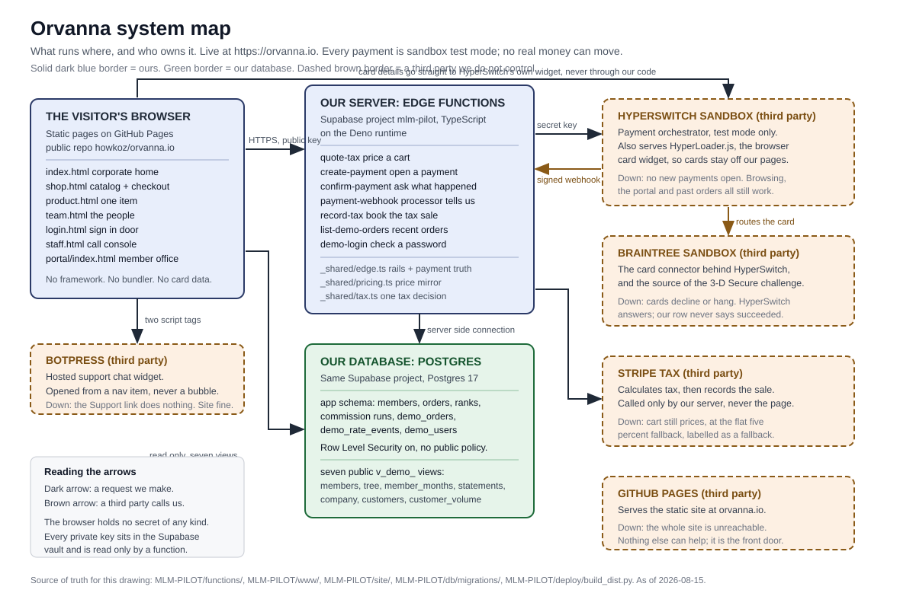
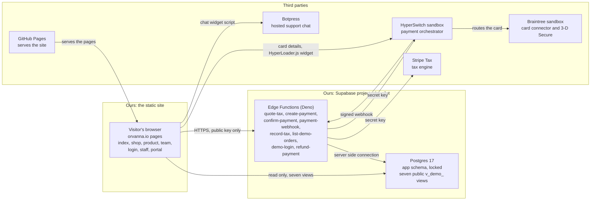
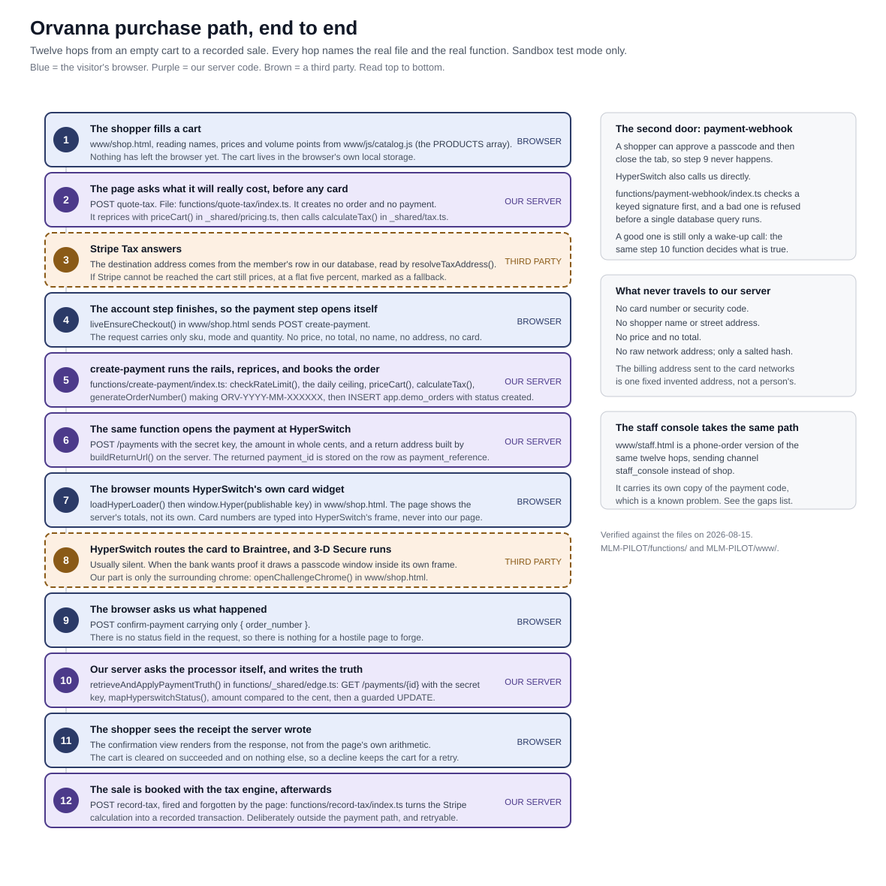
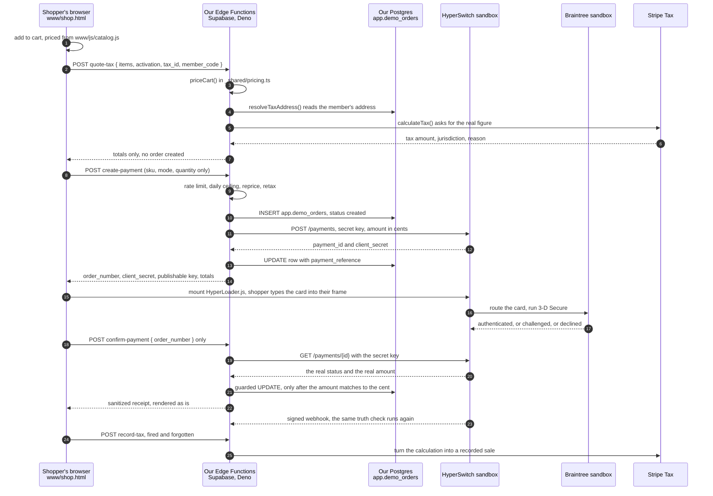

# Orvanna: Architecture

> **As of 2026-08-15.** Owner: Howard Koziara. Author: the project architect
> (mlm-architect). Status: description of what is actually built and running, not a plan.
>
> Plain path: `C:\Users\howar\Desktop\Desktop\ORVANNA\DOCUMENTATION\01-ARCHITECTURE.md`
> Diagrams: `C:\Users\howar\Desktop\Desktop\ORVANNA\DOCUMENTATION\diagrams\system-map.svg`
> and `C:\Users\howar\Desktop\Desktop\ORVANNA\DOCUMENTATION\diagrams\purchase-path.svg`
>
> Every statement below was checked against a file in
> `C:\Users\howar\Desktop\Desktop\ORVANNA\MLM-PILOT`. Where something could not be
> checked, it says so in plain words instead of guessing. Section 8 lists the places
> where the older project documents no longer match the code.

## Acronym key

Every short form used in this document, spelled out once here and again at first use
in the body.

| Short form | Spelled out |
|---|---|
| AI | Artificial Intelligence |
| API | Application Programming Interface |
| CORS | Cross-Origin Resource Sharing |
| CSS | Cascading Style Sheets |
| HMAC | Hash-based Message Authentication Code |
| HTML | HyperText Markup Language |
| HTTP / HTTPS | HyperText Transfer Protocol, and its secure form |
| IP | Internet Protocol |
| JSON | JavaScript Object Notation |
| MLM | Multi-Level Marketing, the direct-selling business model |
| PV | Personal Volume, the points a purchase is worth in the pay plan |
| SDK | Software Development Kit |
| SQL | Structured Query Language |
| SVG | Scalable Vector Graphics |
| 3DS | 3-D Secure, the card-network step that asks a shopper's bank to confirm it is really them |
| URL | Uniform Resource Locator, a web address |
| UTC | Coordinated Universal Time |

---

## 1. What Orvanna is

Orvanna is a make-believe direct-selling company that sells Artificial Intelligence
(AI) agents by subscription. Visitors browse a catalog of sixteen items, put them in
a cart, and check out. Members of the company sign in to a member office and see
their downline tree, their monthly volume, their rank, and a commission statement.
Staff have a call console for taking an order over the phone. The company, its one
thousand members, their six months of order history, and every commission ever paid
are invented. The mathematics behind them is not: volume rolls up a real genealogy
tree in a real Postgres database, ranks are earned by written rules, and a monthly
commission run produces an auditable statement per member that an independent
checker has recomputed to the cent.

It is Howard's own flagship, built on his own time, his own accounts, and his own
domain, and it is live at https://orvanna.io. It exists to be a demonstration that
can be walked end to end rather than described: a full commerce stack, from a
catalog page to a card payment to a tax record, standing up in public. The payment
side runs against sandbox test rails only. No real money can move through it, by
construction and not by promise, because the only payment accounts wired to it are
test-mode accounts that have no path to a real bank. Nothing in it contains
employer data, employer names, or employer terminology; that fence is deliberate
and absolute.

---

## 2. Component map

### 2.1 The picture first

Plain path to the drawing:
`C:\Users\howar\Desktop\Desktop\ORVANNA\DOCUMENTATION\diagrams\system-map.svg`

### 2.2 What each piece is, who owns it, and what happens when it is down

| Piece | Ours or theirs | What it does | If it is down |
|---|---|---|---|
| The static site (`MLM-PILOT\www\` and `MLM-PILOT\site\`) | **Ours** | Every page a visitor sees: corporate home, shop, product pages, team page, sign-in, staff console, and the member office. | Cannot be down on its own; it is files. See GitHub Pages. |
| GitHub Pages, public repository `howkoz/orvanna.io` | Theirs | Serves those files at https://orvanna.io with HTTPS and the custom domain. | The whole site is unreachable. Nothing else can compensate; it is the front door. |
| Supabase Edge Functions | **Ours** (running on their platform) | The eight server programs: `quote-tax`, `create-payment`, `confirm-payment`, `payment-webhook`, `record-tax`, `list-demo-orders`, `demo-login` and `refund-payment`. They hold every secret and do every write. *(Corrected 2026-08-16: this row and the diagram above previously said seven; `refund-payment` went live 2026-08-16 and had not been counted.)* | Checkout, sign-in, refunds and the live-orders list stop. Reading the corporate pages and the member office still works, because those read the database views directly. |
| Supabase Postgres | **Ours** (their managed platform) | The `app` schema holds members, orders, ranks, commission runs, live demo orders, the rate-limit ledger and the sign-in accounts. Seven read-only views are the only thing the public may see. | The member office and staff lookups show nothing. Checkout also stops, because an order row is written before a payment is opened. |
| HyperSwitch sandbox (app.hyperswitch.io, test mode) | Theirs | The payment orchestrator. It opens payments, routes them to a card connector, and serves `HyperLoader.js`, the browser widget that collects the card. | No new payment can be opened, and the shop says so. Browsing, the member office, and orders already placed are unaffected. Payments already in flight are settled later by the webhook or by the next check. |
| Braintree sandbox | Theirs | The card connector behind HyperSwitch, and the thing that actually raises the 3-D Secure (3DS) challenge. Merchant connector `mca_eE4v07QwkYUSyF55vrUC`. | Cards decline or hang. HyperSwitch still answers our questions, and our order row never says succeeded, so nothing is ever recorded as paid that was not. |
| Stripe Tax | Theirs | Calculates tax for the destination, and afterwards records the completed sale as a tax transaction. Called only by our server, never by a page. | The cart still prices, using a flat five percent fallback, and the outcome is stamped `flat_fallback` so the difference is never silent. Tax recording waits and is retried later. |
| Botpress | Theirs | The hosted support chat, opened from a navigation item rather than a floating bubble. | The Support link does nothing. No other part of the site notices. |

Two honest notes about ownership. First, "ours" above means the code and the data are
ours; the machines are rented in every case. Second, Stripe appears twice in this
project's history and only once in its architecture: Stripe Tax is a live dependency,
while the Stripe payment connector inside HyperSwitch is configured but disabled,
because Stripe refuses raw test card numbers without a support ticket.

---

## 3. Every language and runtime in use

Verified by reading the files, not by assumption. The verification method is stated
for each row so anyone can repeat it.

| Language | Runtime | Where it lives | Why it is there | How this was verified |
|---|---|---|---|---|
| TypeScript | Deno, inside Supabase Edge Functions | `MLM-PILOT\functions\` : eight function folders plus `_shared\edge.ts`, `_shared\pricing.ts`, `_shared\tax.ts`, `_shared\staff-auth.ts`, `_shared\refund-rules.ts` and `_shared\refund-rules.test.ts` (`_shared\` also holds one Python checker, `check_pricing_mirror.py`, counted in the Python row below). *(Corrected 2026-08-16: this cell previously said seven folders and three shared files; the refunds work of 2026-08-16 added `refund-payment` and three shared TypeScript files.)* | This is the only place that may hold a secret. A static site cannot keep a private key, so anything needing one lives here. Types matter most where money is counted. | Read the TypeScript files. They call `Deno.serve` and `Deno.env.get`, and import over HTTPS from `deno.land`, which is the Deno way and not the Node way. |
| Plain browser JavaScript | The visitor's browser | Inline `<script>` blocks inside each page, plus two shared files: `www\js\catalog.js` and `site\js\app.js` | No framework, no compiler, no dependency tree. A page is readable as shipped, and a change is a text edit followed by a copy. | Searched the whole project for `package.json`, `node_modules`, `.jsx`, `.tsx`, `vite.config` and `webpack`. **Zero results.** No import statements or modules in the page scripts; they are ordinary scripts. |
| HTML | The browser | `www\index.html`, `shop.html`, `product.html`, `team.html`, `login.html`, `staff.html`, and `site\index.html` | Seven pages, hand written. | Directory listing plus reading the head of each file. |
| CSS | The browser | `www\css\corporate.css`, `shop.css`, `staff.css`, and `site\css\portal.css` | Shared visual system across pages. | Counted `<link rel="stylesheet">` tags in every page; found no inline `<style>` blocks at all. |
| Python | CPython on Howard's machine, launched as `py` | `MLM-PILOT\deploy\build_dist.py` (the deploy builder), plus offline helpers `db\seed\generate_seed.py`, `db\seed\build_seed_proof.py` and `functions\_shared\check_pricing_mirror.py` | Python never runs in production and never serves a request. It only assembles the folder that gets published, and generates or checks data offline. | Read `build_dist.py` in full. It is a file-copy, link-rewrite and integrity-check script with no server in it. |
| SQL | Postgres 17, on Supabase | `MLM-PILOT\db\migrations\` (twelve files) and `db\comp\001_comp_engine.sql` | Schema, row-level security, the seven public views, and the entire commission engine. The pay-plan mathematics is SQL, not application code, so it can be recomputed independently. | Listed and read the migration filenames and grepped their `create table` and `create view` statements. |

Three things stated explicitly, because they are the questions people ask first.

1. **There is no React.** There is no framework of any kind on any page: no React, no
   Vue, no Svelte, no jQuery. The pages use the browser's own document interface
   directly.
2. **There is no package installation step for the application.** No `package.json`
   exists anywhere in the project, so there is nothing to install, nothing to audit
   for vulnerable packages, and no build output to get out of date. The Edge Functions
   import their one dependency, a Postgres driver, straight from a versioned URL that
   Deno fetches itself.
3. **The pages are self-contained, with one precise qualification.** Each page carries
   all of its own behaviour inline; `shop.html` is a single one hundred and thirty
   six kilobyte file that contains the entire checkout. What the pages share are four
   stylesheets and two JavaScript files (`catalog.js` for the catalog, `app.js` for
   the member office). So "self-contained single files" is true of the logic and not
   quite true of the styling and the catalog, and this document says so rather than
   repeating a slogan.

The site loads exactly two external scripts, both deliberate and both recorded:
`HyperLoader.js` from HyperSwitch, which is what keeps card numbers out of our pages,
and the Botpress chat widget. Nothing else external: no analytics, no font services,
no tag managers.

---

## 4. The purchase path, end to end

### 4.1 The picture first

Plain path to the drawing:
`C:\Users\howar\Desktop\Desktop\ORVANNA\DOCUMENTATION\diagrams\purchase-path.svg`

### 4.2 Hop by hop, with the actual file and function

| # | Where | File | Function or symbol | What happens |
|---|---|---|---|---|
| 1 | Browser | `www\shop.html` with `www\js\catalog.js` | the `PRODUCTS` array | The shopper builds a cart. Prices shown here are display only. The cart is kept in the browser's local storage. |
| 2 | Browser to our server | `www\shop.html` | `fnCall('quote-tax', ...)` | The page asks what the cart will really cost, before any card is shown. Howard's rule: nobody should learn about tax after handing over a card. |
| 3 | Our server | `functions\quote-tax\index.ts` | `priceCart()` from `_shared\pricing.ts`, then `resolveTaxAddress()` and `calculateTax()` from `_shared\tax.ts` | Reprices the cart from the server's own table and asks the tax engine. It creates no order and no payment, and it deliberately does not keep Stripe's calculation identifier, because a quote nobody buys should leave nothing behind. |
| 4 | Third party | Stripe Tax `POST /v1/tax/calculations` | called from `calculateTax()` | Answers a real figure for a real destination. The destination is read from the member's database row, never taken from the request. |
| 5 | Browser to our server | `www\shop.html` | `liveEnsureCheckout()` calling `fnCall('create-payment', ...)` | Once the account step is done, the payment step opens itself. The request body carries only `sku`, `mode` and `quantity` per line, plus the activation choice, the typed tax identifier text, the member code and the channel. |
| 6 | Our server | `functions\create-payment\index.ts` | `checkRateLimit()`, the daily ceiling query, `priceCart()`, `calculateTax()`, `generateOrderNumber()` | Runs the rails, reprices everything from scratch, mints the order number `ORV-YYYY-MM-XXXXXX`, and inserts one row into `app.demo_orders` with status `created`. |
| 7 | Our server to HyperSwitch | same file | `fetch(HYPERSWITCH_BASE_URL + '/payments')` and `buildReturnUrl()` | Opens the payment with the secret key, the amount in whole cents, `confirm: false`, a fixed invented billing address, and a return address the server builds. The returned `payment_id` is stored as `payment_reference`. |
| 8 | Browser | `www\shop.html` | `loadHyperLoader()` then `window.Hyper(publishableKey)` | The page mounts HyperSwitch's own card widget with the client secret. The shopper types the card into HyperSwitch's frame. It never enters our page and never reaches our functions. |
| 9 | Third parties | HyperSwitch to Braintree | none of ours | The card is routed and 3-D Secure runs. Most of the time this is silent. When the bank wants proof, it paints a passcode form inside its own frame. |
| 10 | Browser | `www\shop.html` | `openChallengeChrome()` | Our only part of the challenge is the window around it: the order number, the test-mode notice, a cancel that re-asks the server, and a focus trap. The frame is hidden the instant it appears and revealed only if it is still there after 1,400 milliseconds, which is the tell that a real passcode form rendered rather than a silent check. |
| 11 | Browser to our server | `www\shop.html` | `fnCall('confirm-payment', { order_number })` | The browser asks what happened. It sends the order number and nothing else, so there is no status field for a hostile page to forge. |
| 12 | Our server | `functions\confirm-payment\index.ts` calling `functions\_shared\edge.ts` | `retrieveAndApplyPaymentTruth()`, using `mapHyperswitchStatus()` and `refineFailureReason()` | The one place a payment outcome is ever decided: retrieve the payment from HyperSwitch with the secret key, map all seventeen possible statuses, compare the amount to the cent, then run a guarded update that only moves a row from an allowed previous state. |
| 13 | Processor to our server | `functions\payment-webhook\index.ts` | `hmacSha512()`, `signatureMatches()`, then the same `retrieveAndApplyPaymentTruth()` | The independent second door, for the shopper who approves the passcode and then closes the tab. The body is treated as a wake-up call only. |
| 14 | Browser to our server | `www\shop.html` then `functions\record-tax\index.ts` | `fnCall('record-tax', 'POST', {})` | On success only, the page pokes the tax recorder and forgets about it. Turning a calculation into a recorded sale is bookkeeping, so it sits outside the payment path and is safe to retry. |

The staff call console, `www\staff.html`, walks the same path for a telephone order
and sends `channel: "staff_console"` instead of `"shop"`.

---

## 5. Security rails, and why each one exists

Each rail below is named with the file it lives in and the specific bad outcome it
prevents. Understanding the "why" is the point; a rail whose reason is forgotten gets
removed by the next person in a hurry.

### 5.1 The Cross-Origin Resource Sharing (CORS) origin allow list

`functions\_shared\edge.ts`, `isAllowedOrigin()` and `corsHeaders()`. Also repeated
inside `functions\record-tax\index.ts`.

The allow list is exactly `https://orvanna.io`, plus `http://localhost` and
`http://127.0.0.1` with any port for development. A request from anywhere else is
answered 403, and, just as importantly, gets no `Access-Control-Allow-Origin` header
at all, which is what makes a browser refuse to hand the response to a foreign page.

**Why.** Without it, anyone could put our checkout functions behind their own web
page. Our functions would then be creating orders, spending our rate limit, and
calling our tax engine on a stranger's behalf, on a site we do not control and cannot
take down.

### 5.2 Salted Internet Protocol (IP) address hashing

`functions\_shared\edge.ts`, `callerIpHash()`.

The caller's address is combined with a secret salt from the vault, hashed with
SHA-256, and only the hash is stored in `app.demo_rate_events`. The raw address is
never written to the database and never written to a log line.

**Why.** A rate limiter needs to tell one visitor from another; it does not need to
know who they are. An address is personal data, and a table of raw addresses is a
liability that grows quietly. The salt matters because a plain hash of an address is
reversible in seconds: there are only about four billion of them, so anyone with the
table could rebuild every address in it. With a secret salt they cannot.

### 5.3 Per-scope rate limits

`functions\_shared\edge.ts`, `checkRateLimit()`, called with a scope name by each
function. The ledger key is `scope:hash`, so each function has its own bucket.

| Function | Limit | Why that number |
|---|---|---|
| `create-payment` | 5 per minute and 30 per hour | Opening a payment is the expensive act, and a real shopper does it a handful of times. |
| `quote-tax` | 20 per minute and 200 per hour | Deliberately looser: a shopper fiddles with a cart while making up their mind, and every fiddle is a quote. |
| `confirm-payment` | 20 per minute | Confirmation is legitimately polled while a payment settles. |
| `list-demo-orders` | 20 per minute | Cheap and read only. |
| `demo-login` | 8 per minute and 40 per hour | A sign-in door is the one worth guessing at, so this is the tightest. |
| `payment-webhook` | none, on purpose | Every genuine call comes from the same few processor addresses and would share one bucket, so a burst of real events would be throttled, retried, and throttled again. The signature check is the gate here, and it is a better one. |

**Why the scopes matter.** Before scoping, a shopper who polled for confirmation
could eat the budget for actually paying. Separating the buckets means one activity
can never lock a visitor out of another. A refused request is also not counted, so a
blocked visitor's window never extends itself.

### 5.4 The daily circuit breaker

`functions\create-payment\index.ts`, `DAILY_ORDER_CEILING = 500`.

Over five hundred orders created in one Coordinated Universal Time (UTC) day, the
function answers 503 with "the demo is resting" until midnight.

**Why.** Rate limits are per visitor, so a thousand visitors, or one attacker with a
thousand addresses, can still run up an unbounded bill against a hosted database, a
payment sandbox and a paid tax engine. The circuit breaker puts a known ceiling on
the worst possible day, and a demonstration that is asleep is much better than a
demonstration that is expensive.

### 5.5 Server-side repricing, so the browser can never send a price

`functions\_shared\pricing.ts`, `priceCart()`, plus the mirrored `CATALOG` table.

The request body is read for exactly three fields per line: `sku`, `mode`,
`quantity`. Anything else a caller adds is ignored by construction, because the code
never looks at it. All money is computed in whole cents from the server's own table.

**Why.** Anything the browser can compute, the browser can lie about. A page is
public, editable, and untrusted by definition. If a total arrived from the browser,
the site would be one console command away from selling everything for a dollar.
Because the price never travels, there is nothing to tamper with. The server's table
must match the site's catalog exactly, so the checker gate mechanically compares all
sixteen item and mode combinations, plus the activation fee and the tax rate, between
`www\js\catalog.js` and `functions\_shared\pricing.ts`. Any drift fails the gate.

The same reasoning was applied to tax on 2026-08-15. The browser used to send a
`tax_exempt` boolean, which meant any caller could zero their own tax. Now the page
sends the tax identifier text, `looksLikeTaxId()` decides whether it even looks like
one, and Stripe decides what it means. Stated honestly, and stated on the page too:
Stripe checks the shape of an identifier, not the government register behind it, so a
well-formed invented one passes. The mechanism is real; the verification is not.

### 5.6 The server-built return address

`functions\create-payment\index.ts`, `buildReturnUrl()` with the two-item allow list
`RETURN_PAGES = ["shop.html", "staff.html"]`.

The address a shopper returns to after a bank challenge is built as
`<validated origin>/<page from the allow list>?orv=<our order number>`. A full
address supplied by the caller is never accepted; an unrecognised page name silently
becomes `shop.html`.

**Why this is not a detail.** A 3-D Secure challenge can take the shopper's entire
page away, and HyperSwitch's redirect action is an unconditional navigation. Whatever
address we hand over is where a real person, mid-payment, is sent next. If the
browser could choose it, an attacker could send a shopper from a genuine Orvanna
payment to a page of their choosing, and the shopper would arrive there believing
they were still in our checkout. That is an open redirect, and it is one of the
oldest and most effective ingredients in a phishing attack. Building the address on
the server, from an origin we have already validated and a page name from a literal
list, removes the choice entirely.

### 5.7 Card data never touches our code

`www\shop.html`, `loadHyperLoader()` and `window.Hyper()`.

Card number, expiry and security code are typed into a frame served by HyperSwitch,
on HyperSwitch's own domain. Our pages never see the values, our functions never
receive them, and our database has no column for them.

**Why.** Handling raw card data would put this site inside Payment Card Industry
scope, with the audit obligations that come with it, and would make our own pages a
target worth attacking. Using the provider's widget is not only cheaper, it is the
better practice for a real merchant too. The same reasoning is why the challenge
frame is drawn by the provider's own toolkit and not by us: taking that over would
mean confirming the payment from our own server, which would mean the card entering
our page.

### 5.8 The single source of payment truth

`functions\_shared\edge.ts`, `retrieveAndApplyPaymentTruth()`.

Two callers, and only two: `confirm-payment`, when the browser asks, and
`payment-webhook`, when the processor tells us. Both run the same steps in the same
order: retrieve the payment from HyperSwitch with the secret key, map the status,
compare the amount to the cent, then a guarded update that only moves a row out of an
allowed previous state.

**Why one implementation.** A browser can claim anything. A webhook body can be
forged unless it is signed, and even a correctly signed body is only somebody else's
word. So no status ever enters our database from a request body, from either source.
The worst a forger can achieve is to make us re-ask a question we already know how to
answer. Keeping it in one function is what stops the browser path and the processor
path drifting apart over time, which is exactly what has happened to the two copies of
the page-side checkout code (section 7).

The webhook's signature is checked with a keyed hash (HMAC) using SHA-512 against the
vault's `HYPERSWITCH_HASH_KEY`, compared in constant time by `timingSafeEqual()` so
that a near-miss guess cannot be detected by how long the answer took. A body that
fails is refused with zero database queries.

### 5.9 The sealed database posture

`db\migrations\003_row_level_security.sql`, `010_demo_orders.sql`,
`011_view_privilege_hardening.sql`.

Row Level Security is on for every table in the `app` schema with no policy for the
public role, which means the public key can read nothing and write nothing. The only
things the public key may touch are seven read-only views: `v_demo_members`,
`v_demo_tree`, `v_demo_member_months`, `v_demo_statements`, `v_demo_company`,
`v_demo_customers` and `v_demo_customer_volume`. Every write in the entire system
happens inside an Edge Function.

**Why.** The public key is printed in the page source; it has to be, for the member
office to read anything at all. So the design assumption is that a stranger holds it.
Everything else follows from that: the key must be worth nothing on its own. This was
not assumed, it was probed live during the Phase 5 and Phase 6 checks.

---

## 6. Deployment

### 6.1 How the site is built and published

There is no application build, in the sense of compiling or bundling. What
`MLM-PILOT\deploy\build_dist.py` does is assemble a publishable folder:

1. Copies `MLM-PILOT\www\` to `deploy\dist\` (the corporate site at the domain root)
   and `MLM-PILOT\site\` to `deploy\dist\portal\` (the member office at `/portal/`).
2. Rewrites six cross-folder links, because the two folders sit side by side in the
   source and one inside the other once published. A link it expects and cannot find
   fails the build rather than shipping broken.
3. Writes `CNAME` (the custom domain), `.nojekyll`, a `404.html` and a short
   `README.md` into the published folder.
4. Stamps every `?v=` asset reference with a twelve-character hash of the actual
   stylesheet and script bytes. This exists because a hand-maintained version string
   sat unchanged while a stylesheet was rewritten three times in one day, so returning
   visitors kept serving themselves the old file from cache and a shipped fix reached
   nobody who had been to the site before. Deriving the stamp from the content means
   it changes when, and only when, the content does.
5. Checks that no page still points at `../www/` or `../site/`, then resolves every
   relative link in every page and fails if any of them does not exist.
6. Prints a file count, a size, and a hash of the whole bundle.

The result is committed and pushed to the **public** repository
`github.com/howkoz/orvanna.io`, which GitHub Pages serves at https://orvanna.io.
The **private** repository `github.com/howkoz/orvanna` holds the source of truth: the
pages, the functions, the migrations, the specifications and the gate records. So the
public repository contains built output only, and its own README says that edits made
there directly will be overwritten by the next build.

The domain's records are set by hand at the registrar (four address records and a
`www` alias), and HTTPS is enforced. One operational note worth keeping: the served
pages carry a ten-minute cache instruction, so a change can appear absent in a browser
that already has the page. A cache-busting query string settles whether a fix is
missing or merely cached; not knowing that cost a round of debugging once already.

### 6.2 How the Edge Functions are deployed

The functions live in `MLM-PILOT\functions\`, with `MLM-PILOT\supabase\config.toml`
naming the project and a link pointing the Supabase tooling at that folder. They are
deployed to the Supabase project `mlm-pilot` (reference `oiyibdczkokegaxkwulv`, region
us-west-2), one function at a time.

Two deployment facts that matter and are recorded rather than assumed:

- `payment-webhook` is deployed **without** the platform's token verification,
  because HyperSwitch cannot present our public key. Its own signature check is what
  secures it, and that check runs before anything else in the function.
- Deployments have been hand-carried through a tool call rather than scripted, and the
  project's own notes flag this: a deployed function has been verified functionally
  (it boots, its imports resolve, calls return the right data) but not byte-compared
  against the repository copy. A Supabase personal access token would make future
  deploys exact and repeatable. This is an open item, not a solved one.

Database changes are applied as numbered migrations from `MLM-PILOT\db\migrations\`,
with the commission engine itself living in `db\comp\001_comp_engine.sql`.

### 6.3 Environment secrets, by name only

These are the names of the values that live in the Supabase secrets vault for the
project. **No value appears in this document, in any repository, in any log line, or
in any chat window.** They are typed into the dashboard by Howard himself, and any
value that has ever appeared in a chat window is regenerated before use.

| Secret name | What it is for | Read by |
|---|---|---|
| `HYPERSWITCH_API_KEY` | The secret key that authorizes opening and retrieving payments, and issuing refunds. | `create-payment`, `confirm-payment`, `payment-webhook` (through the shared truth function), and `refund-payment` (directly, at `refund-payment\index.ts` line 596). *(Corrected 2026-08-16: `refund-payment` was missing from this row.)* |
| `HYPERSWITCH_PUBLISHABLE_KEY` | The public key handed to the browser widget. Public by design, vaulted anyway so a key swap is one dashboard edit. | `create-payment` |
| `HYPERSWITCH_HASH_KEY` | The key the webhook signature is checked against. | `payment-webhook` |
| `STRIPE_SECRET_KEY` | Authorizes tax calculations and tax transaction records. | `_shared\tax.ts` (through `quote-tax` and `create-payment`) and `record-tax` |
| `ORVANNA_DEMO_IP_SALT` | The salt that makes the stored address hashes irreversible. | every function that rate limits |
| `SUPABASE_DB_URL` | The direct database connection. **Injected by the platform**, not typed by anyone. | every function that touches the database |

One value is deliberately not in the vault: the key that signs sign-in session tokens
lives in the `app.demo_auth_config` table and is read by `demo-login` inside the
database. Two values are public by design and appear in the page source: the Supabase
public key and the HyperSwitch publishable key. Neither grants anything.

---

## 7. Honest limitations and gaps

Nothing here is hidden, and none of it is currently dangerous, because no real money
can move on a sandbox rail. All of it is the kind of thing that becomes dangerous the
day the rail is real.

1. **The checkout code exists twice and has already drifted.** `www\shop.html` and
   `www\staff.html` each carry a full copy of the payment engine, roughly six hundred
   lines. In a single day the staff console fell behind the shop on three things: the
   finishing state that stops the card form flashing back before the receipt, the
   amount signature that discards a payment when the total moves, and two of the six
   outcome messages. The consequence on the console is worse than on the shop, because
   that page tells a live agent what to say to a caller. The durable fix is one shared
   `www\js\payments.js`. The project's own code audit rates it the highest-leverage
   item in the project. It has not been done.

2. **Some database changes are not in the repository.** *(Corrected 2026-08-16:
   this limitation is now closed on all three counts, and the original text below
   is kept for the record. The tax columns and the `demo_address_*` columns DO
   appear in migration files: `015_member_tax_addresses.sql` (the five
   `demo_address_*` columns), `016_order_tax_provenance.sql` (`tax_source`,
   `tax_calculation_id`, `tax_reason`, `tax_jurisdiction`) and
   `017_tax_transaction_record.sql` (`tax_transaction_id`,
   `tax_transaction_at`), all recovered into the folder on 2026-08-15. The
   numbering no longer skips 009 or 013: `009_rank_qualification_gate_POINTER.md`
   records ledger entry 009, and `013_demo_orders_created_at_index.sql` was
   written 2026-08-15.)* The original claim: the tax columns on
   `app.demo_orders` (`tax_source`, `tax_calculation_id`, `tax_reason`,
   `tax_jurisdiction`, `tax_transaction_id`, `tax_transaction_at`) and the
   `demo_address_*` columns on `app.members` are read and written by the functions but
   appear in no migration file. The migration numbering also skips 009 and 013 in
   `db\migrations\`. The live database and the repository therefore do not fully
   reconstruct each other, which is the one property a migration folder exists to
   guarantee.

3. **The sign-in gate is real, but it is not absolute.** `demo-login` checks
   credentials against hashes in the database, server side, and returns a signed
   token. That token is never verified anywhere afterwards: the pages check the shape
   of what they hold in session storage. Since the site is static hosting and the seven
   public views are readable with the public key by design, the gate is presentation
   for a determined visitor. Making it absolute means routing the office and console
   data through an authenticated function. It is a tracked follow-up, and the member
   sign-in password is published on the checkout page on purpose.

4. **Today's checkout work has not been through the two-gate process.** The automatic
   payment open, the amount signature, the finishing state, the challenge reveal and
   the member sign-in all shipped verified by their builder only, which is exactly what
   the two-gate rule exists to prevent. One correctness pass and one quality pass over
   the checkout as a whole are owed.

5. **A frictionless payment still flashes the authentication window.** The reveal is
   on a 1,400 millisecond timer, and this sandbox sometimes finishes just after it, so
   the window is revealed a moment before it closes. Howard has accepted this for now.
   The correct fix is to stop guessing on a timer and poll the payment, revealing only
   when the status is genuinely waiting for the shopper.

6. **The external 3-D Secure provider is parked.** 3DSecure.io is configured but
   returns a generic error, so the challenge that runs today is Braintree's own. This
   is not a gap in the flow, only in which provider performs it. Separately, the
   sandbox key for that provider was pasted into a chat window and should be rotated,
   along with the HyperSwitch secret and hash keys and the Stripe test key. **Key
   rotation is the oldest open item in the project.**

7. **Live orders are not connected to the commission engine, on purpose.** A row in
   `app.demo_orders` is never an input to a commission run. Six months of finalized
   commissions stay byte-identical no matter what a stranger does in the shop, and that
   is proven by a checksum in the gate rather than assumed. It also means the numbers
   in the member office do not move when a visitor buys something.

8. **Two limits are honest rather than solved.** The rate limiter reads a bucket and
   then increments it, so two requests arriving in the same instant can both pass. And
   a tax identifier is checked for shape, never for existence. Both are recorded in
   the gates as accepted for a demonstration.

9. **The project documents lag the code by a day or two, consistently.** See section 8.
   That is the reason this document exists.

---

## 8. Where the existing documents no longer match the code

Found while writing this, by reading the files rather than the descriptions. None of
these are code defects; they are places where a document told a reader something that
was no longer true.

> **STATUS 2026-08-15: every row below has been CORRECTED IN PLACE, at the
> coordinator's direction, on the same day it was found.** The table is kept as the
> record of what was wrong and how it was put right, because a project that has burned
> time on stale documents should be able to see the pattern. Corrections were made as
> additions, never as deletions: `PHASE-6-SPEC.md` gained an amendment block at the top
> plus seven inline "AMENDED" markers, `ROADMAP.md` gained a "RESOLVED 2026-08-15"
> section under the dead end rather than losing it, and the architecture audit gained a
> historical header while its body was left untouched.
> Two items were deliberately NOT changed; they are listed under the table.

| Document | What it said, before the 2026-08-15 correction | What the code does |
|---|---|---|
| `docs\PHASE-6-SPEC.md` section 1.2 | The site sends a `tax_exempt` boolean and "the Tax ID value is NOT transmitted". | The opposite, changed deliberately on 2026-08-15. The page sends the tax identifier text and `create-payment` explicitly ignores any `tax_exempt` field, because letting the browser decide exemption let any caller zero their own tax. |
| `docs\PHASE-6-SPEC.md` section 0 rule 5 and section 1.4 | The site may load "exactly ONE" external script. | Two: `HyperLoader.js` and the Botpress chat widget. The second was sanctioned later, in the roadmap, but the specification was never updated. |
| `docs\PHASE-6-SPEC.md` section 4 | "No webhook endpoint ships in v1", with a webhook planned for v1.1. | `payment-webhook` shipped and is live. |
| `docs\PHASE-6-SPEC.md` section 3 | Four vault secrets. | Five, plus one platform-injected. `STRIPE_SECRET_KEY` is missing from the table. |
| `docs\PHASE-6-SPEC.md` sections 1.3, 5.4 | Tax is a flat five percent from the mirror. | Flat five percent is now only the fallback when Stripe Tax cannot be reached. |
| `ROADMAP.md`, Phase 6.2 | The tax engine is blocked at TaxJar's signup, with three options listed and no decision. | A real tax engine is live, and it is Stripe Tax, reached directly by our own functions rather than through a HyperSwitch connector. The roadmap never records this, which makes it the most misleading single entry in the project. |
| `ROADMAP.md`, Phase 6 | "three Edge Functions deployed". | Seven. `quote-tax`, `record-tax`, `demo-login` and `payment-webhook` all came later. |
| `docs\decisions\ARCHITECTURE-AUDIT-2026-08-15.md` | Tax exemption is decided in the browser and obeyed by the server, "ONCE, IN THE WRONG PLACE". Line counts for five functions. | That finding was fixed the same day the audit was written. The audit also predates `quote-tax`, `record-tax` and `_shared\tax.ts` entirely, and its line counts are stale (`create-payment` is 568 lines, not 505). The audit is still the best description of the browser-side duplication problem. |
| `00-README.md` | "Six role agents". The stack table offers "GitHub Pages or Cloudflare Pages". The key documents list names `site\` and `db\` only. | The team is larger (a designer, a writer and a coordinator joined). GitHub Pages was chosen. `www\`, `functions\` and `deploy\` are not mentioned anywhere in that file, and they are now most of the project. |
| `00-README.md` | Brand persona described with the retired "Globex Wellness" placeholder in one place. | The brand is Orvanna throughout the code and the site. `ROADMAP.md` also still carried "Globex" in its council verdict and product concept sections, and `docs\COMP-PLAN-SPEC.md` still opened with "Globex sells AI agents". |

### Deliberately not changed

Two places where the retired persona survives were left alone on purpose, and both
are now the database engineer's and the coordinator's calls rather than mine.

1. **Seven migration headers and two seed scripts** carry the comment
   "MLM Pilot (Globex persona, personal project)". These files are applied and
   gate-passed. Editing an applied migration is how a repository stops reproducing the
   database it claims to describe, and the Phase 6 gate checksums exist precisely to
   catch that kind of drift. A comment is not worth the risk.
2. **The `GW-` member code prefix** appears in live database rows, in
   `www\shop.html`, `www\staff.html` and `site\js\app.js`. Changing it is a data
   migration plus a copy change plus a re-verification, not a find and replace. It is
   already logged as finding M9 in `docs\qa\COPY-AUDIT-2026-08-15.md`, which makes the
   same observation: every other visible identifier on the property reads `ORV-`, so a
   sharp visitor asks what `GW` stands for and there is no answer.

Gate records under `docs\qa\` and `docs\verification\` also mention the persona. Those
are dated evidence of what was checked on a given day and are never edited.

---

## 9. What was verified for this document, and what was not

**Verified by reading the file:** every Edge Function and shared module; the deploy
builder; the migration filenames and their table and view statements; the page and
stylesheet inventory; the absence of any package manifest or framework; the external
script tags; the endpoint names each page calls; the two repository remotes; and the
public views the member office reads.

**Not verified, and therefore not asserted as fact here:** the live contents of the
Supabase secrets vault (the names come from the code that reads them and from the
specification, never from the values); the current state of the HyperSwitch dashboard;
whether the deployed function bytes match the repository copies, which the project's
own notes say has not been checked; and anything about live traffic. Statements about
what happened during earlier phases are taken from the roadmap and the gate records,
and are attributed as such rather than restated as first-hand observation.
