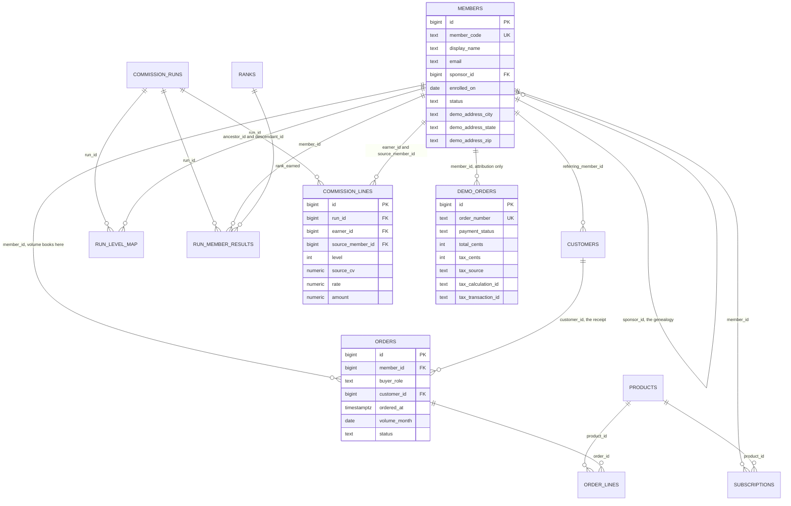
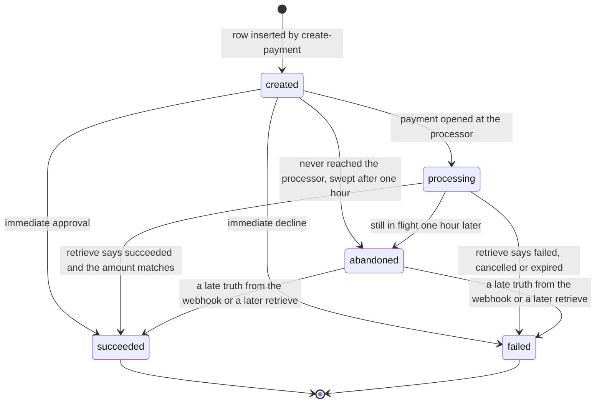

# 02. Data Model

Owner: database engineer role, Orvanna Multi-Level Marketing (MLM) Pilot.
Written 2026-08-15. Verified against the live Supabase Postgres project
`oiyibdczkokegaxkwulv` on the same day, and against every migration file in
`MLM-PILOT\db\`.

Diagram: `DOCUMENTATION\diagrams\data-model.svg`
Plain path: `C:\Users\howar\Desktop\Desktop\ORVANNA\DOCUMENTATION\diagrams\data-model.svg`

Everything in this document is either read out of a migration file, read out of
an Edge Function, or queried from the live database. Where the repository and
the live database disagree, that disagreement is written down rather than
smoothed over. See section 12.

---

## Acronym key

Spelled out here once so the rest of the document can move quickly.

| Short form | Full term | What it means here |
|---|---|---|
| MLM | Multi-Level Marketing | The business model this pilot demonstrates |
| SV | Sales Volume | A member's own purchase volume for one month |
| CV | Commissionable Volume | The slice of Sales Volume that commissions are paid on, 80 percent in version 1 |
| TV | Team Volume | The Sales Volume of a member's whole downline, not counting themselves |
| PV | Personal Volume, also called volume points | Points a product carries; one dollar equals one point in version 1 |
| RLS | Row Level Security | The Postgres feature that decides, per row, whether a role may see it |
| FK | Foreign Key | A column that must point at an existing row in another table |
| PK | Primary Key | The column or columns that uniquely name a row |
| CTE | Common Table Expression | A named sub-query, the `with ...` clause |
| JSON | JavaScript Object Notation | A text format for structured data; `jsonb` is Postgres's binary form of it |
| API | Application Programming Interface | How one program calls another |
| IP | Internet Protocol address | The network address a web request arrives from |
| UTC | Coordinated Universal Time | The single clock the whole system stamps against |
| 3DS | 3-D Secure | The bank's cardholder authentication step during a card payment |
| ECI | Electronic Commerce Indicator | A code recording the 3-D Secure outcome |
| DDL | Data Definition Language | The `create table` and `alter table` half of SQL |

---

## 1. The plain English tour

Read this section and you know what the database is for. Everything after it is
detail.

The database has three neighbourhoods, and they touch each other far less than
you would expect.

**Neighbourhood one: the compensation engine.** This is the pilot's real
subject. Who is in the tree, what they bought, and what the plan says they
earned.

| Table | What it is for, in one sentence |
|---|---|
| `app.members` | Every distributor in the pilot, and the one column, `sponsor_id`, that makes them a tree |
| `app.products` | The catalogue of digital agents sold as monthly subscriptions, with the price and the volume points each one carries |
| `app.customers` | People who buy through a member without joining the business themselves |
| `app.subscriptions` | Which member subscribes to which product, and for which months |
| `app.orders` | One purchase event, stamped with the month its volume counts toward |
| `app.order_lines` | The individual products on an order, with price and volume copied in so history cannot be rewritten by a price change |
| `app.ranks` | The five rank names and how many levels deep each one gets paid |
| `app.commission_runs` | One row per attempt to calculate one month, and the record of whether that attempt is the final word |
| `app.run_level_map` | A frozen photograph of the family tree as it stood when a run started |
| `app.run_member_results` | One row per member per run: their volume, their rank, and their total pay for that month |
| `app.commission_lines` | The statement itself, one line per commission payment, saying who earned what from whom and at what rate |

**Neighbourhood two: the live demonstration checkout.** Added in phase six. A
visitor to the public site can put an agent in a cart and run a real test-mode
card payment through it. This neighbourhood deliberately does not touch
neighbourhood one.

| Table | What it is for, in one sentence |
|---|---|
| `app.demo_orders` | One row per live checkout attempt, including what was charged, what tax was applied, where that tax figure came from, and where the payment ended up |
| `app.demo_rate_events` | A counter per visitor per minute, so one person cannot hammer the demonstration checkout |
| `app.demo_users` | Sign-in accounts and their roles, with passwords stored only as bcrypt hashes |
| `app.demo_auth_config` | The server-side key used to sign session tokens, and nothing else |

**Neighbourhood three: the public read surface.** Seven views in schema
`public`, named `v_demo_*`. These are the only database objects the website can
read. They are described in section 9.

The single most important structural fact: **the browser never reads a table.**
Not one. Every table lives in schema `app`, which is not exposed to the Supabase
REST layer at all, and every table has Row Level Security switched on with no
policy for the public roles. The website reads views. The Edge Functions reach
the tables over a separate server-side connection that never ships to a browser.

---

## 2. The picture

Open the diagram before reading the column tables. It shows the three
neighbourhoods, the foreign keys between them, and the payment status machine on
one page.

Plain path: `C:\Users\howar\Desktop\Desktop\ORVANNA\DOCUMENTATION\diagrams\data-model.svg`

---

## 3. The compensation engine tables, column by column

Types are as they exist in the live database. The "why it exists" column is the
part worth reading.

### 3.1 `app.members`

Migration 001, extended by migration 015.

| Column | Type | Meaning | Why the column exists |
|---|---|---|---|
| `id` | `bigint` identity, PK | Internal row number | Joins are on an integer, never on a public code, so a code could be re-issued without corrupting history. It is never exposed by a view. |
| `member_code` | `text` not null, unique | Public-safe handle, for example `GW-000001` | The only member identifier any public view is allowed to show. It is safe to print on a page. |
| `display_name` | `text` not null | Synthetic person name | The demonstration needs something human to render. |
| `email` | `text` not null | Synthetic address at `example.com` | Present because a real system has one. **No view exposes it**, which is exactly the point of the private schema. |
| `sponsor_id` | `bigint` FK to `app.members(id)`, nullable | Who enrolled this member | This single column **is** the genealogy. Null only for a root. See section 5. |
| `enrolled_on` | `date` not null | Enrolment date | Drives tenure displays and spreads the seeded population over 24 months. |
| `status` | `text` not null, check in `active`, `closed` | Account status | Deliberately distinct from monthly activity. A member can be an open account and still be inactive for a month. Activity is `run_member_results.is_active`. |
| `demo_address_line1` | `text` nullable | Synthetic street | Migration 015. Obviously fake on every row, on purpose: the project collects no real street addresses and should not look like it does. |
| `demo_address_city` | `text` nullable | Real city | A tax engine reasons about a destination. Inventing one produces invented tax. |
| `demo_address_state` | `text` nullable | Real state code | Same reason. Three teaching accounts sit in California, Florida and New York because those three treat software as a service differently. |
| `demo_address_zip` | `text` nullable | Real postal code | The part a tax engine actually keys on. A postal code is not personal data; a street address is. That is the line migration 015 draws. |
| `demo_address_country` | `text` nullable | Country code | Completes the destination. |

Indexes: unique on `member_code`, plain index on `sponsor_id`.

Integrity: a `before insert or update of sponsor_id` trigger,
`app.check_sponsor_cycle`, walks the sponsor chain upward and refuses the write
if it ever comes back to the row being written. A step cap of one million
guards against walking a chain that is already corrupt. Without this trigger a
single bad update could make the recursive tree walk run forever.

**Why the tax address lives here and not in the browser.** The destination is
read server side from the signed-in member's row and is never accepted from the
page. If the browser could supply the tax address, it could choose its own tax
rate. That is the same class of mistake as letting the browser supply a price.

### 3.2 `app.products`

Migration 001. Twelve rows live.

| Column | Type | Meaning | Why the column exists |
|---|---|---|---|
| `id` | `bigint` identity, PK | Row number | |
| `sku` | `text` not null, unique | Stock keeping unit code | Stable external handle for a product. |
| `name` | `text` not null | Display name | |
| `tier` | `text` check in `domain`, `support` | Which family of agent | Domain agents are 100.00 dollars and 100 volume points; support agents are 50.00 and 50. |
| `price` | `numeric(10,2)` not null | What the buyer pays | |
| `volume_points` | `numeric(10,2)` not null | What the rank and commission math counts | Kept separate from price so the two can diverge later without a schema change. |
| `commissionable_value` | `numeric(10,2)` nullable | Per-product Commissionable Volume | **Null in version 1 on purpose.** Version 1 derives Commissionable Volume as 80 percent of Sales Volume at the member-month level. The column exists so a per-product figure can arrive later without a migration on a table full of history. |

### 3.3 `app.customers`

Migration 007. 799 rows live.

| Column | Type | Meaning | Why the column exists |
|---|---|---|---|
| `id` | `bigint` identity, PK | Row number | |
| `customer_code` | `text` not null, unique | Public-safe handle | Same rule as `member_code`: the only customer identifier a view may show. |
| `display_name` | `text` not null | Synthetic name | |
| `email` | `text` not null | Synthetic address | Never exposed by any view. |
| `referring_member_id` | `bigint` FK to members, not null | The distributor this customer buys through | A customer is always attached to exactly one member. |
| `enrolled_on` | `date` not null | When they first bought | |
| `status` | `text` check in `active`, `closed` | Account status | |

Customers are **not** members. They never appear in the genealogy, never
qualify, never hold a rank, and never earn. They exist so that customer volume
can be told apart from distributor volume, which is the distinction regulators
and honest plans care most about.

### 3.4 `app.subscriptions`

Migration 001. 1,820 rows live.

| Column | Type | Meaning | Why the column exists |
|---|---|---|---|
| `id` | `bigint` identity, PK | Row number | |
| `member_id` | `bigint` FK, not null | Who subscribes | |
| `product_id` | `bigint` FK, not null | Which agent | |
| `quantity` | `integer` not null, default 1, check greater than zero | How many seats | |
| `start_month` | `date` not null | First day of the first billed month | Months are always stored as the first of the month so comparisons never depend on day-of-month arithmetic. |
| `cancel_month` | `date` nullable | First day of the month billing **stops** | An **exclusive** end. Active in month `m` when `start_month <= m` and (`cancel_month` is null or `m < cancel_month`). Exclusive ends remove the classic off-by-one month bug at cancellation. |

### 3.5 `app.orders`

Migration 001, extended by migration 007. 10,332 rows live.

| Column | Type | Meaning | Why the column exists |
|---|---|---|---|
| `id` | `bigint` identity, PK | Row number | |
| `member_id` | `bigint` FK, not null | **The account the volume books to** | For a customer order this is the referring member, not the buyer. See the attribution rule below. |
| `buyer_role` | `text` not null, default `member`, check in `member`, `preferred_customer`, `retail_customer` | Who actually bought | Lets customer volume and distributor volume be separated in a later version without restructuring anything. |
| `customer_id` | `bigint` FK to customers, nullable | The actual buyer, when it was a customer | Keeps the receipt auditable while the volume still rolls up. |
| `ordered_at` | `timestamptz` not null | When the purchase happened | |
| `volume_month` | `date` not null | First day of the month this order counts toward | **Stamped once at creation from `ordered_at` in Coordinated Universal Time and never recomputed.** If it were derived at read time, a timezone change or a code change would silently move historic volume between months. |
| `status` | `text` check in `completed`, `refunded` | Order state | Only completed orders count toward Sales Volume. |

**The attribution rule**, enforced by a check constraint:
`(buyer_role = 'retail_customer') = (customer_id is not null)`. A customer order
must name its customer, and a member order must not carry one. The tag and the
receipt are inseparable. The consequence is that the commission engine needs no
knowledge of customers at all: it aggregates account volume exactly as it always
did.

Indexes: `(member_id, volume_month)` and `(volume_month)`.

### 3.6 `app.order_lines`

Migration 001. 10,332 rows live.

| Column | Type | Meaning | Why the column exists |
|---|---|---|---|
| `id` | `bigint` identity, PK | Row number | |
| `order_id` | `bigint` FK, not null | Parent order | |
| `product_id` | `bigint` FK, not null | Which product | |
| `quantity` | `integer` not null, check greater than zero | How many | |
| `unit_price` | `numeric(10,2)` not null | Price **copied from the product at order time** | If the line pointed at the live catalogue price, raising a price next year would retroactively change what last year's commissions were paid on. Copying makes history immutable. |
| `unit_volume` | `numeric(10,2)` not null | Volume points copied the same way | Same reason. Line Sales Volume is `quantity * unit_volume`. |

### 3.7 `app.ranks`

Migration 001, seeded by migration 004. Five rows.

| Column | Type | Meaning | Why the column exists |
|---|---|---|---|
| `rank_code` | `text` PK | `member`, `builder`, `leader`, `director`, `executive` | |
| `rank_name` | `text` not null | Display name | |
| `sort_order` | `int` not null | 1 through 5 | Lets the site order ranks without hard-coding the list. |
| `paid_depth` | `int` not null | 1 through 5 | How many levels deep this rank is paid. |

Qualification **rules** are deliberately not in this table. They live in the
compensation plan specification and in the engine function, version-stamped on
each run, so a rule change is a new engine version and not a quiet data edit.

### 3.8 `app.commission_runs`

Migration 001. Twelve rows live, one per seeded month.

| Column | Type | Meaning | Why the column exists |
|---|---|---|---|
| `id` | `bigint` identity, PK | Run number | |
| `period` | `date` not null | First day of the month being paid | |
| `spec_version` | `text` not null | The plan version the engine computed under | Without this you cannot ever answer "which rules produced this statement". |
| `status` | `text` check in `running`, `final`, `superseded` | Where the run stands | |
| `started_at`, `finished_at` | `timestamptz` | Timing | |
| `notes` | `text` | Free text | Why the run exists, useful when a rerun happens. |
| `total_sv`, `total_cv`, `total_payout` | `numeric(14,2)` | Company totals, written at finish | Sums of already-rounded member figures, never re-rounded. |
| `members_paid` | `int` | How many members earned | |

A partial unique index, `commission_runs_one_final_per_period_idx on (period)
where status = 'final'`, means **only one run per period can ever be final**.
A rerun is a new row; the old run flips to `superseded` and its lines are left
exactly as they were.

### 3.9 `app.run_member_results`

Migration 001. 12,000 rows live, which is 1,000 members times 12 months.

| Column | Type | Meaning | Why the column exists |
|---|---|---|---|
| `run_id` | `bigint` FK, PK part | Which run | |
| `member_id` | `bigint` FK, PK part | Which member | |
| `sv` | `numeric(12,2)` not null | That month's personal Sales Volume | |
| `cv` | `numeric(12,2)` not null | Commissionable Volume, `round(0.80 * sv, 2)` | Rounded once, here, and never re-rounded downstream. |
| `tv` | `numeric(14,2)` not null | Team Volume, the whole subtree excluding self | |
| `is_active` | `boolean` not null | Whether the member met the single qualification gate, Sales Volume of at least 100 | One gate for both "gets paid" and "counts as an active leg", so the two can never drift apart. |
| `rank_earned` | `text` FK to ranks | Rank held for that month | |
| `paid_depth` | `int` not null | Copied from the rank at run time | Copied, not looked up, so changing a rank's paid depth tomorrow cannot rewrite yesterday's statement. |
| `total_earned` | `numeric(12,2)` not null | Sum of this member's lines in this run | |
| `cumulative_sv` | `numeric(14,2)` nullable | Reserved, null in version 1 | Forward space for lifetime-volume bonus tiers without altering a table full of history. |

### 3.10 `app.commission_lines`, the statement

Migration 001. 22,076 rows live.

| Column | Type | Meaning | Why the column exists |
|---|---|---|---|
| `id` | `bigint` identity, PK | Line number | |
| `run_id` | `bigint` FK, not null | Which run | |
| `earner_id` | `bigint` FK to members | Who is paid | |
| `source_member_id` | `bigint` FK to members | Whose volume paid them | A statement that says only "you earned 40 dollars" is not auditable. This column is what makes a line explainable. |
| `level` | `int` check between 1 and 5 | Tree distance from earner to source | |
| `source_cv` | `numeric(12,2)` not null | The source member's Commissionable Volume that month | Stored, not recomputed, so the arithmetic on the page can be checked against the row. |
| `rate` | `numeric(5,4)` not null | The percentage applied | |
| `amount` | `numeric(12,2)` not null | `round(rate * source_cv, 2)` | Rounded at the line, once. |
| `payout_type` | `text` default `unilevel_level_pay` | Which kind of payout this line is | Enumerating from day one means a second payout type is a new value, not a new table. |

Index: `(run_id, earner_id)`, which is exactly how a statement page reads.

### 3.11 `app.run_level_map`, the frozen tree

Created by the engine file `db\comp\001_comp_engine.sql`, applied to the live
database as ledger entry `008_comp_engine_v12`. 29,550 rows live.

| Column | Type | Meaning | Why the column exists |
|---|---|---|---|
| `run_id` | `bigint` FK, PK part | Which run this photograph belongs to | |
| `ancestor_id` | `bigint` FK to members, PK part | The upline member | |
| `descendant_id` | `bigint` FK to members, PK part | The downline member | |
| `level` | `int` check at least 1 | Plain tree distance, 1 means frontline | |

This is the genealogy table, and it is worth understanding why it exists at all.
See section 5.

---

## 4. The live checkout tables, column by column

### 4.1 `app.demo_orders`

Migration 010, extended by migrations 016 and 017. 117 rows live.

| Column | Type | Meaning | Why the column exists |
|---|---|---|---|
| `id` | `bigint` identity, PK | Row number | |
| `order_number` | `text` not null, unique | Server-generated, shape `ORV-YYYY-MM-XXXXXX` | **This is the idempotency key.** The database itself forbids two rows for one order, so a double-submitted checkout cannot become two orders. |
| `created_at` | `timestamptz` not null, default `now()` | When the attempt started | Also drives the daily circuit breaker and the one-hour abandonment sweep. |
| `created_by_channel` | `text` check in `shop`, `staff_console` | Where the order came from | The staff console and the public shop share one table but must stay tellable apart. |
| `member_id` | `bigint` FK to members, nullable | Which member the order is attributed to | Nullable because a guest can check out. **Read-only attribution: it feeds nothing in the commission engine.** |
| `referral_code_entered` | `text` nullable | The raw text the shopper typed | Kept even when it matches no member, so a mistyped code never fails an order and is still visible afterward. |
| `items` | `jsonb` not null | Array of `sku`, `mode`, `quantity`, `unit_price`, `unit_pv` **as the server priced them** | Client prices are never trusted and never stored. |
| `activation` | `text` check in `priority`, `standard` | Which activation option | |
| `subtotal_one_cents` | `integer` not null | One-time items subtotal, in cents | |
| `subtotal_sub_cents` | `integer` not null | Subscription items subtotal, in cents | |
| `activation_fee_cents` | `integer` not null | Activation fee, in cents | |
| `tax_cents` | `integer` not null | Tax charged, in cents | |
| `tax_exempt` | `boolean` not null | Whether a tax identifier was supplied | Decided server side from the tax identifier text. The older client-supplied boolean was deliberately dropped because it let any caller zero their own tax. |
| `total_cents` | `integer` not null | What the payment was opened for, in cents | |
| `pv_total` | `numeric(10,2)` not null | Volume points on the order | Points are not money, so they stay numeric. |
| `payment_reference` | `text` nullable, unique when not null | The processor's payment identifier | Null until the processor answers. A partial unique index means one processor payment can never be attached to two orders. |
| `payment_status` | `text` not null, default `created`, check in the five states | Where the money got to | Section 6 is entirely about this column. |
| `processor_summary` | `jsonb` nullable | Sanitized summary from a server-side retrieve | Named fields only. Never raw card data, never a full processor payload. |
| `status_updated_at` | `timestamptz` not null, default `now()` | When the status last moved | Maintained by a trigger so a function cannot forget to stamp it. |

**The six tax provenance columns.** These are the most interesting columns in
the table, because they exist to stop the database from lying quietly.

| Column | Type | Meaning | Why the column exists |
|---|---|---|---|
| `tax_source` | `text` nullable, check in `stripe_tax`, `flat_mirror_5pct`, `flat_fallback` | How this row's tax figure was produced | **A fallback must never be silent.** If the tax engine cannot be reached the order still has to price, so it falls back to a flat rate. An order priced that way is not the same fact as one priced by a real tax engine, and a receipt that cannot tell you which is a receipt that quietly lies. Migration 016 also back-filled every pre-existing row to `flat_mirror_5pct` rather than leaving them null, because saying so is more honest than letting a reader assume. |
| `tax_calculation_id` | `text` nullable | The tax engine's calculation identifier | A calculation is a **quote**. Storing its identifier is what lets the quote be re-examined, and what lets the later recording step find the sales that still need booking. |
| `tax_reason` | `text` nullable | The engine's taxability reason | **A zero is ambiguous and the difference matters.** Zero can mean "the seller has no registration in that jurisdiction", which is a misconfiguration, or "this jurisdiction genuinely does not tax this product", which is the correct answer. Only the reason code tells them apart, so the checkout can say *why* a figure is what it is instead of just showing it. |
| `tax_jurisdiction` | `text` nullable | Which jurisdiction the sale landed in | Makes the figure explainable without re-querying the engine. |
| `tax_transaction_id` | `text` nullable | The tax engine's **transaction** identifier | A calculation is a quote; a transaction is the record that a sale actually happened, and it is what a tax report is built from later. Calculating without ever recording means the checkout shows the right number and the books never learn the sale occurred. Null means the sale has not been recorded yet: either it has not succeeded, it had no calculation, or the recorder has not run. |
| `tax_transaction_at` | `timestamptz` nullable | When the transaction was recorded | |

**Why recording tax is a separate job.** Tax liability is assumed when the sale
completes, so recording must happen after a payment succeeds and never at the
quote. But it must also never delay a shopper's receipt: if the tax engine is
slow, that is a bookkeeping problem, not a reason to leave someone staring at a
spinner after their money has moved. So a separate, idempotent job writes the
record, and its update is guarded with `where tax_transaction_id is null`, which
is what makes running it twice harmless. The partial index
`demo_orders_tax_unrecorded_idx on (payment_status) where tax_calculation_id is
not null and tax_transaction_id is null` answers that job's one question
directly instead of scanning every order ever placed.

Live as of 2026-08-15: 117 demonstration orders, 27 with a tax calculation
identifier, 6 with a tax transaction identifier, and **zero succeeded orders
holding a calculation but no transaction**, which is the recorder's backlog
measured directly.

This table grows continuously, because the public demonstration checkout is
live and any visitor can add a row. Every count in this document was measured
on 2026-08-15 and none should be treated as current. Measure, never copy.

Indexes on `app.demo_orders`, read from the live database:
`demo_orders_pkey`, `demo_orders_order_number_key` (unique),
`demo_orders_payment_reference_key` (unique, partial),
`demo_orders_created_at_idx`, `demo_orders_payment_status_idx`,
`demo_orders_tax_unrecorded_idx` (partial).

### 4.2 `app.demo_rate_events`

Migration 010.

| Column | Type | Meaning | Why the column exists |
|---|---|---|---|
| `ip_hash` | `text` not null, PK part | Salted hash of the caller's Internet Protocol address, prefixed with a scope | **The raw address is never stored and never logged.** The salt lives in the secrets vault. The scope prefix keeps each function's budget separate, so polling for a confirmation cannot eat the budget for creating a payment. |
| `window_start` | `timestamptz` not null, PK part | The minute bucket, truncated | |
| `request_count` | `integer` not null | Requests in that bucket | |

The counting rule is deliberate: the current bucket is read first, and a request
that is already at or over the limit is refused **and not counted**, so refused
requests never extend a visitor's own penalty window.

### 4.3 `app.demo_users`

Migration 012, extended by migration 014. 1,002 rows live.

| Column | Type | Meaning | Why the column exists |
|---|---|---|---|
| `id` | `bigint` identity, PK | Row number | |
| `username` | `text` not null, unique | Sign-in name | A second unique index on `lower(username)` makes sign-in case-insensitive. |
| `password_hash` | `text` not null | bcrypt hash | The plain password is never stored. Verification happens inside the database by hashing the attempt with the stored salt. |
| `role` | `text` check in `admin`, `staff`, `member` | What this account may open | `member` was added by migration 014. The role gate is checked server side; a member account cannot open the member portal or the staff console. |
| `member_code` | `text` nullable | Which member the account belongs to | Null for admin and staff, who are not members of anything. For member accounts the username **is** the member code, which is why the existing sign-in function needed no change and why the value it returns is already what the checkout needs. |
| `label` | `text` nullable | Human description | |
| `created_at` | `timestamptz` not null, default `now()` | | |

1,000 of the 1,002 rows are member accounts created by migration 014, all
sharing one bcrypt hash. The migration computes the hash once in a scalar
sub-query and reuses it, because hashing a thousand rows individually at cost 10
would take roughly a minute for no benefit when they all carry the same password
anyway.

### 4.4 `app.demo_auth_config`

Migration 012. Key and value pairs, server side only. Currently holds one row,
`token_signing_key`, generated inside the database from cryptographically strong
random bytes, so no human ever typed it and it appears in no repository, no
page, and no chat window.

---

## 5. The genealogy: how the tree is actually stored

There are two representations, and both matter.

**The live tree is an adjacency list.** `app.members.sponsor_id` points at the
sponsor, and that is the whole structure. No nested sets, no materialized path,
no closure table maintained on write. The advantage is that enrolling a member
is a single insert that cannot leave the tree half-updated. The cost is that
answering "who is in my downline" needs a recursive walk.

**Every commission run freezes its own copy.** `app.run_level_map` holds one row
per ancestor and descendant pair, with the plain tree distance, for one run.
The engine builds it once as the first step of a run using a recursive Common
Table Expression walking up `sponsor_id`, then every later step of that run
reads the frozen map instead of the live tree.

Three consequences, and they are the reason the design is worth the extra table:

1. **Editing the tree after a run starts cannot change that run's output.** The
   run is computing against a photograph.
2. **A statement stays explainable years later**, even if the member has since
   been moved.
3. **Page loads never walk the tree.** The expensive walk happens once per run,
   not once per visitor.

The map stores pairs to **full depth**, not capped at five levels. Team Volume
is defined as the whole subtree, so a five-level cap would silently corrupt Team
Volume in any tree deeper than five. The five-level limit is applied later, when
commission lines are written, where it belongs.

The recursion is safe to run because the cycle-check trigger on `app.members`
guarantees no member can ever appear in their own upline.

---

## 6. The `payment_status` lifecycle, as a state machine

### 6.1 What each state means

| State | Plain meaning |
|---|---|
| `created` | The order row exists. Nothing has been asked of the processor yet. No money has moved. |
| `processing` | The payment is live at the processor. This includes the case where the shopper is sitting in front of a bank approval screen, which is a patient wait rather than an error. |
| `succeeded` | The processor confirmed the money moved, **and** the amount matched the order total to the cent. |
| `failed` | The processor said no, in any of its flavours: declined, cancelled, expired. |
| `abandoned` | Our own guess. The order sat non-terminal for more than an hour, so a sweep aged it out. |

### 6.2 Which transitions are legal

| From | To | Legal | Note |
|---|---|---|---|
| `created` | `processing`, `succeeded`, `failed`, `abandoned` | Yes | Any forward move |
| `processing` | `succeeded`, `failed`, `abandoned` | Yes | |
| `abandoned` | `succeeded`, `failed` | Yes | Only these two |
| `abandoned` | `processing`, `created` | **No** | An abandoned order may resolve, never restart |
| `succeeded` | anything else | **No** | Terminal |
| `failed` | anything else | **No** | Terminal. A retry is a new order number, not an edit |
| anything | `created` | **No** | `created` is an initial state only; no row rewinds |
| any state | itself | Yes | A repeat of the same status is an allowed no-op |

That last row is not a loophole, it is the point. Confirmation is retried by
both the browser and the processor webhook, and making a repeat a legal no-op is
what makes those retries safe.

### 6.3 Where it is enforced, in three layers

**Layer one, the check constraint.** `payment_status` may only ever hold one of
the five listed values. A typo cannot invent a sixth state.

**Layer two, the database trigger.** `app.demo_orders_guard_status_transition`,
a `before update of payment_status` trigger created in migration 010, raises an
exception on every illegal move listed above. This is the layer that matters,
because it holds even if a function is rewritten badly, and it holds against a
hand-typed `update` run by an administrator.

A second trigger, `app.demo_orders_touch_status_updated_at`, stamps
`status_updated_at` whenever the status actually changes, so no function has to
remember to do it.

**Layer three, the function layer.** Two additional locks in
`functions\_shared\edge.ts`:

1. A status is only ever written from a **fresh retrieve against the processor**
   using the secret key. Nothing the browser says is ever written as a status.
   There is exactly one implementation of "ask the processor and write the
   truth", used by both the browser-triggered confirmation and the
   processor-triggered webhook, so the trust model cannot drift between the two
   callers.
2. Every status update carries its own guard list in the `where` clause, for
   example `and payment_status in ('created', 'processing')`. A row that settled
   in the moment between the retrieve and the write is therefore left alone.

There is also an amount check that sits in front of every `succeeded`: the
processor's amount must equal `total_cents` exactly, as an integer comparison.
A mismatch is never allowed to become `succeeded`; it is written as `processing`
with the reason `amount_mismatch` and logged loudly.

### 6.4 Why a terminal row is immutable

Because it is a receipt. Once the money has moved, the row is the record of what
happened, and a record that can be edited afterward is not a record. Concretely:

- If `succeeded` could be edited, a bug or a bad retry could turn a real payment
  into a failure and the shopper's evidence would vanish.
- If `failed` could be edited into `succeeded`, a decline could be "fixed" in
  place, which is precisely the thing an auditor needs to be impossible. A retry
  is a **new order number**, so both attempts survive and the sequence is
  visible.

This is the same principle the compensation engine applies to finalized
statements, one layer down: triggers reject insert, update and delete on
`app.commission_lines` and `app.run_member_results` whenever the run is `final`
**or** `superseded`, so a finalized statement can neither change, shrink, nor
silently grow, and a superseded run stays frozen as the auditable record of what
was once published.

### 6.5 Why `abandoned` may still settle

Because abandonment is **our guess about a shopper**, and settlement is **the
processor's word about money**. Those are not the same kind of fact, and the
second one wins.

The concrete case: a slow 3-D Secure challenge can easily outlive the one-hour
window. The shopper is staring at a bank approval screen on their phone while
our row sits at `processing`. If the row aged out and froze there, we would have
recorded an abandonment for a payment that actually succeeded.

Two defences follow from that:

1. The sweep does not age out blind. Every candidate that has a
   `payment_reference` is retrieved from the processor one last time, and only
   rows still non-terminal after that retrieve are allowed to age out. If the
   processor cannot be reached, the row is left alone, because an unanswered
   question is not an abandonment.
2. Even after ageing out, the database permits `abandoned` to move to
   `succeeded` or `failed`, so a late webhook or a later retrieve can still
   write the truth. It may not move back to `processing` or `created`, because
   that would be re-opening a story rather than finishing it.

---

## 7. Every migration, in order

The live ledger holds seventeen entries. As first written, this document
recorded that the repository held only twelve SQL files plus one pointer, and
that four applied migrations had no file at all.

**That gap was closed on 2026-08-15, the same day it was found.** The missing
bodies were recovered from `supabase_migrations.schema_migrations` and written
into `MLM-PILOT\db\migrations\`, and `MLM-PILOT\db\README.md` was rewritten to
list every migration with its status. Nothing was applied to production during
the recovery. The file column below now reflects the repaired state, and the
remaining deliberate differences are listed in section 8.

| Ledger version | Name | What it did, and why | File in the repository |
|---|---|---|---|
| `20260813184642` | `001_app_schema_core_tables` | Created schema `app` and the nine core tables with all constraints and indexes. Tables live in `app`, never `public`, so nothing is reachable by the data API by accident. | `001_app_schema_core_tables.sql` |
| `20260813184656` | `002_integrity_triggers` | Two guarantees in code: the sponsor cycle check on `app.members`, and the first immutability lock rejecting update and delete on finalized runs' rows. | `002_integrity_triggers.sql` |
| `20260813184712` | `003_row_level_security` | Row Level Security on for every table, with **no** policy for `anon` or `authenticated`. Created the read-only definer role `app_demo_reader` and gave it one select policy per table. Revoked everything the public roles might have held. | `003_row_level_security.sql` |
| `20260813184721` | `004_ranks_seed` | Seeded the five ranks and their paid depths. Names and depths are data; qualification rules stay in the specification and the engine. | `004_ranks_seed.sql` |
| `20260813184808` | `005_demo_views` | The first five `v_demo_*` views, as definer views owned by `app_demo_reader`, each filtered to final runs, exposing no email address and no internal identifier. | `005_demo_views.sql` |
| `20260813184926` | `006_immutability_hardening` | Closed two holes the verifier found: a finalized run could still **grow** by insert or by re-pointing a row's `run_id`, and superseded runs had become mutable again. Both guards now treat `final` and `superseded` identically. | `006_immutability_hardening.sql` |
| `20260813184945` | `007_customers` | Added `app.customers`, the `customer_id` column on orders, the attribution check constraint, and two more demonstration views. | `007_customers.sql` |
| `20260813185042` | `008_comp_engine_v12` | Applied the compensation engine: `app.run_level_map`, `app.fn_run_commission`, `app.fn_finalize_run`. | Not a migration file. Applied from `db\comp\001_comp_engine.sql`; recorded by `008_comp_engine_POINTER.md` |
| `20260813192404` | `009_rank_qualification_gate_v13` | Version 1.3 of the plan: qualification, meaning Sales Volume of at least 100, is required to **hold** any rank above Member, so every rank flag carries the qualified test. **009 is a real, separately applied migration, not a numbering gap:** it is a distinct ledger body of roughly 8,300 characters, against 9,700 for 008, and it stamps `v1.3` where 008 stamped `v1.2`. | `009_rank_qualification_gate_POINTER.md`, written 2026-08-15. The version 1.3 SQL itself is in `db\comp\001_comp_engine.sql` |
| `20260814142607` | `010_demo_orders` | Phase six: `app.demo_orders` and `app.demo_rate_events`, both with Row Level Security on and **zero** policies, plus the payment status transition guard and the status timestamp trigger. Added no view and no grant, so the public surface was unchanged. | `010_demo_orders.sql` |
| `20260814150421` | `011_view_privilege_hardening` | The platform's default grants had given `anon` and `authenticated` all privileges on the seven views rather than select alone. No view is auto-updatable so it was latent, not exploitable, but it was revoked and granted back as select only. | `011_view_privilege_hardening.sql` |
| `20260814200822` | `012_demo_auth` | Moved sign-in off the page and into the database: `app.demo_users` with bcrypt hashes and `app.demo_auth_config` with a generated signing key, both sealed with Row Level Security and zero policies. | `012_demo_auth.sql` |
| `20260815175105` | `013_demo_orders_created_at_index` | **A no-op. Recorded here honestly.** It asked for a descending index on `app.demo_orders(created_at)` using `create index if not exists demo_orders_created_at_idx`. That exact index name already existed from migration 010 as an **ascending** index, so Postgres skipped it silently and the descending index was never built. The live index is ascending, confirmed by `pg_indexes` on 2026-08-15. The reasoning in its comment block was sound, the daily circuit-breaker count and the abandonment sweep both want that index, but the ascending index from migration 010 already serves them, and the ledger records an intent that did not happen. | `013_demo_orders_created_at_index.sql`, written 2026-08-15 and **deliberately not a copy of the applied body**: it creates the descending index under the free name `demo_orders_created_at_desc_idx` so the intent can actually be delivered. Not applied to production |
| `20260815175553` | `014_member_sign_in_accounts` | Real member sign-in for the checkout: allowed the `member` role, added `member_code`, and created one account per member. The username **is** the member code, so the existing sign-in function needed no change. | `014_member_sign_in_accounts.sql` |
| `20260815182513` | `015_member_tax_addresses` | Added the five `demo_address_*` columns to `app.members`, defaulted everyone to a house address so tax can never silently become zero, and set three teaching accounts to real California, Florida and New York postal codes. | `015_member_tax_addresses.sql`, recovered verbatim 2026-08-15 |
| `20260815190816` | `016_order_tax_provenance` | Added `tax_source`, `tax_calculation_id`, `tax_reason`, `tax_jurisdiction`, back-filled existing rows to `flat_mirror_5pct`, and added the `tax_source` check constraint and column comments. | `016_order_tax_provenance.sql`, recovered 2026-08-15 with one added existence check around the `add constraint` so a rebuild is re-runnable |
| `20260815191928` | `017_tax_transaction_record` | Added `tax_transaction_id` and `tax_transaction_at` plus the partial index the recorder job reads, so a completed sale is booked for reporting and not only quoted. | `017_tax_transaction_record.sql`, recovered verbatim 2026-08-15 |
| not applied | `018_PROPOSED_tax_integrity_hardening.sql` | **Proposed, not applied, not in the ledger.** Makes `tax_source` NOT NULL with a default, and adds a check tying `total_cents` to the sum of its four parts. Addresses risks 3 and 4 in section 13. Howard decides. | `018_PROPOSED_tax_integrity_hardening.sql`, drafted 2026-08-15 |

---

## 8. Run order for a fresh environment

Migrations 001 through 007 from `db\migrations\`, then
`db\comp\001_comp_engine.sql`, then the data loaders, then the runs, then
migrations 010 through 017. Migration 018 is not in the run order until it is
approved.

After the 2026-08-15 recovery, a rebuild from the repository reproduces the live
schema, with three deliberate and recorded differences:

1. **One ledger row instead of two for the engine.** `comp\001_comp_engine.sql`
   carries the version 1.3 text and is applied once, so a rebuild never passes
   through the version 1.2 state that ledger entry 008 represents. The
   resulting schema and function bodies are identical; only the history row
   count differs. Keeping a second copy of a 9,000 character engine file purely
   to reproduce a history row would mean two files to keep in step forever.
2. **A rebuild has one index production lacks**,
   `demo_orders_created_at_desc_idx`, because migration 013's file was written
   to do what its ledger entry claims rather than to reproduce a no-op.
3. **Migration 018 exists in the repository and not in production**, on purpose.

All three are listed in `db\README.md` under "Known differences between this
repository and production".

---

## 9. The public `v_demo_*` views

Seven views in schema `public`. Verified live on 2026-08-15: `anon` and
`authenticated` hold **SELECT and nothing else** on all seven, and hold no
privilege on anything else in `public`.

| View | What it exposes | Notes |
|---|---|---|
| `v_demo_members` | `member_code`, `display_name`, `enrolled_on`, `rank_name` | Rank comes from the latest final run. Null when the member has no row in that run, for example because they enrolled after that period. |
| `v_demo_tree` | `member_code`, `sponsor_code` | Edges only, both as public-safe codes. The root appears with a null sponsor so the site can anchor the tree. Carries no run data, so it has no final-run filter. |
| `v_demo_member_months` | `member_code`, `period`, `sv`, `cv`, `tv`, `is_active`, `rank_earned` | Final runs only. |
| `v_demo_statements` | `period`, `earner_code`, `level`, `source_code`, `source_cv`, `rate`, `amount` | Final runs only. This is the auditable statement, rendered. |
| `v_demo_company` | `run_id`, `period`, `total_sv`, `total_cv`, `total_payout`, `members_paid`, and five rank distribution counts | Final runs only. `run_id` is a run identifier, not a member identifier, and the site footer's data-basis line reads period plus run identifier from here. |
| `v_demo_customers` | `customer_code`, `display_name`, `referring_member_code`, `enrolled_on` | No email address, no internal identifier. |
| `v_demo_customer_volume` | `member_code`, `volume_month`, `customer_sv` | The slice of a member's Sales Volume that came from customer purchases, from completed retail customer orders only. No run data, so no final-run filter. |

**Why the `app` schema stays private.** Four reasons, in order of importance:

1. **Blast radius.** The publishable key ships inside the website's JavaScript.
   Anyone can read it. If the key could reach tables, a mistake in one policy
   would expose everything. Because the key can reach only views, the worst a
   key holder can do is read exactly the seven column lists above.
2. **No email address can leak, ever.** `app.members.email` and
   `app.customers.email` are not in any view. There is no query a browser can
   write that reaches them.
3. **Only finished work is public.** Five of the seven views filter to runs with
   status `final`. A run in progress, or a superseded run, is invisible to the
   site by construction rather than by remembering to filter.
4. **The shape can change without breaking the site.** The views are a contract.
   Refactoring a table does not break the pages as long as the view still
   returns the same columns.

The views are **definer** views, created `with (security_invoker = false)` and
owned by `app_demo_reader`, so they run with that role's read permission on the
underlying tables rather than the caller's. That is what lets a role with no
table access read a view built on those tables.

---

## 10. Row Level Security posture, stated accurately

Verified live on 2026-08-15 against `pg_class` and `pg_policy`.

| Table | Row Level Security | Policies | Who the policy is for |
|---|---|---|---|
| `app.members` | Enabled | 1 | `app_demo_reader`, select, `using (true)` |
| `app.products` | Enabled | 1 | Same |
| `app.customers` | Enabled | 1 | Same |
| `app.subscriptions` | Enabled | 1 | Same |
| `app.orders` | Enabled | 1 | Same |
| `app.order_lines` | Enabled | 1 | Same |
| `app.ranks` | Enabled | 1 | Same |
| `app.commission_runs` | Enabled | 1 | Same |
| `app.run_member_results` | Enabled | 1 | Same |
| `app.commission_lines` | Enabled | 1 | Same |
| `app.run_level_map` | Enabled | **0** | Nobody. Invisible to every role subject to Row Level Security |
| `app.demo_orders` | Enabled | **0** | Nobody |
| `app.demo_rate_events` | Enabled | **0** | Nobody |
| `app.demo_users` | Enabled | **0** | Nobody |
| `app.demo_auth_config` | Enabled | **0** | Nobody |

**What this posture actually is, stated plainly.**

Row Level Security here is a **blanket seal**, not per-user filtering. There is
no policy anywhere that says "a member may see their own row". Every policy that
exists is `for select to app_demo_reader using (true)`, which is a whole-table
read grant to one role that exists only to own the views.

That means the security model is really this: **the tables are closed to
everybody except two privileged server-side identities.** One is
`app_demo_reader`, which cannot log in and exists only so definer views work.
The other is the service role, which bypasses Row Level Security by design and
lives only inside Edge Functions and administrative connections.

Three honest caveats:

1. **A documented deviation exists in migration 003.** The specification said
   the definer role would "have SELECT on the underlying tables". A plain grant
   is not enough once Row Level Security is enabled, because `app_demo_reader`
   does not own the tables and cannot be given the bypass attribute on Supabase.
   Each table therefore carries one policy. The intent is preserved exactly:
   tables remain invisible to the public API. That deviation is documented
   inline in migration 003 and clarified in migration 006's header, which also
   records that the "see engineer report" reference in 003 is a dangling pointer
   to a document that does not exist.
2. **The Edge Functions do not go through the REST layer at all.** They connect
   to Postgres directly over the platform-injected connection string, which is
   the official pattern for functions that need tables outside the REST layer.
   This is server-side privileged access, exactly like the service role, and it
   widens nothing for the publishable key.
3. **The gate on the pages is not absolute, and migration 012 says so itself.**
   The site is static hosting, so any page's markup can still be fetched
   directly, and the seven public views remain readable with the publishable key
   by design, because that is what makes the portal a demonstration. What
   migration 012 changed is that the **credential check** became real and server
   side. Making the gate absolute would additionally require routing portal and
   console data through an authenticated function.

---

## 11. Money representation

Two representations, both exact, neither one floating point.

**The compensation engine uses `numeric`.** Every money and volume column is
`numeric(10,2)`, `numeric(12,2)` or `numeric(14,2)`. Rates are `numeric(5,4)`.

**The live checkout uses integer cents.** `subtotal_one_cents`,
`subtotal_sub_cents`, `activation_fee_cents`, `tax_cents` and `total_cents` are
all `integer`. Only `pv_total` is numeric there, because volume points are not
money.

**Why never a floating point number.** A `float` or `double precision` stores a
binary approximation. The classic demonstration is that `0.1 + 0.2` in binary
floating point is `0.30000000000000004`, not `0.3`. That is not a bug in
Postgres, it is what binary fractions are. In a commission system the error
compounds: sum twenty-two thousand commission lines and the total drifts from
the sum of the printed lines, and a statement that does not add up is worthless
no matter how small the discrepancy.

**Why cents specifically in the checkout.** Three reasons:

1. Integers are exact by definition, so there is no rounding question at all.
2. Cents are the same minor unit the payment processor's Application Programming
   Interface uses, so the amount equality check before any `succeeded` is a plain
   integer comparison of two values in the same unit. No conversion, no epsilon,
   no "close enough".
3. Formatting back to two-decimal dollars happens once, at the edge, for display
   only. The stored value never leaves integer form.

**Why numeric in the engine.** `numeric` is arbitrary-precision decimal, so it is
also exact, and it carries the two-decimal scale naturally for figures that are
already money-shaped in the specification. Rounding is deliberately rare: it
happens exactly twice, once per member-month for Commissionable Volume as
`round(0.80 * sv, 2)`, and once per commission line for `amount` as
`round(rate * source_cv, 2)`. Member and company totals are sums of
already-rounded values and are never re-rounded, which is what makes a printed
statement add up to its own total exactly.

Postgres `round(numeric, 2)` rounds half away from zero. Every amount in this
system is zero or positive, and for non-negative values round half away from
zero is identical to round half up, which is what the plan requires.

---

## 12. Live row counts, 2026-08-15

Queried directly, for scale context.

| Table | Rows |
|---|---|
| `app.members` | 1,000 |
| `app.customers` | 799 |
| `app.products` | 12 |
| `app.subscriptions` | 1,820 |
| `app.orders` | 10,332 |
| `app.order_lines` | 10,332 |
| `app.commission_runs` | 12 |
| `app.run_member_results` | 12,000 |
| `app.commission_lines` | 22,076 |
| `app.run_level_map` | 29,550 |
| `app.demo_orders` | 117 (live and growing, see section 4.1) |
| `app.demo_users` | 1,002 |

---

## 13. What looks wrong or risky

Stated plainly, with no attempt to soften it. Nothing in this section has been
changed; this document only records it.

1. **CLOSED 2026-08-15. Four migrations were applied to the live project with
   no file in the repository: 013, 015, 016 and 017.** The repository could not
   rebuild the live database. The bodies were recovered from
   `supabase_migrations.schema_migrations` and written into
   `MLM-PILOT\db\migrations\`, with 015 and 017 copied verbatim and 016 copied
   with one added existence check so it is re-runnable. Nothing was applied to
   production. Ledger entry 009 was checked at the same time and is **real**,
   not a numbering gap; it now has a pointer file. See section 8 for the three
   remaining deliberate differences.

2. **PARTLY CLOSED 2026-08-15. Migration 013 was a no-op and the ledger records
   an intent that did not happen.** It asked for a descending index using
   `if not exists` against a name that migration 010 had already created as
   ascending. `if not exists` matches on the name only, never on the definition,
   so Postgres skipped it silently. The live index on
   `app.demo_orders(created_at)` is still ascending, and anyone reading the
   ledger would reasonably believe a descending index exists. A rewritten
   `013_demo_orders_created_at_index.sql` now creates the index under the free
   name `demo_orders_created_at_desc_idx` and documents the trap at length.
   **It has not been applied to production**, so the ledger and the database
   still disagree there until Howard decides. Worth knowing before deciding: an
   ascending b-tree can be scanned backwards, so the practical gain is small.

3. **OPEN, with a proposed fix drafted. `tax_source` is nullable and its check
   constraint explicitly permits null.** The whole argument for the column,
   written into migration 016 itself, is that a fallback must never be silent. A
   nullable column with a null-permitting check leaves the silent case
   reachable. Today the Edge Function always supplies a value and zero of the
   117 live rows are null, but that is a habit of the code, not a guarantee of
   the database. `018_PROPOSED_tax_integrity_hardening.sql` makes it `not null`
   with a default and is **not applied**. It contains one genuine judgement
   call, about whether the default should be `flat_fallback` or a new
   `unspecified` value, which is written up in the file for Howard to settle.

4. **OPEN, with a proposed fix drafted. Nothing enforces that `total_cents`
   equals its parts.** There is no check constraint tying `total_cents` to
   `subtotal_one_cents + subtotal_sub_cents + activation_fee_cents + tax_cents`.
   The function recomputes rather than adjusts, which is the right instinct, but
   a single arithmetic slip in a future edit would be stored without complaint,
   and `total_cents` is the figure the payment is actually opened for. The
   constraint is in migration 018, **not applied**. Pre-flight already run
   read-only against live data: all 117 rows satisfy it today, so it would
   validate without a failing row. Re-run that count immediately before
   applying, because the table grows on its own.

5. **`items` is unvalidated `jsonb`.** Nothing in the database requires the
   array shape the code writes. If the pricing code changes shape, old and new
   rows become silently inconsistent and only the reading code would notice.

6. **`processor_summary` is overwritten on every sync, so the history of what
   the processor said is lost.** Only the latest retrieve survives. For a
   payment that moved through several states this discards exactly the trail you
   would want during a dispute. An append-only child table would keep it.

7. **The published member password opens 1,000 accounts, and the roster of valid
   usernames is public.** Migration 014 makes this deliberate and explains why:
   a visitor to a public demonstration has to be able to sign in, and the roster
   is already readable through `v_demo_members` by design. It is recorded here
   as a fact rather than a defect, but it is worth stating clearly that
   `v_demo_tree` plus `v_demo_members` plus one printed password is, jointly, a
   thousand working credentials. The mitigation that matters is the server-side
   role gate, which refuses a `member` role account at the portal and the staff
   console.

8. **Migration 012's earlier draft carried real passwords and survives in the
   private repository's history.** The file itself says so. Rotating either
   password is a single statement and has not been done.

9. **`app.run_level_map` grows with every run and is only cleaned when a run is
   superseded.** At 1,000 members it is 29,550 rows. The engine's own comments
   estimate a few million narrow rows at 100,000 members, per run. That is
   survivable but it means the retention rule, which today deletes only
   superseded runs' maps, becomes the thing that decides table size at scale.

10. **`tax_transaction_id` has no unique constraint.** The uniqueness the tax
    engine requires is carried by `order_number`, which is unique, so this is
    not currently a defect. It is noted because the column is a foreign
    reference and nothing prevents two rows from carrying the same one if a
    future job path changed.

11. **`app.demo_orders.member_id` has a foreign key into `app.members`, which is
    the only structural link between the live checkout and the engine.** It is
    read-only attribution and feeds nothing, exactly as the phase six
    specification requires. The risk is not present today; it is that a future
    change could quietly make live demonstration orders an input to commission
    math, which would break the finalized-months invariant. Worth a comment on
    the column.

12. **CLOSED 2026-08-15. The `009` ledger entry had no pointer document,**
    unlike `008`, and `db\README.md` wrongly described 009 as "unassigned".
    Checked against the live ledger: 009 is a real, separately applied
    migration with its own body, and the SQL it applied is already present in
    `db\comp\001_comp_engine.sql`, which carries the version 1.3 text. A
    pointer file now records that link, and the README claim is withdrawn. A
    rebuild still produces one ledger row where the live project has two, which
    is now a documented and accepted difference rather than an unexplained one.
