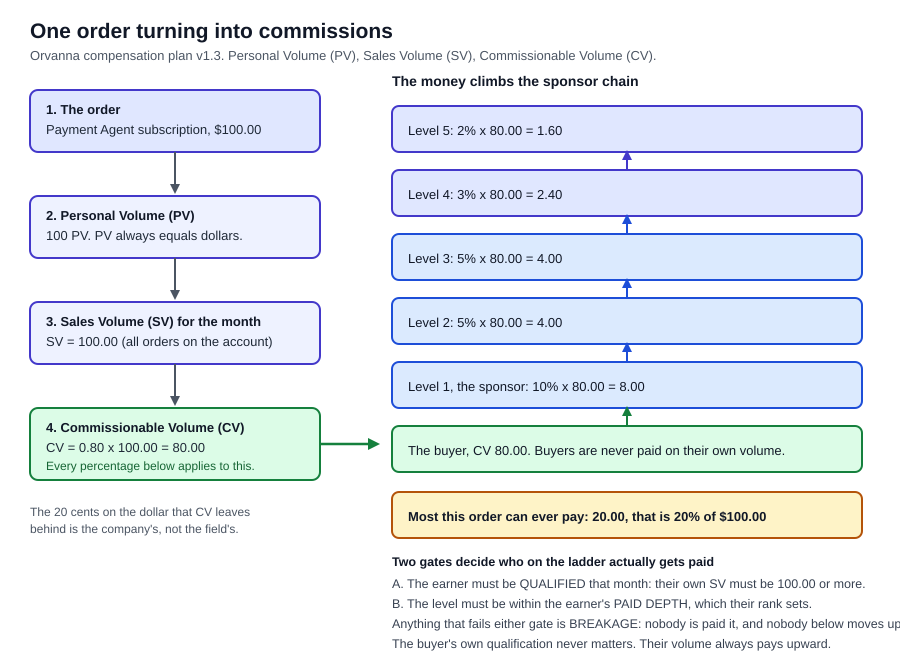
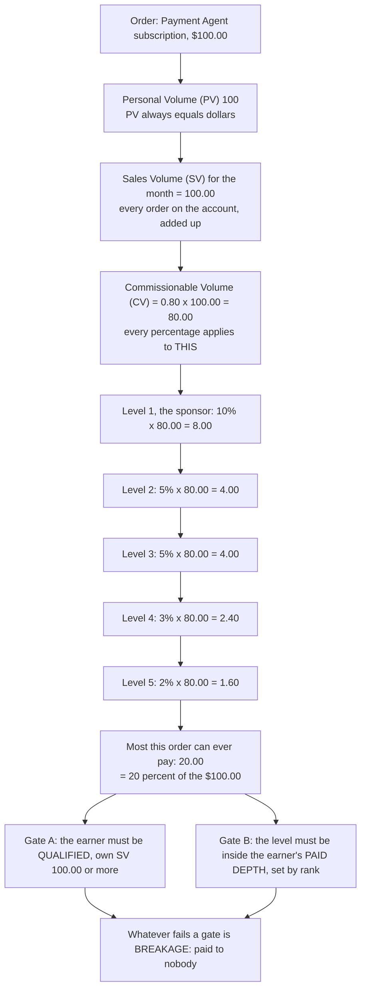
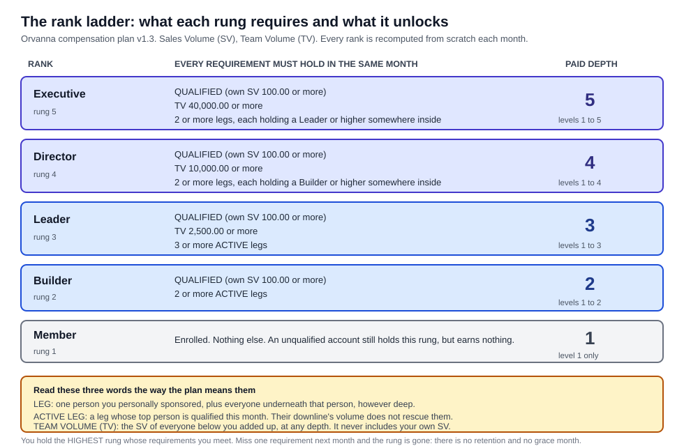
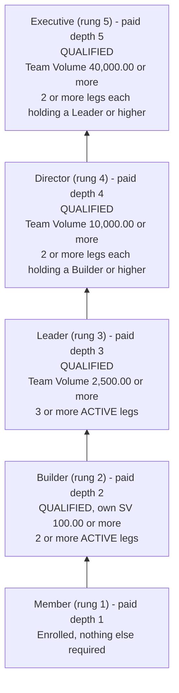
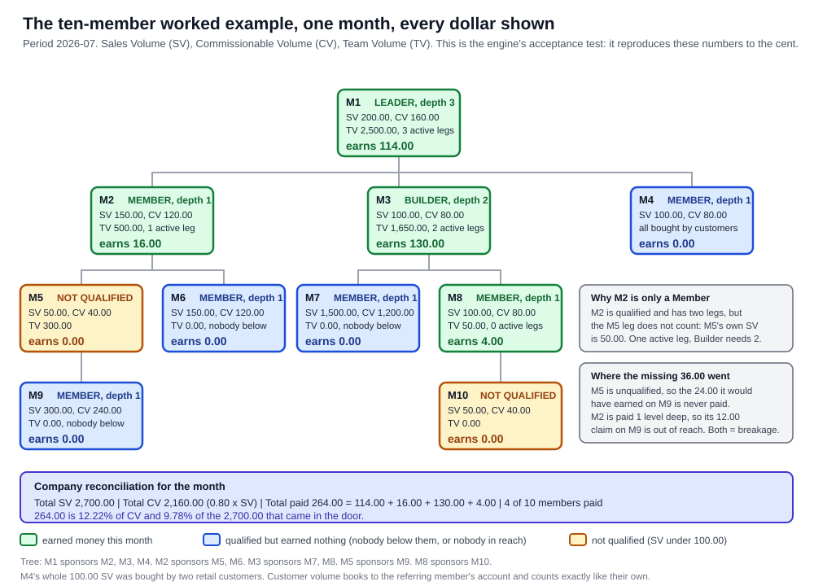
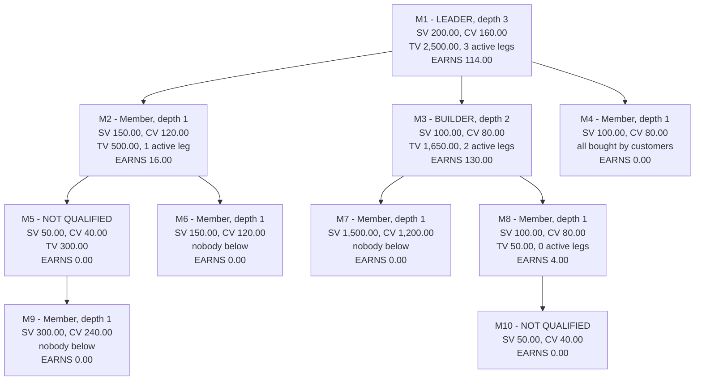

# 03. The Orvanna Compensation Plan

**Owner of this document:** the compensation engineer on the Orvanna build team.
**Plan version described:** v1.3, the version currently deployed.
**Written:** 2026-08-15.

**Sources this document was built from, and nothing else.** If a rule is not in one of
these files, it is not in this document:

- `C:\Users\howar\Desktop\Desktop\ORVANNA\MLM-PILOT\docs\COMP-PLAN-SPEC.md` (the specification, treated as the source of truth)
- `C:\Users\howar\Desktop\Desktop\ORVANNA\MLM-PILOT\docs\ORVANNA-COMP-PLAN-BOOKLET.html` (the member-facing booklet)
- `C:\Users\howar\Desktop\Desktop\ORVANNA\MLM-PILOT\db\comp\001_comp_engine.sql` (the engine, the code that actually computes money)
- `C:\Users\howar\Desktop\Desktop\ORVANNA\MLM-PILOT\db\comp\002_worked_example_test.sql` (the acceptance test)
- `C:\Users\howar\Desktop\Desktop\ORVANNA\MLM-PILOT\db\migrations\001_app_schema_core_tables.sql`, `004_ranks_seed.sql`, `007_customers.sql`, `010_demo_orders.sql`
- `C:\Users\howar\Desktop\Desktop\ORVANNA\MLM-PILOT\www\js\catalog.js` and `C:\Users\howar\Desktop\Desktop\ORVANNA\MLM-PILOT\functions\_shared\pricing.ts` (prices and Personal Volume per product)
- `C:\Users\howar\Desktop\Desktop\ORVANNA\MLM-PILOT\site\js\app.js` (the member portal that displays all of this)

**Acronym key, used throughout.** Personal Volume (PV). Sales Volume (SV). Commissionable
Volume (CV). Team Volume (TV). Multi-Level Marketing (MLM). Coordinated Universal Time
(UTC). Quality Assurance (QA). Structured Query Language (SQL). Every one of these is
spelled out again the first time it appears in the body text below.

---

## 1. The one-paragraph answer: how does someone earn money here

A member subscribes to one or more Orvanna artificial intelligence agents, each of which
carries a Personal Volume (PV) figure equal to its price in dollars. Everything that
member's account buys in a calendar month is added up into their Sales Volume (SV), and
80 percent of that becomes Commissionable Volume (CV), which is the only number
commissions are ever calculated from. Every month the company walks up the sponsorship
tree from each buyer and pays a slice of that buyer's CV to the people above them: 10
percent to the direct sponsor, then 5, 5, 3 and 2 percent to the next four people up. Two
gates decide whether any given person on that chain actually receives their slice. First,
that person must be QUALIFIED, meaning their own SV that month was 100.00 or more.
Second, the level must be inside their PAID DEPTH, which their rank sets: a plain Member
is paid one level down, a Builder two, a Leader three, a Director four, an Executive
five. Anything that fails either gate is simply not paid to anybody, which the plan calls
breakage. That is the entire earning model: no bonus pools, no matching bonuses, no fast
start, no retail markup, no rebate on your own purchases. One mechanism, two gates.

---

## 2. Lead with the picture

Plain path to that image:
`C:\Users\howar\Desktop\Desktop\ORVANNA\DOCUMENTATION\diagrams\commission-flow.svg`

The same thing as a diagram you can paste into a rendering tool:

**Why 80 percent and not 100.** CV is deliberately smaller than SV. The 20 cents on every
dollar that CV leaves behind never enters the commission calculation at all. It is the
company's margin, decided before any percentage is applied. This is why the plan can
truthfully say the absolute ceiling on an order is 20 percent of revenue and not 20
percent of CV: 20 percent of CV is 16 percent of revenue, and the five level percentages
add to 25 percent of CV, which is 20 percent of revenue.

Check that arithmetic yourself: 10 + 5 + 5 + 3 + 2 = 25 percent of CV. CV is 0.80 of
revenue. 0.25 x 0.80 = 0.20, so 20 percent of revenue. On a $100.00 order that is $20.00,
which is exactly 8.00 + 4.00 + 4.00 + 2.40 + 1.60.

---

## 3. Every word defined before it is used

One sentence each. No jargon inside the definitions.

| Term | What it means |
|---|---|
| **Member** | Somebody who has enrolled and has a place in the sponsorship tree; also the name of the lowest rank. |
| **Customer** | Somebody who buys agents through a member but does not join the tree; a customer never qualifies, never holds a rank, and never earns anything. |
| **Sponsor** | The one person directly above you in the tree, the person who enrolled you. |
| **Upline** | Everybody above you: your sponsor, their sponsor, and so on to the top. |
| **Downline** | Everybody below you, at any depth, however far down it goes. |
| **Frontline** | The people you personally sponsored, and only those people; your downline's first row. |
| **Leg** | One frontline person plus that person's entire downline, treated as a single branch. |
| **Level** | The plain distance in the tree from you down to somebody in your downline; your frontline is level 1, their frontline is level 2, and so on. |
| **Personal Volume (PV)** | The volume figure printed on a product, which in Orvanna always equals its price in dollars. |
| **Sales Volume (SV)** | The total PV of everything booked to your account in one calendar month, whether you bought it or one of your customers did. |
| **Commissionable Volume (CV)** | 80 percent of your SV, rounded to two decimals; the only number any commission percentage is ever applied to. |
| **Team Volume (TV)** | The SV of everybody strictly below you, added up across your whole downline at every depth; it never includes your own SV. |
| **Qualified month** | A month in which your own SV was 100.00 or more; it is the single gate for both getting paid and having your leg counted. |
| **Active leg** | A leg whose frontline person is qualified this month; a leg with a huge downline but an unqualified frontline person is not active. |
| **Rank** | The title you hold for one month, recomputed from scratch every month, which sets how many levels deep you are paid. |
| **Paid depth** | How many levels of your downline you are paid on: Member 1, Builder 2, Leader 3, Director 4, Executive 5. |
| **Breakage** | Commission money that the percentages describe but nobody receives, because the person who would have received it failed a gate. |
| **Compression** | The idea of skipping over an unqualified person so the next qualified person up moves into their slot; Orvanna v1 does NOT do this (see section 10). |
| **Commission run** | One numbered, versioned batch calculation for one month, which produces every member's statement and can be locked so it never changes. |

Two of these deserve an extra sentence because they are the ones that trip people up.

**TV excludes you.** If your downline sold 2,500.00 and you personally sold 200.00, your
TV is 2,500.00, not 2,700.00. This is the plan's explicit choice, recorded as open
question 1 in the specification with the answer "exclude".

**A leg is judged by its top person only.** The plan asks whether the frontline person is
qualified, not whether the branch produced volume. This is deliberate: it means a rank is
built by helping the people you personally sponsored stay active, not by sitting above
one lucky branch.

---

## 4. What is actually sold, and the PV on it

The commission plan is downstream of the catalog, so the catalog numbers matter. These
are read from `www\js\catalog.js` and mirrored in `functions\_shared\pricing.ts`, which a
checking script (`functions\_shared\check_pricing_mirror.py`) compares so the two cannot
drift apart.

### 4.1 The twelve agents, which are the only products the compensation engine knows about

| Tier | Products | Price per month | PV per month |
|---|---|---|---|
| Domain agents | Payment Agent, Shipping Agent, Pricing Agent, Inventory Agent, Marketing Agent, Tax Agent | $100.00 | 100 |
| Support agents | Software Engineer, Quality Assurance (QA), Secretary, Chief Executive, Accounting, Customer Care | $50.00 | 50 |

PV equals dollars, one to one, always. A subscription bills and grants its PV every month
it is active. Cancel it and the PV stops from the cancellation month forward; months
already billed keep their volume.

### 4.2 The bundles and packs the shop also sells, which the compensation engine does NOT know about

The storefront sells four more items, and it also offers a one-time purchase mode at ten
times the monthly price with ten times the PV:

| Item | Monthly price and PV | One-time price and PV |
|---|---|---|
| Manager Agent (bundle) | $200.00 / 200 PV | $2,000.00 / 2,000 PV |
| Ignition Pack | $200.00 / 200 PV | $2,000.00 / 2,000 PV |
| Momentum Pack | $400.00 / 400 PV | $4,000.00 / 4,000 PV |
| Constellation Pack | $800.00 / 800 PV | $8,000.00 / 8,000 PV |

**Be clear about what this means.** The compensation specification describes two tiers and
only two tiers. The database table that the engine reads, `app.products`, has a constraint
that allows only the values `domain` and `support` for a product's tier, so a bundle or a
pack cannot even be stored as a product the engine can see. No bundle, pack, or one-time
purchase has ever produced a single cent of commission. This is one of the real gaps
listed in section 10, not a rounding detail.

---

## 5. Mechanism one: level pay on your frontline (level 1)

This is the mechanism that produces most of the money in the plan, because level 1 pays
10 percent, twice the rate of any other level.

### 5.1 The rule

You are paid 10 percent of the CV of every person you personally sponsored, for as long
as you are qualified that month. Their own qualification does not matter. If they bought,
you are paid on it.

### 5.2 Worked example, every step

You sponsored somebody. This month they subscribed to the Marketing Agent and the
Customer Care agent.

1. Marketing Agent price $100.00, PV 100. Customer Care price $50.00, PV 50.
2. Their SV for the month = 100 + 50 = **150.00**.
3. Their CV = 0.80 x 150.00 = **120.00**.
4. You are qualified this month (your own SV was at least 100.00), and level 1 is inside
   every rank's paid depth, so the gates pass.
5. Your commission line = 10 percent x 120.00 = 0.10 x 120.00 = **12.00**.

You earn $12.00 on their $150.00 of buying. As a fraction of what they actually spent
that is 12.00 / 150.00 = 8 percent, not 10 percent, because the 10 percent applies to CV,
not to the price. This is the single most common misreading of any MLM plan, so it is
worth saying out loud: **every percentage in this plan is a percentage of CV, and CV is
80 percent of the money.**

### 5.3 The same example if they had bought only one support agent

1. Software Engineer only. Their SV = **50.00**, their CV = 0.80 x 50.00 = **40.00**.
2. They are not qualified themselves (50.00 is below 100.00), which does not matter here.
3. Your level 1 line = 0.10 x 40.00 = **4.00**.

They earn nothing themselves that month and their leg does not count as active for your
rank, but their volume still pays you. That asymmetry is intentional and is written into
the specification in section 5: "all CV pays upline, whoever generated it".

---

## 6. Mechanism two: depth beyond level 1, which rank unlocks

### 6.1 The rule

Levels 2 through 5 pay 5, 5, 3 and 2 percent of the source person's CV, and you only reach
them if your rank says you do. Your paid depth is a hard cut: at depth 2 you are paid on
levels 1 and 2 and you see nothing from level 3, no matter how much volume is there.

| Level | Rate | Reached by |
|---|---|---|
| 1 | 10 percent | every rank, including Member |
| 2 | 5 percent | Builder and above |
| 3 | 5 percent | Leader and above |
| 4 | 3 percent | Director and above |
| 5 | 2 percent | Executive only |

### 6.2 Worked example, every step

You are a Builder, so your paid depth is 2. Underneath you:

- Your frontline person A subscribed to the twelve-agent style stack: 12 domain agents at
  $100.00 and 6 support agents at $50.00.
- Your frontline person B subscribed to two support agents.
- Person B sponsored person C, who subscribed to one support agent.

Step by step:

1. Person A's SV = (12 x 100) + (6 x 50) = 1,200 + 300 = **1,500.00**.
   Person A's CV = 0.80 x 1,500.00 = **1,200.00**.
2. Person B's SV = 50 + 50 = **100.00**. Person B's CV = 0.80 x 100.00 = **80.00**.
3. Person C's SV = **50.00**. Person C's CV = 0.80 x 50.00 = **40.00**.
4. Person A is at level 1 for you: 0.10 x 1,200.00 = **120.00**.
5. Person B is at level 1 for you: 0.10 x 80.00 = **8.00**.
6. Person C is at level 2 for you: 0.05 x 40.00 = **2.00**.
7. Your total = 120.00 + 8.00 + 2.00 = **130.00**.

Now change one thing and nothing else: you are a plain Member instead of a Builder, so
your paid depth is 1. Person C is now out of reach. You earn 120.00 + 8.00 = **128.00**,
and the 2.00 is breakage. Nobody else gets it. It is not pushed to the person above you
and it is not held for later.

**The teaching point.** Rank in this plan buys reach, not rate. Going from Member to
Builder does not increase what you earn on your frontline by a single cent. It only opens
a new row of people underneath them.

---

## 7. Mechanism three: customer sales rolling up

### 7.1 The rule

Anybody can buy Orvanna agents as a customer through a referring member without joining
the tree. The customer's order is booked onto the referring member's account, tagged as a
retail customer purchase with the customer's own identity kept on the order so the receipt
is still auditable. The full PV counts in that member's SV. The customer never qualifies,
never holds rank, and never earns.

In v1 the referring member does **not** get a separate retail commission on that sale. The
benefit is entirely indirect: the volume counts toward the member's own qualification,
toward their CV (which pays their upline), and toward their upline's TV.

### 7.2 Worked example, every step

A member has no subscriptions of their own this month. Two of their customers each buy one
support agent: one buys the Quality Assurance (QA) agent, the other buys the Secretary
agent.

1. QA agent $50.00, PV 50. Secretary $50.00, PV 50.
2. Both orders book to the member's account, so the member's SV = 50 + 50 = **100.00**.
3. 100.00 is greater than or equal to 100.00, so the member is **qualified this month**,
   without having bought anything themselves.
4. The member's CV = 0.80 x 100.00 = **80.00**.
5. The member earns nothing directly on these sales. Their sponsor earns
   0.10 x 80.00 = **8.00** at level 1.
6. Because the member is now qualified, their own leg counts as active for their sponsor's
   rank, and they are eligible to be paid on anybody in their own downline.

**Why this matters beyond the arithmetic.** The specification records the reason on the
record: it means a member's qualification can rest on volume **sold**, not only volume
**bought**. Plans where the only way to qualify is to buy your own product are the ones
regulators call pay to play. This is the structural answer to that criticism, and it is
the reason the customer feature exists at all.

---

## 8. The rank ladder

Plain path:
`C:\Users\howar\Desktop\Desktop\ORVANNA\DOCUMENTATION\diagrams\rank-ladder.svg`

### 8.1 The rules in words

- Every requirement on a rung must hold in the **same month**. There is no mixing of a
  good January with a good March.
- You hold the **highest** rung whose requirements you meet. Nobody is stuck on a lower
  rung because of order of evaluation.
- Ranks are recomputed **from scratch every month**. There is no retention, no "highest
  ever achieved" title, and no grace period. The specification records this as open
  question 3 with the answer "monthly-pure for v1".
- Every threshold is **greater than or equal to**, never "more than". Exactly 100.00
  qualifies. Exactly 2,500.00 of Team Volume (TV) makes Leader. This is open question 2,
  answered "inclusive".
- Requiring the holder's own qualified month on every rung above Member is the v1.3
  change, made on 2026-08-13. Before that, a person with a large team and no personal
  volume could hold a Leader or Director title. Howard's ruling was one word: "Gate it."

### 8.2 Two rungs that read differently from the others

**Builder collapsed into the qualification gate.** Builder's requirement used to be a
separate personal volume test. Once qualification moved to 100.00 SV, Builder's personal
test became identical to it, so Builder is now simply "qualified plus two active legs".

**Director and Executive count legs by what is inside them, not by activity.** For Leader
you count active legs, meaning the frontline person is qualified. For Director you count
legs that contain a Builder or higher **anywhere inside**, at any depth. For Executive you
count legs that contain a Leader or higher anywhere inside. This is what makes the top of
the ladder about developing other leaders rather than about accumulating volume.

The engine evaluates these in a fixed order for exactly this reason: Builder depends only
on qualification, Leader on TV and active legs, Director on who holds Builder or Leader,
Executive on who holds Leader or Director. Each stage only reads results from earlier
stages, so the definitions can never chase each other in a circle.

---

## 9. The full worked scenario: ten people, one month, every dollar

This is the specification's section 7 example. It is not an illustration invented for this
document. It is the **acceptance test**: the engine is required to reproduce every number
below exactly, and `db\comp\002_worked_example_test.sql` fails loudly if a single value
differs.

Plain path:
`C:\Users\howar\Desktop\Desktop\ORVANNA\DOCUMENTATION\diagrams\worked-example-tree.svg`

### 9.1 Who bought what, and the volume arithmetic

| Person | What they subscribed to | SV arithmetic | SV | CV = 0.80 x SV | Qualified? |
|---|---|---|---|---|---|
| M1 | Payment Agent + Pricing Agent | 100 + 100 | 200.00 | 160.00 | yes |
| M2 | Payment Agent + Software Engineer | 100 + 50 | 150.00 | 120.00 | yes |
| M3 | Shipping Agent | 100 | 100.00 | 80.00 | yes, exactly on the line |
| M4 | QA + Secretary, both bought by M4's customers C1 and C2 | 50 + 50 | 100.00 | 80.00 | yes, exactly on the line |
| M5 | Accounting | 50 | 50.00 | 40.00 | **no** |
| M6 | Marketing Agent + Customer Care | 100 + 50 | 150.00 | 120.00 | yes |
| M7 | 12 domain agents + 6 support agents | (12 x 100) + (6 x 50) | 1,500.00 | 1,200.00 | yes |
| M8 | Software Engineer + Accounting | 50 + 50 | 100.00 | 80.00 | yes, exactly on the line |
| M9 | Payment + Shipping + Pricing | 100 + 100 + 100 | 300.00 | 240.00 | yes |
| M10 | Secretary | 50 | 50.00 | 40.00 | **no** |

Total SV = 200 + 150 + 100 + 100 + 50 + 150 + 1,500 + 100 + 300 + 50 = **2,700.00**.
Total CV = 0.80 x 2,700.00 = **2,160.00**. Cross-check by adding the CV column:
160 + 120 + 80 + 80 + 40 + 120 + 1,200 + 80 + 240 + 40 = 2,160.00. They agree.

### 9.2 Team Volume, computed from the bottom up

TV is everybody below you, so start at the leaves and work upward.

- M9, M10, M6, M7, M4 have nobody below them: TV = **0.00** each.
- M5's downline is M9 only: TV = **300.00**.
- M8's downline is M10 only: TV = **50.00**.
- M2's downline is M5, M6 and M9: 50 + 150 + 300 = **500.00**.
- M3's downline is M7, M8 and M10: 1,500 + 100 + 50 = **1,650.00**.
- M1's downline is everybody else: 2,700.00 total minus M1's own 200.00 = **2,500.00**.
  Longhand: 150 + 100 + 100 + 50 + 150 + 1,500 + 100 + 300 + 50 = 2,500.00.

M1 lands exactly on the Leader threshold of 2,500.00. Because the plan is inclusive,
exactly on the line counts.

### 9.3 Active legs and rank, person by person

| Person | Frontline | Which of them are qualified | Active legs | Rank test | Rank | Paid depth |
|---|---|---|---|---|---|---|
| M1 | M2, M3, M4 | all three | 3 | qualified, TV 2,500 >= 2,500, 3 legs >= 3 | **Leader** | 3 |
| M2 | M5, M6 | M6 only (M5 has SV 50) | 1 | qualified, but Builder needs 2 active legs | Member | 1 |
| M3 | M7, M8 | both | 2 | qualified, 2 active legs. Leader needs TV 2,500, has 1,650 | **Builder** | 2 |
| M4 | none | n/a | 0 | qualified, no legs | Member | 1 |
| M5 | M9 | M9 | 1 | **not qualified**, so no rank above Member | Member | 1 |
| M8 | M10 | none (M10 has SV 50) | 0 | qualified, 0 active legs | Member | 1 |
| M6, M7, M9, M10 | none | n/a | 0 | no legs | Member | 1 |

**The M2 teaching case.** M2 is qualified, has two frontline people, and has 500.00 of
Team Volume. M2 is still a plain Member, because one of those two legs is headed by M5,
whose own SV is 50.00. M5's leg contains 300.00 of volume from M9, and none of that
rescues M5's leg. The leg is judged by its top person.

**The M8 teaching case.** M8 is qualified but has zero active legs, because M8's only
frontline person, M10, sold 50.00. M8 still earns, because earning at level 1 requires
only that M8 is qualified. Rank and earning are two different tests.

### 9.4 Every commission line in the run

Rate by level: level 1 is 10 percent, level 2 is 5 percent, level 3 is 5 percent.
No line in this example reaches level 4 or 5, because the tree is only three levels deep.

| Earner | Source | Level | Source CV | Rate | Arithmetic | Amount |
|---|---|---|---|---|---|---|
| M1 | M2 | 1 | 120.00 | 10% | 0.10 x 120.00 | 12.00 |
| M1 | M3 | 1 | 80.00 | 10% | 0.10 x 80.00 | 8.00 |
| M1 | M4 | 1 | 80.00 | 10% | 0.10 x 80.00 | 8.00 |
| M1 | M5 | 2 | 40.00 | 5% | 0.05 x 40.00 | 2.00 |
| M1 | M6 | 2 | 120.00 | 5% | 0.05 x 120.00 | 6.00 |
| M1 | M7 | 2 | 1,200.00 | 5% | 0.05 x 1,200.00 | 60.00 |
| M1 | M8 | 2 | 80.00 | 5% | 0.05 x 80.00 | 4.00 |
| M1 | M9 | 3 | 240.00 | 5% | 0.05 x 240.00 | 12.00 |
| M1 | M10 | 3 | 40.00 | 5% | 0.05 x 40.00 | 2.00 |
| M2 | M5 | 1 | 40.00 | 10% | 0.10 x 40.00 | 4.00 |
| M2 | M6 | 1 | 120.00 | 10% | 0.10 x 120.00 | 12.00 |
| M3 | M7 | 1 | 1,200.00 | 10% | 0.10 x 1,200.00 | 120.00 |
| M3 | M8 | 1 | 80.00 | 10% | 0.10 x 80.00 | 8.00 |
| M3 | M10 | 2 | 40.00 | 5% | 0.05 x 40.00 | 2.00 |
| M8 | M10 | 1 | 40.00 | 10% | 0.10 x 40.00 | 4.00 |

Fifteen lines, and that is every line the run produces.

### 9.5 Statement totals, one person at a time

- **M1** = 12.00 + 8.00 + 8.00 + 2.00 + 6.00 + 60.00 + 4.00 + 12.00 + 2.00.
  Take it in pieces: level 1 gives 12 + 8 + 8 = 28.00. Level 2 gives 2 + 6 + 60 + 4 =
  72.00, running total 100.00. Level 3 gives 12 + 2 = 14.00. **Total 114.00.**
- **M2** = 4.00 + 12.00 = **16.00.**
- **M3** = 120.00 + 8.00 + 2.00 = **130.00.**
- **M8** = **4.00.**
- **M4, M5, M6, M7, M9, M10** = **0.00 each.** M4, M6, M7 and M9 are qualified but have
  nobody in reach below them. M5 and M10 are not qualified.

Company payout = 114.00 + 16.00 + 130.00 + 4.00 = **264.00**. Members paid: **4 of 10**.

264.00 / 2,160.00 = **12.22 percent of CV**. 264.00 / 2,700.00 = **9.78 percent of the
money that came in the door.**

### 9.6 The reconciliation Howard should actually check: where the other money went

The structural ceiling is 20 percent of CV paid across five levels, which the plan states
as 25 percent of CV, that is 20 percent of revenue. On 2,160.00 of CV, the five level
percentages could in principle describe 0.25 x 2,160.00 = **540.00**. Only 264.00 was
paid. Here is every dollar of the difference, and none of it is unexplained.

**Loss one: the tree has no ancestors to pay.** M1 is the root, so nothing above M1 exists
and M1's own 160.00 of CV pays nobody. M2's CV can only reach one level up, not five. And
so on. Add up, for each person, only the levels that actually exist above them:

| Source | CV | Levels that exist above them | Most that could be paid on this person |
|---|---|---|---|
| M1 | 160.00 | none | 0.00 |
| M2 | 120.00 | level 1 (M1) | 12.00 |
| M3 | 80.00 | level 1 (M1) | 8.00 |
| M4 | 80.00 | level 1 (M1) | 8.00 |
| M5 | 40.00 | levels 1 to 2 (M2, M1) | 4.00 + 2.00 = 6.00 |
| M6 | 120.00 | levels 1 to 2 (M2, M1) | 12.00 + 6.00 = 18.00 |
| M7 | 1,200.00 | levels 1 to 2 (M3, M1) | 120.00 + 60.00 = 180.00 |
| M8 | 80.00 | levels 1 to 2 (M3, M1) | 8.00 + 4.00 = 12.00 |
| M9 | 240.00 | levels 1 to 3 (M5, M2, M1) | 24.00 + 12.00 + 12.00 = 48.00 |
| M10 | 40.00 | levels 1 to 3 (M8, M3, M1) | 4.00 + 2.00 + 2.00 = 8.00 |

That column adds to 12 + 8 + 8 + 6 + 18 + 180 + 12 + 48 + 8 = **300.00**. So 540.00
minus 300.00 = **240.00 never existed**, purely because this tree is small and shallow.
In a mature tree this shrinks toward zero, which is exactly why real payout rates climb as
an organization matures.

**Loss two: the two gates.** Of that reachable 300.00, only 264.00 was paid:

- M5 is not qualified, so the 0.10 x 240.00 = **24.00** that M5 would have earned on M9 is
  paid to nobody.
- M2's paid depth is 1, so M2's level 2 claim on M9, 0.05 x 240.00 = **12.00**, is out of
  reach.

24.00 + 12.00 = **36.00 of breakage**. And 300.00 minus 36.00 = **264.00**, which is the
payout. Every dollar is now accounted for:

**540.00 (structural ceiling) = 240.00 (no upline exists) + 36.00 (breakage at the two
gates) + 264.00 (paid).**

**Why there is no compression, said plainly.** If the plan compressed, M5 being
unqualified would let M2 slide into M5's place and collect the 24.00. Orvanna v1 does not
do this. The specification names compression as the flagship version 2 feature. Until
then, an unqualified person is a wall in the tree, not a hole.

---

## 10. Qualification: the single gate

### 10.1 The rules

- **Qualified means SV greater than or equal to 100.00 in that calendar month.** That is
  the whole test.
- **The same number does two jobs.** It decides whether you can be paid, and it decides
  whether your leg counts as active for the person above you.
- **Ways to reach it:** one domain agent (100 PV), or two support agents (50 + 50), or any
  mix that reaches 100, or customer purchases booked to your account, or any combination
  of those.
- **Exactly 100.00 qualifies.** Every threshold in this plan is inclusive.
- **It resets every month.** There are no grace months in version 1. A qualified March
  does nothing for April.

### 10.2 What happens if somebody does not qualify

Four things, and it is worth separating them because they are often confused:

1. **They are paid nothing that month.** Not reduced, not deferred: zero commission lines
   are created for them at all. There is no makeup payment later.
2. **Their leg does not count as active** for their sponsor's rank, no matter how much
   volume sits below them.
3. **They cannot hold any rank above Member**, even if their Team Volume and leg counts
   would otherwise reach Leader or Director. That is the v1.3 rule.
4. **Their own volume still pays their upline in full.** Their CV flows up exactly as if
   they were qualified. Losing qualification costs the person, not the company or the
   people above them.

### 10.3 Where the gate is enforced in code

All of it is in `C:\Users\howar\Desktop\Desktop\ORVANNA\MLM-PILOT\db\comp\001_comp_engine.sql`,
inside the function `app.fn_run_commission`:

| Rule | Where it lives |
|---|---|
| SV from completed orders stamped with the volume month | the `member_sv` common table expression, summing `quantity * unit_volume` |
| CV = round(0.80 x SV, 2) | the `vols` common table expression |
| TV = whole subtree excluding self | the `tv_agg` common table expression, reading the run's level map |
| Qualified = SV >= 100.00 | the `base` common table expression, written as `(v.sv >= 100.00) as qualified` |
| Active leg = frontline person is qualified | the `active_leg_counts` common table expression |
| Builder, Leader, Director, Executive flags, all carrying the qualified test | `flags_bl`, `flags_d`, `flags_e` |
| Highest rank held wins | the `ranked` common table expression |
| Paid depth per rank | joined from `app.ranks`, seeded in `db\migrations\004_ranks_seed.sql` |
| Earner must be qualified to be paid | the commission line insert, `where ... earner.qualified` |
| Level must be inside paid depth | the same insert, `and lm.level <= earner.paid_depth` |
| Source qualification is irrelevant | there is deliberately no such condition on `src` |
| No compression | levels come from the run's level map, which stores plain tree distance |

The engine never loops over members. Every step is one set-based SQL statement, which is
why a thousand-member month finishes in well under a second and why the same approach
would still hold at a hundred thousand members.

### 10.4 Where the gate is NOT enforced, or is duplicated

- **Closed accounts are still included in every run.** The engine writes one result row
  for every member row regardless of account status. A closed member with no orders shows
  zeros, which is harmless, but a closed member with orders would still be counted. The
  engine's own README raises this as an unresolved open question for the architect.
- **The rules exist in three places.** The engine in SQL is the truth. The member portal
  (`site\js\app.js`) carries its own JavaScript copy of the constants: `QUAL_SV = 100`,
  `PAID_DEPTH`, and a `RANK_REQS` table with the thresholds 2,500 / 10,000 / 40,000. The
  member booklet carries a third copy in prose. The portal copy is display only and does
  not compute any payment, but nothing mechanically stops those three from drifting apart
  the way the pricing files are protected by a mirror-checking script. This is a real
  maintenance risk, not a theoretical one.

---

## 11. Honest section: what is specified versus what is actually built

Howard asked for this plainly, so it is stated plainly. Everything in section 11.1 is real
working code that has been run and independently verified. Everything in section 11.2 is
words on paper with no implementation behind it.

### 11.1 BUILT and verified

| Capability | Evidence |
|---|---|
| SV, CV and TV computed from completed orders | `db\comp\001_comp_engine.sql`, function `app.fn_run_commission` |
| The 100.00 qualification gate | same function, `base` common table expression |
| All five ranks, their thresholds, active legs, leg containment for Director and Executive, and paid depth | same function, `flags_bl` through `ranked`, plus `db\migrations\004_ranks_seed.sql` |
| The v1.3 rule that every rank above Member requires the holder's own qualified month | same function; all three high-rank flags carry `f.qualified` |
| Unilevel level pay at 10 / 5 / 5 / 3 / 2 percent, earner-qualified, depth-gated, source qualification ignored, no compression | the commission line insert in the same function |
| Line-level rounding, with member and company totals as sums of already-rounded lines | same function, steps 3 to 5 |
| Versioned commission runs with statuses running, final and superseded, one final run per period, and database triggers that freeze a finalized run's rows | `app.fn_finalize_run` plus `db\migrations\006_immutability_hardening.sql` |
| Customer purchases booking to the referring member's account, with the buyer's identity kept on the order | `db\migrations\007_customers.sql`, including the constraint that a retail customer order must name a customer and a member order must not |
| The ten-member worked example reproduced to the cent | `db\comp\002_worked_example_test.sql`, three symmetric difference checks that must all return zero rows |
| Six real months computed and finalized on a thousand-member tree | Feb 11,906.00, Mar 13,434.00, Apr 14,636.00, May 16,507.20, Jun 17,749.20, Jul 20,669.20; July is run number 12 with total SV 172,550.00, total CV 138,040.00 and 284 of 1,000 members paid, which is 14.97 percent of CV |
| Independent recomputation by a second agent that matched the deployed database to the cent for all six months | `docs\verification\PHASE-3-VERDICT.md` |
| Member-facing display of rank, SV, CV, TV and statement lines | `site\js\app.js` |

A useful detail from that six-month history: the v1.3 qualification gate only changed three
of the six months. February fell from 12,014.00 to 11,906.00, March from 13,549.20 to
13,434.00, April from 14,763.20 to 14,636.00, and May, June and July were unchanged. The
gate cost 350.40 across half a year, which tells you that almost every high-rank holder was
already buying enough to qualify. The v1.2 runs were kept as frozen superseded history
rather than deleted.

### 11.2 SPEC ONLY, or not built at all

| Item | Status | Why it matters |
|---|---|---|
| **Compression** | Written up as the flagship version 2 feature. No code. | This is the single biggest gap between how the plan reads and how mature plans behave. Every unqualified person is currently a hard wall. |
| **Refunds and clawbacks** | Explicitly out of scope. The order status column allows `refunded`, but the engine only ever reads `completed`, and no code path ever writes a refund. | If a refund ever happens, no rule exists yet for reversing volume or reclaiming paid commission. The booklet promises the rule will be published before refunds exist. |
| **A retail commission on customer sales** | Open question 5 in the specification, answered "no for v1". Not built. | Today a member with only customer sales earns nothing directly from them. |
| **Grace months, rank retention, highest-ever titles** | Named as version 2 candidates. Not built. | Ranks are brutally monthly today. |
| **The `cumulative_sv` column** | Exists in the results table, written as `null` on every row, explicitly "reserved in v1". | A column that always holds nothing is a promise, not a feature. |
| **Bundles, packs, and one-time purchases** | Sold by the shop at 200 to 800 PV monthly and up to 8,000 PV one time. The compensation specification describes only two tiers, and the `app.products` table constraint permits only `domain` and `support`. | **This is the most serious gap.** The storefront can sell a product the compensation engine structurally cannot see. No bundle or pack has ever paid a commission to anyone. |
| **Live checkouts feeding the commission engine** | Live shop and staff console orders are written to `app.demo_orders` by the edge functions. Migration 010 states explicitly that this table has no foreign key into `app.orders` and "feeds nothing". | **Every commission ever calculated came from seeded data.** No real purchase on the live site has ever produced a cent of commission. The two halves of the system are not connected. |
| **Any mechanism for actually paying a member** | Nothing in the codebase moves money to a member. There is no payout method, no bank detail, no disbursement record, no payment file. | The system computes statements. It does not pay them. That is a deliberate scope line for a demonstration, but it should never be described as a payout system. |
| **Any scheduler** | `app.fn_run_commission` and `app.fn_finalize_run` are called by hand. There is no cron job, no scheduled task, no automation. | A month closes only when a human runs it. |
| **Closed-account handling** | Unresolved open question in the engine README. Closed members are included in runs. | Low impact today, undefined behavior tomorrow. |
| **The `preferred_customer` buyer role** | Allowed by the database constraint on `app.orders`. The compensation specification defines only `member` and `retail_customer`. | An unused third value with no rule attached to it. |
| **The activation fee** | The checkout charges $25.00 for priority activation. It is not a product, carries no PV, and the compensation specification never mentions it. | Whether an activation fee is commissionable is a question the plan has not answered. Today the answer is accidentally "no". |
| **Migration "009"** | The specification and roadmap refer to "engine migration 009" for the v1.3 gate. No such file exists on disk; the v1.3 text lives inside `db\comp\001_comp_engine.sql`. | A rebuild from the repository produces 13 ledger rows where the live project has 14, which the database audit already flagged. Cosmetic, but it means the repository and the deployed project do not describe their history identically. |

---

## 12. Payout timing, money representation, and rounding

### 12.1 The calendar

1. **Volume month stamp.** Every order is stamped with the month it counts toward at the
   moment it is created, in Coordinated Universal Time (UTC). Subscription orders always
   stamp the first day of the month. That stamp never moves afterward, so a late edit can
   never shift volume between months.
2. **Cutoff.** A month's volume is complete when the calendar month ends. Nothing enters
   a closed month.
3. **The run.** After month end, somebody calls `app.fn_run_commission(period)`. It creates
   a numbered run with status `running`, computes everything, and stops. It does not
   finalize itself.
4. **Finalization.** Somebody calls `app.fn_finalize_run(run_id)`. Only a `running` run can
   be finalized. It first flips any previous final run for that month to `superseded`, then
   marks this run `final`, at which point database triggers freeze its rows against update,
   delete, and even insert.
5. **Reruns.** A recomputation never edits history. It creates a new run number, and the old
   run stays in the database marked superseded. Every statement traces to the exact run that
   produced it.
6. **Actual payment.** There is none. See section 11.2. The run produces statements.

### 12.2 Two different ways this system stores money, which must not be confused

- **The commission engine uses `numeric(12,2)`,** a fixed-point decimal type. There are no
  floating-point numbers anywhere in the engine. This is the correct choice: floating point
  cannot represent 0.10 exactly and would eventually produce a statement that does not add
  up.
- **The live checkout uses integer cents.** `app.demo_orders` stores
  `subtotal_one_cents`, `subtotal_sub_cents`, `activation_fee_cents` and `tax_cents` as
  integers, because that is the same minor unit the payment application programming
  interface uses, which makes the amount comparison an exact integer check with no rounding
  question at all.

These two representations never meet today, because live orders do not feed the engine. If
they are ever connected, that boundary is exactly where a conversion bug would live, and it
deserves an explicit test.

### 12.3 Rounding: where, which direction, and how much can be lost or created

**Rounding happens in exactly two places, and nowhere else.**

1. **Once per member per month:** `CV = round(0.80 x SV, 2)`.
2. **Once per commission line:** `amount = round(rate x source CV, 2)`.

**Direction.** Postgres `round(numeric, 2)` rounds half away from zero. Every quantity in
this system is zero or positive, so half away from zero is identical to half up, which is
what the specification requires. At exactly half a cent, the member gets the extra cent.

**Totals are never re-rounded.** A member's statement total is the sum of their already
rounded lines. The company total is the sum of the already rounded member totals. Nothing
is rounded twice, which is the classic way a statement ends up not adding up.

**Where money could be lost or created, honestly assessed.**

- **With the current catalog, rounding never fires at all.** Every price is a multiple of
  $50.00, so every SV is a multiple of 50, so every CV is a multiple of 40 (since
  0.80 x 50 = 40). Then every rate lands exactly on a cent: 10 percent of 40 is 4.00, 5
  percent is 2.00, 3 percent is 1.20, 2 percent is 0.80. The same holds for the bundles and
  packs at 200, 400, 800 PV and for the one-time ten-times prices. **Not one cent in any of
  the six finalized months was created or destroyed by rounding.** The independent audit
  confirmed this from the other direction: zero rows where an amount disagreed with
  `round(rate x source_cv, 2)`.
- **The moment a price is not a multiple of $2.50, rounding starts firing.** The tightest
  rate is 2 percent of CV, which is 0.02 x 0.80 = 0.016 of the price. For that to be a whole
  number of cents, the price must be a multiple of $0.625, and a multiple of $2.50 is safe
  for all five rates. A $19.99 add-on would produce a level 5 line of
  0.016 x 19.99 = 0.31984, which rounds to 0.32 and **creates** 0.00016 of money out of
  nothing.
- **The direction of the bias is toward the member, and the company absorbs it.** Because
  rounding is half up and all amounts are positive, the sum of rounded lines is greater than
  or equal to the exact sum. The maximum overpayment across a whole run is the number of
  commission lines multiplied by half a cent. Nothing is being divided out of a fixed pool,
  so nobody's share is reduced to fund somebody else's rounded-up cent: the company simply
  pays the sum of the lines.
- **The rule to protect this property:** keep every catalog price a multiple of $2.50. It
  costs nothing and it keeps every statement exactly reconcilable. This is a recommendation,
  not a rule in the plan, and it is not enforced anywhere in code today.

### 12.4 Why the same run twice gives the same answer

The engine is deterministic by construction, which matters because a compensation plan that
can produce two different answers for the same month is not a compensation plan.

- The genealogy is **snapshotted once** at the start of the run into a run-scoped level map.
  Every later step reads that snapshot, never the live tree, so editing the tree while a run
  is in flight cannot change that run's output.
- Both bulk inserts carry an explicit sort order, so even the row identifiers come out in the
  same sequence.
- All arithmetic is fixed-point decimal.
- The run records which specification version it was computed under, currently `v1.3`.

The specification's own phrasing is the contract: same data plus same specification version
equals identical output to the cent, always.

---

## 13. Quick reference card

| Question | Answer |
|---|---|
| What is commissionable? | 80 percent of Sales Volume, called Commissionable Volume. |
| What are the level rates? | 10, 5, 5, 3, 2 percent, levels 1 through 5. |
| Most that can be paid on one order? | 20 percent of the price, 25 percent of CV. |
| What makes a month qualified? | Your own Sales Volume of 100.00 or more. |
| Cheapest way to qualify? | One domain agent at $100.00, or two support agents at $50.00, or customer purchases totalling 100 PV. |
| Does my own buying earn me anything? | No. It qualifies you and it pays your upline. |
| Do I earn on somebody unqualified below me? | Yes, their volume pays you normally. |
| How deep am I paid? | Member 1, Builder 2, Leader 3, Director 4, Executive 5. |
| Does rank change my percentages? | No. Rank only changes how deep you reach. |
| Do ranks carry over? | No. Every rank is recomputed from scratch each month. |
| Is there compression? | No, not in version 1. |
| Are refunds handled? | No, not in version 1. |
| Is anybody actually paid money? | No. The system computes and locks statements; it does not disburse. |

---

## 14. Change history of the plan itself

| Version | Date | What changed |
|---|---|---|
| 1.0 | 2026-08-13 | First complete plan: level pay 10/5/5/3/2, five ranks, a 50 PV activity gate, a generic product. |
| 1.1 | 2026-08-13 | Product locked to artificial intelligence agent subscriptions, domain at $100.00 and support at $50.00. The qualification gate moved to 100 PV and became a single gate doing both jobs, being paid and counting a leg active. Worked example rebuilt. |
| 1.2 | 2026-08-13 | Customer accounts added. Customers buy through a referring member, their full PV rolls up to that member's Sales Volume at purchase time, and they never earn. Qualification can now rest on volume sold. |
| 1.3 | 2026-08-13 | Every rank above Member now requires the holder's own qualified month. Team Volume and legs alone no longer carry a title. Deployed the same day and all six months rerun and refinalized. |

The member booklet is the only member-facing statement of the plan, and it governs if any
other page disagrees with it. Rule changes take effect at the start of a stated month and
are never applied retroactively.
