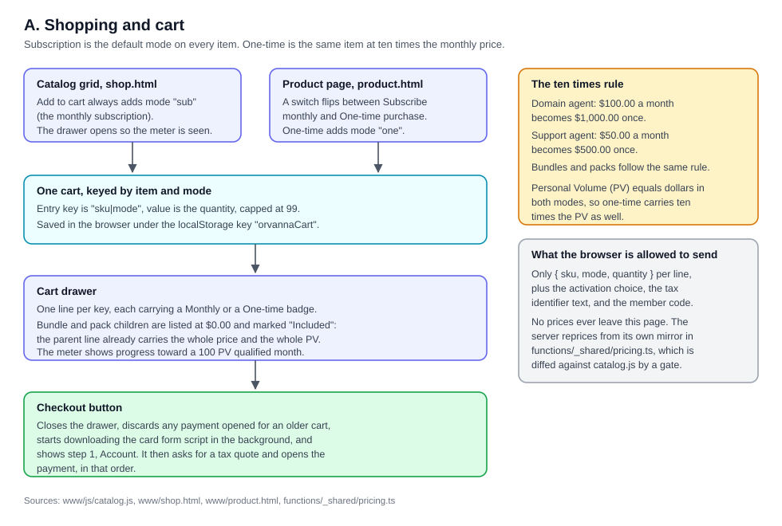
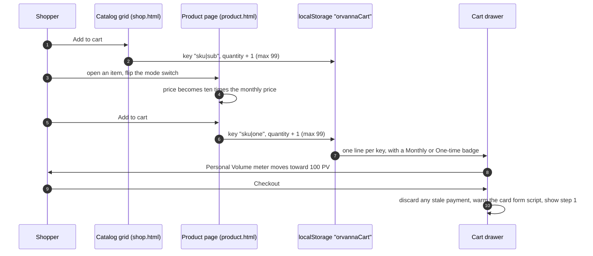
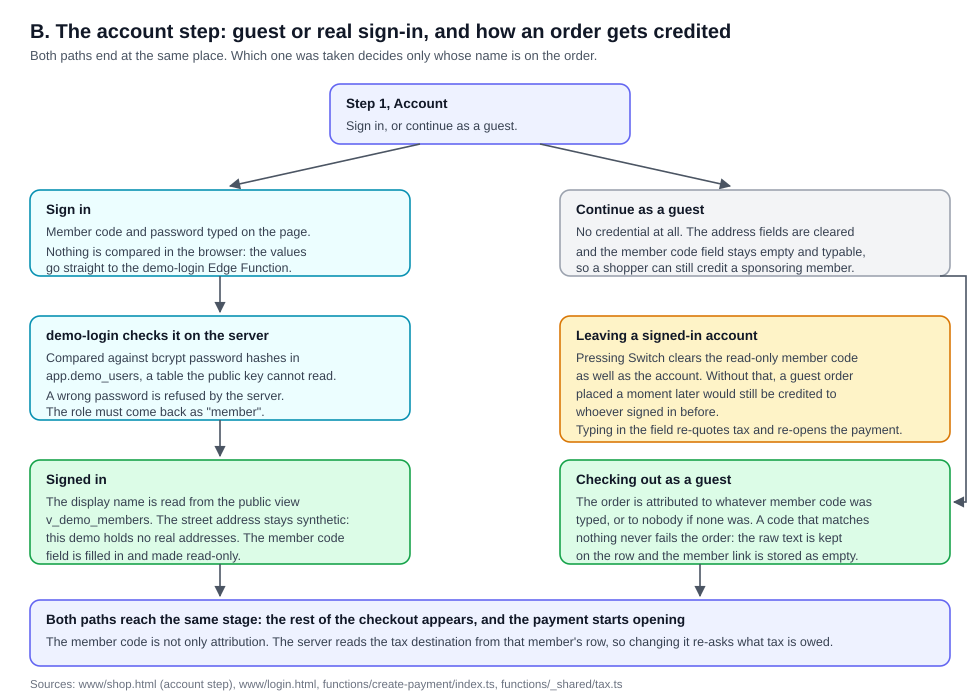
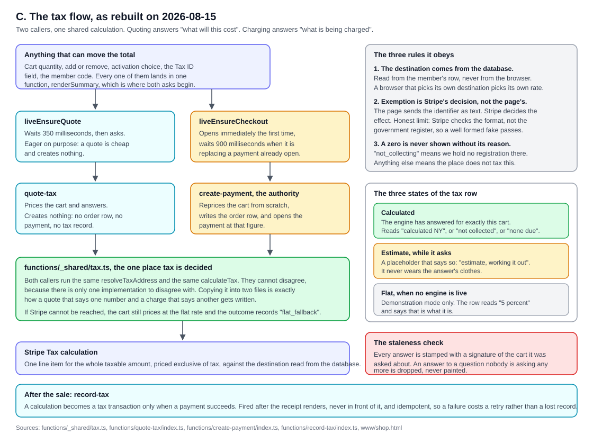
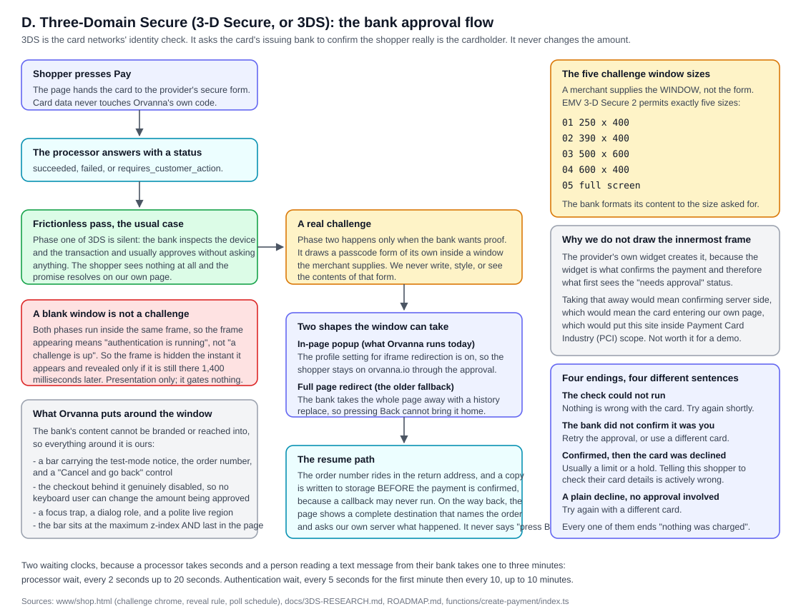
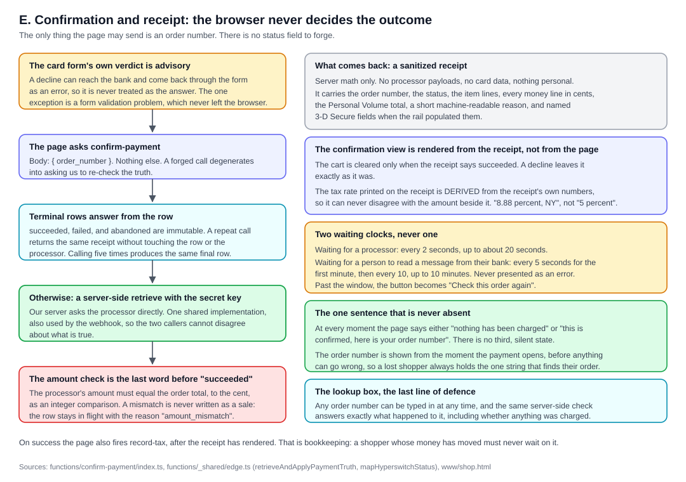
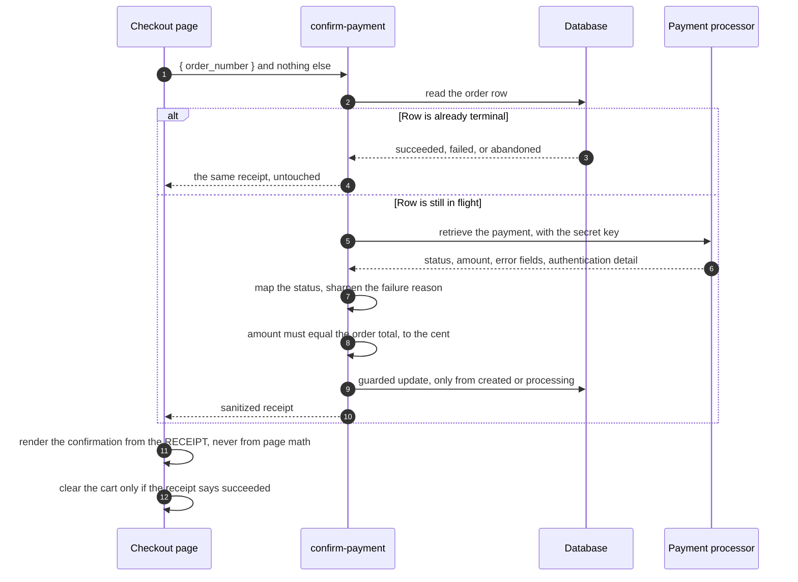
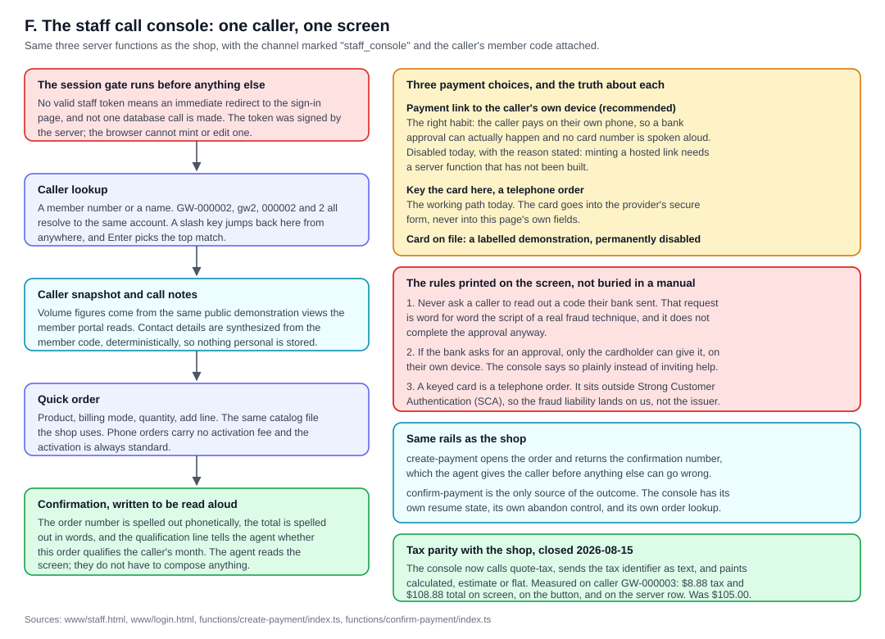

# 04. Checkout and the individual function flows

**Owner of this document:** the site builder (the front end and the pages).
**Written:** 2026-08-15.
**Plain path:** `C:\Users\howar\Desktop\Desktop\ORVANNA\DOCUMENTATION\04-CHECKOUT-AND-FLOWS.md`
**Diagrams folder:** `C:\Users\howar\Desktop\Desktop\ORVANNA\DOCUMENTATION\diagrams\`

Every claim in this document was read out of the actual files listed at the end of
each section. Where something is not built yet, or has drifted, it says so instead
of describing the intention.

---

## Acronym key

Spelled out here once, so the body reads cleanly.

| Short form | Full form | What it means in one line |
|---|---|---|
| 3DS | 3-D Secure (also written Three-Domain Secure) | The card networks' identity check: it asks the card's issuing bank to confirm the shopper really is the cardholder. |
| EMV 3DS | EMV 3-D Secure, versions 2.1, 2.2 and 2.3.1 | The modern version of 3DS, the one in use here. EMV is the standards body behind chip cards. |
| PV | Personal Volume | The points a purchase carries toward a member's qualified month. In this catalog, PV equals dollars. |
| SV | Sales Volume | The figure the qualified month is measured on in the staff console meter. |
| SCA | Strong Customer Authentication | The European rule that makes 3DS mandatory for most online card payments. |
| PCI | Payment Card Industry | The card-security standard. Handling raw card numbers on your own page puts you inside its scope. |
| MOTO | Mail Order / Telephone Order | A card payment keyed by a person over the phone. |
| ACS | Access Control Server | The issuing bank's server that draws the approval screen. |
| transStatus | Transaction Status | The single letter 3DS uses to report how the identity check went: Y authenticated, N not authenticated, A attempted, R rejected, U unavailable. |
| PAN | Primary Account Number | The long number on the front of a card. |
| CVV | Card Verification Value | The short code on the back of a card. |
| URL | Uniform Resource Locator | A web address. |
| SVG | Scalable Vector Graphics | The image format the diagrams in this document use. |

---

## The front-end approach, in one page

Before the flows, the shape of the thing they live in.

**Plain browser JavaScript. No framework, no build step for the pages
themselves.** Every page under `MLM-PILOT\www\` is a plain `.html` file with its
script inline and its styles in a shared stylesheet. There is no React, no Vue, no
bundler, no transpiler. `shop.html` is one file of about 2,900 lines that contains
its own markup, its own script, and nothing generated.

**Why that is a choice and not laziness.** The site has to deploy free on GitHub
Pages against a custom domain, it has to be readable a year from now by whoever
opens it, and it has to be auditable line by line by a verifier and a quality gate.
A build step would put a compiler between what is written and what is served,
which is the wrong trade for a demonstration whose whole value is that you can read
it.

**Self-contained pages, with three shared files.** The pages share
`www\js\catalog.js` (the single source of truth for every product, price, and PV
figure), `www\css\corporate.css`, and a per-area stylesheet such as
`www\css\shop.css`. Everything else lives in the page that uses it. The staff
console even duplicates its twenty-five line session gate rather than sharing it,
because the deploy script moves the two folders apart and a shared path would be
fragile. Twenty-five duplicated lines beat a broken path.

**Exactly two external scripts are sanctioned.** The payment provider's card form
loader, and the hosted support chat. Both are recorded in `ROADMAP.md`. The card
form loader is fetched only when live payments are on, and the fetch is started
early, the moment a shopper enters checkout, so its download overlaps the account
step instead of following it.

**Content-hash cache busting, done by `deploy\build_dist.py`.** This one deserves
the why, because it is the reason a correct fix can reach nobody.

The pages carry a version stamp on each stylesheet and script reference, for
example `shop.css?v=5.2`. A browser caches by that whole address. The stamp was
hand-maintained, and it sat at `5.2` while `shop.css` was rewritten three times on
2026-08-15. Because the address never changed, every browser that had visited
before kept serving itself the old stylesheet. One of those rewrites was the fix
that lifts the bank-approval bar above the payment window; with the stale sheet
that bar is painted behind the bank's frame and is invisible. So the fix could be
correct, deployed, and provably working for a brand new visitor while reaching
nobody who had been to the site before.

Hand-maintained version strings fail that way every time, because the person
changing the stylesheet is never the person remembering the stamp. So the build
now hashes the bytes of every stylesheet and script in the output, takes the first
twelve characters of that hash, and rewrites every `?v=` reference to it. The
stamp changes when, and only when, the content changes.

The same build also copies `www\` to the site root and `site\` to `/portal/`,
rewrites the handful of cross-folder links, writes the domain file, a page-not-found
page, and a repository readme, then refuses to finish if any relative link in the
output does not resolve to a real file.

**Sources:** `MLM-PILOT\www\shop.html`, `MLM-PILOT\www\staff.html`,
`MLM-PILOT\www\js\catalog.js`, `MLM-PILOT\deploy\build_dist.py`,
`MLM-PILOT\ROADMAP.md`.

---

## A. The shopping and cart flow



Plain path: `C:\Users\howar\Desktop\Desktop\ORVANNA\DOCUMENTATION\diagrams\flow-cart.svg`



### Two modes, one cart

Every item in the catalog exists in two billing modes.

- **Subscription** is the default. It is what the Add to cart button on the catalog
  grid always adds. The card shows a monthly price and a PV figure.
- **One-time** is offered on the product page, behind a switch. Buying outright
  means one payment and no renewal.

The cart does not hold products. It holds **item-and-mode pairs**. The storage key
is literally `sku|mode`, where mode is `sub` or `one`, and the value is the
quantity, capped at 99. That is why the same agent can sit in a cart twice, once
monthly and once outright, without the two lines fighting.

The cart lives in the browser under the `localStorage` key `orvannaCart`, so it
survives a closed tab, a crash, and, importantly for section D, a bank taking the
whole page away. Carts written by an earlier round of the site used a bare product
code as the key; those are migrated to `sku|sub` when the cart is loaded, so nobody
loses a cart to a format change.

### The ten times rule

The one-time price is exactly **ten times** the monthly price, and PV moves with
it, because in this catalog PV always equals dollars.

| Tier | Monthly | Monthly PV | One-time | One-time PV |
|---|---|---|---|---|
| Domain agent | $100.00 | 100 PV | $1,000.00 | 1,000 PV |
| Support agent | $50.00 | 50 PV | $500.00 | 500 PV |
| Manager Agent (bundle) | $200.00 | 200 PV | $2,000.00 | 2,000 PV |
| Ignition Pack | $200.00 | 200 PV | $2,000.00 | 2,000 PV |
| Momentum Pack | $400.00 | 400 PV | $4,000.00 | 4,000 PV |
| Constellation Pack | $800.00 | 800 PV | $8,000.00 | 8,000 PV |

**Why ten and not some other number.** The one-time price is not a discount and it
is not a penalty. It states what the product is worth without a subscription: ten
months of value, paid at once, owned outright. The product page says the same thing
in both directions, so a shopper on the monthly view is told the full value and a
shopper on the one-time view is told what subscribing would cost this month.

**The consequence worth naming.** Because PV equals dollars in both modes, a
one-time purchase carries ten times the PV as well. A single one-time domain agent
is 1,000 PV, which clears a 100 PV qualified month ten times over. That is a
deliberate property of the compensation model, not an accident of the pricing.

### Bundles and packs

A bundle or a pack is a **parent item with children**. The parent carries the whole
price and the whole PV. The children are shown, indented, at $0.00 and labelled
"Included". The Manager Agent is priced at $200.00 a month against three support
agents that would cost $150.00 separately, because the management layer itself is
the product.

### What leaves the browser

Nothing about price. When the cart is sent to a server function, each line is
reduced to `{ sku, mode, quantity }`. The server prices it from its own mirror in
`functions\_shared\pricing.ts`, and a gate mechanically compares every price and PV
figure in that mirror against `catalog.js`. Drift fails the gate.

**Sources:** `MLM-PILOT\www\js\catalog.js`, `MLM-PILOT\www\shop.html`,
`MLM-PILOT\www\product.html`, `MLM-PILOT\functions\_shared\pricing.ts`.

---

## B. The account step: guest, sign-in, and attribution



Plain path: `C:\Users\howar\Desktop\Desktop\ORVANNA\DOCUMENTATION\diagrams\flow-account.svg`

```mermaid
sequenceDiagram
    autonumber
    participant Shopper
    participant Page as Checkout step 1
    participant Login as demo-login (server function)
    participant DB as Database
    participant Create as create-payment

    alt Sign in
        Shopper->>Page: member code and password
        Page->>Login: both values, unexamined by the browser
        Login->>DB: compare against bcrypt hashes in app.demo_users
        DB-->>Login: match, and a role
        Login-->>Page: role must be "member"
        Page->>DB: read the display name from the public view
        Page->>Page: fill the member code field and lock it
    else Continue as guest
        Shopper->>Page: no credential at all
        Page->>Page: clear the address, leave the member code typable
    end
    Page->>Page: reveal the rest of the checkout, start opening the payment
    Shopper->>Create: place the order
    Create->>DB: resolve the member code against app.members
    DB-->>Create: a member row, or nothing
    Create->>DB: store the member link, or empty, and always the raw text
```

### The two doors

Step 1 offers exactly two ways forward: sign in, or continue as a guest. Neither is
a gate on the shop. Both reach the same next stage. **What the choice decides is
whose name is on the order, not what anyone is allowed to see.**

### The sign-in is real, and its limits are stated

The member code and the password are sent to a server function, which compares them
against bcrypt password hashes held in a database table the site's public key
cannot read. A wrong password is refused by the server. The browser never compares
anything and holds no rule about what a valid credential looks like, so the page
cannot leak whether a member code exists.

Three honest limits, all of them written into the page itself:

1. **The demonstration password is printed on the page on purpose.** A visitor to a
   demonstration has to be able to sign in. It guards nothing: the member roster it
   opens is already public.
2. **The account it opens cannot open anything else.** The role that comes back
   must be `member`. A staff or administrator credential is refused with a message
   telling the visitor to use a member code or continue as a guest. The real
   protection is the server-side role gate, not this courtesy check.
3. **The street address stays synthetic.** The demonstration holds no real
   addresses, so signing in fills in the member's own *name* and a made-up street.

### How a member code attributes an order

The member code field is the whole subject of this project in one input.

- Signing in **fills it in and makes it read-only**, so the order is credited to the
  account that actually signed in.
- Pressing Switch to leave a signed-in account **clears it as well as the account**.
  Without that, a guest order placed a moment later would still be credited to
  whoever signed in before.
- A guest may type any member code, which is how a shopper credits a sponsoring
  member.
- On the server, the code is resolved against the members table. **A miss never
  fails the order**: the member link is stored as empty and the raw text is kept on
  the row, so a mistyped code costs attribution rather than a sale.

### The field that also decides tax

The member code is not only attribution. The server reads the **tax destination**
from that member's row. A New York code and a Florida code owe different tax on the
same cart, so typing in this field re-asks what tax is owed as well as re-opening
the payment.

There is a fixed lesson recorded in the page here. When the payment only opened on
a button press, after the field was filled, nothing had to listen to this field.
The moment the payment started opening on arrival at the step, the code was created
empty, typing changed nothing, and the order was credited to nobody. A regression
that loses attribution quietly is the worst kind on a project about attribution, so
the field is now debounced through the same path as every other control that can
move the total.

**Sources:** `MLM-PILOT\www\shop.html` (account step),
`MLM-PILOT\www\login.html`, `MLM-PILOT\functions\create-payment\index.ts`,
`MLM-PILOT\functions\_shared\tax.ts`.

---

## C. The tax flow



Plain path: `C:\Users\howar\Desktop\Desktop\ORVANNA\DOCUMENTATION\diagrams\flow-tax.svg`

**This changed on 2026-08-15.** Howard put the problem plainly: *"you need to
calculate the tax before payment is sent ... no one wants to make a payment and
then find out 71 dollars was applied after submitting the card."*

```mermaid
sequenceDiagram
    autonumber
    participant Shopper
    participant Page as Checkout page
    participant Quote as quote-tax
    participant Create as create-payment
    participant Shared as _shared/tax.ts
    participant DB as Database
    participant Stripe as Stripe Tax

    Shopper->>Page: change anything that moves the total
    Page->>Page: renderSummary, tax row shows "estimate, working it out"
    par Ask what it will cost
        Page->>Quote: items, activation, tax identifier text, member code
        Quote->>Shared: price this cart
        Shared->>DB: read the destination from the member's row
        Shared->>Stripe: calculate
        Stripe-->>Shared: tax, a reason, a jurisdiction
        Shared-->>Quote: outcome
        Quote-->>Page: totals only. No order, no payment, no tax record.
        Page->>Page: tax row becomes "calculated NY"
    and Open what will be charged
        Page->>Create: the same cart
        Create->>Shared: price this cart again, from scratch
        Shared->>DB: the same destination
        Shared->>Stripe: calculate
        Stripe-->>Shared: tax, a reason, a jurisdiction
        Create->>DB: write the order row with the tax, its source and its reason
        Create-->>Page: order number, and the totals it actually opened at
        Page->>Page: repaint the row and the pay button from THESE figures
    end
```

### What was wrong before, and why each piece was wrong

Tax used to be calculated inside `create-payment`, as a side effect of opening a
payment. Three things followed, and all three are fixed:

1. **Nothing could be priced without being started.** Merely looking at a total
   wrote an order row and opened a payment at the processor. The abandoned-order
   sweep existed largely to clean up after curiosity.
2. **The interim was a guess wearing the answer's clothes.** For the seconds before
   the payment came back, the summary showed a flat five percent, in the same
   position and the same typeface as the real figure. Nobody could tell which one
   they were looking at. That, not the arithmetic, is the actual complaint.
3. **Changing the cart threw a payment away.** Adding an item discarded a perfectly
   good payment purely to re-ask what tax was owed on the new amount.

### Two callers, one calculation

- **`quote-tax` prices a cart and answers. It creates nothing.** No order row, no
  payment at the processor, no tax record. It exists to put a real figure on the
  screen early. Its calculation identifier is deliberately not returned or stored,
  because a quote nobody buys should leave nothing behind.
- **`create-payment` reprices the same cart and is the authority for what is
  charged.** It ignores anything the page was quoted, because a quote is a display
  and a charge is a fact.

**They share one implementation, `functions\_shared\tax.ts`, precisely so they
cannot disagree.** A quote that says one number and a charge that says another is
the single worst bug this checkout could ship, and copying the logic into two files
is exactly how that bug gets written. One function, two callers, no second opinion.

The two calls also run on different clocks, on purpose. The quote waits 350
milliseconds after the last change, because it is cheap and creates nothing and can
afford to be eager. The payment opens immediately the first time, but waits 900
milliseconds when it is replacing a payment that is already open, because a tax
identifier is typed one character at a time and the demonstration allows only five
payment creations a minute per visitor. Quoting has its own, looser rate limit
bucket, so a shopper who fiddles with their cart can still pay at the end of it.

### The three rules the shared calculation obeys

**1. The destination comes from the database, never from the browser.**
It is read from the signed-in member's row. A browser that can choose its own
destination can choose its own tax rate, which is the same mistake as letting it
choose its own price. A guest, and a member code that matches nobody, fall back to a
fixed house address so a calculation always has somewhere to land rather than
silently returning zero for want of an address.

**2. Exemption is decided by Stripe, not by the page.**
The page sends the tax identifier as **text**. The shared code decides whether it
even looks like one, and Stripe decides what it means. The older design accepted a
`tax_exempt` boolean from the browser, which let any caller zero their own tax; that
was the one hole in an otherwise server-authoritative money path, and it is now
ignored on the server.

The limit is stated on the page as well as here: **Stripe checks the format of an
identifier, not the government register behind it, so a well-formed fake passes.**
The mechanism is real; the verification is not, and we say so rather than implying a
check we do not perform.

**3. A zero is never shown without its reason.**
Stripe returns zero in two completely different situations, and only the reason
separates them:

| Reason | What it means | Whose problem it is |
|---|---|---|
| `not_collecting` | We hold no tax registration in that jurisdiction | Ours to fix, a configuration gap |
| anything else | That jurisdiction simply does not tax this product | Nobody's. It is the correct answer. |

So the reason is carried back, stored on the order row, and turned into words on
screen: **"not collected"** for the first, **"none due"** for the second.

### The three states of the tax row

This is the part a shopper actually sees, and the row now says which state it is in.

| State | What the row shows | When |
|---|---|---|
| **Calculated** | `Tax  calculated NY` with the amount | The engine has answered for exactly this cart. Where the jurisdiction is known, it is named. |
| **Estimate** | `Tax  estimate, working it out` with a placeholder amount | While the question is being asked. It admits what it is. |
| **Flat** | `Tax  5 percent` | Demonstration mode only, when no tax engine is live at all. It says that is what it is. |

Two more honest variants inside the calculated state: **`not collected`** and
**`none due`** for the two kinds of zero above, and **`estimated`** when Stripe
could not be reached and the flat fallback was used. The fallback is never silent:
the order row records the source as `flat_fallback`.

### The staleness check

Every answer is stamped with a signature of the cart it was asked about: the item
lines, the activation choice, the tax identifier text, and the member code. Between
asking and answering, the shopper may have changed the cart. An answer to a question
nobody is asking any more is **dropped, not shown**, because a wrong figure that
looks calculated is worse than an estimate that admits it.

The same signature guards the money. If the payment on hand was opened against a
different signature than the screen currently shows, the pay button refuses to pay,
discards the stale payment, and opens a fresh one at the amount the shopper can
actually see. The server reprices independently in any case, so this protects the
shopper from a confusing charge rather than protecting the total, which was never
the browser's to decide.

### Two receipts of this work, both recorded in the code

- The pay button used to read the page's own arithmetic. That was true only while
  both sides applied a flat five percent. With a real engine, a New York cart showed
  $326.63 in the summary while the button offered to charge $315.00. The charge
  would have been the correct $326.63, so **the button was the liar**. It now quotes
  the server's figure and nothing else.
- The receipt used to print "5 percent" no matter what. A New York order charged
  $8.88 on $100.00 still called it five percent, which is a receipt stating a figure
  nobody was charged. The rate is now **derived from the receipt's own numbers**, to
  two decimal places, so it cannot disagree with the amount printed beside it, and
  the jurisdiction is named where it is known.

### After the sale

A calculation is a quote. A **transaction** is the record that a sale happened, and
it is what tax reports are built from. Liability is assumed when the sale completes,
so a separate function, `record-tax`, turns calculations into transactions for
orders that actually paid. It is fired after the receipt has rendered, never in
front of it: a shopper whose money has already moved must not wait on bookkeeping.
It is idempotent three ways over, so a failure costs a retry rather than a lost
record.

**Sources:** `MLM-PILOT\functions\_shared\tax.ts`,
`MLM-PILOT\functions\quote-tax\index.ts`,
`MLM-PILOT\functions\create-payment\index.ts`,
`MLM-PILOT\functions\record-tax\index.ts`, `MLM-PILOT\www\shop.html`.

---

## D. The 3-D Secure (3DS) flow



Plain path: `C:\Users\howar\Desktop\Desktop\ORVANNA\DOCUMENTATION\diagrams\flow-3ds.svg`

### What 3DS is, in plain terms

When you pay by card online, the shop knows the card number is valid. It does not
know **you** are the person entitled to use it. 3-D Secure is the card networks'
answer to that: before the money moves, the card's issuing bank is asked to confirm
the shopper really is the cardholder.

The name comes from the three domains the check spans: the shop's side, the card
issuer's side, and the network in the middle that routes between them.

Two things are worth fixing in your head early:

- **3DS authenticates a person. It never changes an amount.** That is why the
  amount check in section E is untouched by any of this and remains the last word.
- **Most of the time it asks the shopper nothing at all.** That is by design, and
  it is the single most misunderstood part of the flow.

### Frictionless versus a real challenge

EMV 3DS has two phases and, on this rail, both run inside the same window.

**Phase one is silent.** The bank inspects the device, the transaction, and its own
risk view, and usually approves without asking anything. This is called a
**frictionless** pass. The shopper sees nothing, types nothing, and the payment
simply resolves.

**Phase two happens only when the bank wants proof.** It draws a passcode form of
its own, on its own server, and the shopper completes it. This is the **challenge**.

Confusing the two produced a real, reported defect on 2026-08-15. Because the frame
appears for phase one as well as phase two, showing it immediately gave a shopper a
**blank white window for about two seconds**, waiting for a challenge that was never
going to come, with the site's own bar announcing an approval the bank had not asked
for.

The fix: **the frame is made invisible the instant it appears, and revealed only if
it is still there 1,400 milliseconds later.** A frictionless authentication finishes
inside that beat and the shopper sees nothing at all, which is the entire point of
frictionless. The delay is presentation only. It never gates the payment, and the
outcome still comes from the server either way.

### The challenge window, and what a merchant actually supplies

The one-time passcode form is served by the cardholder's own bank, from its Access
Control Server (ACS). **A merchant never writes it, styles it, or sees its code.**

What a merchant supplies is the **window**: a frame sized to one of the five sizes
the EMV 3-D Secure 2 standard permits. The bank formats its content to whichever
size was requested.

| Code | Size |
|---|---|
| 01 | 250 by 400 |
| 02 | 390 by 400 |
| 03 | 500 by 600 |
| 04 | 600 by 400 |
| 05 | Full screen |

**Why Orvanna does not draw even that innermost frame.** The payment provider's own
widget creates it, because the widget is what confirms the payment and therefore
what first sees the "needs approval" status. Taking that away would mean confirming
server side, which would mean the card entering our own page, which would put this
site inside Payment Card Industry (PCI) scope. Not worth it for a demonstration, and
not better practice for a real one.

### In-page popup versus a full redirect

The provider can deliver the challenge in more than one shape, and which one fires
decides whether the shopper stays on the site.

| Shape | What happens | Is the shopper still on orvanna.io? |
|---|---|---|
| In-page popup | The provider injects a full-screen frame on our own page and runs the approval inside it | Yes |
| External authentication overlay | The same idea, driven by an external authentication provider | Yes |
| Full page redirect | The whole page is navigated away to the bank, using a history-replacing navigation | No |

**Orvanna runs the in-page flow today.** The profile setting for iframe redirection
was switched on, so the provider returns the in-page popup shape rather than the
redirect. This is the native browser flow for 3DS 2; the full page redirect is the
older fallback. It was set on the profile, so no server function had to be
redeployed.

Two cautions that survive the switch, both recorded in the research file:

- The authorization step **after** authentication can still return a redirect if
  the connector wants its own step. So the return path has to exist regardless.
- The redirect is a *replace*, which destroys the history entry. **After a redirect,
  pressing Back does not return the shopper to the checkout.** Any wording that says
  "just go back" is wrong, which is why no message on this site says it.

### What the site puts around the bank's window

The bank's content cannot be branded or reached into, so everything around it is
ours:

- A slim bar above the window carrying the three things a shopper needs in the same
  screenshot: **that this is test mode, the order number, and a way out**
  ("Cancel and go back").
- The checkout behind it goes **genuinely disabled**, not merely dimmed, so a
  keyboard user cannot tab into it and change the amount currently being approved.
- A focus trap, a dialog role with an accessible name, and a polite live region, so
  a shopper using a screen reader is told a challenge appeared.
- The order number is on screen and in storage **before** the card is ever handed
  over, so if everything after that goes wrong, the shopper holds the one string
  that finds their order.

There is a defect worth recording here because it would have hidden all of the
above. The provider paints its bank frame with an inline stacking order of
422222133323. Browsers clamp that value to a signed 32-bit integer, so it resolves
to 2147483647, the maximum. The site's bar asked for 2147483000 and therefore
rendered **behind** the bank frame: order number, test-mode notice, and cancel
button all invisible at the exact moment they matter. The fix needed both halves:
match the maximum, and move the bar to the end of the page when it opens so that at
equal stacking order the later element wins.

### The resume path, if the bank takes the whole page away

This is the path that exists because the redirect shape can happen at all.

- The order number rides in the **return address**, so it survives even a return
  into a brand new tab. The address is built by the server from its own allowed
  origin plus a page name from a two-item list, never from anything the browser
  sends, so nothing can turn it into an open redirect.
- A copy of the state is written **before** the payment is confirmed, never in a
  callback, because the provider can navigate the page away before any callback of
  ours runs. There are two copies: one scoped to the tab, which carries the payment's
  bearer token, and one that carries no secret and expires after thirty minutes, for
  a bank application that bounces the shopper back into a new tab with empty tab
  storage.
- On the way back, the page shows a **complete destination in its own right**: it
  names the order, asks our own server what actually happened, and says plainly
  whether anything was charged. It never tells anyone to press Back.
- If the order cannot be identified at all, the page says so, states that the cart
  is untouched and nothing was charged twice, notes that a pending hold drops off on
  its own, and offers a lookup box.

### Test cards

The table below is reproduced from `MLM-PILOT\docs\TEST-CARDS.html`, which is the
project's card reference. **Read the note after it before using any of them.**

**Expiry and security code for every card below:** any future expiry date and any
three digit code, four for American Express. The cardholder name can be anything.

**Primary matrix: 3DSecure.io sandbox card numbers.** This provider does not
publish a flat list; it publishes an encoding scheme where the **last four digits**
choose the outcome and the leading digits are free.

| What you want to see | Last four | Example number |
|---|---|---|
| Approval screen, then it passes | xx70 | 7000 1009 1111 2070 |
| Approval screen, then it fails | xx71 | 3000 1010 1111 1071 |
| Approval screen the tester decides by hand | xx72 | 3000 1008 1111 1072 |
| Frictionless, no screen at all, authenticated | xx03 | 4000 1005 1111 2003 |
| 3DS unavailable (transStatus U) | xx53 | any leading digits |
| Rejected by the issuer (transStatus R) | xx33 | any leading digits |
| Directory server timeout | xx63 | any leading digits |
| Card not enrolled in 3DS at all | not applicable | 9000 1001 1111 1111 |

**Alternative path: Stripe test cards**, for when the processor's own 3DS does the
authentication. These produce a hosted approval screen with explicit "Complete
authentication" and "Fail authentication" buttons.

| Card number | What it does | End state |
|---|---|---|
| 4000 0000 0000 3220 | Approval required, issued in Ireland | Screen, then success |
| 4000 0084 0000 0027 | Approval required, issued in the United States | Screen, then success |
| 4000 0027 6000 3184 | Always authenticates, every transaction | Screen, then success. Deterministic. |
| 4000 0038 0000 0446 | Set up for off-session use, still asks on one-time payments | Screen, then success |
| 4000 0000 3220 0000 | 3DS required on every transaction but resolves frictionless | No screen, success |
| 4000 0084 0000 1629 | Approval passes, then the bank declines the money | Screen, then payment fails |
| 4000 0082 6000 3178 | Approval passes, then declined for insufficient funds | Screen, then payment fails |
| 4000 0084 0000 1280 | The 3DS lookup itself errors, payment declined | 3DS error, payment fails |
| 4000 0000 0000 3097 | 3DS may be attempted, any attempt errors | 3DS error |
| 4000 0000 0000 3055 | 3DS supported but not required | Usually no screen, success |
| 4000 0025 0000 3155 | Requires authentication for off-session payments | Screen on first use |

**Cards that succeed with no approval screen**

| Card number | Brand |
|---|---|
| 4242 4242 4242 4242 | Visa, the everyday workhorse |
| 4111 1111 1111 1111 | Visa |
| 5555 5555 5555 4444 | Mastercard |
| 3782 8224 6310 005 | American Express, four digit code |
| 6011 1111 1111 1117 | Discover |
| 3800 0000 0000 06 | Diners Club |

**Cards that decline, for the sad path**

| Card number | What the processor answers |
|---|---|
| 4000 0000 0000 0002 | Card declined, generic, Visa |
| 5105 1051 0510 5100 | Card declined, generic, Mastercard |
| 4000 0000 0000 9995 | Insufficient funds |
| 4000 0000 0000 9987 | Lost card |
| 4000 0000 0000 9979 | Stolen card |

**Three warnings carried over from the source file:**

1. **4242 4242 4242 4242 can never show an approval screen.** It is documented as a
   card that supports 3DS but is not enrolled in it. If you test "is 3DS working?"
   with this card, the answer will always look like no, and it will be wrong. This
   exact confusion cost the project a long detour once already.
2. **4000 0084 0000 1629 is the case that must never read like a plain decline.**
   The shopper does everything right and still gets a no: the bank confirms who they
   are, then refuses the money. Telling that shopper to check their card details is
   actively wrong.
3. The 3DSecure.io numbers exercise the **authentication** leg. The authorization
   leg can still fail afterwards because the processor's test mode does not
   recognize the card. That is not a broken flow; the test proved authentication
   only.

**A discrepancy you must know about before testing.** The live checkout page's own
in-form hint currently recommends a **different set of numbers** from the table
above, because the processor changed on 2026-08-15 and each processor publishes its
own test numbers. The hint printed under the card form reads, with expiry 01/29 and
any three digit code:

| Card number | What the page says it does |
|---|---|
| 4000 0000 0000 2503 | Asks for the passcode 1234, then approves |
| 4000 0000 0000 2370 | Asks, and the approval fails |
| 4000 0000 0000 2701 | Approves with no passcode at all |
| 4000 1111 1111 1115 | Raises the approval screen, then the card declines |

**`TEST-CARDS.html` has not been updated with these.** Until it is, the page hint is
the current truth for the live rail and the reference file is the current truth for
the two older paths. That gap is stated here rather than papered over.

### The four endings, and why each gets its own sentence

A decline is not one event. The site tells four apart, and every failing message,
without exception, ends by saying nothing was charged.

| Ending | What the shopper is told | What they should do |
|---|---|---|
| The security check could not run | Nothing was charged, and nothing about your card is wrong | Try again in a minute |
| The bank did not confirm it was you | The payment stopped there, your cart is unchanged | Retry the approval, or use a different card |
| Confirmed, then the card itself declined | Your bank confirmed it was you, then declined the payment | Usually a limit or a hold; a different card often works |
| A plain decline, no approval involved | Declined, your cart is unchanged | Try again with a different card |

There is a fifth branch that exists for an honest reason. The four above depend on
the named authentication fields, and the processor's own 3DS, which is what this
rail uses today, does not populate them. So a shopper who typed a correct passcode
and was then declined used to land on a bare "Declined.", which reads as though the
approval step did nothing. What the page knows first-hand is whether the approval
window **opened**, because it watched it open. That fact alone does not say whether
the approval succeeded, so the wording is decided by what the processor actually
said, and it stops short of claiming the bank confirmed the shopper's identity,
because on this rail we genuinely cannot see that.

**Sources:** `MLM-PILOT\www\shop.html`, `MLM-PILOT\docs\3DS-RESEARCH.md`,
`MLM-PILOT\docs\TEST-CARDS.html`, `MLM-PILOT\ROADMAP.md`,
`MLM-PILOT\functions\create-payment\index.ts`, `MLM-PILOT\www\css\shop.css`.

---

## E. Confirmation and the receipt



Plain path: `C:\Users\howar\Desktop\Desktop\ORVANNA\DOCUMENTATION\diagrams\flow-confirmation.svg`



### The outcome is decided by a server-side retrieve, never by the browser

The browser can only send an **order number**. There is no status field to forge, so
a forged call degenerates into asking us to re-check the truth. The only source of
truth is our own server-side retrieve of the payment from the processor, using the
secret key that never leaves the server.

The card form's own verdict is treated as **advisory**. A decline can reach the bank
and come back through the form as an error, so the server is always asked afterwards.
The single exception is a pure form validation problem, incomplete or invalid fields,
which never left the browser at all: in that case the form stays up for editing and
says so.

### The retrieve, the amount check, and the guarded update

These three live in one shared implementation, used by both the confirm function and
the webhook, so the two callers cannot drift apart about what is true.

1. **Retrieve.** Ask the processor directly for the payment.
2. **Map the status.** The processor's full status list is mapped to three states of
   ours plus a reason. Anything unrecognized is treated as still in flight and
   reported as an unknown status, which is the safe direction: an unknown status can
   never be mistaken for success. A failure is then sharpened using the
   authentication detail, so "we could not confirm it was you" and "we confirmed it
   was you and the bank still said no" become different reasons.
3. **The amount check, which is the last word before any success is written.** The
   processor's amount must equal the order total, to the cent, as an integer
   comparison in minor units. A mismatch is never written as a sale: the row stays in
   flight with the reason `amount_mismatch`. 3DS authenticates a cardholder, it never
   changes an amount, so this check was untouched by all of the 3DS work.
4. **A guarded update.** The row moves only from `created` or `processing`. Terminal
   rows are immutable, so calling the confirm function five times produces the same
   final row.

### The receipt

What comes back is deliberately small: server math only, no processor payloads, no
card data, nothing personal. It carries the order number, the status, the item
lines, every money line in cents, the Personal Volume total, a short
machine-readable reason, and named 3DS fields when the rail populated them.

The confirmation view is rendered **from that receipt**, not from the page's own
arithmetic. The cart is cleared only when the receipt says succeeded; a decline
leaves it exactly as it was.

### Two waiting clocks

Waiting for a processor takes seconds. Waiting for a person to read a text message
from their bank takes one to three minutes. One schedule cannot serve both, and the
old single schedule timed out in the middle of every real approval.

| Situation | Poll every | Give up after |
|---|---|---|
| Waiting on the processor | 2 seconds | about 20 seconds |
| Waiting on a bank approval | 5 seconds for the first minute, then 10 seconds | about 10 minutes |

Neither is ever presented as an error. Past the window, the page stops guessing,
tells the shopper it still does not have an answer, repeats that nothing has been
charged, shows the order number, and turns the button into "Check this order again".

### The finishing state

Between the bank's window closing and the server answering, there are a few seconds
of quiet. The provider's card form is still mounted underneath, so without care the
shopper watches the page snap back to an empty card form and then jump to the
receipt, which reads as though the payment failed and then changed its mind. Howard
described it exactly: *"it stops for a second back at the card entry and then
finishes at the complete page."*

So while finishing, the card form and the button are hidden and only the status line
remains, and that line deliberately says nothing about the outcome, because at that
instant nobody knows it.

### The rule that has no exceptions

At every single moment of this flow, the page says either **"nothing has been
charged"** or **"this is confirmed, here is your order number"**. There is no third
state that is allowed to be silent. The order number is on screen from the moment
the payment opens, and any order number can be typed into the lookup box at any
time to get the same server-side answer, including whether anything was charged.

**Sources:** `MLM-PILOT\functions\confirm-payment\index.ts`,
`MLM-PILOT\functions\_shared\edge.ts`, `MLM-PILOT\www\shop.html`.

---

## F. The staff call console



Plain path: `C:\Users\howar\Desktop\Desktop\ORVANNA\DOCUMENTATION\diagrams\flow-staff.svg`

```mermaid
sequenceDiagram
    autonumber
    participant Agent
    participant Console as staff.html
    participant Login as login.html + demo-login
    participant Views as Public demonstration views
    participant Create as create-payment
    participant Confirm as confirm-payment

    Console->>Console: session gate, before any other code runs
    alt No valid staff token
        Console->>Login: redirect, and make no database call at all
        Login->>Login: role travels with the request, staff only
    end
    Agent->>Console: look up the caller by number or name
    Console->>Views: read the caller's volume figures
    Agent->>Console: add order lines, choose how to take payment
    Agent->>Create: items, activation standard, member code, channel staff_console
    Create-->>Console: order number, given to the caller immediately
    Agent->>Console: key the card into the provider's secure form
    Console->>Confirm: ask the server what happened
    Confirm-->>Console: receipt
    Console->>Agent: a confirmation panel written to be read aloud
```

### The gate runs first

The session check is the very first thing on the page. A visitor without a valid
staff token is redirected to the sign-in page and **not one database call is made**.
The token was signed by the server; the browser cannot mint or edit one. The sign-in
page carries the role in the request, so a staff credential cannot open the member
portal and a member credential cannot open this console, and the destination is
restricted to two known addresses so the address bar cannot turn the sign-in page
into a redirector.

### One caller, one screen

Left column: **caller lookup** (a member number or a name, with GW-000002, gw2,
000002 and 2 all resolving to the same account), the **caller snapshot** built from
the same public demonstration views the member portal reads, and **call notes**.
Contact details are synthesized deterministically from the member code, so nothing
personal is stored anywhere.

Right column: the **quick order**, built from the same catalog file the shop uses,
and a **confirmation panel written to be read aloud**. That panel spells the order
number out phonetically, spells the total out in words, and tells the agent whether
this order qualifies the caller's month, so the agent reads the screen rather than
composing anything.

### Payment by phone, and the honesty that shapes it

A card keyed by an agent while the cardholder is on the phone is a Mail Order /
Telephone Order (MOTO) transaction. Two facts follow, both stated on the console
itself:

- MOTO sits **outside** Strong Customer Authentication (SCA), so the regulation does
  not require a bank approval on a phone order in the first place.
- 3DS is largely **not usable** on a phone order anyway, because the protocol needs
  the cardholder's own browser to render the approval and return the result. The
  agent's browser belongs to the agent.

The catch is that skipping authentication also skips the liability shift: a fraud
chargeback lands on the merchant rather than the issuer. That is a business trade,
not a bug.

So the console offers three choices, and tells the truth about each:

| Choice | Status today | Why |
|---|---|---|
| Payment link to the caller's own device | **Presented first as the recommended path, but disabled** | It is the right habit: the caller pays on their own device, an approval can happen properly, and no card number is spoken aloud. Minting a hosted link needs a server function that has not been built, and the button says exactly that instead of pretending. |
| Key the card here, a telephone order | The working path today | The card goes into the provider's secure form, never into this page's own fields. |
| Card on file | A labelled demonstration, permanently disabled in live mode | There is no real stored card. |

### The rules printed on the screen

These are on the console itself, not buried in a manual, because an omission is not
a rule:

1. **Never ask a caller to read out a code their bank sent.** Not the six digits in a
   text message, not a code from a banking application, not ever. That request is
   word for word the script of a real fraud technique, issuers warn cardholders
   against it, and it does not complete the approval anyway.
2. If the bank asks for an approval, **only the cardholder can give it**, on their
   own device. If a challenge does fire on this rail, the console says so plainly
   rather than inviting the agent to help, and shows a waiting panel with the order
   number and an elapsed timer.
3. A keyed card is a telephone order, with the liability trade above.

### Same rails, plus its own recovery

The console calls the same three server functions as the shop, with the channel
marked `staff_console` and the caller's member code attached. It carries its own
resume state, its own "Abandon this attempt" control that still asks the server what
really happened before giving up, and its own order lookup for the call that comes in
asking "was I charged?".

### The drift that was found here, and closed the same evening

Reading the files for this document turned up two real differences between the
console and the shop. Both were fixed on 2026-08-15, after this section was first
written, and the observed figures are recorded because the fix is only worth
anything if it is measured.

1. **The console used to show a flat 5 percent tax.** Its totals box computed tax in
   the browser and never called `quote-tax`, and it never repainted itself from the
   totals `create-payment` returns. On a New York caller, a $100.00 order therefore
   read **$5.00 tax, $105.00 total** on screen, and the button offered to take
   $105.00, while the server priced and charged **$8.88 tax, $108.88 total**. On a
   phone call that is the worst version of the fault, because the agent has already
   said the wrong number out loud.
2. **The console used to send the old `tax_exempt` boolean, which the server
   ignores.** So the Tax ID field zeroed the row on screen and exempted nothing at
   all on the server.

Neither was a security problem: the server remained the only authority for what is
charged, which is the point of the design. Both were display honesty problems, of
exactly the kind section C exists to remove on the shop side.

**What the console does now.** It calls `quote-tax` on the same 350 millisecond
debounce as the shop, stamps every server answer with a signature of the order it
was asked about, drops answers that arrive for an order nobody is placing any more,
and paints the same three honest states: **calculated** with the jurisdiction named,
**estimate** while it asks, **flat** when no engine is live. It sends the tax
identifier as text. The pay button and the read-aloud confirmation both quote the
server rather than the page.

Measured on a live sandbox run against caller GW-000003:

| Moment | Tax row | Order total | Pay button |
|---|---|---|---|
| Line added, before the quote returns | `estimate, working it out`, $5.00 | $105.00 | not yet open |
| Quote returned | `calculated NY, US`, $8.88 | $108.88 | not yet open |
| Payment opened (order ORV-2026-08-1M050O) | `calculated NY, US`, $8.88 | $108.88 | `Take $108.88 now, test mode` |
| The server's own row for that order | `tax_cents` 888 | `total_cents` 10888 | matches |

A tax identifier typed into the field moved the row to `none due NY, US` at $0.00,
confirmed by the server rather than assumed by the page.

**One caution for anyone testing this.** The caller snapshot displays a synthesized
city, and it is decoration, not the tax destination. GW-000003 shows "Boise, Idaho"
on screen and is taxed at New York's 8.875 percent, because the destination is read
server side from the member's own row and never from anything on the page. That is
rule one of section C doing its job, but it looks like a contradiction until you
know why.

### The amount signature, added at the same time

The console had the gap the shop had closed earlier: a payment fixes its amount when
it is created, the card form mounts as soon as it opens, and nothing stopped an agent
adding a line afterwards. The console would then take the payment at the old amount
while the screen showed the new one.

It now records the signature the payment was opened against. If the order moves, a
status line warns the agent immediately, and the pay button refuses to send the card,
discarding the stale payment and keeping the order lines so the next press reopens at
the amount now on screen. Observed: with a payment open at $108.88, adding a $50.00
line moved the screen to $163.31 and produced the warning; pressing the button
discarded the payment rather than confirming it, and the next press opened a fresh
order, ORV-2026-08-1M229J, whose server row reads `tax_cents` 1331 and `total_cents`
16331.

### The duplication this created, deliberately

The quote machinery now exists twice, once in `shop.html` and once in `staff.html`.
That is a knowing duplicate, marked as such in a comment at the top of the block. The
right fix is to lift it into a shared `www\js\payments.js` that both pages load, and
every audit says so; it is a large refactor and was deliberately not attempted beside
a live payment rail late in the day. **Until it happens, the two copies must be
changed together.**

**Sources:** `MLM-PILOT\www\staff.html`, `MLM-PILOT\www\login.html`,
`MLM-PILOT\functions\create-payment\index.ts`,
`MLM-PILOT\functions\confirm-payment\index.ts`, `MLM-PILOT\docs\3DS-RESEARCH.md`.

---

## Open items this document records

1. `MLM-PILOT\docs\TEST-CARDS.html` does not carry the current processor's test
   numbers. The live page hint does. They should be reconciled.
2. The quote machinery is now duplicated between `shop.html` and `staff.html`. The
   shared `www\js\payments.js` extraction is the right fix and is still owed. Until
   it lands, the two copies must be edited together.
3. The payment link path on the staff console needs a server function to mint a
   hosted link. Until then the button is honestly disabled.
4. Nobody has completed a bank approval end to end in a browser by automation: the
   card fields live in a cross-origin frame that automation may not type into, so
   the final click-through is a human check. The same limit means the console's
   read-aloud confirmation panel, which now reads its figures from the server
   receipt, has been syntax checked and its receipt fields verified against the
   server, but the render itself has not been driven end to end.
5. `newCall` on the staff console leaves the previous caller's figures in the totals
   box until the next caller is selected. They are hidden behind the order gate the
   whole time, and selecting a caller repaints correctly (observed: $0.00 and
   `estimate`, with no leakage of the previous caller's New York figures), so this is
   cosmetic rather than wrong. Not fixed.
