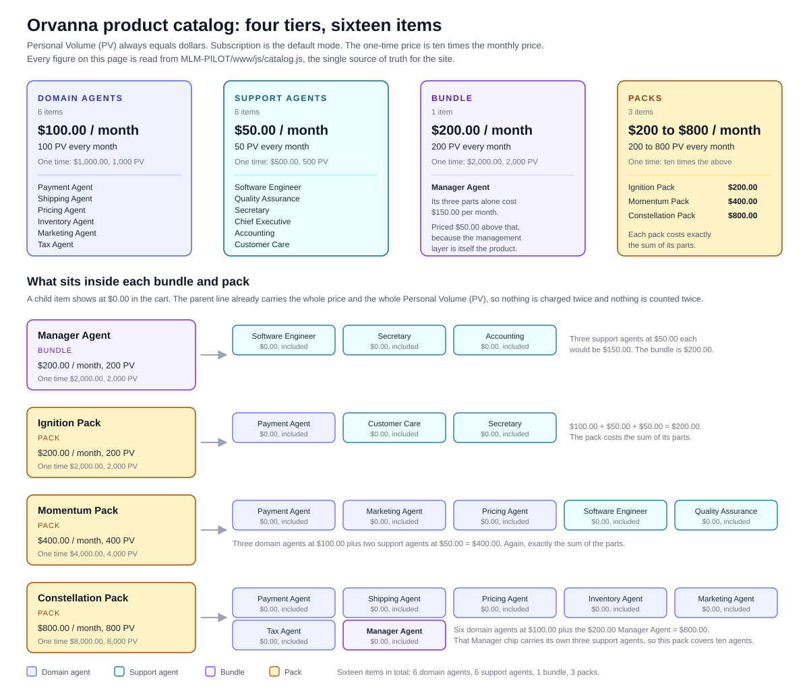

# 05. Product catalog

> Owner: orvanna-writer (content). Written 2026-08-15.
> Source of truth for every number on this page: `MLM-PILOT\www\js\catalog.js`.
> Plain path: `C:\Users\howar\Desktop\Desktop\ORVANNA\MLM-PILOT\www\js\catalog.js`
> Nothing here was written from memory. Prices, Personal Volume figures, tiers, and the
> contents of every bundle and pack were read out of the file and machine checked against
> the server mirror before this document was saved. The result of that check is section 8.

**Acronym key**

| Short form | Written out |
|---|---|
| PV | Personal Volume, the point value a purchase carries in the compensation plan |
| SV | Sales Volume, the sum of PV booked to one account in one month |
| SKU | Stock Keeping Unit, the stable identifier for a sellable item |
| MLM | Multi-Level Marketing, the direct-selling structure the pilot models |
| AI | Artificial Intelligence |

---

## The picture first



Plain path to the diagram:
`C:\Users\howar\Desktop\Desktop\ORVANNA\DOCUMENTATION\diagrams\product-tiers.svg`

---

## 1. The product line in one paragraph

Orvanna sells artificial intelligence (AI) agents as a direct-selling product line. There
is no physical product, no warehouse, and no shipping: every item in the catalog is a
piece of software that does one job for a small business, billed monthly like any other
subscription. Twelve of the sixteen items are single agents, split into six domain agents
that run a whole business function end to end (payments, shipping, pricing, inventory,
marketing, tax preparation) and six support agents that fill a staff role beside them
(software engineering, quality assurance, secretarial work, executive review, accounting,
customer care). The remaining four items are pre-assembled teams: one bundle, which is a
managed trio, and three packs, which are curated formations sized to a stage of business.
Because Orvanna is also a direct-selling company, every item carries a Personal Volume
(PV) figure alongside its price, and that figure is what connects a shopper's cart to the
compensation plan.

---

## 2. The complete catalog, all sixteen items

Read straight out of the `PRODUCTS` array in `catalog.js`. Subscription is the default
mode; one time is the alternative mode on the same item.

| SKU | Display name | Tier | Subscription price / month | Subscription PV / month | One-time price | One-time PV | What the agent does for a customer |
|---|---|---|---|---|---|---|---|
| `payment` | Payment Agent | domain | $100.00 | 100 | $1,000.00 | 1,000 | Watches every transaction from authorization to settlement, categorizes declines and retries the ones worth retrying, reconciles processor payouts against orders, and escalates refunds, chargebacks, and mismatches with the full trail attached. |
| `shipping` | Shipping Agent | domain | $100.00 | 100 | $1,000.00 | 1,000 | Compares carrier rates, books shipments, sends tracking, checks open parcels through the day, files carrier inquiries on stalled shipments, and drafts loss claims for approval. |
| `pricing` | Pricing Agent | domain | $100.00 | 100 | $1,000.00 | 1,000 | Tracks costs and competitor prices, recomputes margin per item, flags anything drifting outside the bands you set, and drafts a weekly price review you approve line by line. |
| `inventory` | Inventory Agent | domain | $100.00 | 100 | $1,000.00 | 1,000 | Reconciles stock counts against sales and receipts nightly, tracks how fast each item moves, recalculates reorder points, and drafts purchase orders for your approval. |
| `marketing` | Marketing Agent | domain | $100.00 | 100 | $1,000.00 | 1,000 | Drafts posts, emails, and product copy in your voice, schedules the approved ones, measures what each campaign returned, and proposes a fix for anything underperforming. |
| `tax` | Tax Agent | domain | $100.00 | 100 | $1,000.00 | 1,000 | Categorizes transactions for tax treatment as they occur, keeps a live calendar of filing obligations by region, and assembles each return with schedules and a summary. It prepares; it never files on its own. |
| `engineer` | Software Engineer | support | $50.00 | 50 | $500.00 | 500 | Takes plain-language requests, scopes them into changes, writes and tests the code, and stages it for your approval. Also watches your site and tools for errors and reports them, usually with the fix attached. |
| `qa` | Quality Assurance | support | $50.00 | 50 | $500.00 | 500 | Runs a test pass on every change: pages load, forms submit, checkout completes, on-screen numbers match the records. Files findings by severity with steps to reproduce, and reports clean passes too. |
| `secretary` | Secretary | support | $50.00 | 50 | $500.00 | 500 | Runs the calendar, drafts routine mail for approval, turns meetings into short notes with decisions and action items pulled out, and hands you the day on one page each morning. |
| `executive` | Chief Executive | support | $50.00 | 50 | $500.00 | 500 | Reads across sales, costs, and operations, keeps a scorecard against your targets, names drift early, and writes a weekly briefing with three numbers that moved and one recommendation. |
| `accounting` | Accounting | support | $50.00 | 50 | $500.00 | 500 | Categorizes transactions daily against your chart of accounts, reconciles bank and processor balances to the cent, drafts month-end statements, and lists anything it cannot place with confidence. |
| `care` | Customer Care | support | $50.00 | 50 | $500.00 | 500 | Answers inbox and chat questions it can prove from your own records, around the clock, drafts replies for the ones it cannot, logs everything, and escalates exceptions with a recommendation. |
| `manager` | Manager Agent | bundle | $200.00 | 200 | $2,000.00 | 2,000 | Runs the Software Engineer, Secretary, and Accounting agents as one team: holds the shared task list, assigns work, resolves collisions between them, and reports once a day instead of three times. |
| `ignition` | Ignition Pack | pack | $200.00 | 200 | $2,000.00 | 2,000 | The first-storefront trio: take the money, answer the customers, keep the calendar honest. Payment Agent, Customer Care, Secretary. |
| `momentum` | Momentum Pack | pack | $400.00 | 400 | $4,000.00 | 4,000 | The growth-phase five: sell it, promote it, price it, build it, test it. Payment Agent, Marketing Agent, Pricing Agent, Software Engineer, Quality Assurance. |
| `constellation` | Constellation Pack | pack | $800.00 | 800 | $8,000.00 | 8,000 | The full formation: all six domain agents plus the Manager Agent running the back office behind them. Ten agents in total once the Manager's own trio is counted. |

Counts: 6 domain agents, 6 support agents, 1 bundle, 3 packs. Sixteen items exactly, which
is also the cart's maximum number of distinct lines in the server pricing mirror
(`MAX_DISTINCT_LINES = 16`, described as "the whole catalog once").

---

## 3. The four tiers, and what actually distinguishes them

The `tier` field on each item is one of four values: `domain`, `support`, `bundle`, `pack`.
The distinction is not marketing decoration. It answers a different question at each level.

### Domain agents, $100.00 per month, 100 PV

Six items. A domain agent owns a **business function** end to end, the kind of function
that would otherwise be a department: payments, shipping, pricing, inventory, marketing,
tax preparation. It has its own inbox of work, its own daily rhythm, and its own approval
boundary with you. The test for this tier is simple: could you draw a box on an
organization chart around what this agent does, and would that box have a budget? If yes,
it is a domain agent.

Why the price is the higher of the two: a domain agent is the thing that replaces the
function, so it is the item a business buys first and keeps longest.

### Support agents, $50.00 per month, 50 PV

Six items. A support agent fills a **staff role** rather than a business function. It works
alongside the domain agents and alongside you: it ships a fix, tests a change, keeps the
calendar, balances the books, answers the inbox, reads the whole picture back to you once a
week. On its own a support agent is useful. It is not a department.

Why the price is exactly half: the scope is narrower, and the deliberate arithmetic is that
two support agents equal one domain agent in both dollars and PV. That equivalence matters
in section 6.

### Bundle, one item: the Manager Agent, $200.00 per month, 200 PV

A bundle is a **managed** group. The Manager Agent contains the Software Engineer,
Secretary, and Accounting agents, and the thing you are buying on top of them is the
management layer itself: one point of contact, one shared task list, one daily summary
instead of three, and someone to resolve the collision between the code change and the
monthly close.

That is why the bundle is the only item in the catalog priced **above** the sum of its
parts. Three support agents bought separately are $150.00 per month. The Manager Agent is
$200.00. The extra $50.00 is the coordination, and `catalog.js` says so in a comment on the
item itself.

### Packs, three items, $200.00 to $800.00 per month

A pack is a **curated formation**: a set of agents chosen to cover a stage of business, with
no management layer added on top unless the pack happens to contain the Manager Agent
(Constellation does). Packs are priced at exactly the sum of their parts. There is no
discount and no premium; what you are buying is the selection, not a saving.

- Ignition: $100.00 + $50.00 + $50.00 = $200.00. Pack price $200.00.
- Momentum: $100.00 + $100.00 + $100.00 + $50.00 + $50.00 = $400.00. Pack price $400.00.
- Constellation: six domain agents at $100.00 plus the $200.00 Manager Agent = $800.00. Pack price $800.00.

**The one sentence that separates bundle from pack:** a bundle sells you a manager, so it
costs more than its contents; a pack sells you a shortlist, so it costs exactly its
contents.

---

## 4. The pricing rules in plain English

Five rules govern every price on the site. All five live in `catalog.js` and are mirrored
in `functions\_shared\pricing.ts`.

**Rule 1. Subscription is the default mode.** Every one of the sixteen items is a monthly
subscription unless the shopper deliberately switches it. The cart stores each line under a
key of the form `sku|mode`, where mode is `sub` or `one`, and any older cart key without a
mode is migrated to `sub`.

**Rule 2. One time costs ten times the monthly price.** A domain agent at $100.00 per month
is $1,000.00 bought outright. A support agent at $50.00 per month is $500.00. The Manager
Agent at $200.00 is $2,000.00. The Constellation Pack at $800.00 is $8,000.00. The comment
in `catalog.js` explains the intent: the one-time price shows what the product is worth
without a subscription. In plain terms it is a little over ten months of subscription, so
the subscriber who stays past year one is the one who came out ahead, and nobody is
punished for preferring to own the thing.

**Rule 3. PV always equals dollars, in both modes.** A $100.00 monthly subscription grants
100 PV every month it is active. A $1,000.00 one-time purchase grants 1,000 PV. There is no
conversion factor to learn and no second price list to maintain. This is the single most
useful simplification in the whole design: if you can read the price, you know the PV.

**Rule 4. Priority activation costs $25.00; standard activation is free.** Because the
product is digital there is nothing to ship, so the checkout's third step asks how fast the
agents should come online rather than where to send a box. Priority brings them online
immediately for $25.00; standard is free and takes up to 48 hours. Standard is preselected.

**Rule 5. Tax is 5 percent, and it is applied to everything above.** The taxable base is the
one-time subtotal plus the first month of subscriptions plus the activation fee. A shopper
who enters a tax identifier is treated as exempt and the row reads $0.00. On the server the
same math runs in integer cents, rounded half up, and because every catalog price is a whole
dollar amount the two never disagree by a cent.

---

## 5. Bundles and packs: what is inside, and the $0.00 child rule

### The contents, verified against the `includes` arrays in `catalog.js`

| Parent item | Tier | Price / month | PV / month | Includes (child SKUs, in file order) |
|---|---|---|---|---|
| Manager Agent | bundle | $200.00 | 200 | `engineer`, `secretary`, `accounting` |
| Ignition Pack | pack | $200.00 | 200 | `payment`, `care`, `secretary` |
| Momentum Pack | pack | $400.00 | 400 | `payment`, `marketing`, `pricing`, `engineer`, `qa` |
| Constellation Pack | pack | $800.00 | 800 | `payment`, `shipping`, `pricing`, `inventory`, `marketing`, `tax`, `manager` |

The twelve single agents all carry `includes: null`. Only these four items have children.

One nesting detail worth knowing: the Constellation Pack's seventh child is the Manager
Agent, which is itself a bundle of three support agents. So the Constellation Pack delivers
six domain agents plus a managed trio, which is ten agents once you count through the
nesting, and the diagram marks that Manager chip in a different color for exactly this
reason.

### Why a child item shows at $0.00

Open a cart with the Ignition Pack in it and you will see four lines: the pack at $200.00,
then Payment Agent, Customer Care, and Secretary each at $0.00 with an "Included" tag. That
zero is not a discount and not a bug. It is the accounting statement that the parent line
already carries **the full price and the full PV** for the whole group.

The code is explicit about it. In `shop.html` the comment above `childRows` reads: each
included agent shows at $0.00, "the parent's price carries the whole bundle, and the
parent's PV carries all the PV". The order summary repeats the same note above its own
child rendering.

Two consequences follow, and both matter:

1. **Money is never charged twice.** The cart total function walks only the top-level cart
   entries. Children are drawn on screen from the parent's `includes` list; they are not
   cart lines and they never enter the arithmetic.
2. **PV is never counted twice either.** The 200 PV on an Ignition Pack is the whole PV for
   that purchase. It is not 200 for the pack plus another 200 for the three agents inside.
   If children carried their own PV, a member could inflate their qualifying volume just by
   buying the same agents in pack form, which would be a real compensation-plan defect
   rather than a display quirk.

If a shopper wants the pack's agents counted individually, the honest way to do that is to
buy them individually. The price and the PV come out identical, which is the point: the pack
is a convenience, not an arbitrage.

---

## 6. How PV connects to the compensation plan

This section is deliberately shallow. The full plan belongs to the compensation engineer's
document; what follows is only the join between a shopping cart and that plan.

Every item grants Personal Volume (PV) equal to its dollars. Add up all the PV booked to one
account in one calendar month and you get that account's Sales Volume (SV). One threshold
then does all the work:

> **A member is qualified in a month when their Sales Volume reaches 100.00 or more.**
> Exactly 100.00 qualifies; every threshold in the plan is "greater than or equal to".

Qualification is monthly and it resets every period. This is the reason for the tier
arithmetic in section 3, and the practical translations are short:

| What the member holds that month | Monthly PV | Qualified? |
|---|---|---|
| One domain agent | 100 | Yes, exactly at the line |
| Two support agents | 100 | Yes |
| One support agent only | 50 | No. Enrolled, but not qualified |
| Any pack or the bundle | 200 or more | Yes, comfortably |

Two things follow from being qualified, and they are the only two facts about the plan this
document states: a qualified member may be paid commissions that month, and a leg of the
organization counts as active only when the member at the top of it is qualified. Everything
past that point, ranks, paid depth, the level percentages, compression, is the compensation
plan specification's territory and is documented there.

The design note the plan itself records is worth repeating because it explains why the
product line is shaped this way at all: a member's volume can come from what their customers
buy through them, not only from what the member buys for themselves. A $100.00 domain agent
sold to a customer qualifies the member exactly as a $100.00 domain agent bought for their
own business does.

---

## 7. The packs, in Orvanna's voice

### Ignition Pack, $200.00 per month

Three jobs start on day one of a storefront and never stop: take the money, answer the
customers, keep the calendar honest. Ignition staffs all three. The Payment Agent reconciles
your sales and works your declines, Customer Care answers the inbox from your own records,
and the Secretary runs the calendar and the follow-ups. It is deliberately small. Run these
three for a month, count the hours they hand back, and add agents when the next bottleneck
shows itself.

### Momentum Pack, $400.00 per month

Growth breaks a business at the seams. Campaigns outrun margins, features outrun testing,
and declines multiply quietly in the background. Momentum staffs both sides of that seam at
once: Marketing drafts and measures while Pricing keeps the margins honest underneath it,
the Software Engineer ships what growth demands while Quality Assurance checks every change
before a customer meets it, and the Payment Agent recovers the declines volume brings. Five
agents, one outcome.

### Constellation Pack, $800.00 per month

The full formation. All six domain agents running payments, shipping, pricing, inventory,
marketing, and tax preparation, with the Manager Agent running the back office behind them.
Settlements flow to the books, stock levels flow to reorders, costs flow to prices, and
figures flow to filings without anyone ferrying a spreadsheet between them. The day ends in
one combined report with the exceptions that need you listed first. Scale changes nothing
about authority: every filing, payment change, and purchase order still stops at your desk
for a yes.

### Manager Agent, $200.00 per month

Three support agents are useful. Three support agents with a manager are a back office. The
Manager Agent runs the Software Engineer, Secretary, and Accounting agents as one team, so
you stop dispatching tasks to individuals. Tell it what you need in plain language; it
decides who does what, in what order, and reports back once, when the work is done.

---

## 8. The lockstep contract, and the result of today's check

### What the contract is

Two files carry the same sixteen prices.

- `MLM-PILOT\www\js\catalog.js` is the single source of truth for the **site**. It is what
  the shop page, the product page, and the cart read. It is a browser file, which means a
  shopper can open it, read it, and modify their own copy of it.
- `MLM-PILOT\functions\_shared\pricing.ts` is the **server mirror**. It runs inside the
  payment Edge Function, and it is the file that decides what the shopper is actually
  charged.

The mirror exists precisely because the first file is untrusted. When the browser submits a
cart, the server reads only three things from each line: the SKU, the mode, and the
quantity. Every dollar figure is recomputed from the mirror's own table. A shopper who edits
the price in their browser changes what their screen says and changes nothing about what
their card is charged.

That protection has a cost: two copies of the same facts, and two copies of the same facts
can drift. So the pair is bound by a written lockstep contract, stated in the header of
`pricing.ts` and in the Phase 6 specification, section 1.3:

> The mirror must stay fact for fact identical to `catalog.js`. If a price changes in one, it
> changes in the other in the same commit.

### The gate that enforces it

The verifier's acceptance criteria include check **V6, Mirror parity**: a mechanical diff of
all sixteen `(sku, mode, price, pv)` quadruples plus the activation fee and the tax rate,
between `catalog.js` and the deployed mirror. The required result is zero differences. Any
drift fails the gate, and a failed gate blocks the phase.

### Why drift would be a serious bug, not a cosmetic one

Say the Momentum Pack rises to $450.00 in `catalog.js` and the mirror is left at $400.00.
Nothing crashes. The shop page shows $450.00, the cart totals $450.00, the shopper agrees to
$450.00, and the server charges $400.00. Now consider what breaks:

1. **The shopper is charged an amount they did not see.** In the other direction, they are
   overcharged, which is worse.
2. **The order record disagrees with the receipt.** The `items` jsonb stores the mirror's
   unit price, so the stored order says $400.00 while the confirmation the shopper read said
   $450.00. Every later reconciliation inherits the discrepancy.
3. **The compensation plan inherits it too.** PV equals dollars, so a wrong price is a wrong
   PV, and a wrong PV changes Sales Volume, which changes qualification, which changes rank,
   which changes commission payments to everyone upline of that member. A fifty-dollar typo
   propagates through a payout run.
4. **Two other verifier checks fail as collateral.** Check V5 proves the recomputed total
   equals both `total_cents` and the amount on the payment object; check V3 proves a tampered
   price changes nothing. Both are built on the assumption that one price table is
   authoritative and correct.

That is the "why" behind an otherwise dull rule. The mirror is not duplication for its own
sake; it is the boundary between what a shopper can edit and what a shopper is charged, and
the diff is what keeps the boundary from becoming a lie.

### The check, run today

Run on 2026-08-15 against the working tree. Both files were parsed and compared field by
field: SKU set, tier, subscription price, subscription PV, one-time price, one-time PV, plus
the activation fee and the tax rate.

```
catalog.js items: 16    pricing.ts items: 16
SKU sets:               identical
QUADRUPLE DIFFS:        0
activation fee:         mirror $25.00, shop.html priority $25.00, standard $0.00
tax rate:               mirror 5 percent, shop.html factor 0.05
```

**Result: PASS. Zero differences.** All sixteen items match on tier, subscription price,
subscription PV, one-time price, and one-time PV. The activation fee agrees at $25.00 for
priority and free for standard. The tax rate agrees at 5 percent, expressed as the integer
`TAX_RATE_PERCENT = 5` on the server and the factor `0.05` on the site, which are the same
number written two ways.

Two observations from the check, neither of them a failure:

- `pricing.ts` carries tier, prices, and PV only. It deliberately does not mirror display
  names, blurbs, icons, or the `includes` arrays, because the server never needs them to
  price a cart. The contract covers the quadruples plus the two constants, and that is
  exactly what it covers.
- The `includes` lists therefore live in `catalog.js` alone and have no server-side twin. That
  is safe today because children are display-only and carry no money and no PV. If a future
  change ever gives a child item its own price or PV, that assumption breaks and the contract
  would need to grow to cover the includes lists as well. Worth remembering before anyone
  changes how bundles are priced.

---

## Where the facts came from

| Fact | File | Plain path |
|---|---|---|
| All sixteen SKUs, names, tiers, prices, PV, includes, blurbs | `catalog.js` | `C:\Users\howar\Desktop\Desktop\ORVANNA\MLM-PILOT\www\js\catalog.js` |
| Server price mirror, activation fee, tax rate, cart caps | `pricing.ts` | `C:\Users\howar\Desktop\Desktop\ORVANNA\MLM-PILOT\functions\_shared\pricing.ts` |
| Activation choices, tax math, $0.00 child rendering | `shop.html` | `C:\Users\howar\Desktop\Desktop\ORVANNA\MLM-PILOT\www\shop.html` |
| Product page prose and the Includes section | `product.html` | `C:\Users\howar\Desktop\Desktop\ORVANNA\MLM-PILOT\www\product.html` |
| The 100 PV qualification gate, SV and PV definitions | `COMP-PLAN-SPEC.md` | `C:\Users\howar\Desktop\Desktop\ORVANNA\MLM-PILOT\docs\COMP-PLAN-SPEC.md` |
| The lockstep contract and verifier check V6 | `PHASE-6-SPEC.md` | `C:\Users\howar\Desktop\Desktop\ORVANNA\MLM-PILOT\docs\PHASE-6-SPEC.md` |
