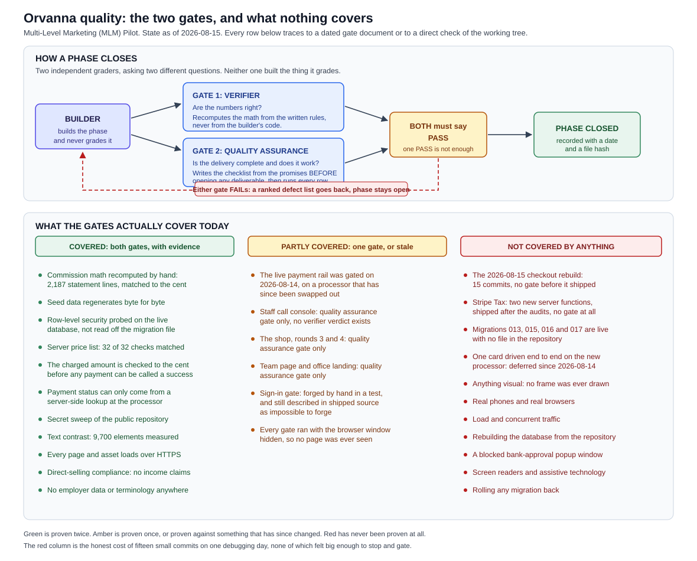

# 06. Quality Assurance and Verification

The testing and verification record for the Orvanna Multi-Level Marketing (MLM) Pilot.

Written by the two graders themselves: `mlm-verifier` (correctness) and `mlm-qa`
(completeness). Neither of us built any of the product described here. That is the
whole point of us.

State of the record: **end of 2026-08-15, carried into the small hours of
2026-08-16.** Section 0 is the two-minute version.

Plain path to this file:
`C:\Users\howar\Desktop\Desktop\ORVANNA\DOCUMENTATION\06-QA-AND-VERIFICATION.md`

Plain path to the diagram:
`C:\Users\howar\Desktop\Desktop\ORVANNA\DOCUMENTATION\diagrams\qa-coverage.svg`

**Acronym key.** Quality Assurance (QA). Multi-Level Marketing (MLM). 3-D Secure,
also written three-domain secure (3DS). Row-Level Security (RLS). Personal Volume
(PV). Sales Volume (SV). Commissionable Volume (CV). Team Volume (TV). Web Content
Accessibility Guidelines (WCAG). Application Programming Interface (API). Software
Development Kit (SDK). Document Object Model (DOM). Cascading Style Sheets (CSS).
Hypertext Markup Language (HTML). Hypertext Transfer Protocol Secure (HTTPS).
Structured Query Language (SQL). Hash-based Message Authentication Code (HMAC).
Secure Hash Algorithm 256-bit (SHA-256). Coordinated Universal Time (UTC). Primary
Account Number (PAN), the long number on the front of a card. Card Verification
Value (CVV), the short code on the back. Strong Customer Authentication (SCA).
Mail Order or Telephone Order (MOTO).

---



*The picture first. Green is proven twice. Amber is proven once, or proven against
something that has since changed. Red has never been proven at all. Full-size file:*
`C:\Users\howar\Desktop\Desktop\ORVANNA\DOCUMENTATION\diagrams\qa-coverage.svg`

---

## 0. State of play, end of 2026-08-15

**Read this if you have two minutes and nothing else.** Everything below it is
the evidence for it.

### What is LIVE and PROVEN

- **Refunds.** `refund-payment` version 2 and `list-demo-orders` version 6 are
  deployed, from disk, by Howard, using the command line tool. Ten direct-call
  refusals were driven against the live endpoint and all ten refused. **One real
  refund was executed and it worked**: order `ORV-2026-08-1JSPY4`, $109.75
  including $9.75 tax, member `GW-000001`, Braintree succeeded, requested by
  `Orvanna_Staff`. The money returned matched the money charged **to the cent**,
  which settles the single most important untested thing in this project as it
  stood yesterday.
- **The tax drift measurement.** `app.v_demo_tax_drift` now reads 975 cents. It
  is the first non-zero reading, it is exactly the tax on the one refunded order,
  and it is the designed consequence of not reversing tax rather than a fault.
- **The public data surface is unchanged.** Exactly seven views are readable by
  the anonymous key, the same seven as before the refunds work.
- **Everything shipped before 2026-08-15** as recorded in section 2, with the
  standing warnings there about which gates are stale.

### What is APPLIED to the database

Migrations 001 to 018, plus 022 and 023. Migration 018 made `tax_source`
mandatory and made `total_cents` provably the sum of its parts, and **no
historical row was altered** doing it (verified: zero rows carry the backfill
value, zero rows violate the sum, zero rows were touched in the applying minute).
Migrations 022 and 023 are the refunds schema.

### What is PROPOSED and NOT applied

Migrations **019** (the shop to compensation bridge), **020** (the GW-000 house
account) and **021** (calendar month containment). Verified absent from the live
ledger. Until 019 lands, **no live sale has ever produced a single point of
volume**, which is the largest unfinished thing in the whole project.

### What is DECIDED but NOT built

**Instant Payout.** Approved by Howard at **20 percent of the order price**,
paid by the sponsor, **terminal at the sponsor with no roll-up**. Not one line of
code or SQL exists for it. The public brochure labels it "approved, not built" on
every mention, which is the honest handling and was checked.

### What is NEW on the property

Four new things shipped, across five files: the **Conductor Library** split into
an index and a per-agent detail page, the **compensation brochure**, the **FAQ**,
and the **Conductor explainer**. The vocabulary changed with them: a distributor
is now a **Conductor**, the agents they run are an **Ensemble**, and the people
they sponsor are a **Team**.

### The three things to do first tomorrow

1. **Fix the address the checkout shows.** A signed-in member sees a synthetic
   Iowa address on the payment screen and is charged the California rate from
   their stored address. The amount is right; the address shown at the moment of
   consent is not the one that produced it. This is new finding **N-H1** and it
   is the only HIGH raised today.
2. **Grade the staff refund screen.** The refund *endpoint* is now the
   best-evidenced code in the project. The *button* that reaches it has never had
   a single checklist row run against it, and the staff console has still never
   had a verifier gate of any kind.
3. **Decide migration 019.** Everything about compensation from real sales is
   waiting behind it, including whether Instant Payout can ever be more than a
   brochure promise.

### The one lesson worth carrying out of today

**Widen a constraint, and re-read every trigger that was leaning on it being
narrow.** Migration 022 widened a CHECK constraint to admit `refunded`. Migration
010's trigger had been relying on that constraint to reject values it had never
heard of, so widening it silently deleted the guarantee and
`processing` to `refunded` briefly became legal. Caught by the migration's own
verification block, before any refund existed, and closed by migration 023. A
constraint and a trigger that together enforce one rule are one mechanism, and
editing half a mechanism is how this class of defect is made.

---

## 1. How quality is actually gated on this project

A phase closes only when **both** independent graders return a PASS. One PASS is
not enough. Either FAIL keeps the phase open and sends a ranked defect list back
to the builder.

The prime rule underneath both gates: **the builder never grades its own work.**
Neither grader wrote a line of the product. Neither can fix anything. Both can only
report.

### Why two gates and not one

Because "correct" and "complete" are different failures, and a single grader
reliably catches only the kind it is looking for.

| | Verifier gate | Quality assurance gate |
|---|---|---|
| The question | Are the numbers right? | Is the delivery complete, and does it work? |
| Method | Recompute independently from the written rules, never from the builder's code | Write the acceptance checklist from the promises BEFORE opening any deliverable, then execute every row |
| Typical catch | A commission line off by a cent, a leaked column, a status that can be written from the wrong place | A promised page that was never built, a button whose text cannot be read, a claim on screen that the code does not honour |
| Blind spot | Will happily confirm perfect arithmetic on a feature nobody can use | Will happily tick "the page shows a total" without knowing the total is wrong |
| Output | `MLM-PILOT\docs\verification\PHASE-N-VERDICT.md`, findings plus a SHA-256 hash of what was graded | `MLM-PILOT\docs\qa\PHASE-N-QA.md`, the checklist as a table plus a ranked defect list |

The split has already earned itself twice, in opposite directions:

- On 2026-08-15 the **verifier** found that a hand-typed member code was thrown
  away on the live checkout. Every number on the page was right. The order was
  simply credited to nobody. Quality assurance was reading the same screen and
  saw nothing wrong, because nothing looked wrong.
- On 2026-08-14 **quality assurance** found that the staff console was still
  faking payments behind a "no payment is ever taken" notice while the shop next
  to it took real test payments. Nothing was mathematically incorrect. The
  property simply contradicted itself.

Neither grader alone would have found both.

### The two standing lessons that shaped the quality assurance gate

1. **Presence in the document is not visual proof (added 2026-08-14).** Howard
   caught washed-out buttons that a gate had passed. Since then every interactive
   element is scored by computing its rendered contrast from the browser's own
   computed styles, compositing every transparent layer, against the 4.5 to 1
   floor for text. A button whose text cannot be read is a HIGH defect even when
   its click handler works perfectly.
2. **Scope follows capability, not the brief (added 2026-08-14).** When a
   capability goes live anywhere, the checklist covers every surface that presents
   that capability, not only the surface the phase brief names. This is the rule
   that caught the faking staff console, and it produced half of the medium-rated
   findings in the 2026-08-15 sweep.

### Where the rule broke

The rule has no trigger that fires on accumulation. On 2026-08-15 the project
shipped fifteen commits, 723 lines of code and SQL, a processor change, a 3DS mode
change, a new payment lifecycle and roughly a thousand new credential rows, and
**not one gate document was written that day before any of it went live.** Nobody
decided to skip the gates. Each individual commit felt too small to stop for.
Fifteen of them added up to a rebuilt payment rail.

The recommended repair, from the architecture audit and endorsed here: any change
to `create-payment`, `confirm-payment`, `_shared/edge.ts`, or the payment block of
either page opens a gate obligation that stays open until both gates run, no matter
how small the change was.

---

## 2. Every phase, its verdict, and its date

Taken from the dated gate documents in `MLM-PILOT\docs\verification\` and
`MLM-PILOT\docs\qa\`. Where a document does not exist, the row says so. **A missing
document is a missing gate, not an implied pass.**

| Phase | What it covered | Verifier verdict | Quality assurance verdict | Date | Closed on both gates? |
|---|---|---|---|---|---|
| 0 | Scaffold, guardrails, team, roadmap | not gated | not gated | 2026-08-13 | No gate ran. Scaffolding only. |
| 1 and 2 | Schema, migrations, row-level security, deterministic seed of 1,000 members | **PASS** (0 HIGH, 2 MEDIUM, 7 LOW) | **PASS** | 2026-08-13 | **Yes** |
| 3 | Commission engine, ranks, commission runs, statements | **PASS** (0 HIGH, 1 MEDIUM, 4 LOW) | **PASS** (38 of 42 rows; the 4 failures were documentation) | 2026-08-13 | **Yes** |
| 4 | Corporate site, sign-in page, member portal (five tabs) | **no verifier verdict exists** | **PASS** (36 rows: 35 PASS, 1 FAIL at MEDIUM) | 2026-08-13 | **No. One gate only.** |
| 4B and 4C | The shop, product pages, portal connection points | **no verifier verdict exists** | **PASS, with one MEDIUM design question** (41 rows) | 2026-08-14 | **No. One gate only.** |
| 4C.2 | Shop round 4: catalog as single source of truth, four-step checkout | **no verifier verdict exists** | **PASS, conditional on a stale roadmap fix** (51 rows) | 2026-08-14 | **No. One gate only.** |
| 4.5 | Staff call console | **no verifier verdict exists** | **PASS** | 2026-08-14 | **No. One gate only.** |
| 5 | Public launch of orvanna.io, GitHub Pages, custom domain, HTTPS | **PASS** (0 HIGH; security and exposure half) | **PASS** (24 of 24 rows) | 2026-08-14 | **Yes** |
| 5T | Team page, roster of ten, teaser, unified cache stamps | **no verifier verdict exists** | **PASS** (31 of 31 rows), then a delta pass **PASS** (13 of 13) | 2026-08-14 | **No. One gate only.** |
| 6 | Real test-mode payments on the live rail | **PASS** (0 HIGH; both MEDIUMs fixed and re-verified same session) | **PASS** (10 of 10 rows) | 2026-08-14 | **Yes, on the rail as it stood that day.** See the warning below. |
| Office landing (retroactive gate on live code) | Rebuilt member portal home | not gated | **FAIL** (2 HIGH contrast, 5 MEDIUM, 4 LOW) | 2026-08-14 | **No. Failed, and shipped anyway by Howard's own explicit ruling that no rollback was warranted.** |
| Full audit sweep, six areas | Everything, treated as unreviewed | **FAIL** (4 HIGH, 9 MEDIUM, 6 LOW) | **FAIL** (2 HIGH, 8 MEDIUM, 8 LOW) | 2026-08-15 | **No. Both gates failed.** |
| Stripe Tax (quote-tax, record-tax, migrations 015 to 017) | Real destination-based tax on the live checkout | **no document exists** | **no document exists** | 2026-08-15 | **No gate of any kind has ever been run on this.** |
| Refunds (migrations 018, 022, 023; `refund-payment`; `list-demo-orders` v6) | The refund engine and the one live refund | **PASS** (0 HIGH on the engine) | **CONDITIONAL PASS** (endpoint complete; the screen ungraded) | 2026-08-16 | **Partly. The endpoint closes. The staff screen has never been graded, and this gate raised one HIGH on the checkout.** |
| Four new pages: Conductor Library index, per-agent detail, compensation brochure, FAQ, Conductor explainer | New public surface, new vocabulary | **no document exists** | **no document exists** | 2026-08-15 | **No gate of any kind has been run on any of them.** |

Full record for the refunds row:
`C:\Users\howar\Desktop\Desktop\ORVANNA\MLM-PILOT\docs\verification\REFUNDS-VERDICT-2026-08-15.md`

### Three warnings about that table

**The Phase 6 "CLOSED, BOTH GATES PASS" line is stale, and the roadmap still
states it as present-tense fact.** Both gates genuinely passed on 2026-08-14. Since
then the payment processor changed (four dummy simulators out, Braintree sandbox
in), the 3DS mode changed, the challenge presentation changed, the payment lifecycle
changed and checkout identity changed. The gates certify a rail that no longer
exists. An untrue certification is worse than no certification, because it stops the
check from being made.

**Phases 4, 4B, 4C, 4C.2, 4.5 and 5T were closed on the quality assurance gate
alone.** No verifier verdict was ever written for any of them. The project's own
rule says a phase closes only on both. Six phases do not meet it. This is stated
plainly because it is not visible from the roadmap, which reports them as done.

**The refunds gate is the first one in two days that ran on time, and it still
only covers half the feature.** It was written against the deployed endpoint, the
live ledger and the live data, not against a builder's report, and it found one
HIGH defect while doing it. But it does not cover the staff screen at all: the
history, the order detail and the refund button shipped ungraded, and the staff
console has still never had a verifier gate of any kind. So the pattern of 2026
-08-15 is improving rather than fixed. **Four new public pages also shipped with
no gate of any kind**, which is the accumulation problem in section 1 recurring
on a different surface.

---

## 3. The test cards, in plain English

Full matrix: `C:\Users\howar\Desktop\Desktop\ORVANNA\MLM-PILOT\docs\TEST-CARDS.html`

**Read this warning before that file.** `TEST-CARDS.html` carries no date, its file
timestamp is 2026-08-14 18:46, and the processor changed the next day. Of roughly
forty card rows in it, four are still true on the live rail. It describes three card
worlds (3DSecure.io, Stripe, and the HyperSwitch dummy connector) and **none of the
three is connected any more.** It is the one document in the project where following
the documentation produces a wrong conclusion within thirty seconds. It has not yet
been rebuilt.

### What is actually true on the live rail today

The processor is Braintree sandbox. Expiry `01/29` on every card. Any three-digit
security code. The passcode the sandbox itself displays on the approval screen is
`1234`.

| Card number | What it does, in plain English |
|---|---|
| `4000 0000 0000 2503` | The bank asks the shopper for a passcode, the shopper types `1234`, and the payment is **approved**. This is the only card that shows the whole journey ending in a sale, so it is the one the checkout recommends first. |
| `4000 0000 0000 2370` | The bank asks for a passcode and the **identity check fails**. The right card for testing the "we could not confirm it was you" path. |
| `4000 0000 0000 2701` | **No screen at all.** Approved silently. This is what a smooth, frictionless payment is supposed to look like. |
| `4000 1111 1111 1115` | The bank asks, the shopper answers correctly, **and the card is still declined.** See the correction below. |
| Any amount between $2,000.00 and $3,000.00 | Declines, on any card. This is a Braintree sandbox rule triggered by the **amount**, not the card. It is documented nowhere in `TEST-CARDS.html` and it is the rule most likely to make a tester believe the site is broken. It also means the specification's own worked example cart, at $2,231.25, cannot pass on the live rail. |

### The two corrections that cost real debugging time

**Correction one. `4111 1111 1111 1111` is not a three-domain secure (3DS) test
card at all.** It was recommended in the shop's own card hint for part of
2026-08-15. It is an ordinary success card. If you use it to answer the question
"is 3DS working?", the answer will always look like no, and the answer will be
wrong. The same trap exists with `4242 4242 4242 4242`, which is documented as
supporting 3DS but not enrolled in it, so no approval screen can ever appear no
matter what the site asks for. `TEST-CARDS.html` still contains a large red
instruction to use `4242 4242 4242 4242`, and that card is not valid on Braintree
at all.

**Correction two. `4000 1111 1111 1115` raises the approval screen but is a decline
card.** A tester types the correct passcode, the bank confirms the identity, and the
payment is then refused by the card. On screen that reads exactly as though the
passcode was ignored. It is not. Two separate things happened in order: the identity
check passed, then the money was refused. Any wording that tells that shopper to
"check their card details" is actively wrong.

Both mistakes were in a shipped card hint at the same time, and together they
produced a card that could never finish and a card whose success looked like a bug.
Howard found both.

### The deeper lesson behind the card table

The reason the cards changed on 2026-08-15 is that the **processor** changed, and
every processor publishes its own test numbers. The root cause of two nights of lost
configuration work was found in HyperSwitch's source rather than its documentation:
a function named `is_separate_authentication_supported()` hard-codes nine connectors
that can do external 3DS, and every dummy connector on the account returns false by
name. No setting, key, or acquirer value on our side could ever have changed that.

---

## 4. Findings ledger

Every finding raised by a gate or an audit, its severity, and its status as of
2026-08-15. Statuses marked **verified** were re-checked directly in the working
tree while writing this document. Statuses marked *not re-verified* are reported as
the audit left them, and should be treated as unknown rather than as closed.

### 4.1 The audit of 2026-08-15, six areas

On 2026-08-15, after Howard's instruction to "audit everything, make sure all is in
order, nothing sloppy", six independent audits ran across the whole property. Both
gate verdicts were FAIL.

| Area | Auditor | Document |
|---|---|---|
| Correctness and security, whole system | mlm-verifier | `MLM-PILOT\docs\verification\FULL-AUDIT-2026-08-15.md` |
| Database | mlm-db-engineer | `MLM-PILOT\docs\verification\DB-AUDIT-2026-08-15.md` |
| Completeness, contrast, every surface | mlm-qa | `MLM-PILOT\docs\qa\FULL-AUDIT-2026-08-15.md` |
| Code quality and duplication | mlm-qa | `MLM-PILOT\docs\qa\CODE-QUALITY-AUDIT-2026-08-15.md` |
| Every word the site shows a human | orvanna-writer | `MLM-PILOT\docs\qa\COPY-AUDIT-2026-08-15.md` |
| Architecture and documentation accuracy | mlm-architect | `MLM-PILOT\docs\decisions\ARCHITECTURE-AUDIT-2026-08-15.md` |

#### Verifier findings (correctness and security)

| # | Severity | Finding | Status |
|---|---|---|---|
| V-H1 | HIGH | A total that moves while the payment is being created is dropped on the floor. The card form then shows the current total while the open payment carries the old one. | **FIXED, verified.** Commit `3f30d44`. |
| V-H2 | HIGH | A hand-typed member code is silently discarded. A guest who types a sponsor's code gets an order credited to nobody. | **FIXED, verified.** An input listener now exists at `www\shop.html:1151`. |
| V-H3 | HIGH | The session token is never verified, and the shipped source comment claims it is. Hand-writing a session object opens the staff console and the member portal. | **MOVED, NOT CLOSED. Downgraded to MEDIUM.** See the box below; this is the most misunderstood item in the codebase. |
| V-H4 | HIGH | The administrator and staff passwords went into version control in plaintext and were never rotated. | **PARTLY CLOSED, verified.** The plaintext is out of the current migration file; git history still carries it and **no rotation is recorded anywhere.** |
| V-M1 | MEDIUM | Cart edits made while the checkout is open never reach the checkout. | **FIXED, verified.** `renderAll` now calls the summary re-render. |
| V-M2 | MEDIUM | Automatic payment opening manufactures orphan orders and burns the daily rail limit. 66 percent of orders on 2026-08-15 were stuck at `created`. | **OPEN**, not re-verified. |
| V-M3 | MEDIUM | `confirm-payment` performs no authorization, and the order list publishes the last 25 order numbers to anyone. | **OPEN**, not re-verified. |
| V-M4 | MEDIUM | Specification drift in three places, none amended. | **OPEN**, not re-verified. |
| V-M5 | MEDIUM | A third-party chat script runs on the payment page. Acceptable on a test rail; must never carry to a live one. | **OPEN by design ruling.** |
| V-M6 | MEDIUM | Migration 013 is applied to production and absent from the repository. | **OPEN, verified, and now worse.** See section 4.5. |
| V-M7 | MEDIUM | Howard's real first name appears 16 times in the public build, with verbatim internal quotes. | **MOSTLY FIXED, THEN RECURRED. Counted from the public repository's own history:** 19 occurrences at `06d0c03`, **5** after the copy fix at `da5ca7c`, back to **7** at `5e3cc0c`. Four of the seven are legitimate credits on `team.html` and `index.html` and should stay. **Three are internal comments in `deploy\dist\staff.html`, two of them verbatim dated quotes, and they were reintroduced by the very next feature commit.** See N-M4. |
| V-M8 | MEDIUM | The rate limiter reads then increments in two statements, so concurrent requests can all pass. | **OPEN**, not re-verified. |
| V-M9 | MEDIUM | The sign-in role allow-list omits `member`, so a page asking for `member` gets "any role is acceptable". | **OPEN**, not re-verified. |
| V-L1 to V-L6 | LOW (6) | Daily limit uses session time zone not UTC; the 25-unit cap is unexplained to the shopper; a byte order mark in `catalog.js`; unrecorded reasoning for seven database advisor errors; no secret scan in the build; an orphan row if a reference write fails. | **OPEN.** The byte order mark was verified still present. |

> ### V-H3 has MOVED. State this split precisely or it will be got wrong again.
>
> The original finding was that **nothing anywhere verified a session token**, and
> that `www\staff.html` claimed a browser could not forge one. That claim was
> false and has been removed.
>
> **It was replaced by a second claim that was ALSO false at the time it shipped:**
> *"The real gate is the role check the server performs on every function call."*
> When that sentence was written, no server-side role check existed anywhere in
> the codebase. `demo-login` minted tokens that nothing ever verified.
>
> **It is true NOW, and only in one place.** `functions\_shared\staff-auth.ts`
> verifies the token's signature against the key in `app.demo_auth_config`, checks
> the expiry, then **re-reads the role from `app.demo_users`** and discards the
> token's own role claim. Every function was read to establish where it runs:
>
> | Function | Is a token verified? |
> |---|---|
> | `refund-payment` | **Yes, on every call.** This is the control that moves money. |
> | `list-demo-orders` | **Only on the order-detail path** (`?order_number=`). The default list has origin and rate limit only. |
> | `create-payment`, `confirm-payment`, `demo-login`, `quote-tax`, `record-tax` | **No.** Origin allow-list and rate limit only. |
> | `payment-webhook` | **No.** It has its own signature verification instead. |
>
> So the sentence now shipping on `www\staff.html:398` and `site\index.html:71`
> is **true of the refund button, true of opening one order, false of every other
> call the staff console makes, and false of the entire member portal**, which
> calls nothing that verifies a token at all.
>
> The honest form of the sentence is: *the refund endpoint decides for itself who
> you are; the rest of the property does not.* Origin and rate limit are rails,
> not gates, and the difference is the whole point.
>
> Downgraded from HIGH to MEDIUM because the one control that can move money out
> of the business is now genuinely gated, and because the residual exposure is
> reading a demonstration page rather than performing an action.

#### Quality assurance findings (completeness, contrast, every surface)

Measurement scale, for context: 9,700 elements were scored for computed contrast
across every page and both themes. 9,690 passed.

| # | Severity | Finding | Status |
|---|---|---|---|
| Q-H1 | HIGH | Shop primary buttons are unreadable while disabled: computed **1.70 to 1** against a 4.5 to 1 floor. Reproduced live on the checkout button and on the pay button during every payment open. | **FIXED, verified.** Commit `f7329f1` replaced the fade with a real disabled treatment. |
| Q-H2 | HIGH | Portal light theme: the QUALIFIED and NOT QUALIFIED signal fails, five instances, 3.28 to 1 and 4.12 to 1. The single most important status in the member office. | **FIXED, verified.** The colour tokens were restated and re-measured at 6.72 to 1 and 5.53 to 1. |
| Q-M1 | MEDIUM | The shop tells the shopper "any values continue, including empty fields" directly beneath a real payment button. False on a live rail. | **FIXED, verified.** Zero occurrences of the phrase across `www\`, `site\` and `deploy\dist\`. |
| Q-M2 | MEDIUM | "Express options place the order in one step." All three express buttons are disabled and place nothing. | **FIXED, verified.** Zero occurrences of the phrase anywhere in the shipped tree. |
| Q-M3 | MEDIUM | The disabled express buttons look identical to the working one. No disabled rule exists for them at all. A shopper taps Apple Pay and gets silence. | **OPEN.** The sentence was removed, the visual treatment was not re-measured by this pass. Treat as unknown, not closed. |
| Q-M4 | MEDIUM | The staff console says "No bank approval is possible on this path" on a page that ships a full bank-approval overlay and contradicts itself two lines earlier. | **FIXED, verified.** Zero occurrences of the phrase anywhere in the shipped tree. |
| Q-M5 | MEDIUM | The finishing state was applied to the shop only. The roadmap claimed both. The staff console still shows the exact flash-back-to-the-card-form bug Howard reported. | **OPEN, verified.** Zero occurrences of the finishing function in `www\staff.html`. The roadmap claim has since been corrected in prose. |
| Q-M6 | MEDIUM | A keyboard user cannot reach the bank's passcode field. The focus ring targets an element that cannot take focus. | **FIXED, verified.** Both pages now set the focus attribute before focusing. |
| Q-M7 | MEDIUM | Staff primary buttons fail while disabled, 3.72 to 1 and 3.84 to 1, including one button that is permanently disabled. | **FIXED, verified.** The staff stylesheet now uses an opaque grey rather than a fade. |
| Q-M8 | MEDIUM | The receipt says "Payments route through the Orvanna orchestration layer in a later phase." They route through it now. | **FIXED, verified.** The line is gone. |
| Q-L1 to Q-L8 | LOW (8) | PV used before it is expanded; ZIP never expanded; an unknown product code silently renders a different product; an overclaimed "saved billing address"; field borders at 1.60 to 1; six touch targets under 24 pixels at phone width; a byte order mark; an unreachable stale status line. | **OPEN.** The "saved billing address" item is **ESCALATED to HIGH and re-raised as N-M1's neighbour, finding N-H1**: the sentence is not merely overclaimed, the address on the screen is not the address the server taxes against, and that is now provable on a real order. |
| Q-unproven | Could not verify | Whether the card form is visually present on arrival could not be confirmed: the browser pane never composited a frame. Recorded as unproven rather than passed. | **STILL UNPROVEN.** Needs one look in a visible browser. |

#### Code quality findings

| # | Severity | Finding | Status |
|---|---|---|---|
| C-A1 | HIGH | Stale cache stamp. Stylesheets rewritten that day kept the old address, so a browser holding yesterday's stylesheet painted the bank-approval bar behind the payment window at the exact moment it matters. | **FIXED, verified.** The build now derives the stamp from a hash of the actual bytes. |
| C-A2 | HIGH | Seven promise chains with no failure handler. A dropped connection leaves "Finishing your order, one moment" on screen forever with nothing to press. | **PARTLY ADDRESSED**, not fully verified. Some handlers now exist; not all four poll loops were confirmed. |
| C-A3 | HIGH | The staff console can move the total after the payment is open, then read the new total aloud to a caller charged the old one. | **OPEN, verified.** The console still has no amount signature. |
| C-A4 | HIGH | Two phantom selectors defeated the staff guard that was supposed to prevent C-A3. The classes it disabled do not exist. | **FIXED, verified.** The guard now names the real classes. |
| C-A5 | MEDIUM-HIGH | Retrying a failed portal load double-binds listeners and silently breaks the light and dark toggle. | **OPEN**, not re-verified. |
| C-A6 to C-A11 | MEDIUM to LOW (6) | An uncancelled reveal timer; two different definitions of "qualified this month" in one portal; an unknown product code showing a different product; both session gates painting the protected page before ejecting; unescaped server strings in the shop only; a support-chat race repeated six times. | **OPEN**, not re-verified. |
| C-B1 | Structural | The staff console is a roughly 600-line copy of the shop's payment engine. Twenty function names are 95 to 100 percent identical. It has drifted three ways in a single day. | **OPEN.** The recommended fix, one shared payment module, is rated the highest-leverage item in the project and has not been done. |

#### Copy findings: 7 HIGH, 11 MEDIUM, 11 LOW, zero compliance findings

| # | Severity | Finding | Status |
|---|---|---|---|
| W-H1 | HIGH | "Payments route through the orchestration layer in a later phase", printed on every successful receipt. | **FIXED, verified.** |
| W-H2 | HIGH | "Any values continue, including empty fields" on a real payment step. | **FIXED, verified.** Same as Q-M1. |
| W-H3 | HIGH | "Express options place the order in one step." Both halves false. | **FIXED, verified.** Same as Q-M2. |
| W-H4 | HIGH | "No bank approval is possible on this path" on the staff console. Operationally dangerous on a live call. | **FIXED, verified.** Same as Q-M4. |
| W-H5 | HIGH | "Test mode: this is a simulated approval and no money moves." The approval is not simulated. It is a real 3DS challenge served by a sandbox issuer. | **FIXED, verified.** Zero occurrences of the phrase anywhere in the shipped tree. |
| W-H6 | HIGH | A 73-line HTML comment containing four invented executives with full biographies ships to production, underneath a page whose entire premise is that the team is real. | **FIXED, verified.** The block is gone from `www\index.html` and `deploy\dist\index.html`, replaced by a four-line note recording why, and archived at `docs\archive\2026-08-14-original-fictional-leadership-section.html`. The only "Chief Executive" strings left on the property are the name of a product the shop sells. |
| W-H7 | HIGH | Nine comments quoting Howard verbatim and dating his bug reports ship to production, on files any visitor can fetch. | **PARTLY FIXED, THEN RECURRED. Downgraded to MEDIUM.** 14 occurrences removed at `da5ca7c`; **two verbatim dated quotes reintroduced at `5e3cc0c`**, at `deploy\dist\staff.html` lines 309 and 2377, plus a third naming at line 936. See N-M4. |
| W-M1 to W-M11 | MEDIUM (11) | Footer and top notice contradict each other on the same page; a false default confirmation note; PV versus SV named differently on two live surfaces; portal money carries no currency mark; a perpetual-ownership promise for hosted software; "cancel anytime" with nothing that cancels; two absolute product guarantees; a two-day build claim that is now three; member codes still carry the pre-Orvanna prefix; the portal is titled for a member and gated for an administrator; one card-hint sentence has the bank and the shopper the wrong way round. | **OPEN**, not re-verified except the member-code prefix, which is still present. |
| W-L1 to W-L11 | LOW (11) | Two em dash characters in placeholder markup (the only two on the property); a bare one-word "Declined."; a percent-style split between surfaces; slang about money on one page; a footer with two versions; inert footer links; PV before its expansion; a backdated announcement; two strong outcome claims; two disabled options handled two different ways; a hardcoded delivery promise. | **OPEN.** |

#### Database findings

| # | Severity | Finding | Status |
|---|---|---|---|
| D-F1 | HIGH | Migration 013 is applied to the live project with no file in the repository. The repository cannot rebuild the live ledger. | **OPEN, verified, and now worse.** See 4.5. |
| D-F2 | HIGH | Migration 013 was a no-operation. It asked for a descending index using a name that already existed as an ascending one, so the database silently skipped it. The ledger records an intent that did not happen. | **OPEN.** |
| D-F3 | MEDIUM | The abandon sweep is stranding rows right now: 13 orders at `created` and 3 at `processing`, all more than an hour old. | **OPEN.** |
| D-F4 | MEDIUM | No index serves the abandon sweep. It is a full table scan and grows without bound. | **OPEN.** |
| D-F5 | MEDIUM | The member code column on the sign-in table has no foreign key to the members table, although the target column is unique and would accept one. | **OPEN.** |
| D-F6 | MEDIUM | Six finalized commission runs stamped version 1.2 cannot be re-derived: the engine source was edited in place to version 1.3. For a project whose crown jewel is a recomputable commission run, this is the one auditability gap in the engine. | **OPEN.** |
| D-F7 | MEDIUM | The rate-ledger cleanup has no usable index. | **OPEN.** |
| D-F8 | MEDIUM | An abandoned order can never be corrected by the confirm path, only by the webhook. | **OPEN.** |
| D-F9, D-F10, D-F11 | LOW (3) | Migration 014 is not re-runnable; roughly 1,000 member accounts share one password hash (a deliberate, honestly documented choice); five trigger functions carry a default public execute grant, unreachable in practice. | **OPEN.** |
| D-F12, D-F13 | Information | Seven database advisor errors are the mandated architecture, not defects, recorded so nobody "fixes" them and breaks the demo; the anonymous role's storage grants are platform defaults over zero buckets. | **Recorded, no action.** |

#### Architecture and documentation findings

| Group | Count | What it is | Status |
|---|---|---|---|
| S1 to S13 | 13 | Places where the Phase 6 specification now describes something that is not true. The largest: the specification says the payment begins at the Place order press; it now opens automatically at three different moments, none of which is a button press. | **OPEN.** The specification has not been amended. |
| C1 to C3 | 3 | Places where the code should come back to the specification. The most important: tax exemption is decided in the browser and obeyed by the server, inside a design whose stated invariant is that this never happens. A caller can send "tax exempt" and legitimately reduce a $2,000.00 order by $100.00. | **OPEN**, and partly overtaken by the Stripe Tax work of the same day, which is itself ungated. |
| W1 to W17 | 17 | Statements in the roadmap that are wrong. W5 is the serious one: it certifies a payment rail that no longer exists. W17 is the cause: the document is append-only, so six sections each correct the section above them and a reader who stops early gets a confidently stated falsehood. | **PARTLY FIXED.** W9 was corrected in prose on 2026-08-15. The rest, including W5, are **OPEN**. |
| R1 to R6 | 6 | The 3DS research document now describes the opposite of the live situation in its summary, and zero cards for the live processor appear anywhere in it. | **OPEN.** |
| Test-card document | 1 large | The most dangerous document in the project: undated, points at three dead card worlds, two rows actively inverted, and the four cards the checkout itself recommends appear nowhere in it. | **OPEN.** |
| Items 1 to 34 | 34 | The deduplicated open-items list across every source. Tier 1 (owed before anything else ships) is four items: run both gates over the checkout, correct the roadmap's false statements, rebuild the test-card document, rotate the four burned keys. | **Tier 1 is entirely OPEN.** |

#### Contrast findings closed since (measured, not eyeballed)

| # | Finding | Status |
|---|---|---|
| Disabled button contrast on the shop | A stylesheet comment claimed **4.63 to 1**. Nobody had ever computed it. The real measurement was **3.75 to 1**, below the 4.5 to 1 floor. | **FIXED, verified.** The rule at `www\css\shop.css:593` now records both numbers honestly, and the replacement (`#0F172A` on `#7C8AA0`) computes to **5.10 to 1**. The lesson is in the comment itself: a contrast figure written by hand is a guess until something computes it. |

### 4.1b The refunds gate of 2026-08-16, and the seven findings it raised

Full record:
`C:\Users\howar\Desktop\Desktop\ORVANNA\MLM-PILOT\docs\verification\REFUNDS-VERDICT-2026-08-15.md`

Verifier verdict **PASS** on the engine. Quality assurance verdict **CONDITIONAL
PASS**: the endpoint is complete and proven, the staff screen that fronts it has
never been graded, and the gate found one HIGH on the checkout while looking.

| # | Severity | Finding | Status |
|---|---|---|---|
| N-H1 | **HIGH** | **The checkout shows one address and taxes against another.** `www\shop.html:124` promises "Sign in to use your saved billing address". Lines 1006 to 1012 then fill the form with `SYNTHETIC_ADDRESS` (line 876: Jordan Avery, 4821 Meridian Loop, Cedar Falls, Iowa 50613) while `_shared\tax.ts` `resolveTaxAddress` sends the member's **real stored address** to the tax engine. Proven on `ORV-2026-08-1JSPY4`: member `GW-000001`'s stored address is Los Angeles, CA 90012, the order carries `tax_jurisdiction = 'CA, US'` and an effective rate of **9.750 percent**. Cedar Falls, Iowa is 7 percent. The shopper saw Iowa and was charged California. | **OPEN.** The amount is correct and the server priced it. What is wrong is that the address shown at the moment of consent is not the one that produced the amount, on a screen that promises it is. |
| N-M1 | MEDIUM | **A refused staff action throws away an identity the server had already verified.** `refund-payment` writes every authorisation failure to the audit log as `actor: "anonymous"`, `actor_role: null`. Correct for a forged token; wrong for `wrong_role` and `unknown_user`, where the signature verified and the username is known. Audit rows 9 and 10 record that somebody with the wrong role tried to refund but not that one was `Orvanna_Admin` and the other Conductor `GW-000001`. Those are the two events worth alerting on. | **OPEN.** Larger than one line: `StaffAuthResult` carries no username on its failure branch. |
| N-M2 | MEDIUM | **Migration 023 is in the live ledger with no file.** Its text was folded into `022_refunds.sql` instead. The final state is reproducible; the broken intermediate state is not. Fourth instance of changing applied SQL in place in this project. | **OPEN.** Milder than D-F1 and V-M6 because the state can be rebuilt. |
| N-M3 | MEDIUM | **Migration 018's file states the opposite of the truth, in capitals.** It is still named `018_PROPOSED_tax_integrity_hardening.sql` and its header reads "STATUS: PROPOSED. NOT APPLIED TO PRODUCTION. NOT IN THE LIVE LEDGER." It is applied, in production, and in the ledger. | **OPEN.** |
| N-M4 | MEDIUM | **The name-in-public-build defect recurred a third time.** 19 occurrences, down to 5 at the copy fix, back to 7 at the next feature commit. Two new verbatim dated quotes in `deploy\dist\staff.html`. | **OPEN.** A finding that returns every time a feature ships is a missing build step, not a defect. Recommendation: fail the build in `deploy\build_dist.py` on an author name inside a comment. |
| N-L1 | LOW | **A missing session header logs as `bad_signature`, not `missing_token`**, because `bearerFrom` falls back to `Authorization`, which on this deployment always carries the anonymous key. The refusal is correct; the audit cannot tell "not signed in" from "somebody tried". | **OPEN, and deliberately so.** Recorded by the builder at `refund-payment\index.ts:166-179` and consciously not changed on the night of deploy: changing a money path to improve a log label at the end of a long session is the wrong trade. The fix is one line, dropping the fallback. |
| N-L2 | LOW | `refund-payment`'s own header contradicts itself: lines 145 to 150 say it must be deployed **without** platform token verification, lines 175 to 179 say it **is** deployed with `verify_jwt: true`. The platform confirms the second. | **OPEN.** The first block is stale and should be deleted, not reconciled. |

### 4.2 Earlier phase-gate findings

| Phase | Findings | Status |
|---|---|---|
| 1 and 2 | 0 HIGH, 2 MEDIUM, 7 LOW | Recorded at the gate; not tracked separately since. |
| 3 | 0 HIGH, 1 MEDIUM (a specification property, not an engine defect), 4 LOW documentation | Recorded at the gate. |
| 4 | 1 FAIL at MEDIUM out of 36 rows | Not re-verified. |
| 5 | 0 HIGH; 1 MEDIUM, an authoring comment naming Howard in the catalog file | **That specific comment was fixed. The same defect class then recurred at roughly ten times the volume** and is now finding V-M7 and W-H7. |
| 6 | 0 HIGH; both MEDIUMs fixed and re-verified in the same session; a backlog of 6 items banked | Backlog **OPEN**: inert card fields present pre-mount, thin pre-mount framing, the rate-limiter race, an accepted asymmetry, a list endpoint that accepts the wrong method, and raw dollar figures in a response. |
| Office landing | 2 HIGH contrast, 5 MEDIUM, 4 LOW. **Verdict FAIL.** | H1 was fixed. **M2, M3 and M4 remain open by Howard's own call.** M5, the PV versus SV naming split, is still live on the shop. |

### 4.3 The honest summary of the ledger

Counts as of the end of 2026-08-15, after the day's fixes and this gate.

- **Fixed and re-verified: 20 findings.** Eleven were closed by the previous
  version of this document. Nine more closed since: six false statements removed
  from live payment screens (Q-M1, Q-M2, Q-M4, W-H2, W-H3, W-H4, W-H5), the
  fictional executive roster (W-H6), and the disabled-button contrast, measured
  from 3.75 to 5.10 against a comment that had claimed 4.63 without anyone ever
  computing it.
- **Still open at HIGH severity: 4.** One of them, N-H1, was raised today and is
  the only HIGH on the current checkout. V-H3 was downgraded to MEDIUM and W-H7
  to MEDIUM, both with reasons stated at their rows rather than quietly.
- Still open at MEDIUM severity: roughly **48**, including five raised today.
- Still open at LOW severity: roughly **40**.
- **Never gated at all:** the Stripe Tax feature, four new public pages, the
  staff refund screen, and five production migrations.

**One thing genuinely changed today about that ceiling.** For the first time,
this system **moved money out of the business**: a real refund of $109.75 through
Braintree. The sandbox still has no path to real funds, so the ceiling holds. But
the shape of the risk changed the moment an outward, irreversible transfer became
possible from a browser button, and every future finding on the refund path
should be read against that rather than against the pretend-payment era. The one
control that guards it, `requireStaff`, was tested ten ways and held ten times.

### 4.4 What is genuinely right, and should not be lost in the list above

An honest ledger has to say this too, or it misleads in the other direction.

- The commission engine was recomputed independently, from the written plan rather
  than the engine's code, and matched **2,187 statement lines to the cent**, with
  zero rank disagreements and zero volume disagreements.
- The seed regenerates byte for byte.
- The money path on the server is single-sourced and cannot be skipped by either
  caller. The charged amount is compared to the stored amount as whole cents before
  any payment can be recorded as a success, and a mismatch can never be written as
  succeeded. This is the strongest control in the project and it is correctly placed
  as the last word.
- A client can never influence an amount. The request carries no prices.
- The database enforces immutability itself, not just in application code:
  a finalized run rejects writes at the trigger level. **Re-proven by execution
  on 2026-08-16**, along with five other guards: `processing` to `refunded`,
  `created` to `refunded` and `refunded` to `succeeded` all refuse; `succeeded`
  to `refunded` allows; the staff audit log refuses an update; and a second full
  refund on an already refunded order is refused by the partial unique index.
  Six of six. Driven live inside a self rolling-back block, with row counts
  re-read afterwards to confirm nothing was committed.
- **The refund row is written before the processor is called.** That single
  ordering decision converts the worst possible failure, an untraceable double
  refund, into an answerable question. It is the best decision in the refunds
  work and it cost nothing.
- **Migration 022's own verification block found migration 022's own defect**,
  minutes after applying and before any refund existed. That is the strongest
  single piece of evidence in this document that the verification habit pays for
  itself.
- **The tax gap was measured rather than hidden.** A view that reads $9.75 and
  names the exact endpoint that would close it is a better outcome than a gap
  nobody wrote down.
- The anonymous key grants nothing on the application schema at all. Not a weak
  policy, no access.
- The secret sweep of the public repository is clean. The only credential in its
  history is the deliberately public demonstration password printed on the page.
- Zero em dashes and zero en dashes across the shipped site, and zero employer data
  or terminology anywhere.
- Direct-selling compliance is clean on every surface: no income claims, no earnings
  projections, no fabricated social proof, and no member is ever shown what an
  unqualified downline person cost them.

### 4.5 One finding this document raises for the first time

While re-verifying the ledger, the checked-in migration folder was compared against
the commit history. **Migrations 015, 016 and 017 are named in commit messages as
applied to production and have no file in `db\migrations\`.** The folder runs 001 to
014 with 009 and 013 already missing. Two new server functions, `quote-tax` and
`record-tax`, exist in the repository with no gate document and no specification
entry.

This is the same defect class the database audit rated HIGH four hours earlier as a
single instance. It is now four instances, and it happened after the audit that named
it. Combined with the rebuild recipe that already omits three migrations, **the
database currently cannot be reconstructed from this repository.**

**Corrected and updated 2026-08-16.** The ledger was read directly rather than
inferred from commit messages, and the picture is better than the paragraph above
but still wrong.

| Migration | In the live ledger? | File in `db\migrations\`? |
|---|---|---|
| 001 to 007 | yes | yes |
| 008, 009 | yes | **pointer files only**, the SQL lives in `db\comp\` |
| 010 to 012 | yes | yes |
| 013 | yes | **yes**, contrary to the paragraph above |
| 014 to 017 | yes | **yes**, contrary to the paragraph above |
| 018 (`tax_integrity_hardening`) | yes | yes, but **named PROPOSED and headed NOT APPLIED**. Finding N-M3 |
| 019, 020, 021 | **no, correctly** | yes, and correctly marked proposed |
| 022 (`refunds_022`) | yes | yes |
| 023 (`refund_guard_fix_023`) | yes | **no file at all.** Folded into 022. Finding N-M2 |

So migrations 013 and 015 to 017 **do now have files**; they were written into the
repository after that paragraph was drafted, which is why it reads worse than the
truth. **Two real gaps remain**: migration 023 has no file, and migrations 008
and 009 are pointers rather than SQL. **The repository can now produce the correct
final state.** It still cannot reproduce the history, and nobody has attempted a
rebuild to prove even the first claim.

---

## 5. What is NOT tested

Named plainly. An untested area that is silently omitted is worse than one that is
named, because a reader assumes coverage that does not exist.

**Rewritten 2026-08-16.** Three items on this list got shorter, one disappeared,
and four are new. The list is longer than it was, which is the honest result of a
day that shipped more than it graded.

### Closed since the last version of this list

- **"No card has ever been driven end to end on the current processor by a
  grader"** was the single most important untested thing in the project. **It is
  now tested.** Order `ORV-2026-08-1JSPY4` was charged $109.75 and refunded
  $109.75, and the amount equality check deferred on 2026-08-14 was recomputed
  and holds to the cent. The deferred check is closed on the processor that is
  actually connected.

### Smaller than it was

1. **The 2026-08-15 checkout rebuild shipped ungated**, and still has no gate of
   its own. Two audits ran retroactively that day and a third ran on the refunds
   work. Fifteen commits of money-path change are still certified by their builder
   only, but the money path itself has now been exercised end to end once, which
   is more than could be said before.
2. **The database rebuild.** The claim "four migrations do not exist as files"
   is no longer true. Migrations 013 and 015 to 017 now have files. **One
   migration, 023, still has none**, and two more are pointers. So the repository
   should now be able to produce the correct final state. **Nobody has tried**, so
   that remains a belief rather than a fact.

### Unchanged, and still true

3. **Nothing visual has ever been seen.** Every gate has run with the browser
   window hidden, including this one, which ran entirely against the database and
   the deployed endpoints. Contrast is computed and behaviour is proven by
   dispatching real events, both stronger than a screenshot for those questions.
   But no page has been rendered and looked at by a grader. Layout collapse,
   overlap, compositor z-order, animation and font rendering are all unproven.
4. **No real device and no second browser.** Phone width was emulated, never a
   phone. One engine throughout.
5. **Load and concurrency are untested.** The rate limiter's read-then-increment
   race is a code-reading finding, not a measured one.
6. **Rollback is untested.** No migration has been rolled back and re-applied.
   One is known not to be re-runnable, and migrations 022 and 023 join the list
   untested.
7. **The blocked-popup path is untested and unhandled** on the bank approval,
   which is now the primary path.
8. **Assistive technology is untested.** No screen reader has ever been run
   against any page.
9. **Nothing has been tested against the Phase 6 specification since it went
   stale.** Thirteen recorded divergences, none amended.

### New, and this is where the day's gap is

10. **The staff refund screen has never been graded, at all.** Not one checklist
    row has been run against `www\staff.html`'s order history, order detail or
    refund button. **The endpoint behind it is now the best-evidenced code in the
    project. The button a human presses to reach it is entirely unproven.** Worse:
    the one successful refund's audit row carries `reason_code: 'other'`, which
    both the screen and a direct call can produce, **so even the success does not
    prove the button is wired.**
11. **The staff console has still never had a verifier gate of any kind.** This
    was already true and is now more serious: it is a roughly 600-line copy of the
    shop's payment engine **plus a control that moves money out of the business**,
    read aloud by an agent on a live call.
12. **`already_refunded` has never been returned by the live endpoint.** The
    design document's own step 7, clicking refund a second time, was not
    performed: there is no audit row after the success. The **database backstop**
    was proven instead (a second succeeded refund is refused by the partial unique
    index), which is the stronger of the two controls. But the caller-facing
    response is unproven, and so is the promise that a second click does not call
    the processor.
13. **Four new public pages shipped with no gate of any kind:** the Conductor
    Library index, the per-agent detail page, the compensation brochure, the FAQ
    and the Conductor explainer. No contrast sweep, no copy audit, no verifier
    pass. They introduce a new vocabulary (Conductor, Ensemble, Team) to a
    property whose older pages have not been swept for the old one.
14. **The Stripe Tax feature has still never been gated**, and finding N-H1 shows
    why that matters: the address the tax is computed from is not the address the
    shopper is shown.
15. **The clawback snapshot is untested in the only case that matters.** The one
    refund captured a `comp_impact` snapshot that correctly reads
    `bridge: not_applied`, because migration 019 is not applied and no live sale
    has ever produced volume. Nobody has seen it capture a real bridged order,
    because no such order can exist yet.
16. **Instant Payout has nothing to test.** Approved at 20 percent, sponsor-paid,
    terminal at the sponsor. Zero lines of code, zero SQL, no migration. The
    public brochure labels it "approved, not built" on every mention, which was
    checked and is correct.

---

## 6. The regression story of 2026-08-15, written as a lesson

### What was changed, and why it was a good idea

The shop's checkout used to create the payment when the shopper pressed Place order.
That meant a two-second wait at the worst possible moment, right at the point of
consent. Howard asked for it to be faster. The builder moved the payment creation
earlier, so that it happens automatically while the shopper is still filling in the
step above and the card form is simply already there when they arrive.

That is a genuinely good change. Howard confirmed the checkout now feels fast, which
was the entire point.

### The hazard the change created, and the defence that was built for it

A payment fixes its amount at the moment it is created. Opening it early means the
shopper can afterwards do something that moves the total, leaving a payment that
would settle at the old amount while the page shows the new one.

The builder saw this and built a defence: an amount signature covering the four
things that can move the total or the attribution (the items, the activation option,
the tax exemption, and the member code). Any change discards the open payment and
opens a fresh one. The server re-prices from scratch every time, so an amount never
originates in the browser. The design was thoughtful and the intent was right.

### The three regressions it shipped with anyway

| # | The regression | What it meant |
|---|---|---|
| 1 | **A hand-typed member code was silently discarded.** The signature included the member code, which shows the author knew it mattered. Nothing ever fired on that field, so the payment had already been created with an empty code before a single character was typed. | For a project whose entire subject is sponsor attribution, the central mechanic was silently broken. A guest who typed a sponsor's code got an order credited to nobody. |
| 2 | **A total that moved while the payment was being created was dropped on the floor.** The re-check refused to act while a create was in flight, and scheduled no retry. The button then relabelled from the current total while the open payment carried the old one. | The final receipt was still truthful, because it renders from the server. What was wrong was the figure on the button at the moment of consent. On a test rail that is a bug. On a live rail it is a consent defect. |
| 3 | **Cart edits made while the checkout was open never reached the checkout.** The cart drawer stayed reachable from the checkout and its edit handler never told the summary. | The drawer showed one total, the summary showed another, and the open payment carried a third. |

All three were regressions. All three worked before the change. Every one of them is
an instance of the exact hazard the amount signature was built to close.

### How they were found

Not by the builder, who tested the thing that was changed and found it working. By
the two gates, running later that day across the whole surface rather than the
changed part of it. The verifier found all three by reasoning about which sequences
of user actions could reach the early-return path, then constructing them.

All three were fixed the same day, in one commit, and all three fixes are verified
closed in section 4.1.

### The lesson

**A structural change verified narrowly produces regressions in the parts nobody
thought to look at.**

The builder's testing was not lazy. It was correctly aimed at the change and it
passed. The change was to *when* something happens, and moving a thing in time
breaks every assumption that quietly depended on the old ordering. Those assumptions
live in code the change never touched, which is exactly the code a narrow test does
not run.

Three corollaries worth keeping:

1. **The two-gate process is what caught this**, and it caught it in the way the
   split was designed for: a correctness grader reasoning adversarially about
   sequences, not a completeness grader ticking a screen. A single gate would have
   caught at most one of the three.
2. **The gates ran too late.** They ran after the work was live, as an audit, not
   before it as a gate. Everything found was already in production and had already
   produced 21 orphaned orders that day. Catching it is not the same as preventing
   it.
3. **Naming the hazard is not the same as closing it.** The amount signature named
   all four inputs correctly and still shipped with two of them unwired. A defence
   is worth exactly as much as its weakest wire, and nothing but an independent test
   finds the unwired one.

The same day produced the same lesson a second time, from the other direction: a
fix described in the roadmap as "APPLIED TO BOTH SURFACES per the QA rule that scope
follows capability" had in fact been applied to one surface. The rule was quoted
correctly and followed halfway. That half is still open today as finding Q-M5.

### The second lesson of the day, from the refunds work

**Widen a constraint, and re-read every trigger that was leaning on it being
narrow.**

Migration 010 made a successful payment terminal. Its trigger only ever tested
where a row was coming *from*; for a status it had never heard of, it fell through
and returned the row unchanged, relying on the CHECK constraint to reject the
value. That was correct and safe for as long as the constraint stayed narrow.

Migration 022 widened the constraint to admit `refunded` and
`partially_refunded`, because a refund needs somewhere to go. Widening it
**silently deleted the guarantee the trigger had been leaning on**, and
`processing` to `refunded` and `created` to `refunded` became legal.

Three properties of this failure are worth keeping, and they are different from
the ones in the story above:

1. **It was invisible in the diff.** Nothing in the trigger edit is wrong when
   read on its own. The defect lives in the interaction between section 1 and
   section 2 of the same file, which no line-by-line review would surface.
2. **A constraint and a trigger that together enforce one rule are one
   mechanism.** Editing half a mechanism is how this class of defect is made, and
   the two halves being in different parts of the same file did not help.
3. **It was caught before it could matter, by the migration's own verification
   block.** No refund existed yet, and the Edge Function never attempts either
   transition because the rule module requires a successful payment first. So it
   was a missing **backstop**, not a live hole. That distinction is exactly what
   the verification block existed to draw, and it drew it within minutes.

This is the first time in the project's record that a defect was caught **by the
process, before the work went any further, rather than retroactively by an
audit.** It is worth noticing as much as the defect is.

---

## 7. Recommended next tests, ranked

Ranked by what would actually reduce risk, not by how quick they are.

Re-ranked 2026-08-16. Test 1 from the previous version is **done**, and what it
proved has pushed two new items to the top.

| # | Test | Why it is first | Effort |
|---|---|---|---|
| 1 | **Fix and then re-test the address shown at checkout.** Sign in as a member, read the address on screen, and compare it to `tax_jurisdiction` and the effective rate on the order that results. | This is finding N-H1, the only HIGH on the current checkout. A shopper is shown Cedar Falls, Iowa and charged the Los Angeles rate. The amount is right; the address that produced it is not the one displayed, at the moment of consent, on a screen that promises it is. | Two hours |
| 2 | **A full quality assurance checklist and a verifier gate over the staff refund screen.** History paging, order detail, the disabled states, the confirmation step, the second click, and computed contrast on every new control. | The endpoint is proven ten ways. The button is proven zero ways, and the one success does not establish that the button is even wired. This is the widest gap in the project today. | Half a day |
| 3 | **A verifier gate on the staff call console as a whole.** It has never had one. | Roughly 600 lines of copied payment engine, drifted three ways in a day, and it now carries a control that moves money out of the business. The known open defect C-A3 lets it charge one amount and speak another. | Half a day |
| 4 | **Gate the four new public pages.** Contrast sweep in both themes, copy audit, and a vocabulary sweep for the Conductor, Ensemble and Team change across the whole property. | Five files of new public surface shipped with no gate of any kind, introducing a new vocabulary to a site whose older pages still carry the old one. | Half a day |
| 5 | **Gate the Stripe Tax work.** Recompute tax independently for at least three destinations, one exempt case, and the receipt wording. | Still never gated, it touches the amount charged, and N-H1 shows the address feeding it is not the address the shopper sees. | Half a day |
| 6 | **A full verifier and quality assurance gate over the checkout as a whole**, both surfaces, against the live rail. | Fifteen commits of money-path work are still certified by their builder only. | One day, half each |
| 7 | **Prove `already_refunded` against the live endpoint**, and confirm the processor is not called a second time. | The database backstop is proven; the caller-facing response and the no-second-call promise are not. | One hour |
| 8 | **A visible-browser visual and assistive-technology pass on all pages**, in both themes, at phone and desktop width. | No page has ever been rendered and looked at, by any gate, including this one. | Half a day |
| 9 | **Rebuild the database from the repository into a scratch project and diff it against production.** | The gaps here are smaller than the last version of this document claimed, but the rebuild has still never been attempted, so "it should work" is a belief. | Half a day |
| 10 | **A concurrency test on the rate limiter, the daily ceiling, and the refund row lock.** | All three races are code-reading findings, not measured ones. The refund one now guards an irreversible outward transfer. | Two hours |
| 11 | **A blocked-popup test on the bank approval path.** | It is the primary path and nothing in the code handles the failure. | One hour |
| 12 | **Rebuild the test-card document from the code**, then re-run the card matrix against it. | It is still the one document that produces a wrong action within thirty seconds, and the shop points at it as authoritative. | Two hours |

### One process change, worth more than any single test

Add a trigger that fires on accumulation. Any change to the payment functions, the
shared server module, or the payment block of either page opens a gate obligation
that stays open until both gates run, regardless of how small the individual change
felt. The rule did not fail on 2026-08-15 because anyone decided to skip it. It
failed because nothing in it noticed fifteen small changes adding up to a rebuilt
payment rail.

---

## Source documents

All paths are absolute and plain.

```
C:\Users\howar\Desktop\Desktop\ORVANNA\MLM-PILOT\docs\verification\PHASE-1-VERDICT.md
C:\Users\howar\Desktop\Desktop\ORVANNA\MLM-PILOT\docs\verification\PHASE-3-VERDICT.md
C:\Users\howar\Desktop\Desktop\ORVANNA\MLM-PILOT\docs\verification\PHASE-5-VERDICT.md
C:\Users\howar\Desktop\Desktop\ORVANNA\MLM-PILOT\docs\verification\PHASE-6-VERDICT.md
C:\Users\howar\Desktop\Desktop\ORVANNA\MLM-PILOT\docs\verification\DB-AUDIT-2026-08-15.md
C:\Users\howar\Desktop\Desktop\ORVANNA\MLM-PILOT\docs\verification\FULL-AUDIT-2026-08-15.md
C:\Users\howar\Desktop\Desktop\ORVANNA\MLM-PILOT\docs\verification\REFUNDS-VERDICT-2026-08-15.md
C:\Users\howar\Desktop\Desktop\ORVANNA\MLM-PILOT\docs\verification\BRIDGE-DRY-RUN-VERDICT.md
C:\Users\howar\Desktop\Desktop\ORVANNA\MLM-PILOT\docs\qa\PHASE-1-QA.md
C:\Users\howar\Desktop\Desktop\ORVANNA\MLM-PILOT\docs\qa\PHASE-3-QA.md
C:\Users\howar\Desktop\Desktop\ORVANNA\MLM-PILOT\docs\qa\PHASE-4-QA.md
C:\Users\howar\Desktop\Desktop\ORVANNA\MLM-PILOT\docs\qa\PHASE-4C-QA.md
C:\Users\howar\Desktop\Desktop\ORVANNA\MLM-PILOT\docs\qa\PHASE-4C2-QA.md
C:\Users\howar\Desktop\Desktop\ORVANNA\MLM-PILOT\docs\qa\PHASE-45-QA.md
C:\Users\howar\Desktop\Desktop\ORVANNA\MLM-PILOT\docs\qa\PHASE-5-QA.md
C:\Users\howar\Desktop\Desktop\ORVANNA\MLM-PILOT\docs\qa\PHASE-5T-QA.md
C:\Users\howar\Desktop\Desktop\ORVANNA\MLM-PILOT\docs\qa\PHASE-6-QA.md
C:\Users\howar\Desktop\Desktop\ORVANNA\MLM-PILOT\docs\qa\office-landing-QA-verdict.md
C:\Users\howar\Desktop\Desktop\ORVANNA\MLM-PILOT\docs\qa\FULL-AUDIT-2026-08-15.md
C:\Users\howar\Desktop\Desktop\ORVANNA\MLM-PILOT\docs\qa\CODE-QUALITY-AUDIT-2026-08-15.md
C:\Users\howar\Desktop\Desktop\ORVANNA\MLM-PILOT\docs\qa\COPY-AUDIT-2026-08-15.md
C:\Users\howar\Desktop\Desktop\ORVANNA\MLM-PILOT\docs\decisions\ARCHITECTURE-AUDIT-2026-08-15.md
C:\Users\howar\Desktop\Desktop\ORVANNA\MLM-PILOT\docs\decisions\2026-08-13-genealogy-representation.md
C:\Users\howar\Desktop\Desktop\ORVANNA\MLM-PILOT\docs\TEST-CARDS.html
C:\Users\howar\Desktop\Desktop\ORVANNA\MLM-PILOT\docs\PHASE-6-SPEC.md
C:\Users\howar\Desktop\Desktop\ORVANNA\MLM-PILOT\docs\COMP-PLAN-SPEC.md
C:\Users\howar\Desktop\Desktop\ORVANNA\MLM-PILOT\ROADMAP.md
C:\Users\howar\Desktop\Desktop\ORVANNA\DOCUMENTATION\11-REFUNDS.md
C:\Users\howar\Desktop\Desktop\ORVANNA\DOCUMENTATION\10-INSTANT-PAYOUT-TERMS.md
C:\Users\howar\Desktop\Desktop\ORVANNA\MLM-PILOT\db\migrations\018_PROPOSED_tax_integrity_hardening.sql
C:\Users\howar\Desktop\Desktop\ORVANNA\MLM-PILOT\db\migrations\022_refunds.sql
C:\Users\howar\Desktop\Desktop\ORVANNA\MLM-PILOT\functions\refund-payment\index.ts
C:\Users\howar\Desktop\Desktop\ORVANNA\MLM-PILOT\functions\_shared\staff-auth.ts
```

**Live sources queried directly for the 2026-08-16 update**, rather than read from
another document: the Supabase migration ledger, `app.demo_orders`,
`app.demo_order_refunds`, `app.demo_staff_actions`, `app.v_demo_tax_drift`,
`pg_constraint`, `pg_get_functiondef`, the anonymous role's privilege set, the
deployed Edge Function versions and entrypoint paths, and the public repository's
own commit history.

Report only. Nothing in the product was changed to produce this document. The one
write attempted, a six-part probe of the refund state machine, was rolled back and
verified rolled back.
