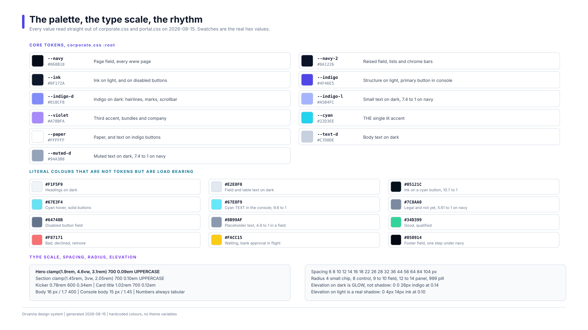
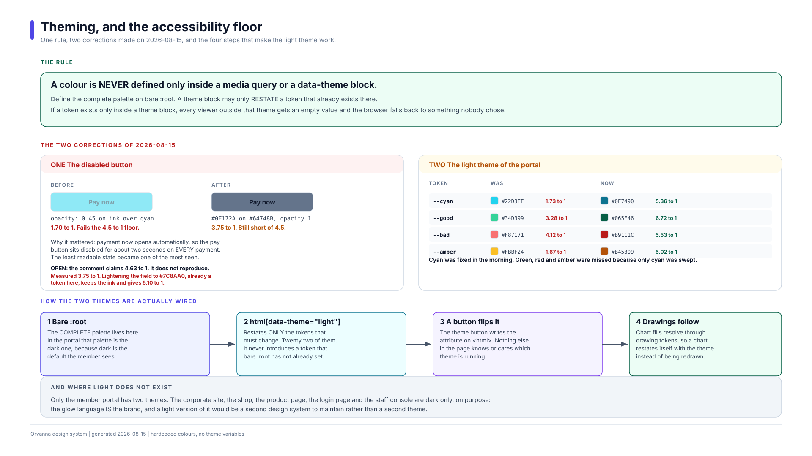
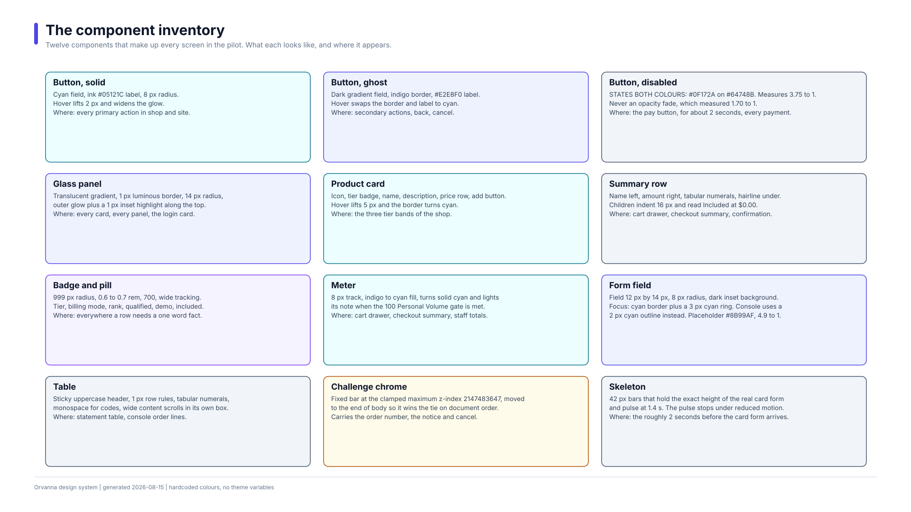

# 07  The Orvanna design system

Owner: the designer on the Orvanna builder team.
Read from the real stylesheets on 2026-08-15. Nothing here is aspirational: every
value below was taken out of a file that ships.

Plain path to this document:
`C:\Users\howar\Desktop\Desktop\ORVANNA\DOCUMENTATION\07-DESIGN-SYSTEM.md`

---

## Acronym key

Every acronym used in this document, written out once here so the body can stay
readable.

| Short | Full |
|---|---|
| CSS | Cascading Style Sheets, the language the look is written in |
| SVG | Scalable Vector Graphics, drawings that stay sharp at any size |
| PV | Personal Volume, the points a purchase earns toward a qualified month |
| 3DS | 3-D Secure, the bank approval step some card payments require |
| WCAG | Web Content Accessibility Guidelines, the accessibility standard |
| px | pixels |
| rem | root em, a size relative to the page's base text size |

---

## The picture first



Plain path: `C:\Users\howar\Desktop\Desktop\ORVANNA\DOCUMENTATION\FIGMA-IMPORT\05-design-tokens.svg`

Seven boards accompany this document. They are the visual half of it, and each one
is a 1920 by 1080 board that drops straight into Figma or into Snagit.

| Board | Shows |
|---|---|
| `01-system-flow.svg` | The whole system: three lanes of user over one shared foundation |
| `02-shop-purchase-flow.svg` | The shop and the checkout, including the bank approval branch |
| `03-member-portal-flow.svg` | The member portal |
| `04-staff-console-flow.svg` | The staff call console |
| `05-design-tokens.svg` | The palette, the type scale, the rhythm |
| `06-component-inventory.svg` | The twelve components |
| `07-theming-and-contrast.svg` | Theming, and the accessibility corrections |

All seven live in `FIGMA-IMPORT\`, with import instructions in that folder's
`README.md`.

---

## Where the design system physically lives

There is no design tool that is the source of truth. The stylesheets are.

| File | Plain path | What it owns |
|---|---|---|
| `corporate.css` | `...\MLM-PILOT\www\css\corporate.css` | The tokens, the glass panel, buttons, navigation, form fields, the footer, the login card, the team page |
| `shop.css` | `...\MLM-PILOT\www\css\shop.css` | Catalog cards, the cart drawer, the Personal Volume meter, the four step checkout, the product page, the bank approval chrome |
| `staff.css` | `...\MLM-PILOT\www\css\staff.css` | The staff call console: denser spacing, work fields, the read aloud confirmation |
| `portal.css` | `...\MLM-PILOT\site\css\portal.css` | The member portal, and the only light theme in the system |

`shop.css` and `staff.css` both load **after** `corporate.css` and inherit its tokens.
`portal.css` is standalone and declares its own palette, which is why it is the only
file that can carry a second theme.

---

## 1  The colour palette

### 1.1  Core tokens

Declared on `:root` in `corporate.css`. These drive the corporate site, the shop, the
product page, the login page, the team page and the staff console.

| Token | Hex | Role | Where it is used |
|---|---|---|---|
| `--navy` | `#060B18` | Page field | The background of every page under `www\`. Deliberately deeper than ink, so ink can sit on top of it as a raised surface |
| `--navy-2` | `#0A1226` | Raised field | The staff lookup dropdown, the bank approval chrome bar |
| `--ink` | `#0F172A` | Ink | Text on light surfaces, and the label on a disabled button |
| `--indigo` | `#4F46E5` | Structural indigo | The primary button in the staff console, the accent bar gradient start, the level 1 fill |
| `--indigo-d` | `#818CF8` | Indigo on dark | Hairlines, hexagon marks, the scrollbar thumb, panel borders |
| `--indigo-l` | `#A5B4FC` | Light indigo | Small text on dark: field labels, card descriptions, member roles |
| `--violet` | `#A78BFA` | Third accent | Bundle badges, the Company section, violet glow bands |
| `--cyan` | `#22D3EE` | The single lit accent | Primary buttons, the meter fill, prices in Personal Volume, every "this is the live one" signal |
| `--paper` | `#FFFFFF` | Paper | Emphasis text on dark, and the label on an indigo button |
| `--text-d` | `#C7D0DE` | Body on dark | Body copy across every dark surface |
| `--muted-d` | `#94A3B8` | Muted on dark | Secondary and explanatory text |
| `--hairline` | `rgba(129, 140, 248, 0.18)` | Luminous 1 px border | The border on nearly every panel, divider and chip |
| `--glass-bg` | `linear-gradient(165deg, rgba(30,41,59,0.62), rgba(13,20,38,0.44))` | Glass fill | The translucent fill behind every panel |
| `--maxw` | `1100px` | Content width | Marketing and shop content |

Cyan is the one loud colour. Indigo, violet and cyan glows may coexist in a band, but
cyan always stays the brightest thing on screen. That is what makes it read as "act
here".

### 1.2  Colours that are not tokens but are load bearing

These appear as literal hex values in the stylesheets. They are not named, but
changing one would break something, so they are pinned here.

| Hex | Role | Measured contrast |
|---|---|---|
| `#F1F5F9` | Every heading on a dark surface | High |
| `#E2E8F0` | Text inside form fields and table cells | High |
| `#05121C` | The label on a cyan button | 10.7 to 1 |
| `#67E3F4` | Hover state of a solid cyan button | High |
| `#67E8F9` | Cyan used as text in the staff console | 9.6 to 1 on navy |
| `#7C8AA0` | Legal text, and navigation items marked not yet | 5.61 to 1 on navy, 5.48 to 1 over the strongest glow wash |
| `#8B99AF` | Placeholder text inside a field | 4.9 to 1 |
| `#64748B` | The field of a disabled button | see section 5.3 |
| `#34D399` `#6EE7B7` | Good, qualified | High |
| `#F87171` `#FCA5A5` `#FECACA` | Declined, remove, error | 8.6 to 1 for `#FCA5A5` on navy |
| `#FACC15` `#FDE68A` | Waiting on a bank approval | High |
| `#050914` | The footer field, one step under navy | n/a, a background |
| `#10192E` and `#818CF8` | Staff scrollbar track and thumb | 5.9 to 1, so the staffer can see and grab it |

`#7C8AA0` has a history worth keeping. The not yet navigation items were originally
`#64748B`, which measured 4.13 to 1 against the navigation field and therefore failed
the 4.5 to 1 floor. `#7C8AA0` fixes that while staying visibly quieter than the live
links, which measure 7.66 to 1 for Sign In and 12.64 to 1 for the ordinary links. The
muted register survived the fix, which is the point: accessibility did not flatten the
hierarchy.

### 1.3  The payment method buttons

Four buttons in the checkout use their own colours. They are deliberately
**branded-style, not branded**: our own generic marks, no copied logos.

| Class | Field | Label |
|---|---|---|
| `.pay-applepay` | `#05070B` | `#F8FAFC` |
| `.pay-googlepay` | `#F8FAFC` | `#1F2937` |
| `.pay-paypal` | `#17357C` | `#F8FAFC` |
| `.pay-card` | `rgba(34, 211, 238, 0.08)` | `#E2E8F0` |

### 1.4  The accessibility corrections of 2026-08-15

Two separate corrections landed on the same day. Board 07 draws them.



Plain path: `C:\Users\howar\Desktop\Desktop\ORVANNA\DOCUMENTATION\FIGMA-IMPORT\07-theming-and-contrast.svg`

**Correction one, the disabled button.** Disabled buttons used to be dimmed with
`opacity: 0.45`. Opacity fades the ink and the background together, so a button
designed as dark ink on cyan collapsed to **1.70 to 1**. That was tolerable while
disabled buttons were rare. It stopped being tolerable when the payment step began
opening automatically: the Pay button now sits disabled for roughly two seconds on
*every* payment, so the least readable state in the system became one of the most
frequently seen.

The fix was to state both colours explicitly instead of dimming:

```css
.btn:disabled {
  background: #64748B;
  border-color: #64748B;
  color: #0F172A;
  opacity: 1;
}
```

The same change was made to `.btn-addline` and `.btn-place` in the staff console,
which had collapsed to 3.84 to 1 and 3.72 to 1.

The principle is right and worth keeping as a rule: **disabled is a state, not a
dimmer.** State both colours, so the contrast is a decision rather than a side
effect.

> **Open issue, found while writing this document.** The code comment records the new
> pairing as 4.63 to 1. That figure does not reproduce. `#0F172A` on `#64748B`
> measures **3.75 to 1**, which is still below the 4.5 to 1 floor the same comment
> invokes. The change was a large real improvement, from 1.70 to 3.75, but it did not
> land where it claims to have landed.
>
> Two honest qualifiers. WCAG 1.4.3 explicitly exempts inactive controls from the
> contrast minimum, so this is not a standards violation. But the team set 4.5 to 1
> as its own floor and believes it has been met, and the reasoning for caring, that
> the state is now seen on every payment, argues for actually meeting it.
>
> The cheapest fix keeps the ink and lightens the field to `#7C8AA0`, a colour already
> in this system, which measures **5.10 to 1**. This is a code change, so it belongs
> to the builder and the two gates rather than to this document. It has been raised
> separately.

**Correction two, the light theme of the portal.** Four tokens carried text at
contrast ratios that failed on light backgrounds. Cyan was found and fixed in the
morning. Green, red and amber were missed in that first pass because only cyan was
swept, and were fixed later the same day.

| Token | Was | Measured before | Now | Measured after |
|---|---|---|---|---|
| `--cyan` | `#22D3EE` | 1.73 to 1.81 to 1 | `#0E7490` | 5.36 to 1 on white, 4.89 to 1 on the page field |
| `--good` | `#34D399` | 3.28 to 1 on its tinted chip | `#065F46` | 6.72 to 1 on the chip, 7.34 to 1 on the page |
| `--bad` | `#F87171` | 4.12 to 1 on its tinted chip | `#B91C1C` | 5.53 to 1 |
| `--amber` | `#FBBF24` | 1.67 to 1 on white | `#B45309` | 5.02 to 1 on white, 4.58 to 1 on the page field |

The lesson recorded in the stylesheet is the valuable part: **sweep the whole palette,
never one token.** The cyan fix was correct and complete for cyan, and that is exactly
why the other three survived. A single-token sweep finds a single token.

A second lesson sits underneath it. The green and red were drawn on **tinted chips**,
not on the page background, and the lighter pair had only ever been checked against
the page. Check a colour against the surface it actually sits on, composited, not
against the surface you assume.

### 1.5  One case where recolouring the text could not work

In the portal's Earnings Mix bar, the level label sits directly on a coloured segment,
and the five level fills run from dark indigo to near white. On the level 2 fill
`#6366F1`, white measures 4.47 to 1 and near-black measures 4.00 to 1. Both fail, and
there is no third colour that passes on every fill.

The solution was to stop trying. The label carries its own near-opaque dark chip,
`rgba(15, 23, 42, 0.85)`, which makes contrast a property of the chip rather than of
whichever fill happens to be underneath. Worst case, white on the chip over the
lightest fill, measures about 12.5 to 1.

This is the general escape hatch: when text must sit on an unpredictable background,
give the text its own background.

---

## 2  Typography

One family for everything, one monospace family for anything that has to be read
character by character.

| Purpose | Stack |
|---|---|
| Body | `"Segoe UI", "Segoe UI Variable Text", system-ui, -apple-system, sans-serif` |
| Codes and numbers | `Consolas, "Cascadia Mono", "Courier New", monospace` |

No web font is downloaded. The pages work from `file://` and from a static server with
no network, which is a deliberate constraint of the pilot.

Monospace is not decoration. It appears exactly where a human has to transcribe or
speak a string: member codes, order numbers, agent names on the team page, keyboard
hints, and the read aloud confirmation.

### 2.1  The scale

| Role | Size | Weight | Tracking | Case |
|---|---|---|---|---|
| Hero title | `clamp(1.9rem, 4.6vw, 3.1rem)` | 700 | 0.09em | UPPERCASE |
| Section title | `clamp(1.45rem, 3vw, 2.05rem)` | 700 | 0.10em | UPPERCASE |
| Page title | `1.25` to `1.35rem` | 700 | 0.12em | UPPERCASE |
| Product name, on its page | `clamp(1.5rem, 3.4vw, 2.2rem)` | 700 | 0.09em | UPPERCASE |
| Card title | `1.02rem` | 700 | 0.12em | UPPERCASE |
| Kicker | `0.78rem` | 600 | 0.34em | UPPERCASE |
| Button | `0.86rem` | 650 | 0.14em | UPPERCASE |
| Body | `16px`, line height 1.7 | 400 | normal | sentence |
| Console body | `15px`, line height 1.45 | 400 | normal | sentence |
| Small print | `0.74` to `0.82rem` | 400 to 600 | 0.02em | sentence |
| Badge | `0.6` to `0.7rem` | 700 | 0.14 to 0.22em | UPPERCASE |
| Read aloud order number | `clamp(1.6rem, 3.4vw, 2.3rem)` | 700 | 0.06em | monospace |

Three things hold this together:

- **Tracking rises as size falls.** The kicker at `0.78rem` carries 0.34em, the widest
  in the system; the hero at up to `3.1rem` carries 0.09em. Small uppercase text
  needs air or it becomes a smudge.
- **Button weight is 650**, not 600 and not 700. It sits deliberately between medium
  and bold so a button reads as firmer than a label without shouting.
- **Numbers are always tabular.** `font-variant-numeric: tabular-nums` is set on every
  price, total, quantity, volume figure and statement cell, so digits line up in a
  column and a changing total does not make the layout twitch.

Body line height is 1.7 on marketing surfaces and 1.45 in the console. Reading and
scanning are different jobs.

---

## 3  Spacing, radius and elevation

### 3.1  Spacing

The rhythm actually used, in pixels:

`6  8  10  12  14  16  18  22  26  28  32  36  44  56  64  84  104`

It is not a strict multiple-of-eight scale, and pretending otherwise would be a lie
about the code. It is a practical ladder with a clear split by surface:

| Surface | Section padding | Panel padding | Grid gap |
|---|---|---|---|
| Marketing bands | 104px, dropping to 72px under 760px | 30 to 36px | 28px |
| Shop tiers | 64px | 28 to 32px | 28px |
| Checkout panels | 72px | 30 to 34px | 36px |
| Staff console | 18px | 16 to 18px | 10 to 16px |
| Member portal | 20px | 12 to 20px | 8 to 24px |

The console is roughly half the marketing dose everywhere. That is the single biggest
reason it feels like a tool rather than a page.

### 3.2  Radius

| Radius | Used for |
|---|---|
| 4px | Small chips, keyboard hints |
| 8px | Buttons, payment method buttons, small fields |
| 9px | Console fields, list rows, choice cards |
| 10px | Larger fields, option cards, stat cards |
| 12px | Console panels, chart boxes |
| 14px | Glass panels on marketing surfaces |
| 999px | Badges, pills, meters, quantity groups, the cart count, avatar rings |

The rule of thumb: the bigger the surface, the softer the corner, up to 14px. Anything
that is conceptually a token or a switch goes fully round at 999px.

### 3.3  Elevation

Elevation is expressed differently in the two worlds, and this is intentional.

**On dark surfaces, elevation is glow.** A shadow on near-black is invisible, so
raised things emit light instead:

```css
box-shadow: 0 0 26px rgba(79, 70, 229, 0.14),   /* the outer glow    */
            inset 0 1px 0 rgba(255, 255, 255, 0.05);  /* a lit top edge */
```

The inset highlight along the top edge is what actually sells the effect: it reads as
a light source above the panel.

Three glow flavours exist, and hover always widens the glow rather than moving the
shadow:

| Flavour | Value |
|---|---|
| Indigo, the default | `0 0 26px rgba(79, 70, 229, 0.14)` |
| Cyan, for the lit ones | `0 0 26px rgba(34, 211, 238, 0.12)` |
| Violet, for the third accent | `0 0 26px rgba(167, 139, 250, 0.13)` |

**On the light theme, elevation is a real shadow:** `0 4px 14px rgba(15, 23, 42, 0.10)`.
Glow on white looks like a printing fault.

**Motion that accompanies elevation:** hover lifts a card by 5 to 6 pixels over 0.2s,
and lifts a button by 1 to 2 pixels over 0.16s. Every transition in the system is CSS
only. There is no animation loop anywhere in the portal, so there is no timer left
running when the tab is hidden. Under `prefers-reduced-motion: reduce`, all
transitions and animations are switched off globally and revealed content is forced
visible, so nothing can be left invisible by a disabled animation.

---

## 4  The component inventory



Plain path: `C:\Users\howar\Desktop\Desktop\ORVANNA\DOCUMENTATION\FIGMA-IMPORT\06-component-inventory.svg`

### 4.1  Buttons

| Variant | Looks like | Appears in |
|---|---|---|
| `.btn-solid` | Cyan field, `#05121C` ink, 8px radius, cyan glow. Hover brightens to `#67E3F4`, lifts 2px, widens the glow | Every primary action: Checkout, Place order, Sign in, the hero call to action |
| `.btn-ghost` | Dark gradient field, indigo border, `#E2E8F0` label. Hover swaps border and label to cyan | Secondary actions: Back to cart, Cancel, the second hero button |
| `.btn-add` | Full width, translucent cyan field, 1.5px cyan border. On hover fills solid cyan; on success the label swaps to a tick and the field stays solid | Every product card, and the product page |
| `.btn-newcall` | Solid cyan, `#0B1120` label, 10.7 to 1 | The staff console top bar |
| `.btn-addline`, `.btn-place` | Solid indigo, white label | The staff console. Indigo, not cyan, because the console is a different register |
| `.btn:disabled` | States both colours: `#0F172A` on `#64748B`, opacity 1. Never a dimmer | The Pay button while the payment opens, and any incomplete form |
| `.link-btn`, `.back-to-shop` | No field at all, uppercase, wide tracking, muted. Hover turns cyan and adds a glow | Inline navigation inside the checkout |

One trap is documented directly in the code and worth repeating. `.btn` is used on
both `<a>` and `<button>`. A bare `<button>` brings the browser's own widget styling,
a light grey field and the system font, and none of it is reset by the variant
classes. `font: inherit`, `background: transparent` and `color: inherit` are set on
`.btn` itself for exactly that reason. The ghost buttons once shipped as light pills
with light text because this was missing.

### 4.2  Cards and panels

**The glass panel** is the base recipe everything else extends:

```css
.glass {
  background: var(--glass-bg);
  border: 1px solid rgba(129, 140, 248, 0.26);
  border-radius: 14px;
  box-shadow: 0 0 26px rgba(79, 70, 229, 0.14),
              inset 0 1px 0 rgba(255, 255, 255, 0.05);
  backdrop-filter: blur(9px);
}
```

`.glass-cyan` and `.glass-violet` restate the border and the glow in the other two
accents. `.accent-bar` adds a 2px gradient bar across a panel top, inset 22px from
each edge.

| Card | Contents | Appears in |
|---|---|---|
| Product card | Icon, tier badge, name, description, price row, Personal Volume figure, add button | The three tier bands of the shop |
| Pillar and feature card | Icon, title, coloured description, body | The corporate site |
| Metric tile | Large cyan number with a glow, uppercase label | The corporate overview band |
| Member and leader card | Mark, name, role, biography, role tag | The team page |
| Stat card | Uppercase label, large tabular number, note | The portal and the console snapshot |
| Confirmation card | Badge, title, order number, summary, notes | The shop confirmation and resume views |
| Console panel | Uppercase title, optional chip, dense body | Every panel in the staff console |

Console panels differ from marketing panels in one structural way: `overflow: visible`,
because the lookup dropdown has to escape its panel. The lookup panel also carries a
`z-index` so the open list overlays the snapshot panel instead of sliding underneath.

### 4.3  Summary rows

The row pattern used wherever money is listed.

- Name on the left, amount on the right, a 1px hairline underneath.
- Amounts always tabular, `white-space: nowrap`, so nothing wraps mid figure.
- The main total is a step larger, `1.15rem` against `0.95rem`.
- Personal Volume totals are cyan with a text glow; money totals are `#F1F5F9`.
- **Child rows** indent. A bundle or pack shows one indented row per included agent,
  each at `$0.00` and tagged Included. In the cart drawer the children indent 54px,
  which is exactly the 40px icon plus the 14px gap, so a child aligns under its
  parent's name rather than under its icon. The parent line hands its divider down to
  the children block so the group reads as one unit.

Appears in: the cart drawer, the checkout summary, the confirmation summary, and the
console totals box.

### 4.4  Badges and pills

All share the shape: 999px radius, `0.6` to `0.7rem`, weight 700, wide tracking,
uppercase, `white-space: nowrap`.

| Badge | Meaning | Colour |
|---|---|---|
| Tier badge | Which catalog tier | Indigo, cyan for domain, violet for bundle |
| Mode badge | Subscription or one time | Cyan for subscription, indigo for one time |
| Rank chip | Member rank | Member muted, Builder indigo, Leader cyan, Director amber, Executive violet |
| Qualified pill | Qualified or not | Green on a tinted green chip, red on a tinted red chip |
| Demo pill | This is a demonstration | Cyan outline |
| Child tag | Included at no charge | Indigo outline |
| Soon pill | Not built yet | `#7C8AA0` outline |
| Role tag | Human or agent | Cyan for the one human, indigo for the nine agents |

In the portal the rank badges are outline plus text. In the console they are solid
fills with dark text, because a staffer glances at a snapshot for under a second and a
filled chip is faster to read than an outlined one.

### 4.5  The bank approval chrome

The most unusual component in the system, and the one with the most instructive bug.

It is a fixed bar pinned to the top of the viewport, above the bank's own full screen
approval frame. It carries the order number, a plain statement of what is happening,
and a cancel control.

The bug: the payment widget paints its bank frame with an inline `z-index` of
`422222133323`. That looks unbeatable, but browsers clamp `z-index` to a signed 32 bit
integer, so it actually lands at `2147483647`, the maximum. The chrome bar therefore
**matches** the maximum rather than trying to exceed it, and the opening function
moves the element to the end of `<body>` so that, at equal `z-index`, the later element
in document order paints on top.

Both halves are required. With the earlier value of `2147483000` the bar rendered
*behind* the bank frame, which meant the order number, the test mode notice and the
cancel button were all invisible at precisely the moment they mattered. It was found
on 2026-08-15, before the approval had ever fired in front of a real shopper.

The shop version borders cyan. The console version borders amber, because in the
console a bank approval is a waiting state the agent cannot resolve.

A related component: `body.payment-in-flight` genuinely disables the quantity, remove
and pay controls while a payment is live, rather than only appearing to.

### 4.6  Form fields

| Property | Marketing and shop | Staff console |
|---|---|---|
| Padding | 12px by 14px | 8 to 10px |
| Radius | 8px | 8 to 9px |
| Field | `rgba(6, 11, 24, 0.6)` | `rgba(6, 11, 24, 0.6)` to `0.7` |
| Border | `rgba(129, 140, 248, 0.3)` | `rgba(129, 140, 248, 0.3)` to `0.35` |
| Text | `#E2E8F0` | `#F1F5F9` |
| Placeholder | `#8B99AF`, 4.9 to 1 | `#8B99AF` |
| Focus | Cyan border plus a 3px cyan ring and an outer glow | A 2px cyan outline at 1px offset |

Field labels are `0.74rem`, weight 600, tracking 0.18em, in `--indigo-l`.

Two field variants carry meaning of their own. The tax identifier row uses a **dashed**
indigo border to mark it as optional. The delivery option is a full width choice card,
not a bare radio: hovering brightens the border, and the selected card gets a cyan
border, a cyan tint and a glow, driven by `:has(input:checked)`.

The card form skeleton deserves its own line. While the server opens the payment,
which measures about two seconds, a skeleton holds the **exact** vertical space the
real card form will occupy, so nothing jumps when it arrives, and a caption says
plainly what is happening. It pulses at 1.4s, and the pulse stops entirely under
reduced motion.

### 4.7  Tables

Two tables exist: the statement table in the portal, and the order lines table in the
console.

Shared rules:

- Header is uppercase, `0.66` to `0.72rem`, weight 700, tracking 0.09em, muted.
- The statement header is **sticky**, so the column meanings survive a long scroll.
- Rows are separated by 1px hairlines, never by fills.
- Every number is tabular and right aligned.
- Codes are monospace, in `--indigo-soft`.
- Row hover tints the row rather than outlining it.
- Wide content scrolls **inside its own container**, never by making the page scroll
  sideways.

The console table folds on phones: under 620px the mode column is hidden and the mode
tag moves inline next to the product name, so no information is lost, only rearranged.

### 4.8  Meters

An 8px track with a 999px radius and an indigo to cyan gradient fill. On reaching the
100 Personal Volume gate, the fill turns solid cyan, the glow strengthens, and the
note under it lights up and goes bold. In the console the qualified state turns green
instead, matching the console's chip language.

The portal has a stricter sibling. On the Gate Board the **open, unmet part of the
scale is hatched, never filled**, so an unmet gap can never be mistaken for progress.

---

## 5  Theming

### 5.1  What has a light theme, and what does not

Only the member portal. The corporate site, the shop, the product page, the login page
and the staff console are dark only, deliberately: the glow language *is* the brand,
and a light version of it would be a second design system to maintain rather than a
second theme.

### 5.2  How the two themes are wired

Four steps, drawn on board 07:

1. **Bare `:root` holds the complete palette.** In `portal.css` that palette is the
   dark one, because dark is what the member sees by default.
2. **`html[data-theme="light"]` restates only what must change**, twenty two tokens.
   It never introduces a token that bare `:root` has not already declared.
3. **A button writes the attribute on `<html>`.** Nothing else in the page knows or
   cares which theme is running.
4. **Drawings follow automatically.** Every fill inside a chart resolves through a
   drawing token, `--c-own`, `--c-cust`, `--c-earn`, `--c-rule`, `--c-hatch`, `--mark`,
   `--mark-lit`, so a chart restates itself with the theme instead of being redrawn.

### 5.3  The rule

> **A colour is never defined only inside a media query or a `data-theme` block.**

Define the complete palette on bare `:root`. A theme block may only **restate** a
token that already exists there.

The reason is mechanical. If a token exists only inside a theme block, every viewer
outside that theme resolves it to an empty value, and the browser falls back to
something nobody chose: an inherited colour, or black. The failure is silent, and it
appears only for the users who are not in the theme you were testing.

Two corollaries earned on 2026-08-15:

- **Sweep the whole palette, never one token.** Fixing cyan alone is what let green,
  red and amber survive.
- **Measure against the surface the colour actually sits on, composited.** Green and
  red are drawn on tinted chips, not on the page background, and checking them against
  the page is what hid the problem.

### 5.4  The accessibility floor

4.5 to 1 for body text and for any interactive text. The stylesheets annotate
individual colours with their measured ratio at the point of use, which is a habit
worth keeping: it makes a later reviewer's job possible without re-measuring
everything.

One correction to that record is noted in section 1.4: the disabled button pairing is
annotated as 4.63 to 1 and measures 3.75 to 1. Annotating a ratio is only useful if the
annotation is right, so the habit is good and this particular number needs redoing.

---

## 6  The logo and the brand assets

### 6.1  The decision

Decided 2026-08-13. Direction B won: the **Hex Team badge** with an engineered
uppercase wordmark. Five concepts were drawn; the other four are archived in
`ORVANNA\brand\`. The Network Ring concept is reserved as an interior motif for the
My Team tree page and should not be used as a logo.

### 6.2  What the mark is made of

A hexagon drawn as a monoline outline, with three satellite nodes connected to a
central hub. The hub is cyan; everything else is indigo. That is the whole idea of the
company in one drawing: a team of agents around a coordinating centre, and the lit
node is the live one.

All lettering is drawn as **pure paths**. No font needs to be installed anywhere for
the logo to render correctly, on any machine, forever.

### 6.3  The files

Master copies live in `ORVANNA\brand\`. Plain path:
`C:\Users\howar\Desktop\Desktop\ORVANNA\brand\`

| File | Use | Notes |
|---|---|---|
| `logo-final-primary.svg` | Light backgrounds: documents, light pages | Ink wordmark |
| `logo-final-dark.svg` | Dark backgrounds | |
| `logo-header-dark.svg` | Site header | Transparent background, dark theme colours. Hexagon and nodes `#818CF8`, hub `#22D3EE`, wordmark `#FFFFFF` |
| `icon-square.svg` | Application icon | 128 grid, indigo tile |
| `favicon.svg` | Browser tab | Hexagon and lit hub only. `#4F46E5` tile at 14 radius, white hexagon at 6.5 stroke, `#22D3EE` hub. Drawn to read at 16px |

Deployed copies sit in `MLM-PILOT\www\assets\` and `MLM-PILOT\site\assets\`. They are
copies, not the masters. If the mark changes, change `brand\` first and then
re-copy.

### 6.4  Rules for using it

- **Every page carries the favicon.** No exceptions.
- **Use the correct variant for the background.** `logo-header-dark.svg` on dark,
  `logo-final-primary.svg` on light. Never recolour a variant by hand; use the file
  that already exists.
- **Sizes in use.** Site header 30px tall, portal header 40px dropping to 32px under
  720px, staff console 24px, login page 34px. Always set the height and let the width
  follow; never set both.
- **Never stretch, rotate, or re-space the wordmark.** The tracking is part of the
  drawing.
- **The hub stays cyan.** It is the single lit node, and it is the same idea as cyan
  being the single lit accent in the interface. Recolouring the hub breaks the
  connection between the mark and the product.
- **Do not place the mark on a busy background.** The monoline stroke is thin by
  design. It needs a flat field.
- **The photograph `hk.jpg`** in `www\assets\` is Howard's own and is not part of the
  brand system.

### 6.5  Guardrail

Orvanna is Howard's personal brand. No employer names, copy, imagery or distinctive
trade dress from anyone else appears in it, and none may be added. Public sites may
inspire structure only. The payment method buttons in section 1.3 are the live example
of how that line is held: branded-style, using our own generic marks, never a copied
logo.

---

## 7  The Figma deliverable, and which route was taken

Howard asked for a Figma flow of the whole system and of each function, and asked
plainly that no Figma file be claimed unless it was actually created.

**The Figma connection was authorised in this session, so the real file was built.**

**Figma board:** https://www.figma.com/board/m4qgXgmSqjOjLTuhflVj5L
Named *Orvanna System Flows and Design System*, in the `howardk` team.

It contains five sections, built object by object with real connectors and real
editable text:

| Section | Covers |
|---|---|
| `01  The whole system` | Three lanes of user, seven steps each, one shared foundation |
| `02  Function, the shop and the checkout` | The seven step happy path and the bank approval branch |
| `03  Function, the member portal` | Sign in, the Office, the five boards, the five tabs |
| `04  Function, the staff call console` | Six call steps and the three rule cards |
| `05  The palette and the rhythm` | Swatches, corrections, the type and spacing scale |

It also contains **28 real Figma colour variables** in a collection called
`Orvanna colour`, with two modes named `Dark` and `Light`. Switching the mode switches
every bound colour, which is the same mechanism the real portal uses. No plugin is
needed to use them.

**And the drag-in pack was built as well**, because a live Figma file and a portable
file are different kinds of useful. `DOCUMENTATION\FIGMA-IMPORT\` holds all seven
boards as clean layered SVG at 1920 by 1080, plus `design-tokens.json` in the Design
Tokens Community Group format that Figma variable importer plugins read, plus a
`README.md` with step by step import instructions and an honest account of what the
import will and will not give you.

The seven boards are generated rather than hand drawn, by
`FIGMA-IMPORT\build_figma_boards.py`, so they can be rebuilt when the design changes
instead of drifting away from the code.

Boards 06 and 07, the component inventory and the theming rules, exist **only** as
SVG. They were not rebuilt in Figma because they read better as reference sheets than
as flows. They import in one drag if they are ever wanted there.

There is a separate, older FigJam board called **The Whole Machine**, built
2026-08-13 and listed in `MLM-PILOT\docs\FIGMA-VISUAL-PACK.md`. It is untouched. That
board explains the business, product and factory side by side. This new file explains
the build. They are companions, not replacements.

---

## 8  Open items

| Item | Detail |
|---|---|
| Disabled button contrast | Annotated as 4.63 to 1, measures 3.75 to 1, floor is 4.5 to 1. Field `#7C8AA0` would give 5.10 to 1. Affects `.btn:disabled` in `shop.css` and `.btn-addline` and `.btn-place` in `staff.css`. Raised as a separate task |
| Contrast annotations | The habit of annotating measured ratios in the stylesheets is good and should continue, but the annotations should be regenerated from a measuring script rather than typed by hand |
| Boards 06 and 07 not in Figma | The component inventory and the theming board exist only as SVG. They import in one drag if they are ever wanted in the Figma file |

---

*Read from the shipping stylesheets on 2026-08-15. Where this document and the code
disagree, the code is what users experience; treat the disagreement as a defect in one
of them and say which.*
