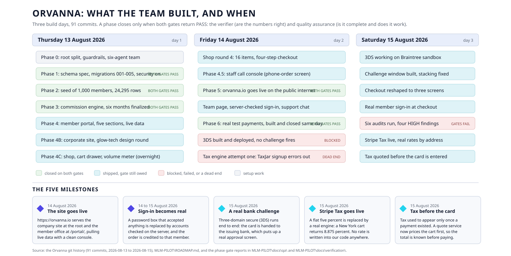

# 08. The team, and what we built

> As of 2026-08-15. Written by the project historian.
> Plain path: `C:\Users\howar\Desktop\Desktop\ORVANNA\DOCUMENTATION\08-TEAM-AND-WHAT-WE-BUILT.md`

**Acronym key, expanded once here so the rest reads cleanly.** Quality Assurance (QA).
Chief Information Officer (CIO). Three-domain secure (3DS), the card networks' identity
check, also written 3-D Secure by its own standards body. Structured Query Language (SQL).
Row-Level Security (RLS), a database feature that decides which rows a caller may see.
Application Programming Interface (API). Software Development Kit (SDK). Personal
Volume (PV). Sales Volume (SV). Team Volume (TV). Scalable Vector Graphics (SVG).
Document Object Model (DOM), the browser's live picture of a page. Mail Order or
Telephone Order (MOTO). Domain Name System (DNS). Hypertext Transfer Protocol (HTTP).

---

## The picture first

Plain path to the diagram:
`C:\Users\howar\Desktop\Desktop\ORVANNA\DOCUMENTATION\diagrams\project-timeline.svg`

---

## How this document decides who did what

Every commit in this repository is authored by one git identity, Howard's, with two
different co-author trailers. So the git author field proves nothing about which
specialist did which piece. Attribution in this document comes from three harder
sources, in this order:

1. **The charter files** in `C:\Users\howar\Desktop\Desktop\ORVANNA\.claude\agents\`,
   which state what each role is allowed to touch. The architect, for example, has no
   Edit tool at all, so no production code can be his.
2. **The reports themselves**, which name their author on line 3 or 4. Six of the seven
   audit and verdict documents do this.
3. **The commit messages and the roadmap**, which name the phase and often the role.

Where none of those three sources names a role, this document says so rather than
guessing. Two significant bodies of work fall into that gap and are flagged in place.

---

## 1. The team

Nine roles work on Orvanna: one coordinator and eight specialists. A tenth agent exists
but is a product, not a builder, and is listed separately below.

**The coordinator: Fable, Chief Information Officer (CIO).** Runs the team on Howard's
behalf. Writes the specialists' charters, sequences the phases, briefs every build,
routes every result through both verification gates, and owns the deployment pipeline,
meaning the domain, the hosting, and the database connection. Makes the calls Howard has
delegated and brings him the ones he has not. The rule the CIO enforces above all others
is that the builder never grades its own work. Title granted by Howard on 2026-08-14, the
day the site went live. Source:
`C:\Users\howar\Desktop\Desktop\ORVANNA\LIBRARY\company\TEAM-PROFILE.md`.

**The eight specialists**, arranged on a three-team model: one Planner, four Builders,
two Verifiers, and one Builder who joined later for words.

| Role | Team | Responsible for | What that means in plain English |
|---|---|---|---|
| **mlm-architect** (the architect) | Planner | The rulebook. Database schema specification, compensation plan specification, and one dated decision document per architectural choice. | Turns "I want X" into instructions precise enough that two people who never speak to each other can build it and reach the same number. Writes no production code at all: his tool list is read, search, and write, with no edit. Every specification must carry a worked example, a small tree hand-computed to the cent, so the builder and the verifier have a shared target. |
| **mlm-db-engineer** (the database engineer) | Builder | The database. Numbered SQL migrations, row-level security on every table from the first migration, the views the public site reads, and the synthetic seed generator. | Builds and protects the store of record. Row-level security on from day one means the public website can only ever read through prepared views that expose no raw tables and no synthetic email addresses. The seed generator is deterministic: it records the random seed value it used, so the verifier can regenerate the same 1,000 members byte for byte and prove nothing was hand-edited. |
| **mlm-comp-engineer** (the compensation engineer) | Builder | The money. The monthly volume rollup, rank qualification, and the commission run that produces an auditable statement for every member. | Writes the engine that decides who gets paid what. It lives inside the database rather than in the website, so the site and the verifier read the same truth. A commission run is a versioned batch with an identity, a period, a specification version, and a status; once a run is marked final its statement lines can never change, and a rerun creates a new run instead of editing the old one. Determinism is the contract: the same data plus the same specification version must produce identical output to the cent. |
| **mlm-site-builder** (the site builder) | Builder | The member portal and the data wiring. Plain HTML, CSS, and JavaScript reading the database views through the public key only. | Builds the screens a member opens and connects them to real data. Owns how data gets wired, where the designer owns how it looks. Every page must footer its data basis, saying plainly that the numbers are synthetic demonstration data for a named period and run. Must verify in a real browser before reporting done. |
| **mlm-qa** (quality assurance) | Verifier | The completeness gate. An acceptance checklist per phase, requirements traced to real artifacts, and end to end functional testing. | Asks a different question from the verifier: not "are the numbers right" but "was everything that was promised actually built, and does it work". The method that makes this honest is the ordering rule: build the checklist from the promises **before** looking at any deliverable, so the grading cannot drift toward what happened to get built. A checklist row without evidence is a FAIL, not a benefit of the doubt. |
| **mlm-verifier** (the verifier) | Verifier | The correctness gate. Independent recomputation of the money, tree integrity, security posture, and truthfulness of anything shown to a user. | The adversary. Recomputes a full commission period from the specification prose, using its own SQL or Python, never the engine's code, and compares to the cent. Checks that the public key cannot read past the demonstration views. Files a verdict with findings ranked HIGH, MEDIUM, and LOW, and fixes nothing. |
| **orvanna-designer** (the designer) | Builder | The look. The corporate site's visual craft, the design system of type, spacing, and colour, SVG illustration and brand motifs, and polish passes on any page a person sees. | Owns how the property looks and feels. Works to a fixed palette and a fixed set of motifs, hexagon badges and connected node networks drawn as inline SVG, never clip art. Accessibility floor is a contrast ratio of 4.5 to 1 for body text. Hired 2026-08-13 at Howard's suggestion when the corporate site build began. |
| **orvanna-writer** (the writer) | Builder | The words. Corporate site copy, all product prose, microcopy, and naming. | Writes believable fiction for a fictional company. Believability comes from specificity, what an agent actually does on a Tuesday, not from adjectives. Four rules are non-negotiable: never an income claim, never fake social proof, only capabilities a skeptical reader would believe software could perform, and every price and volume figure taken from the specification rather than invented. Changes text, never structure: if copy needs a layout change to land, the writer files a request for the designer instead of moving the markup. Hired 2026-08-14 to replace Latin placeholder prose with credible content. |

**The tenth agent, listed for completeness and not part of the eight.**
`orvanna-concierge` is the Support agent that answers visitors in the chat window on the
company site, the member portal, and the staff console. It has no charter file in
`.claude\agents\` because it is configured in Botpress, the hosted chat vendor, and went
live 2026-08-14. It is part of the product, not part of the build team.

---

## 2. What each role actually delivered

### mlm-architect, the architect

| Artifact | Plain path | Evidence |
|---|---|---|
| Database schema specification | `MLM-PILOT\docs\SCHEMA-SPEC.md` | commit `f8093f7`, 2026-08-13 |
| Compensation plan specification, versions 1.0 through 1.3 | `MLM-PILOT\docs\COMP-PLAN-SPEC.md` | `f8093f7` (v1.0, worked example paying 257.60), `24aae36` (v1.1, 264.00), `66250da` (v1.2 customers), `13dd7d1` (v1.3 "Gate it") |
| Genealogy decision record | `MLM-PILOT\docs\decisions\2026-08-13-genealogy-representation.md` | `f8093f7`; adjacency list plus a per-run snapshot, chosen over a closure table |
| Phase 6 payments specification | `MLM-PILOT\docs\PHASE-6-SPEC.md` | `19244b3`, 2026-08-14 |
| 3DS research report | `MLM-PILOT\docs\3DS-RESEARCH.md` | `60ad6fc`, 2026-08-14 |
| Architecture and documentation audit, 724 lines | `MLM-PILOT\docs\decisions\ARCHITECTURE-AUDIT-2026-08-15.md` | `33945a2`; self-identifies as "Author: mlm-architect. Status: REPORT ONLY" |

The audit is the strongest single piece of architect work in the record. It maps every
decision the system makes and marks which ones are made twice, in the browser and on the
server, and which of those duplicates are checked against each other. Three are checked,
one is checked in the shop but not on the staff console, and one, tax exemption, was
decided in the browser and simply accepted by the server. That table is what triggered
the tax rework described in the milestones below.

The architect also produced rulings during Phase 3 that are recorded in commit `be21b82`:
superseded commission runs are frozen rather than deleted, in both directions, and a
stale 50 PV cell in the specification was corrected.

### mlm-db-engineer, the database engineer

| Artifact | Plain path | Evidence |
|---|---|---|
| Migrations 001 to 007 (core tables, integrity triggers, row-level security, ranks, demonstration views, immutability hardening, customers) | `MLM-PILOT\db\migrations\` | Phase 1 and 2 commits, 2026-08-13 |
| Migrations 010, 011, 012, 014 (demonstration orders and rate ledger, view privilege hardening, sign-in accounts, member sign-in accounts) | same folder | `09be630`, `5dcba31`, `9c802a5`, `8238fd2` |
| Seed generator and proof pack | `MLM-PILOT\db\seed\generate_seed.py`, `build_seed_proof.py`, plus 19 output files including the editor part loader | `9d5d995`; 24,295 rows loaded to the cloud |
| Database audit, 611 lines | `MLM-PILOT\docs\verification\DB-AUDIT-2026-08-15.md` | `33945a2`; self-identifies as "Auditor: mlm-db-engineer (read-only inspection)" |

The seed is deterministic and was proved so: the verifier regenerated it from the
recorded seed value and got byte-identical output, which is recorded as a day-one gate
result in the team profile.

The database audit found its own team's record-keeping problems, which is the behaviour
you want from an audit. Migration 013 is applied to the live project and has no file in
the repository, and worse, it was a no-op: it asked for a descending index using a name
that already existed as an ascending index from migration 010, so Postgres skipped it
silently and the ledger now records an intent that never happened.

### mlm-comp-engineer, the compensation engineer

| Artifact | Plain path | Evidence |
|---|---|---|
| The engine itself | `MLM-PILOT\db\comp\001_comp_engine.sql` | `be21b82`, 2026-08-13, "hand-traced to the cent" |
| The worked-example test | `MLM-PILOT\db\comp\002_worked_example_test.sql` | same commit |
| Reset tooling for repeatable runs | `MLM-PILOT\db\comp\003_reset_app_data.sql` | `9d5d995` |
| Six months of finalized commission runs on real cloud Postgres | live database, recorded in `MLM-PILOT\ROADMAP.md` | `9d5d995` then `13dd7d1`; payouts February 11,906.00, March 13,434.00, April 14,636.00, May 16,507.20, June 17,749.20, July 20,669.20, ranks reaching Executive |

This is the most thoroughly proven work on the project. The worked example ran three
times against real Postgres with zero mismatches, and the verifier then recomputed all
six months independently and matched the cloud to the cent, which is what closed Phase 3.

One honest defect against the role's own determinism contract, found by the database
audit: ledger entry 008, the version 1.2 engine, cannot be reproduced from the
repository, because `001_comp_engine.sql` was edited in place to version 1.3 and the
earlier text no longer exists anywhere.

### mlm-site-builder, the site builder

| Artifact | Plain path | Evidence |
|---|---|---|
| The member portal: five sections, seven database views, dark default, member picker, expandable tree | `MLM-PILOT\site\index.html`, `site\js\app.js`, `site\css\portal.css` | `b08dc3b`, 2026-08-13, "zero console errors on live check" |
| Portal connection points into the company site and shop | same files | `ecd98ee` |
| Portal defect fixes for mobile, contrast, and motion | same files | `152851b`, 2026-08-14 |

The portal is roughly 1,481 lines across the page and its script, per the architecture
audit's line census.

**A gap in the record worth stating plainly.** The seven server-side Edge Functions in
`MLM-PILOT\functions\` (create-payment, confirm-payment, payment-webhook,
list-demo-orders, demo-login, quote-tax, record-tax, plus the shared `edge.ts`,
`pricing.ts`, and `tax.ts`) are the largest body of code on the project and **carry no
role attribution anywhere in the commit record**. They were built inside coordinator-run
work packets labelled W1, W2, and W3 in commits `09be630` and `267f749`, and extended
daily thereafter. They are not attributable to the site builder or to any other named
specialist on the evidence available. The same is true of the deployment builder
`MLM-PILOT\deploy\build_dist.py`; the roadmap assigns Phase 5 to "(main session, deploy)",
which is the coordinator.

### orvanna-designer, the designer

| Artifact | Plain path | Evidence |
|---|---|---|
| Five logo concepts, then the locked kit: primary, dark, header, application icon, favicon | `brand\` (11 files) | `6d3ca73` then `a246422`, 2026-08-13 |
| The corporate site: home, shop, product template, team, login, staff console | `MLM-PILOT\www\*.html` | `ab32848`, `22b0b51`, `8eca967`, `4d5f67e`, `9cdf6bf` |
| The design system as three stylesheets | `MLM-PILOT\www\css\corporate.css`, `shop.css`, `staff.css` | same commits |
| The glow-tech redesign: glass panels, a living hero constellation that responds to the cursor, scroll reveals, count-ups | `www\index.html`, `www\css\corporate.css` | `22b0b51`, 2026-08-13; Howard's verdict "perfect job" |
| The shop: twelve-agent catalog in two tiers, cart drawer, PV qualification meter | `www\shop.html` | `8eca967`, overnight 2026-08-13 |
| The staff call console, researched against real call-centre order entry first | `www\staff.html`, `www\css\staff.css` | `9cdf6bf`, 2026-08-14 |
| The office landing rebuild: Gate Board hero, Momentum Board, Rank Runway, Earnings Mix, The Wire | `site\index.html` | `152851b`, 2026-08-14 |

The measurable outcome of this role: on 2026-08-15 an automated harness measured computed
contrast on 9,700 elements across the whole property and 9,690 passed. The ten failures
were three elements on the staff console and a small number elsewhere, and the two
classed HIGH were fixed the same day in commit `f7329f1`.

The designer's largest single save came from a defect it did not create. Howard walked
the live site on 2026-08-14 and found unreadable buttons; the root cause was that the
`.btn` class had never actually styled real button elements, so contrast sat at 1.08 to 1
instead of 15.34 to 1 (commit `80d4385`).

### orvanna-writer, the writer

| Artifact | Plain path | Evidence |
|---|---|---|
| Every word of prose on 17 pages, replacing all Latin placeholder text | `www\*.html`, `www\js\catalog.js` | `22f7513`, 2026-08-14, "zero Latin remains (17 pages scan-verified)" |
| 16 distinct product prose sets, with human-approval framing on any task carrying legal weight | `www\js\catalog.js`, `www\product.html` | same commit |
| Corporate copy: the origin story, the technology direction, leader biographies, footer labels | `www\index.html`, `www\team.html` | same commit |
| The Wire copy on the office landing page | `site\index.html` | `152851b` |
| Copy audit of every word the site shows a human, 270 lines | `MLM-PILOT\docs\qa\COPY-AUDIT-2026-08-15.md` | `33945a2`; self-identifies as "Auditor: orvanna-writer" |

The copy audit is the clearest example on the project of a specialist grading its own
domain honestly. It returned 7 HIGH, 11 MEDIUM, and 11 LOW findings against its own
prose, and zero direct-selling compliance findings. The HIGH findings all share one
cause: a layer of checkout copy written when payments were pretend was still shipping on
top of a real payment processor.

### mlm-verifier, the verifier

| Artifact | Plain path | Verdict |
|---|---|---|
| Phase 1 verdict | `MLM-PILOT\docs\verification\PHASE-1-VERDICT.md` | PASS, zero HIGH; reproduced all 15 commission lines to the cent and proved byte-identical seed determinism |
| Phase 3 verdict | `PHASE-3-VERDICT.md` | PASS; independently recomputed all six months and matched the cloud to the cent |
| Phase 5 verdict | `PHASE-5-VERDICT.md` | PASS, zero HIGH; proved the application schema is not exposed to the data API, all writes denied, engine functions unreachable |
| Phase 6 verdict | `PHASE-6-VERDICT.md` | PASS, zero HIGH; tamper and forge attempts held on the live rail; both MEDIUM findings fixed and re-verified the same session |
| Full correctness and security audit | `FULL-AUDIT-2026-08-15.md` | **FAIL**, four HIGH |

The verifier's day-one catches are recorded in the team profile: a seed enrollment-date
plausibility problem affecting 290 members, and an INSERT hole in the statement lock that
traced back to the specification itself rather than to the builder.

Its 2026-08-15 audit is the most consequential document on the project. It read every
file in the money path and the sign-in path, recomputed the money independently,
recomputed a full commission period from the specification prose, and queried the live
database directly. Four HIGH findings: a total that moves while a payment is being
created is dropped on the floor; a hand-typed member code is silently discarded so an
order is credited to nobody; the session token is never actually verified and a shipped
comment claims that it is; and the administrator and staff passwords sit in version
control in plaintext, never rotated.

Honest note on coverage: there are four phase verdicts for a project that ran eight
numbered and lettered phases. Phases 2, 4, 4B, 4C, and 4.5 have QA reports but no
separate verifier verdict file.

### mlm-qa, quality assurance

Thirteen reports in `C:\Users\howar\Desktop\Desktop\ORVANNA\MLM-PILOT\docs\qa\`:

| Report | Result |
|---|---|
| `PHASE-1-QA.md` | PASS, 38 of 41 applicable rows |
| `PHASE-3-QA.md` | PASS, 38 of 42, zero HIGH |
| `PHASE-4-QA.md` | PASS; full-journey pass 35 of 36, zero HIGH |
| `PHASE-4C-QA.md` | PASS, night sweep 40 of 41 |
| `PHASE-4C2-QA.md` | PASS 49 of 51 zero HIGH, plus two delta passes (16 of 16, 12 of 12) |
| `PHASE-45-QA.md` | PASS 44 of 45; the single MEDIUM was a missing PV, SV, and TV acronym key on the staff console, filed against Howard's own house rule |
| `PHASE-5-QA.md` | PASS 24 of 24 on the live site |
| `PHASE-5T-QA.md` | PASS 31 of 31 plus a delta 13 of 13 on the team page |
| `PHASE-6-QA.md` | PASS 10 of 10 on the live payment rail, with hand-computed carts to the cent |
| `office-landing-QA-verdict.md` | findings fixed in `a958d34` |
| `FULL-AUDIT-2026-08-15.md` | **FAIL**, two HIGH |
| `CODE-QUALITY-AUDIT-2026-08-15.md` | 11 silent-breakage findings; **no author line, so this document does not attribute it** |

Two of QA's contributions are permanent changes to its own charter, written into
`C:\Users\howar\Desktop\Desktop\ORVANNA\.claude\agents\mlm-qa.md` after it missed
something Howard caught:

- **Contrast must be computed, never eyeballed** (added 2026-08-14). Presence in the
  DOM is not visual proof. Every interactive element must have its rendered contrast
  computed from resolved styles with alpha compositing, and anything under 4.5 to 1 for
  text fails. A button whose text cannot be read is a HIGH defect even when its click
  handler works.
- **Scope follows capability, not the brief** (added 2026-08-14). When a capability goes
  live anywhere, the checklist covers every surface presenting that capability. The miss
  that produced this rule: the shop took real test payments while the staff console still
  faked them behind a "no payment is ever taken" disclaimer, and the phase brief's
  shop-only scope let it slide.

The full audit of 2026-08-15 shows the discipline working: 9,700 elements measured, the
compliance sweep clean, the checkout changes confirmed real and correct, and a FAIL
verdict anyway on two colour decisions and a set of copy lines that had gone stale.

---

## 3. The timeline, by phase

The rule that governs this section: **a phase closes only when both gates return PASS**,
the verifier proving the numbers are right and quality assurance proving the delivery is
complete and works. One FAIL sends a defect list back to the builder. Phases marked
"shipped, gate owed" below are live but have not been through that pair.

### Day 1, Thursday 2026-08-13

**Phase 0, the scaffold.** Set out to separate personal work from employer work
permanently and stand up a team. Closed by commit `d26947d`: a new git repository at
`C:\Users\howar\Desktop\Desktop\ORVANNA\`, the flagship platform documents moved across,
the house rules written, and six agents defined. A seven-persona council vetted the idea
before any build and returned GO with a locked version 1 scope.

**Phase 1, the schema.** Set out to produce a specification precise enough to build from
and a database that enforces it. Closed the same day on both gates: schema specification,
migrations 001 to 005, row-level security on from the first migration, and the genealogy
decision documented. Migrations 001 to 009 were applied to the cloud the same day.

**Phase 2, the seed.** Set out to produce 1,000 synthetic members in a realistic tree
with about six months of order history. Closed on both gates, with the subscription model
folded in after the product concept locked. The verifier's byte-identical regeneration is
what closed it.

**Phase 3, the compensation engine.** Set out to produce a deterministic, auditable
commission run. Closed by commit `13dd7d1` with both gates PASS, after the verifier
matched all six months to the cent independently. Version 1.3 of the plan, Howard's
"Gate it" ruling requiring qualification to hold any rank above Member, was specified,
built, deployed, and rerun the same evening, with the superseded runs frozen as history
rather than deleted.

**Phase 4, the member portal.** Set out to give a member the four things a distributor
actually opens an application for. Shipped and QA-passed the same evening; Howard's
verdict was "perfect for an office for a member to review their volume".

**Phase 4B, the corporate site.** Set out to build the public front a visitor hits to
learn about the company. Shipped the same evening, then redesigned the same evening again
after the designer's second round produced the glow-tech look.

**Phase 4C, the shop.** Set out to turn the agent catalog into a storefront. Built
overnight: twelve products in two tiers, a cart drawer, a PV qualification meter, and a
demonstration checkout. QA night sweep passed 40 of 41.

### Day 2, Friday 2026-08-14

**Phase 4C.2, shop round 4.** Set out to answer Howard's seven-item feedback list.
Delivered 16 purchasable items, a product page template, subscription-as-default with a
ten times one-time price anchor, a four-step checkout, and four payment methods drawn as
generic marks. QA passed 49 of 51 with zero HIGH.

**Phase 4.5, the staff call console.** Set out to support a staff member who is on a
phone call with a member. Delivered member lookup with a live caller snapshot, a quick
order flow with a live qualification meter and a say-this script, MOTO-pattern payment
capture, and a read-aloud confirmation with a phonetic order number. QA passed 44 of 45.

**Phase 5, the domain.** Set out to put the property on the public internet. Closed on
both gates the same day: QA 24 of 24, verifier security PASS with zero HIGH. This is the
milestone described in section 4.

**The team page.** Set out to replace a fictional leadership panel with the real roster.
Delivered one human and nine agents, a true origin story, and Howard's own photograph.
QA passed 31 of 31 plus a 13 of 13 delta.

**Server-checked sign-in and the support chat.** Migration 012 created bcrypt-hashed
accounts and a `demo-login` Edge Function validated them on the server, replacing gates
that had been client-side only. Botpress was chosen as the chat vendor and wired as a
navigation item on all three surfaces rather than a floating bubble, which keeps it from
ever opening over the card form.

**Phase 6, real test payments.** Set out to run the checkout through HyperSwitch, an
open-source payment orchestrator, in test mode. Opened and closed the same evening on
both gates. First payment ever: order ORV-2026-08-158WRU, $105.00, succeeded, amount
verified to the cent. Howard then caught a live defect that both gates had missed,
declines failing ungracefully, and it was fixed and deployed within the hour.

**Two blocks the same night.** The TaxJar tax engine could not be started because its
signup form errored repeatedly, consistent with that vendor's post-acquisition wind-down.
And 3DS, though fully built and deployed, would not produce a challenge.

### Day 3, Saturday 2026-08-15

**3DS working.** The root cause was found in the orchestrator's source code rather than
its documentation, Braintree sandbox was wired in, and a real bank approval screen
appeared. See the milestones and the lessons.

**The challenge window.** The dialog that frames the bank's own passcode form was already
built but had never run, and carried a defect that would have hidden it entirely. Fixed
and proven in the live page.

**Checkout reshaped.** Howard's two complaints, entering a card twice and a flash back to
the card form, were both real. Three changes reduced checkout to three screens.

**Real member sign-in at checkout.** Migration 014 gave members accounts, validated on
the server, and orders became attributable to the member who placed them.

**Six audits, both gates FAIL.** Everything shipped on 2026-08-15 went to production
verified by its builder only, which is exactly what the two-gate rule exists to prevent.
The audits that followed returned FAIL from both gates.

**Stripe Tax, then tax before the card.** See the milestones.

**Phase 7, the full inventory and flow map, has not started.** It is the one phase Howard
reserved to do with the coordinator directly rather than delegate.

---

## 4. The major milestones

### The site goes live, 2026-08-14

`https://orvanna.io` became a real, publicly reachable website. The mechanism is a
builder script, `MLM-PILOT\deploy\build_dist.py`, which assembles the company site at the
root and the member office at `/portal/` and rewrites the five links that cross between
those two folders, publishing the built output only to a public GitHub repository. DNS
was set by hand at the registrar, four address records plus one alias for the `www` name,
and HTTPS was enforced. The portal was confirmed pulling live database data from the
public origin with zero console errors. Both gates passed the same day: QA 24 of 24, and
a verifier security review with zero HIGH findings that proved the application schema is
not exposed to the data API, that all writes are denied, and that the compensation engine
functions are unreachable from outside. Commit `98577e9`.

### Real member sign-in replaces a fake, 2026-08-14 and 2026-08-15

The sign-in screen originally accepted anything typed into it, which was honest for a
demonstration but became a problem the moment the site did anything real. It was replaced
in two steps. On 2026-08-14, migration 012 created accounts with bcrypt-hashed passwords
and a server-side `demo-login` function to check them, closing the portal and the staff
console behind real credentials (commit `9c802a5`). On 2026-08-15, migration 014 extended
this to members at checkout, so a shopper signs in as a real member account, the server
validates it, and the resulting order is attributed to that member rather than to nobody
(commit `7fbbc49`). The verifier's later finding that the browser still does not verify
the token it holds is recorded in section 6; the server-side validation is real, the
client-side check of the resulting session is not.

### A real bank challenge, three-domain secure end to end, 2026-08-15

Three-domain secure (3DS) is the step where the card network hands the shopper to their
own bank to prove who they are. Orvanna's side of it had been fully built and deployed on
2026-08-14 and would not fire. On 2026-08-15 the cause was found, Braintree's sandbox was
added as the payment processor, and the flow ran end to end on the live site: card
4111 1111 1111 1111 returned a real bank approval screen, card 4000 1111 1111 1115 was
declined by the processor, and a payment left parked awaiting the shopper's response held
the correct waiting state. Commit `0a05221`. Two further rounds the same day made the
experience correct rather than merely functional: the frame that holds the bank's form
was re-stacked so Orvanna's own chrome could be seen in front of it, and a blank window
that appeared on every silent approval was suppressed.

### Stripe Tax goes live and returns real rates, 2026-08-15

Until this point the site charged a flat five percent, written into the code in three
separate places. Stripe Tax replaced it with a real engine: the destination address is
read on the server from the database rather than accepted from the browser, exemption is
decided by Stripe rather than by a digit typed into a tax identifier box, and the
provenance of every figure is recorded on the order. A cart shipping to New York returns
8.875 percent, a rate that appears nowhere in Orvanna's code; Stripe's own registrations
decide which jurisdictions are collected and which are not. Commits `3df713b` and
`092e740`, the latter adding migration 017 and a `record-tax` function that converts a
tax calculation into a recorded tax transaction once a sale actually completes.

### Tax moves to a quote, before the card, 2026-08-15

Howard: "you need to calculate the tax before payment is sent, no one wants to make a
payment and then find out 71 dollars was applied after submitting the card." Tax had been
arriving as a side effect of opening a payment, which meant nothing could be priced until
an order row and a live payment already existed, and the seconds before the real answer
showed a flat five percent dressed up as the real figure. A new `quote-tax` service now
prices a cart and answers, creating no order, no payment, and no tax record. A new shared
module, `MLM-PILOT\functions\_shared\tax.ts`, is the single implementation used by both
the quote and the charge, so the two cannot drift apart. The checkout line now states
which of three things it is showing: calculated, an estimate while it asks, or a flat
rate because no engine is live. Server totals are stamped with the cart they belong to,
so a late answer for an old cart is discarded rather than displayed. Commit `f8f9741`.

A short follow-up the same day is worth recording because it shows the discipline
working. While verifying the shared module against production, a New York cart showed
$326.63 in the summary and a pay button reading "Pay $315.00". The charge would have been
the correct $326.63, so the button was the liar: it was reading the page's own arithmetic
under a comment asserting the page and the server compute the identical figure. That was
true while both applied a flat five percent and false the moment a real tax engine
arrived. The button now quotes the server. Commit `fd8d32f`.

---

## 5. Hard-won lessons

### A payment connector must be on the orchestrator's hard-coded list, or external authentication silently never runs

Two nights were spent configuring three-domain secure against a wall that no setting
could have moved. The orchestrator, HyperSwitch, decides whether a connector supports
separate authentication in its own source code, in
`crates/common_enums/src/connector_enums.rs`, function
`is_separate_authentication_supported()`. Exactly nine connectors return true: Stripe,
Checkout, Braintree, Adyen, Cybersource, Nuvei, NMI, Zift, and Archipel. Every dummy and
simulator connector returns false by name. Every processor on the account was a
simulator, so the orchestrator skipped authentication entirely and simply charged the
card, and the standalone authentication endpoint said so outright when finally asked:
"you cannot authenticate this payment because
payment_attempt.external_three_ds_authentication_attempted is false".

Three separate lessons sit inside that one:

1. **The answer was in the vendor's source, not the vendor's documentation.** When
   behaviour contradicts configuration, read the code.
2. **Ask the disqualifying question before wiring anything.** The parallel attempt to use
   a real Stripe test connector failed for an unrelated reason that was equally fatal and
   equally knowable in advance: Stripe refuses raw card numbers sent to its API without a
   support ticket. Proven not to be a 3DS problem, because a plain test card with
   authentication switched off failed with the identical message. Confirm the raw-card
   policy before wiring a processor, because that single question decides it.
3. **A configuration error can be a two-step problem.** Creating the authentication
   connector and attaching it to the business profile are two separate operations. The
   connector was correct all along; the profile's `authentication_connector_details` was
   null, which broke every card including plain test cards until it was found.

### A version stamp that never changes does not bust caches

The site's stylesheets and scripts were loaded with a query string, `?v=5.2`, whose whole
purpose is to make a browser fetch a new copy after a change. It was written by hand and
had not moved in days, so a returning browser could keep serving yesterday's file over
today's fix. Recorded as finding A1 in the code quality audit, worded exactly as the risk
deserved: "today's z-index fix may never reach a returning browser". The fix was to
generate the stamp from a content hash in `build_dist.py`, so it changes when, and only
when, the file changes (commit `33945a2`).

The same class of problem cost a round of debugging on the live site the same week:
`orvanna.io` is served with a ten-minute cache lifetime, so a shipped change can look
absent for ten minutes. The habit that settles it in seconds is to append a throwaway
query string and reload, which proves whether a fix is missing or merely cached.

### Structural changes verified narrowly produce regressions

Opening the card form automatically, so the shopper is not made to press a button to
reach a payment step they have already committed to, is a small and obviously good idea.
Verified against its own goal, it worked. Verified as a change to a system, it produced
three defects at once, two of them HIGH:

- A total that moves while the payment is being created is dropped on the floor, so the
  card form mounts with a button showing the current total while the open payment carries
  the old one.
- A hand-typed member code is silently discarded, because nothing listens for changes to
  that field any more, so a guest who types a sponsor's code gets an order credited to
  nobody.
- Measured in production: on 2026-08-14, before the change, 49 orders were created and 5
  were left stranded, about 10 percent. On 2026-08-15, with the automatic open, 32 orders
  were created and 21 were stranded with a live payment attached, about 66 percent, and
  the daily circuit breaker counts every one of them, so mere browsing consumes it.

The second half of this lesson is about duplication. The staff console is a roughly 600
line copy of the shop's payment engine, and on 2026-08-15 it drifted three ways in a
single day: the finishing state, the amount signature, and two of the six outcome
messages went to the shop only. The code quality audit measured the underlying problem at
224 shared lines and 25 shared functions, 20 of them 95 to 100 percent identical, already
diverged in two places. The durable fix, a single shared payments module, is rated the
highest-leverage item in the project and does not exist yet.

### When a source document arrives, re-verify every claim that cites it

On 2026-08-15 six audits landed at once. They did not only find defects in code; they
found statements in the project's own roadmap that were no longer true, and one that had
never been true as written. The roadmap had claimed a fix was applied to both payment
surfaces "per the QA rule that scope follows capability". True of that one fix, false as
the general claim it was phrased as, and the correction is now written into the roadmap
directly underneath the original sentence rather than replacing it. Commit `f7329f1`
carries the same discipline in its title: "correct a false roadmap claim".

The pattern repeats in the 3DS notes. One night's conclusion, that acquirer details are
read from the authentication connector, was reversed the next day by reading the source:
they are read from the payment connector's metadata first, and the authentication
connector's values are only a fallback. The correction is recorded next to the original.

The general rule: a new authoritative source is not just new information, it is a reason
to re-read everything already written that depends on it. Summaries built before the
source arrived are the most likely things to be wrong, and they are the things people
read.

### A blank window is not a challenge

Testing a card that authenticates silently, Howard saw a frame appear for two seconds,
show nothing, and disappear. He offered to accept it as a sandbox limitation. It should
not have been accepted, and it was not: it was a real bug with a real cause.
Three-domain secure has two phases inside one frame. Phase one is silent, the issuing
bank inspecting the device and the transaction and usually approving without asking
anything. Phase two is the visible passcode form, and only happens when the bank wants
proof. The frame appearing means "authentication is running", not "a challenge is up",
and treating the two as the same thing produced a blank white window on every silent
approval with a chrome bar announcing an approval nobody had been asked for. The lesson
is the offer that was declined: when the owner is willing to write a defect off as a
platform limitation, that is precisely the moment to check whether it is one.

### Everything that ships without a gate eventually gets one

Every change made on 2026-08-15, the automatic open, the amount signature, the finishing
state, the challenge reveal, and member sign-in, shipped to production verified by its
builder only. Both gates then returned FAIL: four HIGH findings from the verifier and two
HIGH from quality assurance. Nothing about the two-gate rule changed; it was simply
skipped for a day, and the cost was paid on the following day with interest.

---

## 6. What is not done yet, ranked

**1. The gates are owed on everything built on 2026-08-15.** Both full audits returned
FAIL. Some findings were closed the same day: the two HIGH contrast defects in commit
`f7329f1`, and three amount and attribution defects in commit `3f30d44`. But **the audits
have not been re-run**, so no PASS exists over the current state of the checkout. This is
the single most important open item, because everything below it is unmeasured until it
is done.

**2. The session token is never verified, and the code says it is.** Confirmed still open
at the time of writing: `sessionIsValid` in `MLM-PILOT\www\staff.html` line 309 checks
only that a token string exists, that the role matches, and that the expiry is in the
future. Writing a made-up session object into browser storage opens the staff console,
and the same trick opens the member portal. The shipped comment claiming "the token was
signed by the server; the browser cannot mint or edit one" is false as implemented, and
it is public source. The pages behind it read only demonstration views, which bounds the
damage, but the claim in the comment is worse than the gap.

**3. Credentials have not been rotated.** The plaintext administrator and staff passwords
were removed from the migration file the same day they were committed (`f48200d` replaced
the literals with variables), but they remain in the git history at commit `9c802a5`, and
the live accounts still use them. Also outstanding: the 3DSecure.io sandbox key, the
HyperSwitch secret key and payment response hash key, and the Stripe test key, all of
which passed through a chat window and should be considered burned.

**4. The shared payments module does not exist.** `MLM-PILOT\www\js\` contains one file,
`catalog.js`. Until `payments.js` exists, every payment change has to be made twice, and
the staff console is currently missing three of the shop's fixes: the finishing state, so
it still flashes back to the card entry between approval and receipt, which is the exact
bug Howard reported; the amount signature, so a total can still move after the payment is
open and settle at the old figure; and two of the six outcome messages, so an agent can
read the wrong sentence to a caller who authenticated and was then declined.

**5. The migration folder no longer describes the database.** Migrations 013, 015, and
017 are applied to the live project and have no file in
`C:\Users\howar\Desktop\Desktop\ORVANNA\MLM-PILOT\db\migrations\`, which stops at 014.
Migration 013 was additionally a no-op that the ledger records as though it happened. The
repository cannot rebuild the live database today. Related: the version 1.2 compensation
engine text cannot be reproduced, because the engine file was edited in place to version
1.3.

**6. Stale copy is still shipping on the live payment page.** Two of the copy audit's
seven HIGH findings are confirmed still present: `www\shop.html` line 214 tells a shopper
that express options place the order in one step and that credit card opens the card
form, both now false, and line 306 says "Demonstration checkout: any values continue,
including empty fields", which is an invitation to skip fields on a real payment rail. A
third, a line promising that payments will route through the orchestration layer "in a
later phase" printed under receipts for payments that had just done exactly that, is
fixed.

**7. Phase 7, the full inventory and flow map, has not started.** Howard reserved it to do
with the coordinator directly. This documentation set is a partial down payment on it.

**8. Order history for members is specified but not built.** It sits first on Howard's own
Sunday list. The architect's decision is owed first: a new sealed read path in the style
of the existing demonstration views, or an Edge Function.

**9. The external three-domain secure path is parked.** 3DSecure.io still returns a
generic error even on a qualifying connector, so the fault is inside that integration
rather than in the connector-support rule. Not needed for a working challenge, because
the processor's own three-domain secure is what runs today.

**10. Small, known, and accepted.** Silent authentications still flash the bank window
briefly, because the reveal delay is a fixed 1,400 milliseconds and the round trip
sometimes runs longer; the correct fix is to stop guessing on a timer and poll the
payment instead. `orvanna.ai` still needs its forward to `orvanna.io`. Three MEDIUM
findings on the office landing page remain Howard's calls. And the enrollment flow is
permanently "coming soon" by Howard's ruling, so it is not a gap at all.

---

## What this document does not cover

It does not describe how anything works; documents 01 through 07 in this folder do that.
It does not attribute the seven server-side Edge Functions or the deployment builder to a
named specialist, because the record does not support it. It does not attribute the code
quality audit, because that report carries no author line. And it stops at 2026-08-15;
the git history is the live record, and this document is a reading of it at that date.
