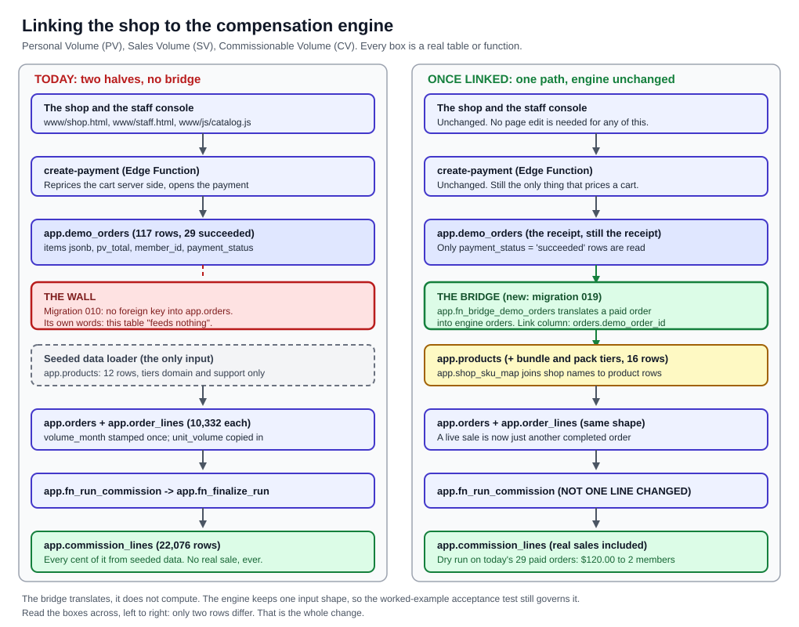
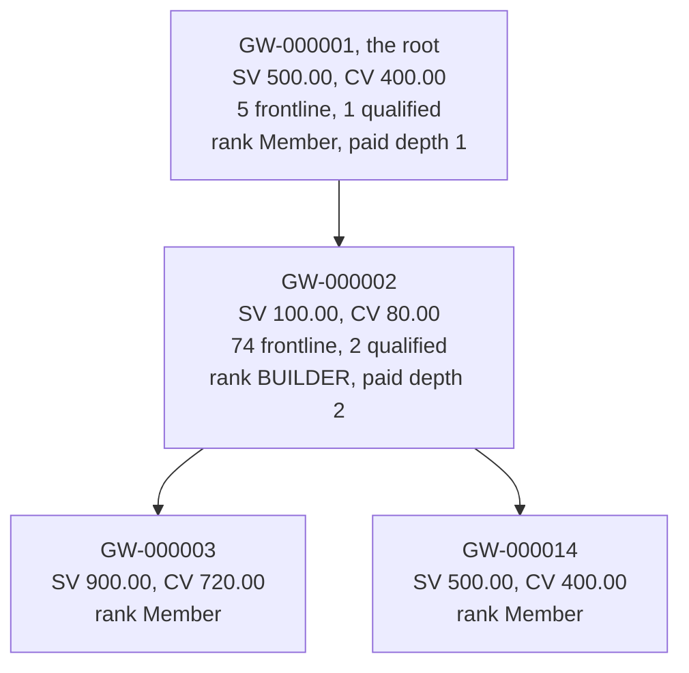

# 09. Linking the Shop to the Compensation Plan

**Owner of this document:** the compensation engineer on the Orvanna build team.
**Written:** 2026-08-15.
**Status:** design plus a dry run. **Nothing in here has been applied to production.**

This document exists because of finding 11 in `03-COMPENSATION-PLAN.md`, section 11.2:
the live shop writes to `app.demo_orders`, and migration 010 says in its own header that
that table "feeds nothing". Every commission Orvanna has ever calculated came from seeded
data. No real purchase has ever produced a cent. Both halves of the system work. The
bridge between them does not exist.

Howard's instruction, verbatim: "I thought that about the shop and comp plan i want you to
link it and becasue that is probably the most important piece."

**Acronym key, used throughout.** Personal Volume (PV). Sales Volume (SV). Commissionable
Volume (CV). Team Volume (TV). Coordinated Universal Time (UTC). Stock Keeping Unit (SKU),
which is just a short code naming one sellable thing. Structured Query Language (SQL).
Multi-Level Marketing (MLM). Each is spelled out again the first time it appears below.

**Sources this document was built from, and nothing else.**

- `C:\Users\howar\Desktop\Desktop\ORVANNA\DOCUMENTATION\03-COMPENSATION-PLAN.md`
- `C:\Users\howar\Desktop\Desktop\ORVANNA\DOCUMENTATION\02-DATA-MODEL.md`
- `C:\Users\howar\Desktop\Desktop\ORVANNA\MLM-PILOT\docs\COMP-PLAN-SPEC.md` (version 1.3)
- `C:\Users\howar\Desktop\Desktop\ORVANNA\MLM-PILOT\db\comp\001_comp_engine.sql`
- Every file in `C:\Users\howar\Desktop\Desktop\ORVANNA\MLM-PILOT\db\migrations\`
- `C:\Users\howar\Desktop\Desktop\ORVANNA\MLM-PILOT\functions\create-payment\index.ts`
- `C:\Users\howar\Desktop\Desktop\ORVANNA\MLM-PILOT\functions\_shared\pricing.ts`
- `C:\Users\howar\Desktop\Desktop\ORVANNA\MLM-PILOT\www\js\catalog.js`
- Read-only queries against the live Supabase project `oiyibdczkokegaxkwulv`, 2026-08-15

**A rule I held to throughout.** I did not invent a single compensation rule. Where the
specification does not answer a question, that question is in section 4 as a decision for
Howard, with options and a recommendation, and it is marked in the migration header as an
assumption rather than a fact.

---

## 1. Lead with the picture



Plain path to that image:
`C:\Users\howar\Desktop\Desktop\ORVANNA\DOCUMENTATION\diagrams\shop-to-comp-bridge.svg`

Read the two columns across, row by row. Only two rows differ. Everything else, including
the engine that computes the money, is untouched.

```mermaid
flowchart TD
    subgraph TODAY["TODAY: two halves, no bridge"]
        A1["Shop and staff console<br/>www/shop.html, www/js/catalog.js"] --> A2["create-payment Edge Function<br/>reprices the cart server side"]
        A2 --> A3["app.demo_orders<br/>117 rows, 29 succeeded"]
        A3 --> A4["THE WALL<br/>migration 010: no foreign key<br/>into app.orders, 'feeds nothing'"]
        A5["Seeded data loader<br/>app.products, 12 rows"] --> A6["app.orders + app.order_lines<br/>10,332 rows each"]
        A6 --> A7["app.fn_run_commission"]
        A7 --> A8["app.commission_lines<br/>22,076 rows, all seeded"]
    end
    subgraph LINKED["ONCE LINKED: one path"]
        B1["Shop and staff console<br/>UNCHANGED"] --> B2["create-payment<br/>UNCHANGED"]
        B2 --> B3["app.demo_orders<br/>succeeded rows only"]
        B3 --> B4["THE BRIDGE, new<br/>app.fn_bridge_demo_orders<br/>link column orders.demo_order_id"]
        B4 --> B5["app.products + bundle and pack tiers<br/>app.shop_sku_map joins the two catalogs"]
        B5 --> B6["app.orders + app.order_lines<br/>same shape as always"]
        B6 --> B7["app.fn_run_commission<br/>NOT ONE LINE CHANGED"]
        B7 --> B8["app.commission_lines<br/>real sales included"]
    end
```



**The one design idea worth understanding.** The bridge **translates**, it does not
compute. It turns a paid checkout into ordinary rows in `app.orders` and
`app.order_lines`, the exact shape the engine has always read, and then gets out of the
way. The alternative, teaching the engine to read a second kind of order, would mean
every downstream step (Sales Volume, Team Volume, ranks, commission lines) needs to know
about two sources forever, and the ten-member worked example that guards the engine would
no longer describe everything the engine does. Translation keeps one input shape and one
acceptance test.

---

## 2. How volume flows today, and how it would flow linked

### 2.1 Today, table by table

A visitor buys something on the live site. Here is every table the money and the volume
touch, in order:

| Step | Where it happens | What lands |
|---|---|---|
| 1 | `www\js\catalog.js` in the browser | The cart: shop SKU, mode (`sub` or `one`), quantity. Sixteen sellable items. |
| 2 | `functions\create-payment\index.ts` | The cart is thrown away and repriced from `functions\_shared\pricing.ts`. Client prices are never read. |
| 3 | `app.demo_orders` | One row. `items` holds the priced lines as JavaScript Object Notation. `pv_total` holds the Personal Volume. `member_id` holds the member whose code was typed, or null. |
| 4 | `app.demo_orders.payment_status` | Moves to `succeeded` only after a fresh retrieve from the processor **and** an exact integer amount match. |
| 5 | **nothing** | The trail ends. There is no foreign key from `app.demo_orders` into `app.orders`, by design, stated in migration 010's header. |

Meanwhile the engine reads an entirely separate world:

| Step | Where it happens | What it reads |
|---|---|---|
| A | `app.products` | 12 rows. Tiers `domain` and `support` only. SKUs look like `AGT-D-001`. |
| B | `app.orders` + `app.order_lines` | 10,332 rows each, every one written by the seeded data loader. `volume_month` stamped once at creation. `unit_volume` copied from the product so history cannot be rewritten. |
| C | `app.fn_run_commission` | Sums `quantity * unit_volume` over completed orders for the month into Sales Volume, then Commissionable Volume, Team Volume, ranks, and commission lines. |
| D | `app.commission_lines`, `app.run_member_results`, `app.commission_runs` | The statement, frozen once the run is finalized. |

**Two catalogs that have never met.** This is a fact I found while reading, not a
judgement. The shop's SKUs are `payment`, `shipping`, `manager`, `constellation` and so
on. The engine's SKUs are `AGT-D-001` through `AGT-S-006`. There is no column in either
table that joins them. Even if the tier constraint allowed bundles tomorrow, a bridge
would still have nothing to join on. This is the third gap, alongside the missing link
and the missing tiers, and it is why the design below introduces a small mapping table
rather than pretending a join exists.

### 2.2 Linked, table by table

Steps 1 through 4 above are unchanged. Then:

| Step | Where it happens | What lands |
|---|---|---|
| 5 | `app.fn_bridge_demo_orders` (new) | Reads `app.demo_orders` rows with `payment_status = 'succeeded'` and a non-null `member_id` that have not been bridged yet. |
| 6 | `app.shop_sku_map` (new) | Turns each shop SKU into an `app.products` row identifier. Sixteen rows, one per sellable item. |
| 7 | `app.products` (widened) | Gains the `bundle` and `pack` tiers and four new rows: Manager Agent, Ignition Pack, Momentum Pack, Constellation Pack. |
| 8 | `app.orders` (one new column) | One row per demo order per volume month, `buyer_role = 'member'`, `status = 'completed'`, `volume_month` from the demo order's creation month, and the new `demo_order_id` pointing back at the receipt. |
| 9 | `app.order_lines` (one new column) | One row per cart line, with `unit_price` and `unit_volume` copied in exactly as the seeded loader does, plus the new `billing_mode` recording `sub` or `one`. |
| 10 | `app.fn_run_commission` | **Unchanged.** It sees ordinary completed orders and cannot tell where they came from. |

**Why `demo_order_id` matters more than it looks.** It is the idempotency key. A unique
index on `(demo_order_id, volume_month)` means running the bridge twice cannot produce two
orders for one sale, in exactly the same way `order_number` already stops a
double-submitted checkout becoming two payments. It is also the audit trail: from any
commission line you can walk back to `earner -> source member -> order -> demo order ->
processor payment reference`. Without the column, a bridged order is indistinguishable
from a seeded one and the trail dies.

---

## 3. What the live data actually looks like right now

Read-only counts from the live database, 2026-08-15, because the decisions below are much
easier to judge against real numbers than in the abstract.

| Payment status | Orders | With a member attached | Personal Volume |
|---|---|---|---|
| `succeeded` | 29 | 11 | 5,650 |
| `created` | 50 | 13 | 11,050 |
| `abandoned` | 26 | 1 | 2,550 |
| `failed` | 8 | 1 | 550 |
| `processing` | 4 | 2 | 550 |
| **Total** | **117** | **28** | **20,350** |

Three facts jump out, and each one is a decision below:

1. **Only 29 of 117 orders are paid, and only 11 of those name a member.** The other 18
   paid orders carry 3,650 Personal Volume that belongs to nobody in the tree.
2. **2,400 Personal Volume of the paid orders is bundles and packs**, which the engine
   structurally cannot see today: two Constellation Packs, one Momentum Pack, two Manager
   Agents.
3. **One paid order is a one-time purchase**, two Software Engineer agents at $500.00
   each, carrying 1,000 Personal Volume in a single month. That one row is decision 4.1
   in miniature.

---

## 4. The policy questions. These are Howard's, not mine.

Each is a decision, the options, what each option does, and my recommendation with the
reasoning. **None of these is answered by the specification.** Every one of them is
written into the migration header as an assumption so it can be changed by editing one
constant rather than by archaeology.

### Decision 4.1: a one-time purchase costs ten times and carries ten times the volume. When does that volume count?

> **ANSWERED BY HOWARD, 2026-08-15.** His words: "spread it for now but going forward lets
> keep everything within a calendar month and we run the entire commissions end of month."
> Option B below, plus two further rules now fixed as policy. The full design of what
> spreading introduces, a schedule of future obligations, is **section 11**. Built in
> `021_calendar_month_containment.sql`.

The house pricing rule in `catalog.js` is explicit: the one-time price is the monthly
price times ten, and Personal Volume always equals dollars. So a one-time Payment Agent is
$1,000.00 and 1,000 Personal Volume, and a one-time Constellation Pack is $8,000.00 and
8,000 Personal Volume.

| Option | What it does to the payout curve | What it does to gaming |
|---|---|---|
| **A. All of it in the month of purchase** | A single one-time Constellation Pack puts 8,000 Sales Volume on one account in one month. Commissionable Volume 6,400. The upline can be paid up to 25 percent of that, 1,600.00, in one month, against a payout that is normally a few dollars per member. The company payout curve gets a spike shaped exactly like whoever bought a big one-time item. | Worst case. Team Volume for Leader is 2,500 and for Executive 40,000. One person buying one $8,000.00 pack instantly hands their whole upline chain 8,000 of Team Volume. Rank becomes purchasable in a single transaction by somebody else's card. It also makes qualification (100) trivially over-satisfied for one month and zero the next, which is the classic buy-in-then-vanish pattern. |
| **B. Spread over ten months, one tenth per month** | Flat. A one-time purchase produces exactly the same monthly volume as the subscription it replaces: 100 a month for ten months. The payout curve is identical to the subscription curve, which is the curve every threshold in the plan was calibrated against. | Removes the spike entirely. There is no month in which a one-time purchase is worth more than the same product on subscription. Nobody can buy a rank in one transaction. |
| **C. Count it all at once but cap what counts** | Introduces a cap number that appears nowhere in the plan and that has to be explained to every member. A cap also silently destroys volume, which is the one thing the plan currently never does without naming it as breakage. | Partly blunts the spike, at the cost of a rule nobody can predict. |

**My recommendation: B, spread over ten months, one tenth of the Personal Volume per
month, starting with the month of purchase.**

The reasoning is not "spikes are bad", it is that **the plan's thresholds are all
per-month numbers**. Qualification is 100 per month. Leader is 2,500 of Team Volume per
month. Those numbers only mean anything if a month of volume corresponds to a month of
product. The ten-times rule says in plain words what a one-time purchase is: ten months
paid up front. Spreading the volume makes the volume say the same thing the price already
says. Option A does not create extra generosity, it creates a different plan for ten
months.

**How it is implemented, and why it needs no new machinery.** The bridge writes ten order
rows for a one-time line, stamped to ten consecutive volume months, each carrying the
monthly price and the monthly Personal Volume. Ten slices at the monthly price add back
exactly to the one-time price, and ten slices of monthly volume add back exactly to the
one-time volume. Nothing is lost, no schedule table is needed, and the engine never learns
a new concept. Every catalog value divides by ten exactly, so no rounding is created.

**The honest cost of B, stated plainly.** Months two through ten carry volume with no
money arriving in them. That is correct (the money already arrived), but the company
payout in month seven will include commission funded by a payment received in month one.
Anybody reading a single month's reconciliation needs to know that. A one-line note on the
run covers it.

### Decision 4.2: packs and bundles carry the parent's Personal Volume, children show zero. Confirm?

The four multi-agent items are Manager Agent ($200.00), Ignition Pack ($200.00), Momentum
Pack ($400.00) and Constellation Pack ($800.00). Each names its children in
`catalog.js`, and each carries its own price and Personal Volume.

**Confirming what should flow: yes, the parent's Personal Volume, once, and nothing from
the children.** That is what the catalog says and it is the only reading that keeps the
plan's single invariant, Personal Volume equals dollars, true.

Worth checking the arithmetic rather than trusting it. Adding up the children:

| Pack | Children | Children's monthly prices add to | Pack price |
|---|---|---|---|
| Ignition Pack | Payment, Customer Care, Secretary | 100 + 50 + 50 = 200 | 200 |
| Momentum Pack | Payment, Marketing, Pricing, Software Engineer, Quality Assurance | 100 + 100 + 100 + 50 + 50 = 400 | 400 |
| Constellation Pack | six domain agents plus the Manager Agent | 600 + 200 = 800 | 800 |
| **Manager Agent** | Software Engineer, Secretary, Accounting | 50 + 50 + 50 = **150** | **200** |

Three of the four match exactly. The Manager Agent deliberately does not: it is priced
$50.00 above its parts because, in the product's own words, the management layer is the
product.

**What breaks if a child ever gains its own volume.** Three things, in increasing order of
seriousness:

1. **Double counting.** A Constellation Pack would credit 800 for the parent plus 800 for
   the children, 1,600 Personal Volume on an $800.00 sale.
2. **Personal Volume stops equalling dollars**, and the moment that is false, every
   sentence in the member booklet that says "volume equals dollars" is wrong.
3. **The 20 percent ceiling breaks.** The plan's whole promise is that one order can pay
   at most 20 percent of its price. Doubling the volume doubles the ceiling to 40 percent
   of revenue while the company still only received the one payment. That is not a
   rounding problem, it is a solvency problem.

There is also a subtler trap: **exploding a pack into its children would silently
under-credit the Manager Agent by 50** (150 of child volume against a $200.00 sale), so
exploding is not even neutral. See decision 4.6.

### Decision 4.3: what happens to volume when an order is refunded or charged back?

**First, the state of the world, stated accurately.** `app.demo_orders.payment_status`
permits exactly five values: `created`, `processing`, `succeeded`, `failed`, `abandoned`.
There is no refunded state. `app.orders.status` permits `completed` and `refunded`, but
nothing in the codebase has ever written `refunded`, and the engine only ever reads
`completed`. So today a refund **cannot be represented at all**. This is not a rule that
needs choosing yet; it is a rule that must exist before the first refund does.

| Option | What it does |
|---|---|
| **A. Reverse the volume in its original month and rerun that month** | Mathematically the cleanest: the month reflects what actually happened. But if that month's run is already final, the rerun supersedes a published statement, and every member's earnings for that month change after they were told what they earned. |
| **B. Reverse the volume in the month the refund lands, as negative volume** | The industry-standard approach, and it never touches a published statement. But the engine has no concept of negative volume. A member with a big refund would get negative Sales Volume, negative Commissionable Volume, and their upline would receive negative commission lines. That is a clawback, and the plan explicitly has no clawback rules. |
| **C. Do nothing to volume; record the refund and report it** | Nothing published ever changes, no rule is invented, and the discrepancy is visible instead of hidden. But the company can pay commission on money it gave back. |

**My recommendation, in two parts.**

**For the bridge, now: the bridge writes only `succeeded` orders, and it never updates or
deletes an order it has already written.** If a refund arrives before that month's
commission run has been finalized, the correct action is to remove the bridged order rows
and run the month again, which is safe because nothing has been published. That is an
operational step, not a rule, and it is the only reversal the design supports.

**For after a month is finalized: I will not recommend a rule, because inventing one is
exactly what I must not do.** The three options above are real and the choice is a
business decision about who absorbs the loss. What I will say plainly is which one I would
argue for when Howard decides: **B, negative volume in the month the refund lands**,
because the immutability of a finalized statement is the single strongest property this
system has and it is worth more than perfect month attribution. But B cannot be built
until the plan says what happens when a member's monthly volume goes negative and whether
a negative commission line is a debt or is written off. Those two sentences do not exist
yet, and the member booklet already promises the refund rule will be published before
refunds exist.

### Decision 4.4: does volume count at order creation, or only when payment reaches `succeeded`?

**Only `succeeded` is defensible. I recommend it, and I would push back hard on anything
else.**

The plain-English reason: **a commission is a share of money that was received.** Not
money that was requested, not money that a shopper started to send. Every other state is
either not an outcome yet or is a negative outcome:

- `created` means the row exists and nothing has been asked of the processor. **50 of the
  117 live rows sit here**, carrying 11,050 Personal Volume. Counting creation would pay
  commission on carts that never paid a cent.
- `processing` means the shopper may be looking at a bank approval screen right now. It is
  a question, not an answer.
- `abandoned` is our own guess, and the data model deliberately lets it still resolve to
  `succeeded` later, precisely because a slow 3-D Secure challenge can outlive the sweep.
- `failed` is a decline.

There is a second reason that matters just as much: `succeeded` is the only state the
system will not write without **a fresh retrieve from the processor and an exact integer
match between the processor's amount and `total_cents`**. It is the only status in the
whole system backed by an independent confirmation. Everything else is our own opinion.
Commission should be paid on the one fact the processor confirmed.

And a third: `succeeded` and `failed` are the two terminal states, and the database
trigger refuses to move a row out of either. Volume derived from a terminal state can
never be invalidated by a later status change, which means a finalized month can never be
made wrong by a row moving underneath it.

### Decision 4.5: which month does an order belong to when it settles after a month boundary?

The engine's existing rule, from the specification's section 6.3, is that an order belongs
to the volume month stamped at creation in Coordinated Universal Time, and that stamp never
moves. The new question the live shop creates is what to do when the payment succeeds in
September for an order created at 23:58 on 31 August, especially once the August run has
been finalized.

| Option | What it does |
|---|---|
| **A. Always the creation month, refuse and report if that month is already final** | Keeps the existing rule exactly. A late settlement into a closed month is reported to a human rather than resolved by a machine. Nothing published changes, and nothing moves silently. The cost: that volume is not counted anywhere until Howard decides what to do with it. |
| **B. Always the creation month, and rerun the closed month if needed** | Perfectly accurate months. But it supersedes a published statement to add a few dollars, and it means a finalized month is never actually finished. |
| **C. The settlement month** | Always lands in an open month, never disturbs history. But it divorces a purchase from its receipt, and it contradicts the specification's stamp-at-creation rule for no gain in the 99 percent case. |
| **D. Creation month, shifted forward to the earliest open month if that month is closed** | Never loses volume and never disturbs history. But it silently moves volume between months, which is the exact failure mode the stamp-at-creation rule was written to prevent. |

**My recommendation: A, creation month, and the bridge refuses to write into a period that
already has a final run, reporting those rows instead.**

The reasoning: the case should be rare by construction. The abandonment sweep ages
non-terminal orders out after one hour, and a run is executed by hand after month end, so
the window for a genuinely late settlement is small. Given a rare case, a report a human
resolves beats a rule nobody debated. And of the four options, A is the only one that can
change neither a published statement nor an order's month without a person deciding to.

If Howard prefers not to lose the volume, D is the second choice, but it must carry a
visible marker on the order saying it was shifted, because an unexplained shift is exactly
the kind of thing that destroys trust in a statement.

### Decision 4.6: should a pack be one product, or should it explode into its component agents?

The task asked this as part of the tier question, and it deserves its own decision because
the two answers produce different money.

| Option | What it does |
|---|---|
| **A. A pack is its own product row.** One order line, parent Personal Volume, children never appear. | Personal Volume equals the price exactly, in every case. One line on a statement, which is also what the member bought. The child list stays a marketing fact in `catalog.js` and never becomes a compensation fact. |
| **B. A pack explodes into its components.** One order line per child, each carrying the child's own Personal Volume. | For three of the four packs the total is identical. For the Manager Agent it is 150 against a $200.00 sale, so 50 of paid-for volume vanishes. It also makes a member's statement list agents they did not choose individually, and it makes the pack's price and its volume two independent numbers that can drift. |

**My recommendation: A, a pack is its own product row.** Personal Volume equals dollars is
the one invariant the whole plan rests on, and option A is the only one that keeps it true
for all four items. Option B is not wrong in three cases and wrong in one, which is worse
than being consistently one thing, because it means the rule cannot be stated in a
sentence.

### Decision 4.7: paid orders that name no member. Who gets the volume?

> **ANSWERED BY HOWARD, 2026-08-15.** His words: "when no one is linked then lets pay that
> to the company for now" and "lets make an ID that is the top of the tree like GW-000."
> **Option B, with one critical qualification: this is bookkeeping, not a disbursement.**
> The house account receives the *attribution* so the volume becomes visible; it is never
> paid a commission. Full design in **section 10**. Built in `020_house_account.sql`.
> My recommendation below was option A, pay nobody. Howard chose visibility over silence,
> which on reflection is the better instinct: option A left the number invisible, and an
> invisible number never improves.

Not on the original list, but it is the largest number in the dry run so it cannot be left
implicit. **Eighteen of the 29 paid orders, carrying 3,650 Personal Volume, name no member
at all.** The referral code field is optional, and a guest who types nothing produces an
order attached to nobody.

| Option | What it does |
|---|---|
| **A. Pay nobody. The volume is breakage.** | Consistent with how the plan already treats volume nobody can be paid on. Honest: nobody sponsored that sale, so nobody earned on it. |
| **B. Book it to a house account** | Creates a member who buys nothing and earns everything, which is the shape of a plan people are right to be suspicious of. |
| **C. Book it to the root member** | Same objection as B, and worse, because the root is a real person in the tree whose rank and Team Volume would inflate from strangers' purchases. |

**My recommendation: A, pay nobody, and treat the number as a product signal rather than a
compensation problem.** Then the fix is on the shop side, not the plan side: if 62 percent
of paid orders carry no referral code, the checkout is not asking clearly enough. That is
a page change, and it is worth more than any rule.

---

## 5. The tier problem: exactly what has to change

Stated precisely, because "the constraint blocks it" is not actionable on its own.

**The blocker, verbatim from the live database:**

```
app.products, constraint products_tier_check:
CHECK ((tier = ANY (ARRAY['domain'::text, 'support'::text])))
```

**The four changes required, and no others:**

1. **Widen the tier constraint.** Drop `products_tier_check` and recreate it as
   `check (tier in ('domain', 'support', 'bundle', 'pack'))`. Nothing else in the schema
   reads `tier`; the engine never mentions it. It is a labelling column, so widening it
   changes no arithmetic anywhere.
2. **Add the four missing product rows**, at their monthly price and monthly Personal
   Volume: Manager Agent (bundle, 200.00 / 200), Ignition Pack (pack, 200.00 / 200),
   Momentum Pack (pack, 400.00 / 400), Constellation Pack (pack, 800.00 / 800). The
   one-time versions are **not** separate products; see below.
3. **Add the mapping table `app.shop_sku_map`**, sixteen rows, joining a shop SKU such as
   `constellation` to an `app.products` row. This is the join that has never existed. It
   is a table rather than a column on `app.products` because the shop's names are the
   shop's business, and a table makes an unmapped SKU a loud failure rather than a silent
   null.
4. **Add `billing_mode` to `app.order_lines`**, `sub` or `one`, defaulting to `sub`. All
   10,332 existing rows are subscription orders, so the default is correct history and no
   back-fill is needed.

**Why one-time purchases need no new products.** `app.order_lines` already copies
`unit_price` and `unit_volume` from the product at order time, precisely so history cannot
be rewritten by a catalog change. That copying is what makes a one-time purchase
expressible with no new SKU: the line points at the same product and carries whatever price
and volume the sale actually had. Sixteen products instead of thirty-two, and the mode is
recorded on the line where it belongs.

**On packs versus explosion, decided above:** a pack registers as a product in its own
right. See decision 4.6.

---

## 6. Attribution: who is the earner?

The question as asked was whether the buyer is the earner, the sponsor is, or both. The
answer is **neither, and getting this right matters more than any other line in this
document.**

**In this plan, buying earns you nothing.** Section 13 of the compensation plan document
puts it in one line: "Does my own buying earn me anything? No. It qualifies you and it
pays your upline." So:

| Role | What a purchase does for them |
|---|---|
| **The buyer's member account** | The volume **books** here. It counts toward that member's Sales Volume, which decides their qualification (100 or more), their Commissionable Volume, and their rank. They earn **zero** from it. |
| **The buyer's sponsor (level 1)** | Earns 10 percent of the buyer's Commissionable Volume, if the sponsor is qualified this month. |
| **Levels 2 to 5 above the buyer** | Earn 5, 5, 3 and 2 percent of that same Commissionable Volume, each one only if they are qualified **and** the level is inside their rank's paid depth. |
| **Anyone below the buyer** | Nothing. Volume only ever flows upward. |

**How that maps onto what the checkout already stores.** `app.demo_orders.member_id` is
already the right column, already populated by the referral code, and already a foreign key
into `app.members`. The bridge writes it into `app.orders.member_id`, which is exactly the
column the engine's Sales Volume calculation groups by. **The engine needs no concept of
"earner" at all**, because it already derives every earner from the frozen tree at run
time. The bridge only has to answer one question, "whose account does this volume book
to", and `member_id` already answers it.

**One honest gap in that mapping.** The plan distinguishes a member buying for themselves
(`buyer_role = 'member'`) from a customer buying through a member
(`buyer_role = 'retail_customer'`, which the database requires to name a `customer_id`).
The live checkout **cannot tell these apart**: there is one field, the referral code, and a
signed-in member buying for themselves and a guest typing their friend's code produce an
identical row. The privacy rail is the reason, and it is a good reason: the checkout
deliberately collects no buyer identity, so there is no customer to name.

The money is the same either way. The specification is explicit that customer volume books
to the referring member's account, counts in their Sales Volume, and qualifies them, which
is exactly what booking it as a member purchase does, and the engine never reads
`buyer_role` at all.

**But "only the audit tag differs" is not quite true, and the verifier was right to catch
it.** The public view `public.v_demo_customer_volume` is defined with
`where o.buyer_role = 'retail_customer' and o.status = 'completed'`, and it is granted
SELECT to `anon` and `authenticated`, so it is readable through the public application
programming interface. **Every genuine customer purchase booked as `member` is permanently
invisible in that view.** Customer-attributed volume reporting therefore stays empty for
live sales until the checkout actually asks the question. That is a reporting consequence,
not a money consequence, but it is a real one and it should not be discovered later.

So the bridge books every live order as `buyer_role = 'member'`, and that assumption
is written into the migration header rather than buried. The proper fix is a product
change, not a database change: ask the shopper, in one checkbox, whether they are buying
for themselves or through a member. Until that exists, the tag is an approximation and
should be described as one.

---

## 7. What was built, and where it lives

Part two of this work. **Nothing has been applied to production.**

| File | What it is |
|---|---|
| `MLM-PILOT\db\migrations\019_shop_to_comp_bridge.sql` | The schema changes and the bridge function. Every policy choice from section 4 is a named constant in the header block. Not applied. |
| `MLM-PILOT\db\migrations\020_house_account.sql` | Decision 4.7 as answered: the GW-000 house account, the retention ledger, three guards, and two reporting views. Layers on 019 without editing it. Not applied. |
| `MLM-PILOT\db\migrations\021_calendar_month_containment.sql` | Decision 4.1 as answered: the guard that keeps a finalized month's inputs frozen, and the view that makes the ten-month schedule legible. Layers on 019 and 020 without editing either. Not applied. |
| `MLM-PILOT\db\comp\004_bridge_dry_run.sql` | The dry run. Read-only from first line to last: no insert, no update, no delete, no function call. It recomputes what the engine would produce, in the engine's own algorithm, against a virtual set of bridged orders. |

Plain paths:

`C:\Users\howar\Desktop\Desktop\ORVANNA\MLM-PILOT\db\migrations\019_shop_to_comp_bridge.sql`
`C:\Users\howar\Desktop\Desktop\ORVANNA\MLM-PILOT\db\migrations\020_house_account.sql`
`C:\Users\howar\Desktop\Desktop\ORVANNA\MLM-PILOT\db\migrations\021_calendar_month_containment.sql`
`C:\Users\howar\Desktop\Desktop\ORVANNA\MLM-PILOT\db\comp\004_bridge_dry_run.sql`

**019 has deliberately not been touched since it was written.** The verifier is recomputing
the dry run against that exact file, and changing it underneath them would invalidate their
work. Everything the two answered decisions required is layered on top in 020 and 021.

---

## 8. The dry run: what today's real sales would actually pay

This section is the point of the whole exercise. It answers "what happens if we do this"
before anything is done.

**Method.** Every succeeded order in `app.demo_orders` with a member attached was
translated into virtual engine orders under the recommended options from section 4, and
then the engine's own algorithm, copied step for step from
`db\comp\001_comp_engine.sql`, was run over all 1,000 members for the period
**2026-08-01**. Read-only queries only. Nothing was written.

Every figure below was produced by the queries in
`C:\Users\howar\Desktop\Desktop\ORVANNA\MLM-PILOT\db\comp\004_bridge_dry_run.sql`,
executed against the live project on 2026-08-15. That file contains no insert, update,
delete, create, or function call: it is SELECT statements from first line to last, and it
carries each result inline as a comment so the numbers and the query that produced them
can never drift apart. It re-implements the engine's own common table expressions under
the engine's own names, so the two can be diffed by eye.

**Why August 2026 is the right period to test.** The six finalized months are February
through July 2026. August has no commission run and no seeded orders at all, so August is
the first month whose entire volume would come from the live shop. It is the cleanest
possible test: everything you see below is real money that real people really paid.

### 8.1 The volume that arrives

| Member | What they bought (live, paid) | Sales Volume | Commissionable Volume | Qualified? |
|---|---|---|---|---|
| GW-000001 (the root) | Payment Agent, Manager Agent bundle, Payment Agent, Payment Agent | 500.00 | 400.00 | yes |
| GW-000002 | Payment Agent | 100.00 | 80.00 | yes, exactly on the line |
| GW-000003 | Payment Agent, Constellation Pack | 900.00 | 720.00 | yes |
| GW-000014 | five agents: Inventory, Payment, Shipping, Pricing, Payment | 500.00 | 400.00 | yes |
| all other 996 members | nothing | 0.00 | 0.00 | no |

Total Sales Volume **2,000.00**, total Commissionable Volume **1,600.00**.

**Of that 2,000, exactly 1,000 is volume the engine cannot see today**: GW-000003's
Constellation Pack (800) and GW-000001's Manager Agent bundle (200). Half the real volume
is currently invisible. That is the tier gap measured in dollars rather than described.

### 8.2 The tree these four sit in



Team Volume follows from the tree: GW-000001 has 1,500.00 below them (100 + 900 + 500),
GW-000002 has 1,400.00 (900 + 500), the other two have nothing below them.

### 8.3 Every commission line the run would produce

| Earner | Source | Level | Source Commissionable Volume | Rate | Arithmetic | Amount |
|---|---|---|---|---|---|---|
| GW-000001 | GW-000002 | 1 | 80.00 | 10% | 0.10 x 80.00 | **8.00** |
| GW-000002 | GW-000003 | 1 | 720.00 | 10% | 0.10 x 720.00 | **72.00** |
| GW-000002 | GW-000014 | 1 | 400.00 | 10% | 0.10 x 400.00 | **40.00** |

Three lines. That is the whole run.

### 8.4 The totals

| Figure | Value |
|---|---|
| Total Sales Volume | 2,000.00 |
| Total Commissionable Volume | 1,600.00 |
| **Total payout** | **120.00** |
| **Members who would earn** | **2 of 1,000** |
| **Largest single earner** | **GW-000002, 112.00** |
| Payout as a share of Commissionable Volume | 7.50 percent |
| Payout as a share of volume received | 6.00 percent |

**Tying the volume back to the money, which is the check that matters most.** The four
members between them paid **$2,114.63** across 11 orders, and that produced exactly
**2,000.00** of Sales Volume.

**The $114.63 gap is entirely sales tax. No order in this set paid an activation fee at
all.** Measured from `tax_cents` and `activation_fee_cents` on the eleven rows, not from the
pricing constants:

| Activation | Tax source | Jurisdiction | Orders | Subtotal | Activation fee | Tax |
|---|---|---|---|---|---|---|
| standard | `flat_mirror_5pct` | none recorded | 5 | $500.00 | **$0.00** | $25.00 |
| standard | `stripe_tax` | CA, US | 3 | $500.00 | **$0.00** | $9.75 |
| standard | `stripe_tax` | IL, US | 1 | $100.00 | **$0.00** | $0.00 |
| standard | `stripe_tax` | NY, US | 2 | $900.00 | **$0.00** | $79.88 |
| | | **Total** | **11** | **$2,000.00** | **$0.00** | **$114.63** |

All eleven orders are `activation = 'standard'`, and standard activation is free. The sum of
`activation_fee_cents` across all eleven is exactly zero: not "on some orders", on no orders.

**And the tax is not a flat 5 percent.** Six distinct effective rates appear across the
eleven orders, from two different tax sources:

| Rate | Source | Jurisdiction | What it tells you |
|---|---|---|---|
| 0.000% | `stripe_tax` | IL, US | Illinois did not tax this sale |
| 0.000% | `stripe_tax` | CA, US | A California sale taxed at zero, which is the ambiguous case the data model warned about: it means either no registration in that jurisdiction or a genuinely untaxed product, and only `tax_reason` tells them apart |
| 5.000% | `flat_mirror_5pct` | none | The fallback path, from before the real tax engine |
| 8.875% | `stripe_tax` | NY, US | New York |
| 8.880% | `stripe_tax` | NY, US | New York, rounded differently on a different subtotal |
| 9.750% | `stripe_tax` | CA, US | California |

Five of the eleven orders still price through the flat fallback; six were priced by a real
tax engine against a real destination. That spread is a true fact about the system, and a
"flat 5 percent" sentence would have hidden it.

**Where that wrong sentence came from, because the cause matters more than the sentence.**
The first version of this paragraph was written from `functions\_shared\pricing.ts`, which
declares `TAX_RATE_PERCENT = 5` and `ACTIVATION_FEE_DOLLARS = 25`, instead of from the
`tax_cents` and `activation_fee_cents` columns on the actual rows. The live shop has since
moved to a real tax service, which is exactly why the `tax_source`, `tax_jurisdiction` and
`tax_calculation_id` columns exist. **Describing what the code should do instead of
measuring what the data says is the failure mode that has cost this project more time than
any other**, and it happened here inside the very section written to prevent it. Caught by
the verifier, corrected from measurement.

The reconciliation still closes exactly: 2,000.00 + 114.63 + 0.00 = 2,114.63. The Personal
Volume column of `app.demo_orders` matches the Sales Volume column of the dry run member for
member, so the bridge invents no volume and loses none:

| Member | Paid orders | Personal Volume on the receipts | Sales Volume in the run | Dollars charged |
|---|---|---|---|---|
| GW-000003 | 2 | 900.00 | 900.00 | $979.88 |
| GW-000001 | 3 | 500.00 | 500.00 | $509.75 |
| GW-000014 | 5 | 500.00 | 500.00 | $520.00 |
| GW-000002 | 1 | 100.00 | 100.00 | $105.00 |
| **Total** | **11** | **2,000.00** | **2,000.00** | **$2,114.63** |

### 8.5 Reconciling every dollar, the check worth actually reading

The structural ceiling is 25 percent of Commissionable Volume across five levels, which is
20 percent of revenue. On 1,600.00 of Commissionable Volume that is **400.00**. Only
120.00 would be paid. Here is where the other 280.00 goes, and none of it is unexplained.

**Loss one: there is almost no tree above these people.** For each buyer, only the levels
that actually exist above them can ever pay:

| Source | Commissionable Volume | Levels above them | Most that could be paid |
|---|---|---|---|
| GW-000001 | 400.00 | none, they are the root | 0.00 |
| GW-000002 | 80.00 | level 1 (GW-000001) | 8.00 |
| GW-000003 | 720.00 | levels 1 to 2 (GW-000002, GW-000001) | 72.00 + 36.00 = 108.00 |
| GW-000014 | 400.00 | levels 1 to 2 (GW-000002, GW-000001) | 40.00 + 20.00 = 60.00 |

That column adds to **176.00**. So 400.00 minus 176.00 = **224.00 never existed**, purely
because these four people sit at the very top of the tree with nobody above them. This is
not breakage and it is not a defect; it is what a shallow tree looks like.

**Loss two: the gates.** Of the reachable 176.00, only 120.00 is paid:

- GW-000001's rank is Member, so their paid depth is 1. Their level 2 claims on GW-000003
  (0.05 x 720.00 = 36.00) and GW-000014 (0.05 x 400.00 = 20.00) are out of reach.
  **56.00 of breakage.**
- No earner fails the qualification gate in this run: all four buyers are qualified.

176.00 minus 56.00 = **120.00**, the payout. Every dollar accounts for:

**400.00 (structural ceiling) = 224.00 (levels that do not exist above the buyers) + 56.00
(breakage at the depth gate) + 120.00 (paid).**

A wording precision the verifier asked for: that 224.00 is not all "nobody above them".
GW-000002 does have an upline, GW-000001. What GW-000002 lacks is levels 2 through 5, and
12.00 of the 224.00 is theirs. The table above is precise; the short label was loose.

### 8.6 The teaching case buried in these numbers

GW-000001 is the root of the entire thousand-member tree, personally bought 500.00 of
product, and would earn **8.00**. GW-000002 sits one level below them, bought the minimum
100.00, and would earn **112.00**, fourteen times as much.

The reason is entirely rank. GW-000002 has two qualified frontline members this month, so
they are a Builder with paid depth 2. GW-000001 has five frontline members and only one of
them (GW-000002) is qualified, so GW-000001 is a plain Member with paid depth 1 and cannot
reach past their own frontline. **Rank buys reach, and reach is where the money is.** It is
the plan's central mechanic, and the first month of real sales demonstrates it without
anybody arranging the demonstration.

### 8.7 What the dry run does not include, said plainly

- **3,650 Personal Volume of paid orders that name no member**, across 18 of the 29 paid
  orders. Under recommended option A in decision 4.7 that volume pays nobody. If Howard
  chooses otherwise it is 2,920.00 of Commissionable Volume entering the run, but how much
  of that would actually be paid depends entirely on where in the tree it were booked, so
  no payout figure is quoted here rather than a guessed one.
- **The one-time purchase in the data is unattributed**, so decision 4.1 does not change a
  single number in this dry run. It will change numbers the first time a signed-in member
  buys a one-time item, and it is the decision with the largest future consequence.
- **11,050 Personal Volume sitting at `created`** and 2,550 at `abandoned`, correctly
  ignored under decision 4.4.
- **No refund exists in the data**, so decision 4.3 is untested by construction.

---

## 9. The second dry run: both answered decisions in place

Re-run on 2026-08-15 after Howard answered 4.1 and 4.7, read-only, with a virtual GW-000
injected as a sibling root and the spreading rule applied.

### 9.1 The headline: the member payout did not move, and here is why

| Figure | First dry run | Second dry run | Change |
|---|---|---|---|
| Commission lines | 3 | 3 | none |
| Members paid | 2 | 2 | none |
| **Total member payout** | **$120.00** | **$120.00** | **none** |
| Total member Sales Volume | 2,000.00 | 2,000.00 | none |
| Total member Commissionable Volume | 1,600.00 | 1,600.00 | none |
| Largest single earner | GW-000002, $112.00 | GW-000002, $112.00 | none |
| Commission lines naming GW-000 | n/a | **0** | n/a |
| GW-000's Sales Volume | n/a | **0.00** | n/a |

**Two expectations need correcting, and both matter.**

**First, spreading did not change the August member figures, because spreading was already
in the first dry run.** Spread-over-ten-months was my recommendation, so it was implemented
as policy P4 in migration 019 and applied in the original run. Howard's answer confirmed a
recommendation rather than changing an assumption. There is also a second reason nothing
moved: **the only one-time purchase among the 29 paid orders is unattributed**, two Software
Engineer agents at $500.00 each, bought by somebody who typed no member code. So spreading
had nothing attributed to act on. The first member to buy a one-time item will be the first
time this rule changes a member number.

**Second, GW-000 does not pick up 3,650 Personal Volume in August. It picks up 2,750.**
That is spreading acting on the house account, and it is the clearest demonstration of the
rule anywhere in the data. The unattributed one-time purchase carries 1,000 Personal Volume;
under spreading only one tenth of it, 100, belongs to August. The other 900 is owed to the
nine months after it.

### 9.2 Company retention, month by month

| Month | Retained slices | Company retained Personal Volume |
|---|---|---|
| 2026-08 | 19 | **2,750.00** |
| 2026-09 | 1 | 100.00 |
| 2026-10 | 1 | 100.00 |
| 2026-11 | 1 | 100.00 |
| 2026-12 | 1 | 100.00 |
| 2027-01 | 1 | 100.00 |
| 2027-02 | 1 | 100.00 |
| 2027-03 | 1 | 100.00 |
| 2027-04 | 1 | 100.00 |
| 2027-05 | 1 | 100.00 |
| **Total** | **28** | **3,650.00** |

It reconciles: 2,750 in August plus nine further months of 100 is 3,650, which is exactly
the unattributed paid volume measured in section 8.7. **Nothing is created and nothing is
lost; the calendar is the only thing that changed.** That single table is the whole
spreading rule made visible.

### 9.3 The two kinds of money, side by side and never summed

| Month | Member payout, PAID | Company retention, NOT PAID |
|---|---|---|
| 2026-08 | $120.00 | 2,750.00 Personal Volume |

They sit in different tables on purpose (section 10.3). There is no query that adds them
together, which is what makes it impossible to read company retention as a member payout.

### 9.4 Nothing finalized moved

The six finalized runs, February through July 2026, are untouched and provably so. This is
not a promise, it is three separate facts:

1. **Nothing in 020 or 021 writes to `app.run_member_results` or `app.commission_lines`.**
   Those two tables hold every finalized figure, and neither migration mentions them except
   to add a guard that only fires on new inserts.
2. **Those tables are frozen by triggers that already exist**, verified live on 2026-08-15:
   `run_member_results_immutable_when_final`, `commission_lines_immutable_when_final`, and
   the matching `no_write_into_final` pair. Even a deliberate attempt would be rejected.
3. **The August dry run was re-run with GW-000 present and produced output identical to the
   cent**, including zero commission lines naming the house account. A new member row that
   changes nothing in an open month cannot change anything in a closed one.

### 9.5 The verifier's verdict, and every correction it forced

Independent verification returned **GATE: FAIL** on 2026-08-15. Full verdict:
`C:\Users\howar\Desktop\Desktop\ORVANNA\MLM-PILOT\docs\verification\BRIDGE-DRY-RUN-VERDICT.md`

**The money survived.** Every payout figure was recomputed from a different direction, by
explicit enumeration of ancestor pairs rather than by re-running my recursive query, and
landed on the same $120.00, the same three lines, the same GW-000002 at $112.00, and the
same 400.00 = 224.00 + 56.00 + 120.00 reconciliation. The Stock Keeping Unit map is complete
and correct in both directions, the succeeded gate has no money bug, all nine policy
assumptions genuinely match the code, and the six finalized runs are untouched.

**The narrative did not survive, and both failures were mine.**

| Finding | What was wrong | Fixed |
|---|---|---|
| **H1** | The order count was published as 115 in four places. My own recorded per-status rows add to **117**. The error was already visible inside my own artifact. | Corrected in the diagram, the section 3 table, the decision 4.4 narrative, the Scalable Vector Graphics picture, and the dry-run file. The discard count is now 88 of 117, not 86 of 115. |
| **H2** | I wrote that the $114.63 gap was tax plus the $25.00 activation fee. It is **100 percent tax and zero activation fee**, and the tax is not flat 5 percent but six distinct rates from two sources. | Section 8.4 rewritten from measured columns, with the rate spread shown. New Query 3b in the dry-run file measures it. |
| **M1** | Policy P8's recovery instruction said "delete the bridged rows", but the already-bridged test reads `app.orders` alone. Deleting lines and leaving the order loses volume permanently and silently. | P8 now names both tables in order, and a new `ERROR: bridged order has no lines` verdict makes the orphan state loud. |
| **M2** | `volume_month::timestamptz` resolves against the session timezone, and the comment claimed "always". | Pinned to `(volume_month::timestamp at time zone 'UTC')`. |
| **M3** | Section 6 claimed only the audit tag differs. `public.v_demo_customer_volume` filters on `buyer_role = 'retail_customer'` and is publicly readable. | Named in section 6 with its consequence. |
| **M4** | The reset-script landmine was real but the stated one-line fix leaves the system quietly non-functional. | Full post-reset procedure written into both files. |
| **M5** | Nothing in the database protects a finalized month on `app.orders`. | Stated plainly in 019's header, and **closed by the new trigger in migration 021**. |
| **L1** | Concurrent runs could not double-pay, but the second died as an unhandled exception. | `on conflict do nothing` on the orders insert, plus a lines guard so the whole function is idempotent, not just half of it. |
| **L2** | The no-rounding guarantee depends on the catalogue staying round. | New Query 3c asserts slices sum exactly back to the original. 31 lines checked, zero mismatches. |
| **L3** | Only a `final` run blocks a period; a `running` one does not. | Documented as a deliberate choice: a hard block would let a run abandoned in `running` wedge a month shut permanently. |

**The root cause of H2 is worth more than the correction.** I wrote that sentence from the
constants in `pricing.ts` instead of measuring `tax_cents` on the rows. That is the failure
mode that has cost this project more time than any other, and it happened inside the
paragraph I had labelled "the check that matters most". The lesson is not "be careful", it
is procedural: **every number in a reconciliation must come from a query, and the query
belongs in the artifact next to the number.** That is why Queries 3b and 3c now exist.

**One thing I did not fix, because it is not mine to fix.** The same 115 figure appears five
times in `DOCUMENTATION\02-DATA-MODEL.md`, the database engineer's document, at lines 375,
422, 856, 894 and 907. The live count is 117, confirmed directly. That document has its own
owner and I have not edited it; it is flagged here so the right person corrects it.

---

## 10. The house account, GW-000

### 10.1 What Howard asked for, and the one qualification on it

Howard: "when no one is linked then lets pay that to the company for now", and "lets make
an ID that is the top of the tree like GW-000."

The qualification, which is the whole design: **this is bookkeeping, not a disbursement.**
The house account receives the *attribution* so the volume becomes visible and the reports
add up. It is never paid a commission. The money never left the company, so recording
retained margin as a commission would corrupt every payout report ever produced, because
"total payout" would silently include money the company paid itself.

**GW-000 deliberately breaks the six-digit `GW-NNNNNN` format.** That is a feature. It reads
instantly as not-a-person in any list it appears in.

### 10.2 Sibling root, not formal root, and why the choice was forced

`app.members.sponsor_id` is nullable with nothing requiring exactly one null, and the cycle
check only ever walks upward, so a second null-sponsor row is structurally safe. Two shapes
were possible:

| Shape | What it means | Verdict |
|---|---|---|
| **Formal root** | GW-000 at the very top, with GW-000001 re-parented underneath it | **Rejected.** It re-parents an existing member, and far worse, a formal root sits above all 1,000 members, so every future run would compute level pay from the entire organisation to the company. That is exactly the outcome this design exists to prevent. |
| **Sibling root** | GW-000 alongside GW-000001, both with no sponsor, nothing above it and nothing below it | **Chosen.** The existing tree is untouched: 1,000 members, every sponsor link exactly as it was. |

"Top of the tree" is satisfied: GW-000 has nobody above it. It simply also has nobody below
it, and that is what keeps it honest.

### 10.3 How "receives the volume but is never paid" is made structural

The weak version of this guarantee is a label on a column. The strong version is that the
two kinds of money live in **different tables**, and that is what was built:

| Kind of money | Where it lives | Who reads it |
|---|---|---|
| **Member payout** | `app.commission_lines`, `app.run_member_results` | The commission run, the member portal, every statement |
| **Company retention** | `app.house_retained_volume` (new) | Reporting views only. **No commission run reads it.** |

Retained volume is deliberately **not** booked into `app.orders`. If it were, GW-000 would
have Sales Volume, would pass the 100 qualification gate, would hold a rank, would be
counted as a qualified member, and its Commissionable Volume would inflate the run's total
so that "payout as a percentage of Commissionable Volume" became a misleading figure.
Keeping it out of `app.orders` means **GW-000 cannot qualify by construction**, not by a
rule somebody has to remember. The engine needs no change at all.

In a run, GW-000 appears as a harmless zero row: Sales Volume 0.00, Commissionable Volume
0.00, Team Volume 0.00, not active, rank `member` (the lowest rung, meaning enrolled and
nothing more), earned 0.00.

### 10.4 The three guards, asserted in code rather than inferred from the tree

Today GW-000 earns nothing because nothing sits below it. But "nothing sits below it today"
is a fact about data, and facts about data change. Each property is therefore a rule the
database enforces:

| Guard | What it forbids | Why it matters |
|---|---|---|
| `members_no_sponsoring_by_house_account` | Any member having a house account as their sponsor | Keeps GW-000 permanently childless, and therefore permanently unable to earn. Also makes "existing members must not be re-parented under it" a permanent property rather than something this migration merely refrained from doing. |
| `orders_no_house_account` | Any row in `app.orders` naming a house account | This is the one that makes "cannot qualify" structural. Sales Volume comes only from orders; with no order possible, Sales Volume is always zero. |
| `commission_lines_no_house_account` | Any commission line naming a house account as earner or source | The explicit assertion. Even if both other guards were defeated, no money can be written against the company as though it were a member. |

### 10.5 The public read surface, which this does change

Without a filter, GW-000 would appear on the live site as a member: in the roster from
`v_demo_members` with a blank rank, and as a **second** row with a null sponsor in
`v_demo_tree`. Migration 005's own comment says "The root appears with `sponsor_code` null
so the site can anchor the tree", so a second null sponsor is exactly the assumption that
view rests on.

Migration 020 therefore replaces both views with one extra predicate each and nothing else.
Column lists are identical, so no site query changes, and the definer property and owner are
restated so neither is lost in the replace. **After it, the site still shows 1,000 members
and one root, exactly as today.** The company retention account is a bookkeeping object and
is not a member of anything.

### 10.6 Why this number is worth having at all

Before this, unattributed volume was **silent leakage**: nobody was paid on it and nothing
recorded it, so nobody could have told you it existed. After it, it is **a number on a
report that should shrink every month** as checkout attribution improves. 62 percent of paid
orders currently carry no referral code. That is a product finding wearing an accounting
coat, and it only becomes actionable once somebody can see it.

---

## 11. The volume schedule, which spreading introduces

Spreading creates something this engine has never seen: **volume landing in a future month
with no purchase behind it.** Until now every figure in a run came from activity inside that
month. That needs a schedule, an obligation saying what each future month owes.

### 11.1 Where the schedule lives, and why it is materialised

**It is `app.orders`, and it already exists.** Migration 019's bridge writes **ten real
order rows** for a one-time purchase, stamped to ten consecutive volume months, each
carrying one tenth of the price and one tenth of the Personal Volume, all ten linked to the
one sale by `demo_order_id`. Each month's run picks up the row for its own month through the
same `volume_month` equality it has always used.

The schedule is not a new storage concept, only a new interpretation of an existing one:
**an order row dated to a future month is the obligation.**

**Materialised, not derived, and that is the point.** The ten rows are written once, at
bridge time, with copied price and volume figures. If the spreading rule ever changed from
ten months to twelve, every row already written would keep its original schedule, because
the rule was resolved into data at the moment of sale. This is the same principle
`app.order_lines` has always used in copying `unit_price` and `unit_volume` rather than
pointing at the live catalogue: **a rule change must never reach backwards and rewrite what
was already promised.**

A derived schedule, recomputed at each run from the original order and whatever the current
rule happens to be, would do exactly that. It was rejected for that reason alone.

`app.v_volume_schedule` (migration 021) is a **lens** over those materialised rows, never a
re-derivation. It labels slice 3 of 10; it does not decide that there are ten.

### 11.2 Does a later slice count toward the buyer's own qualification? Yes, and it costs nothing.

This is the question with the most at stake, because it decides whether one $1,000.00
purchase keeps somebody qualified for ten months without buying again.

The answer is yes, and the arithmetic is why:

| Path | Money | Monthly volume | Qualified? |
|---|---|---|---|
| One-time domain agent, spread | $1,000.00 once | 100 per month for ten months | yes, ten months |
| Subscription domain agent | $100.00 per month for ten months, $1,000.00 total | 100 per month | yes, ten months |

**Identical money, identical monthly volume, identical qualification, identical upline pay.**
Spreading makes the two purchase modes exactly equivalent, which is precisely why it is the
right rule and precisely why counting the slices creates no exploit. A one-time buyer is
qualified for ten months because they paid for ten months, the same way a subscriber is.

The alternative, counting a slice for upline pay but not for the buyer's own qualification,
would split Sales Volume into two different numbers and destroy the plan's stated
single-gate property, where one threshold decides both "may be paid" and "counts as an
active leg". That is a large change to the plan to solve a problem that does not exist.

**The contrast validates Howard's decision.** Under the all-at-once option he rejected,
$1,000.00 would have bought 1,000 Personal Volume in one month, ten times the qualification
threshold, and then nothing. *That* would have been the loophole. Spreading removes it.

### 11.3 What stops a slice landing in a month that is already finalized

Two layers, and the second is new.

**Layer one, already built:** policy P3 in migration 019 refuses to bridge an order if any
of its slices lands in a period with a final run, and refuses the whole order rather than
half of it. The ordinary case never arises: slices two through ten are written at bridge
time, months before those months are ever run, so they pre-exist their run.

**Layer two, added in migration 021:** a trigger on `app.orders`,
`orders_no_write_into_finalized_period`, rejects any insert or volume-month change into a
period that already has a final run. Layer one is a rule inside one function, which holds
only as long as every writer remembers it. A hand-typed insert or a future code path would
sail straight past it, and the next re-run of that month would produce different numbers
from the statement members had already been shown.

The existing immutability triggers protect the **output** of a run. This one protects its
**input**, which until now had no protection at all.

### 11.4 Everything resolves inside a calendar month, which is already true

Howard's second rule needs no new code, and it is worth naming the exact line that
guarantees it. In `app.fn_run_commission`, the `member_sv` common table expression joins
orders with `and o.volume_month = v_period`. One equality. **There is no range, no window,
no carry-forward and no accumulator anywhere in the engine.** A run is self-contained by
construction.

That property is also what makes the decision 4.5 answer work: a late settlement into a
finalized month can safely refuse and report, precisely because no run ever reaches into
another month to fix things up.

His third rule, commissions run once at end of month for the whole month, is operational
rather than structural: both functions are called by hand and **there is no scheduler in
this project at all**. That is recorded as a known gap rather than an accident.

### 11.5 Does the schedule survive if the member closes their account? Yes.

The money was received in full at the sale. Closing an account is not a refund, and the
product was already paid for. The remaining slices continue to book volume, continue to
count toward the closed member's own months, and continue to pay their upline, because the
upline's entitlement was earned by a sale that actually happened.

**Honest caveat:** this touches an unresolved question the engine's own README already
raises, that closed accounts are still included in every run. That question is not settled
here. What is settled is that closure alone must not cancel a paid-for schedule, because
that would let the company keep the money and stop recognising the volume.

### 11.6 What a future clawback would have to do to the remaining slices

One line, so whoever builds it inherits the thought: **a clawback must stop every slice not
yet consumed by a finalized run, which is a delete against `app.orders` on `demo_order_id`
and an open `volume_month`, and must separately decide what happens to slices already
consumed by finalized runs, where commission has been published and the input is correctly
frozen.** Those are two different problems, and conflating them is how a clawback feature
goes wrong. Refunds remain unbuilt and no rule for the second half exists (decision 4.3).

---

## 12. INSTANT PAYOUT: an adopted rule of the plan, not yet designed and not yet built

**Status: ADOPTED 2026-08-15 by Howard. NOT DESIGNED. NOT BUILT.**

Howard's words, in order: "I do want to think about providing incentives for people to sell
and get immediate payout on first order but we will need to work through that", then naming
it, then "log that in your notes as a rule of one of the commission rules."

**It is called Instant Payout.** That is Howard's product name and it is the shared
vocabulary from the start, including in any future table, column or function name, so the
code and the field use the same word. Not "fast start", not any industry term.

**This is a rule of the Orvanna compensation plan that has no design and no code.** That
status is more dangerous than a mere idea, because an adopted rule gets spoken about as
though it exists. It is recorded as the fourth earning mechanism in
`03-COMPENSATION-PLAN.md` and as a numbered rule in the specification of record, in both
cases marked adopted and unbuilt.

**Why it is worth the trouble, said first so this section is not purely a warning.**
Immediate payout on a first order is the strongest known lever for getting a new distributor
to actually sell. The gap between effort and reward is what kills early momentum, and
closing that gap is the single highest-leverage thing a plan can do for a beginner. The
mechanism is popular for a real reason. Everything below is caution about **how**, never
about **whether**.

### 12.1 The four collisions a reader must understand before anyone attempts it

**Collision one: it contradicts the end-of-month run.** Everything else in this plan resolves
once, at month end, inside a self-contained calendar month. An immediate payout by
definition does not. Two shapes are possible: a **separate real-time path** running alongside
the batch, or **the batch reconciling against payouts already made**. The second is usually
correct, because it keeps one ledger and one truth; the first creates two systems that must
agree forever.

**Collision two, and the real risk: it pays before the money is safe.** A card chargeback
window runs for months. Paying a bonus the instant an order succeeds means paying out of
money that can still be taken back. Refunds and clawbacks are specification-only with no
code, and `payment_status` has no refunded state at all, so **today there is no mechanism to
recover an Instant Payout that should never have been paid.** Whoever builds this must build
the clawback path first or knowingly accept a loss.

**The name itself raises that cost.** A mechanism called Instant Payout makes an explicit
promise to the field that the money arrives immediately. A delayed or reversed Instant
Payout damages trust more than a bonus that never promised speed in its name. Whoever builds
it is committing to the name.

**Collision three: it collides with spreading.** Howard has just decided that one-time
purchase volume is recognised across ten months. If Instant Payout pays on the full one-time
price immediately, the plan is paying at once on volume it deliberately decided not to
recognise at once. The question, stated plainly: **does Instant Payout pay on the full order
value, on the first slice only, or on a basis of its own that ignores volume entirely?**
Computing it on **price** rather than Commissionable Volume is a common and defensible answer
that sidesteps the collision completely, but it must be a choice somebody makes, not a
detail that emerges.

**Collision four: "first" needs a definition.** First order ever placed by that member, first
order placed by somebody they personally sponsored, or first order inside a window after
enrolment. These pay very different people and produce very different behaviour: the first
rewards buying, the second rewards selling, the third rewards speed.

### 12.2 The open questions that adoption did not answer

Adopting a rule does not design it. These stay open and stay attached to the rule wherever
it appears:

1. What does "first" mean?
2. What is the payout basis: full order value, first slice, or price rather than
   Commissionable Volume?
3. Real-time path alongside the batch, or batch reconciliation against payouts already made?
4. How is an Instant Payout recovered after a chargeback, given that no clawback path exists?
5. Is there a cap, and does the payer's own qualification gate apply?

The interview with Howard is the work. Nothing here should be built until those five have
answers.

> **UPDATE 2026-08-15, later the same day.** All five now have a costed option set and a
> recommendation, written so Howard can approve or amend the whole thing in one pass:
> `DOCUMENTATION\10-INSTANT-PAYOUT-TERMS.md`. Plain path:
> `C:\Users\howar\Desktop\Desktop\ORVANNA\DOCUMENTATION\10-INSTANT-PAYOUT-TERMS.md`
> Still adopted, still unbuilt, still undecided. Two findings from that work belong here
> because they change how collisions three and four read. **Collision three dissolves if the
> basis is the order price rather than Commissionable Volume**, because a price basis consumes
> no volume and therefore leaves the ten-month spreading rule completely untouched.
> **Collision four is not a cost question**, because every first order has one buyer and at
> most one sponsor, so "own first order" and "recruit's first order" produce identical event
> counts and identical cost; only the payee changes, which means the choice can be made purely
> on the behaviour it rewards.

---

## 13. What I recommend happens next, in order

1. **Howard answers the seven decisions in section 4.** Nothing should be applied before
   that, because every one of them is currently an assumption written into a migration
   header.
2. **The verifier recomputes the dry run independently.** I never verify my own math; that
   is the standing rule for this role. The dry run above is my arithmetic and my query, and
   it deserves a second pair of eyes before it becomes anybody's expectation.
3. **Apply migration 019 to a branch, not to production**, and re-run the dry run against
   the branch so the numbers are produced by the real bridge rather than by a simulation of
   it.
4. **Then, and only then, the first real commission run for August 2026.**

**One small landmine found while writing this, recorded rather than quietly fixed.**
`MLM-PILOT\db\comp\003_reset_app_data.sql` truncates `app.products`. Once
`app.shop_sku_map` exists it references `app.products`, and Postgres refuses to truncate a
table while a referencing table is missing from the same list, so that reset script will
fail the first time it runs after migration 019 is applied.

**The fix is one line plus a post-reset step, and the second half matters more.** Adding
`app.shop_sku_map` to the truncate list makes the truncate succeed but leaves a worse state:
the reseed restores only the twelve seeded products, so the four bundle and pack rows are
gone and all sixteen map rows go with them. The bridge would then answer
`skip: unmapped shop sku` for **every** order. Loud rather than silent, but quietly
non-functional until somebody notices. The complete procedure is written into migration
019's header: reset, reseed, then re-run sections 2 and 3 of 019 and steps 2 and 3 of 020,
all of which are `on conflict do nothing` and safe to repeat. The one-line edit deliberately
has not been made yet, because the reset script has to keep working *before* the migration
is applied.

One caution worth stating out loud. Once live sales feed the engine, **the finalized-months
invariant that the whole data model protects is exposed to a new class of event**: a
shopper's late settlement, a refund, a mistyped code. The data model's own risk register
(section 13 item 11 of `02-DATA-MODEL.md`) predicted exactly this, in these words: the risk
is "that a future change could quietly make live demonstration orders an input to
commission math". This document is that change, proposed openly rather than quietly, which
is the only way it should ever happen.
