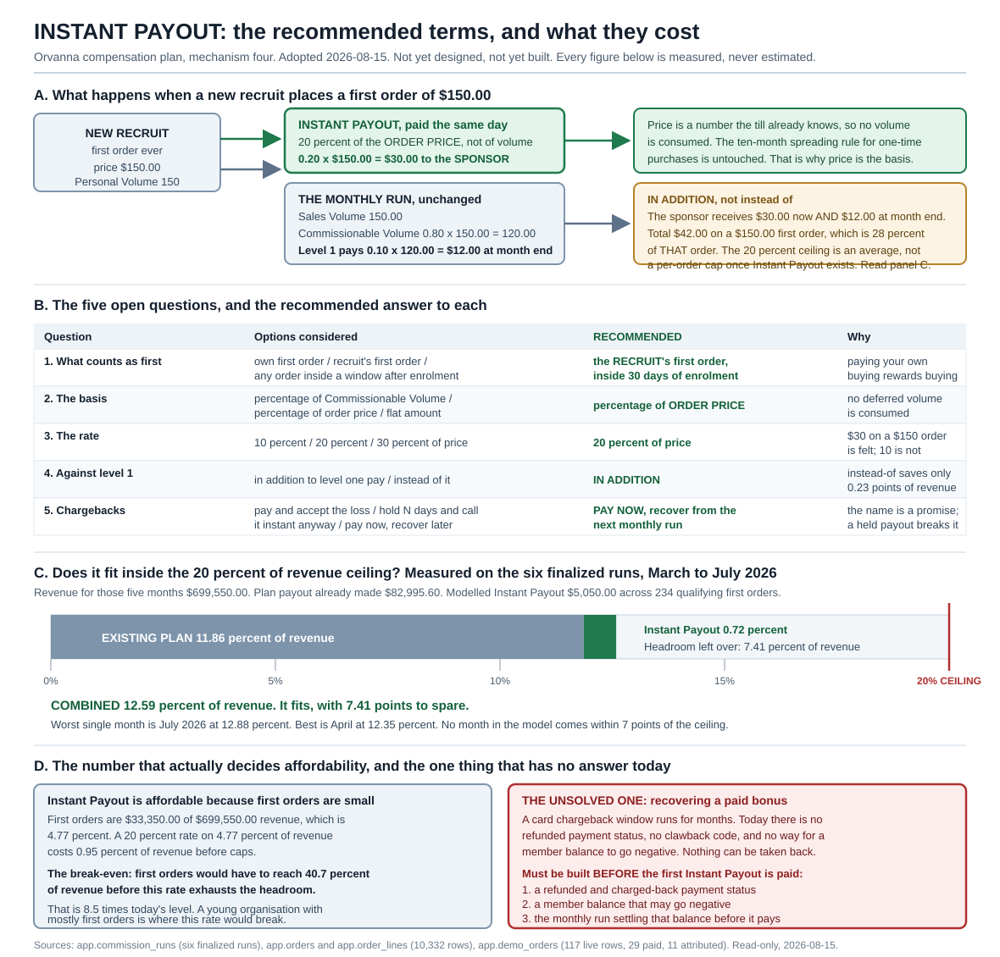

# 10. Instant Payout: costed terms for Howard to choose between

**Owner of this document:** the compensation engineer on the Orvanna build team.
**Written:** 2026-08-15.
**Status: THE RECOMMENDED PACKAGE IN SECTION 9 IS APPROVED BY HOWARD, 2026-08-15, AT 20
PERCENT, WITH ONE RULE HE ADDED. IT IS STILL NOT BUILT. Every query behind every number
was read-only against production. No migration, no engine change, and no code of any kind
has been written for this mechanism.**

> **APPROVAL, 2026-08-15.** Howard's words: **"20 on instant payout and it does not roll up
> to the upline"**.
>
> Two things landed in that sentence. The first confirms the recommended rate of **20 percent
> of the order price**. The second is a **new rule Howard added**, now term 14 in section 9.1
> and section 6.4 below: **an Instant Payout is terminal at the sponsor.** It pays the
> sponsor and nobody above them.
>
> **The chargeback recovery path remains unanswered and unbuilt.** Approving a rate does not
> build a way to get the money back. Section 7 still stands as written, and term 12 is still
> the gate on the whole mechanism.

This document exists for one reason. Howard wants a compensation plan brochure that
includes Instant Payout. A brochure has to state a specific promise, and Instant Payout
today is a name with no terms behind it. Section 7A of the compensation plan and section 12
of the shop-to-compensation document both record it as adopted, unbuilt, and carrying five
unanswered questions. This document answers each of those five as a costed option set.

**Acronym key, used throughout.** Personal Volume (PV). Sales Volume (SV). Commissionable
Volume (CV). Team Volume (TV). Structured Query Language (SQL). Coordinated Universal Time
(UTC). Each is spelled out again the first time it appears in the body text.

**Sources. Every figure below came from one of these, and nothing else.**

- Read-only SQL against the live Supabase project `oiyibdczkokegaxkwulv`, 2026-08-15:
  `app.commission_runs`, `app.run_member_results`, `app.commission_lines`, `app.orders`,
  `app.order_lines`, `app.members`, `app.products`, `app.demo_orders`
- `C:\Users\howar\Desktop\Desktop\ORVANNA\DOCUMENTATION\03-COMPENSATION-PLAN.md`
- `C:\Users\howar\Desktop\Desktop\ORVANNA\DOCUMENTATION\09-LINKING-SHOP-TO-COMP.md`
- `C:\Users\howar\Desktop\Desktop\ORVANNA\MLM-PILOT\db\comp\001_comp_engine.sql`

**The rule I held to.** No number in this document is estimated, scaled, or inferred. Where
the data cannot support a figure, section 4.6 and section 6.4 say so plainly instead of
producing one.

---

## 1. Lead with the picture

Plain path to that image:
`C:\Users\howar\Desktop\Desktop\ORVANNA\DOCUMENTATION\diagrams\instant-payout.svg`

The same thing in one paragraph. A new recruit places a first order of $150.00. Their
sponsor is paid 20 percent of that **price**, $30.00, the same day. At month end the
ordinary plan still runs and the sponsor also receives their normal level one commission of
$12.00, which is 10 percent of the recruit's Commissionable Volume of $120.00. The sponsor
therefore receives $42.00 on a $150.00 first order. Across the five months of real run data,
that design costs 0.72 percent of revenue on top of the 11.86 percent the plan already pays,
for a combined 12.59 percent against a ceiling of 20 percent.

---

## 2. The measured baseline, before anything is added

Everything in this document is costed against real finalized runs, not against a model.
There are six of them, February through July 2026, on the seeded 1,000-member organisation.

**One fact makes the arithmetic simple.** In `app.products`, every row has
`volume_points` exactly equal to `price`, for all twelve products, verified directly.
Personal Volume equals dollars, so **Sales Volume equals revenue**. There is no conversion
step anywhere below.

| Period | Revenue (Sales Volume) | Commissionable Volume | Payout | Payout as share of revenue | Members paid |
|---|---|---|---|---|---|
| 2026-02 | 104,450.00 | 83,560.00 | 11,906.00 | 11.40% | 179 |
| 2026-03 | 114,950.00 | 91,960.00 | 13,434.00 | 11.69% | 206 |
| 2026-04 | 124,600.00 | 99,680.00 | 14,636.00 | 11.75% | 227 |
| 2026-05 | 138,950.00 | 111,160.00 | 16,507.20 | 11.88% | 248 |
| 2026-06 | 148,500.00 | 118,800.00 | 17,749.20 | 11.95% | 261 |
| 2026-07 | 172,550.00 | 138,040.00 | 20,669.20 | 11.98% | 284 |
| **All six** | **804,000.00** | **643,200.00** | **94,901.60** | **11.80%** | |

**February is excluded from every cost model below, and here is why.** 596 of the 1,000
members have their first-ever order in February 2026, because that is the month the seeded
data begins. That is a property of the seed script, not a property of member behaviour. A
first-order bonus costed against February would be costed against a one-off event that can
never recur. Every model below runs on **March through July 2026, five months**, where new
first orders arrive at an ordinary rate.

**The five-month baseline, which is the frame for every figure in this document:**

| Figure | Value | How it was derived |
|---|---|---|
| Revenue, March to July | **699,550.00** | 114,950 + 124,600 + 138,950 + 148,500 + 172,550 |
| Payout already made | **82,995.60** | 13,434 + 14,636 + 16,507.20 + 17,749.20 + 20,669.20 |
| Payout as share of revenue | **11.8641%** | 82,995.60 / 699,550.00 |
| The plan's stated ceiling | **20% of revenue** | 25 percent of Commissionable Volume, and Commissionable Volume is 80 percent of revenue, so 0.25 x 0.80 = 0.20 |
| The ceiling in dollars | **139,910.00** | 0.20 x 699,550.00 |
| **Headroom available to spend** | **56,914.40, which is 8.1359 points of revenue** | 139,910.00 minus 82,995.60 |

That 8.14 points of headroom is the budget. Every option below is judged against it.

---

## 3. The first-order cohort, measured

This is the population an Instant Payout would pay on. A member's first order is defined
here as the earliest `volume_month` in which they have any order with status `completed`.

| Month | Members placing a first order | Their Sales Volume | Their Commissionable Volume | Sponsors who were qualified that month | Level one commission actually paid on them |
|---|---|---|---|---|---|
| 2026-03 | 52 | 5,450.00 | 4,360.00 | 43 | 348.00 |
| 2026-04 | 52 | 4,750.00 | 3,800.00 | 37 | 276.00 |
| 2026-05 | 75 | 8,300.00 | 6,640.00 | 47 | 436.00 |
| 2026-06 | 40 | 3,750.00 | 3,000.00 | 29 | 220.00 |
| 2026-07 | 69 | 11,100.00 | 8,880.00 | 54 | 640.00 |
| **Total** | **288** | **33,350.00** | **26,680.00** | **210** | **1,920.00** |

Two cross-checks, because a cohort table that does not reconcile is worthless:

- Commissionable Volume is 0.80 of Sales Volume: 0.80 x 33,350.00 = 26,680.00. It agrees.
- The level one commission column is exactly 10 percent of the Commissionable Volume
  belonging to first-order members whose sponsor was qualified. For July that measured
  6,400.00 of Commissionable Volume, and 0.10 x 6,400.00 = 640.00. It agrees in all five
  months.

**Two numbers from this table drive everything that follows.**

**Average first order = 33,350.00 / 288 = $115.80.** That is what a bonus rate is applied to.

**First orders are 33,350.00 of 699,550.00 of revenue, which is 4.7674 percent.** That single
percentage is why Instant Payout is affordable, and section 4.5 explains exactly why.

### 3.1 The size of a first order, which decides whether a flat amount is safe

| First order size | Count, March to July | Share |
|---|---|---|
| $50.00 | 121 | 42.0% |
| $100.00 | 72 | 25.0% |
| $150.00 | 41 | 14.2% |
| $200.00 | 26 | 9.0% |
| $250.00 | 9 | 3.1% |
| $300.00 | 8 | 2.8% |
| $350.00 | 6 | 2.1% |
| $400.00 | 5 | 1.7% |
| **Total** | **288** | **100%** |

Check: (121 x 50) + (72 x 100) + (41 x 150) + (26 x 200) + (9 x 250) + (8 x 300) +
(6 x 350) + (5 x 400) = 6,050 + 7,200 + 6,150 + 5,200 + 2,250 + 2,400 + 2,100 + 2,000 =
**33,350.00**. It agrees with the cohort table.

**Forty two percent of first orders are the smallest order the catalog allows.** Remember
that number when you reach the flat-amount option in section 5.

### 3.2 How quickly a first order follows enrolment

| Month | First orders | Placed within 30 days of enrolment | Average days from enrolment to first order |
|---|---|---|---|
| 2026-03 | 52 | 52 | 13.0 |
| 2026-04 | 52 | 50 | 27.4 |
| 2026-05 | 75 | 74 | 15.6 |
| 2026-06 | 40 | 39 | 14.5 |
| 2026-07 | 69 | 69 | 12.7 |
| **Total** | **288** | **284** | |

**284 of 288, which is 98.61 percent, of all first orders already happen inside 30 days.**
This is the most useful single fact in the document, and section 4.3 explains why.

---

## 4. Question one: what counts as "first"

### 4.1 The three options, and who each one actually pays

| Option | Who receives the money | What behaviour it pays for |
|---|---|---|
| **A. The member's own first order ever** | The buyer | **Buying.** The member is paid for placing an order on their own account. No selling is required, no other person is involved, and the money can be earned entirely alone. |
| **B. The first order of somebody they personally sponsored** | The sponsor | **Selling.** The sponsor is paid only when a different human being decides to buy. Nobody can trigger it alone. |
| **C. Any order inside a window after enrolment** | Unspecified by the option itself | **Speed.** This is not a third payee. It is a deadline that can be attached to A or to B. |

### 4.2 Weighing them against Howard's stated goal

Howard's words, recorded verbatim in section 12 of the shop-to-compensation document: "I do
want to think about providing incentives for people to **sell**".

Option A does not pay for selling. It pays for buying, and it pays the buyer. Worse, it
collides head-on with the plan's clearest existing sentence, in the quick reference card of
the compensation plan: "Does my own buying earn me anything? No. It qualifies you and it
pays your upline." Option A would make that sentence false for exactly one order per member.
For a plan that has to survive being read by a sceptic, paying somebody a bonus for buying
their own starter order is the single most criticised shape in the industry.

**Option B pays for selling, and it pays the person who sold.** It also matches how the rest
of the plan already works: all money in Orvanna flows upward from a buyer to the people above
them. Instant Payout under option B is simply an accelerated, enlarged version of the level
one payment that already exists on that same order.

There is a third argument for B that has nothing to do with ideology. **Under option B the
company only ever pays when new revenue arrives from a new person.** Under option A the
company pays on an order that a member could place for themselves, which means the bonus and
the revenue can come from the same wallet.

### 4.3 Why the window should be added on top, not chosen instead

Option C costs almost nothing to add, because the behaviour is already there. 284 of 288
first orders happen within 30 days of enrolment. Restricting Instant Payout to a 30-day
window therefore removes **4 events out of 288**, which is 1.39 percent of the cost, while
adding three real properties:

1. **A deadline is a selling tool.** "You have 30 days" is a sentence a sponsor can say to a
   new recruit. "Whenever you get round to it" is not.
2. **It bounds the liability tail.** Without a window, a member who enrolled in 2024 and
   finally buys in 2027 triggers a first-order bonus three years later. With a window, the
   obligation expires.
3. **It gives the brochure a specific promise**, which is the whole reason this document
   exists.

### 4.4 Recommendation for question one

> **RECOMMENDED: option B with option C attached. Instant Payout is paid to the SPONSOR, on
> the first order placed by a member they personally sponsored, when that order is placed
> within 30 days of that member's enrolment date.**

Cost consequence of the window: 284 qualifying events instead of 288, before any other gate
or cap.

### 4.5 A cost note that applies to A and B equally

Options A and B produce **the same number of events**, because every first order has exactly
one buyer and at most one sponsor. In the five-month window all 288 first-order members have
a sponsor. The choice between A and B therefore changes **who is paid**, not **how much is
paid**, and every cost figure in section 5 applies to both. That is worth knowing, because
it means the choice can be made on behaviour alone without a cost trade-off.

### 4.6 What the live shop data can and cannot tell us here

The live shop has 117 orders, 29 paid, 11 naming a member. It cannot support any Instant
Payout cost model, and the reason is worth stating rather than working around.

- The 11 attributed paid orders belong to four members: GW-000001, GW-000002, GW-000003 and
  GW-000014. All four already have completed orders reaching back to February 2026: 30, 12,
  54 and 6 completed orders respectively. **None of the 11 is anybody's first order.**
- No member has ever enrolled through the live site, because enrolment is permanently
  presented as coming soon. There are zero live enrolment events, so there is zero data on
  the enrolment-to-first-order window from real traffic.

**Therefore: Instant Payout would pay exactly $0.00 on today's real live sales, under every
one of the three definitions of "first".** That is a measured floor, not an estimate. The
seeded 1,000-member organisation is the only dataset in this project that contains first-order
events, which is why every cost model in this document runs on it.

---

## 5. Question two: the basis, and question three: the rate

These two are answered together, because a rate has no meaning without a basis.

### 5.1 The three bases are three different promises

Remember the plan's central fact: **Commissionable Volume is 80 percent of the money.** So
20 percent of Commissionable Volume and 20 percent of price are not the same promise. On a
$150.00 first order:

| Basis | Arithmetic | Bonus |
|---|---|---|
| 20 percent of Commissionable Volume | 0.20 x (0.80 x 150.00) = 0.20 x 120.00 | **$24.00** |
| 20 percent of order price | 0.20 x 150.00 | **$30.00** |
| Flat $25.00 | fixed | **$25.00** |

A percentage of Commissionable Volume is always exactly 80 percent of the same percentage of
price. Quoting a rate without naming its basis therefore overstates or understates the promise
by a quarter.

### 5.2 The collision with the ten-month spreading rule, and which bases avoid it

Howard decided on 2026-08-15 that a one-time purchase, which costs ten times the monthly price
and carries ten times the Personal Volume, has its volume recognised across ten months, one
tenth per month. That is policy P4 in migration 019 and it is the reason `app.orders` receives
ten rows for one one-time sale.

**A Commissionable Volume basis has to answer a question that has no good answer.** Consider a
one-time Payment Agent: $1,000.00 paid at the till, 1,000 Personal Volume, recognised as 100
per month for ten months.

| If the basis is Commissionable Volume, which month's? | Result |
|---|---|
| The first slice only | Bonus computed on 0.80 x 100 = 80.00, against $1,000.00 actually collected. The sponsor is paid as though the recruit bought a $100.00 product. |
| The whole un-spread volume | Bonus computed on 0.80 x 1,000 = 800.00, paid at once on volume the plan deliberately decided not to recognise at once. This is the collision named in section 12 of the shop-to-compensation document. |

**A price basis has no such question, because it does not touch the volume ledger at all.**
The price is $1,000.00, it is known at the instant the payment succeeds, it is the number
already stored on the receipt, and it is the number the processor confirmed. The ten-month
spreading rule continues to govern volume exactly as decided, untouched, and the Instant
Payout is computed from a completely separate quantity: the money that actually arrived.

**A flat amount also avoids the collision**, for the same reason: it consumes no volume.

There is a second reason to prefer price, and it matters for the brochure. **The 20 percent
ceiling is stated as a percentage of revenue.** A bonus expressed as a percentage of price is
directly comparable to that ceiling with no conversion. A bonus expressed as a percentage of
Commissionable Volume has to be converted before anyone can tell whether it fits.

### 5.3 What each basis and rate costs, measured

All figures are March through July 2026, applied to the 288 first-order events, paid **in
addition** to existing level pay, with no caps and no gates. Revenue is 699,550.00 and the
existing plan payout is 82,995.60, which is 11.8641 percent of revenue.

| Basis | Rate | Cost arithmetic | Cost | Cost as share of revenue | Combined plan cost | Combined as share of revenue | Fits the 20 percent ceiling? |
|---|---|---|---|---|---|---|---|
| Percentage of **price** | 10% | 0.10 x 33,350.00 | 3,335.00 | 0.48% | 86,330.60 | **12.34%** | YES |
| Percentage of **price** | **20%** | 0.20 x 33,350.00 | **6,670.00** | **0.95%** | **89,665.60** | **12.82%** | **YES** |
| Percentage of **price** | 30% | 0.30 x 33,350.00 | 10,005.00 | 1.43% | 93,000.60 | **13.29%** | YES |
| Percentage of Commissionable Volume | 10% | 0.10 x 26,680.00 | 2,668.00 | 0.38% | 85,663.60 | 12.25% | YES |
| Percentage of Commissionable Volume | 20% | 0.20 x 26,680.00 | 5,336.00 | 0.76% | 88,331.60 | 12.63% | YES |
| Percentage of Commissionable Volume | 30% | 0.30 x 26,680.00 | 8,004.00 | 1.14% | 90,999.60 | 13.01% | YES |
| **Flat** per qualifying order | $10.00 | 10.00 x 288 | 2,880.00 | 0.41% | 85,875.60 | 12.28% | YES |
| **Flat** per qualifying order | $25.00 | 25.00 x 288 | 7,200.00 | 1.03% | 90,195.60 | 12.89% | YES |
| **Flat** per qualifying order | $50.00 | 50.00 x 288 | 14,400.00 | 2.06% | 97,395.60 | 13.92% | YES |

### 5.4 The honest headline: at this scale, no candidate level breaks the ceiling

Every option in that table fits, and several fit with room to spare. **The 20 percent ceiling
is not the binding constraint on Instant Payout in a mature organisation**, and saying
otherwise would be theatre. The reason is arithmetic, and it is worth understanding rather
than trusting:

Instant Payout costs `rate x (first-order share of revenue)`. First orders are 4.7674 percent
of revenue. So even a rate of 100 percent of the first order price would cost 4.77 percent of
revenue, and 11.86 + 4.77 = 16.63 percent, still inside 20.

**So the real question is not "does this rate fit today" but "at what point would it stop
fitting".** That is a break-even, and it is the number to actually watch:

| Rate, as a percentage of first order price | First orders would have to reach this share of revenue before the 8.1359 points of headroom are exhausted | Multiple of today's 4.7674 percent |
|---|---|---|
| 10% | 81.36% | 17.1x |
| **20%** | **40.68%** | **8.5x** |
| 30% | 27.12% | 5.7x |
| 50% | 16.27% | 3.4x |
| 100% | 8.14% | 1.7x |

**A young organisation is where this breaks, not an old one.** In a company where most orders
are somebody's first, first-order share of revenue approaches 100 percent, and a 50 percent
rate would blow through the ceiling on its own. A 20 percent rate holds until first orders are
four in every ten dollars of revenue, which no organisation with a subscription base sustains.

**This is the reason to prefer 20 percent over 30 or 50.** Not affordability today. Survivability
if Orvanna's mix ever shifts toward new members.

### 5.5 Why not a flat amount, despite it being the cheapest to explain

A flat amount fails on behaviour, not on cost. 42 percent of first orders are exactly $50.00,
the smallest order the catalog allows.

| Flat amount | What it pays on a $50.00 first order | What it pays on a $400.00 first order |
|---|---|---|
| $10.00 | 20% of price | 2.5% of price |
| $25.00 | 50% of price | 6.3% of price |
| $50.00 | **100% of price** | 12.5% of price |

**A flat amount makes the cheapest possible first order the optimal one for the sponsor**,
because the bonus is identical either way and the recruit's resistance is lowest. That is the
exact opposite of an incentive to sell. It also creates a real farming problem: a flat $50.00
pays back the entire cost of a $50.00 order, so a farmer breaks even at zero risk before any
chargeback is involved. Section 8 develops that point.

A percentage of price does the opposite. It scales with the sale, so a sponsor who sells a
Constellation Pack instead of a single support agent is paid sixteen times as much.

### 5.6 Recommendation for questions two and three

> **RECOMMENDED: 20 percent of the order PRICE.**
>
> Price, because it consumes no deferred volume, needs no conversion to be compared with the
> ceiling, and is the one number the payment processor independently confirmed.
>
> 20 percent, because 10 percent pays $10.00 on the average first order of $115.80, which is
> not enough to feel like an event, and because 30 percent and above shortens the break-even
> runway from 8.5 times today's first-order share to 5.7 times or less for a benefit nobody
> can point at.
>
> Uncapped and ungated cost: **6,670.00 over five months, 0.95 percent of revenue, combined
> 12.82 percent. It fits inside the 20 percent ceiling with 7.18 points to spare.**

---

## 6. Question four: in addition to level one pay, or instead of it

### 6.1 What each shape means on one order

Take the recommended 20 percent of price, on a $150.00 first order, where the sponsor is
qualified.

| Shape | Instant Payout | Level one at month end | Sponsor receives | Company pays, as a share of that order's price |
|---|---|---|---|---|
| **In addition** | $30.00 | $12.00 | $42.00 | 28.0% |
| **Instead of** | $30.00 | suppressed | $30.00 | 20.0% |

Note what the "in addition" row exposes, because the brochure will have to be honest about it:
**once Instant Payout exists, 20 percent of price is no longer the most a single order can
pay.** A first order can pay 20 percent instantly plus up to 20 percent through the five
levels, so up to 40 percent of its own price. The 20 percent ceiling survives only in
aggregate, because first orders are 4.77 percent of revenue.

### 6.2 What each shape costs, measured

Level one commission actually paid on first-order members in the five months is **1,920.00**,
measured directly from `app.commission_lines`. All-level commission paid on those same members
is **3,766.40**, so levels two through five account for 1,846.40 of it.

| Shape | Cost arithmetic | Cost | Share of revenue | Combined | Combined share of revenue | Fits? |
|---|---|---|---|---|---|---|
| **In addition to level one** | 6,670.00 | **6,670.00** | 0.95% | 89,665.60 | **12.82%** | YES |
| **Instead of level one on that order** | 6,670.00 minus 1,920.00 | **4,750.00** | 0.68% | 87,745.60 | **12.54%** | YES |
| Instead of all five levels on that order | 6,670.00 minus 3,766.40 | 2,903.60 | 0.42% | 85,899.20 | 12.28% | YES |

### 6.3 Recommendation for question four

> **RECOMMENDED: IN ADDITION.**

Three reasons, in order of weight.

**The saving does not buy anything.** Replacing level one saves 1,920.00 across five months,
which is **0.27 points of revenue**. Both shapes fit the ceiling comfortably. Paying 0.27
points to keep the plan simple is the cheapest simplicity available anywhere in this document.

**"Instead of" adds a suppression rule to an engine that currently has none.**
`app.fn_run_commission` writes a level one line for every frontline source without exception.
"Instead of" requires the run to know which orders already produced an Instant Payout and to
skip a line it would otherwise write. That is a new class of conditional inside the one
function everything else depends on, and it breaks the plan's cleanest sentence: level one is
always 10 percent of your frontline's Commissionable Volume.

**"Instead of" pays the sponsor less exactly when the sponsor did the most work.** Level one
pays 10 percent of Commissionable Volume, which is 8 percent of price. At a 20 percent Instant
Payout the sponsor is still better off under "instead of" than under no bonus at all, but the
new recruit's first order becomes the one order on which the sponsor's ordinary commission
silently disappears. That is a hard thing to explain in a brochure and an easy thing to
resent.

### 6.4 The no-rollup rule, added by Howard on 2026-08-15

> **RULE, APPROVED: an Instant Payout is TERMINAL AT THE SPONSOR. It pays the sponsor and
> nobody above them. It generates no level pay, no depth pay, and no volume of any kind that
> could reach anyone further up the tree. Rank does not extend it, because there is no depth
> for rank to reach through.**

Howard's words: "it does not roll up to the upline".

**This was already true of the recommended terms, and it is now stated rather than implied.**
The recommended basis is the order price rather than Commissionable Volume, so an Instant
Payout consumes no volume, and every upward payment in Orvanna is computed from volume. The
no-rollup behaviour therefore fell out of the design as a consequence. **A consequence is not
a rule.** A future implementer who changed the basis, or who wrote an Instant Payout as an
order row so that it would appear on a report, would break it without ever intending to. Now
it cannot be broken by accident, because breaking it means contradicting a written rule
rather than overlooking a side effect.

**What the rule forbids, stated so an implementer cannot misread it.** Four things, and all
four are ways this could go wrong in code rather than hypotheticals invented for symmetry:

1. **No commission lines above the sponsor.** An Instant Payout writes exactly one line, to
   one earner, for one event. It never produces a level 2, 3, 4 or 5 line for the sponsor's
   own upline.
2. **No volume anywhere.** The Instant Payout amount is never written into `app.orders` or
   `app.order_lines`, and never enters Sales Volume, Commissionable Volume or Team Volume for
   anybody, including the sponsor who received it.
3. **No effect on rank or qualification.** Receiving an Instant Payout does not help the
   sponsor reach the 100.00 qualification threshold, does not count toward any Team Volume
   threshold, and does not make any leg active.
4. **Paid depth is irrelevant to it.** Every other payment in the plan is gated by the
   earner's paid depth. Instant Payout has no level, so there is nothing for paid depth to
   gate. An Executive and a plain Member receive an identical Instant Payout on an identical
   first order.

**Why this is the right rule and not merely Howard's preference.** Instant Payout pays out of
money that is still inside the chargeback window (section 7). A payment that rolls up spreads
that exposure across five people instead of one, and a clawback then has to reach five
balances rather than one. **Terminal at the sponsor means one payee, one amount, one
`demo_order_id`, and one balance line to reverse.** It is the single design choice that makes
the recovery path in section 7.6 tractable rather than a distributed-settlement problem.

**What the rule forecloses, measured.** Nothing was lost by adopting it, because nothing was
ever costed with rollup in it. But it is worth knowing the size of the door it closes. Had an
Instant Payout rolled up the plan's ordinary ladder above the sponsor, the four levels above
level one would add 5 + 5 + 3 + 2 = 15 percentage points on the same capped basis of
25,250.00, which is **3,787.50** over the five months. The total would have been 8,837.50
instead of 5,050.00, and the combined plan cost **13.13 percent of revenue instead of 12.59
percent**. That figure is an upper bound on a shape nobody proposed, quoted only so the rule
has a size attached to it.

---

## 7. Question five: the chargeback problem, which has no answer today

### 7.1 The state of the world, stated accurately

- `app.demo_orders.payment_status` permits exactly five values: `created`, `processing`,
  `succeeded`, `failed`, `abandoned`. **There is no refunded state and no charged-back state.**
- `app.orders.status` permits `completed` and `refunded`, but nothing in the codebase has ever
  written `refunded`, and `app.fn_run_commission` only ever reads `completed`.
- A database trigger refuses to move a demo order out of a terminal state, and `succeeded` is
  terminal.
- There is no member balance table, no concept of a negative balance, and no disbursement
  record of any kind. The system computes statements; it does not pay them.

**Consequence: today, an Instant Payout once paid cannot be recovered by any mechanism.** Not
by a hard route and not by a slow one. There is no route.

A card chargeback window runs for months. Instant Payout by definition pays out of money that
can still be taken back.

### 7.2 The three options

| Option | What it does | What it costs |
|---|---|---|
| **A. Pay immediately and accept the loss** | No clawback is built. Every reversed order leaves a paid bonus behind. | The loss is 100 percent of every Instant Payout attached to a reversed order. See 7.4 for why no dollar figure is quoted. |
| **B. Hold for a defined number of days, and call it Instant only in marketing** | The bonus is computed at once and paid after, say, 30 or 60 days. Nothing has to be recovered because nothing has been released. | Cheap to build and dishonest to say. |
| **C. Pay immediately and recover from the next monthly commission run** | The bonus is released at once. If the order is later reversed, a negative line is written against the member and the next monthly run settles it before paying anything out. | Requires a negative-balance concept that does not exist today. |

### 7.3 Why option B should be argued against, plainly

**The name is the promise.** A mechanism called Instant Payout that arrives in 30 days is not a
delayed bonus, it is a false statement printed in a brochure. Section 12 of the
shop-to-compensation document already made this point and it is worth repeating in the
strongest terms: a delayed or reversed Instant Payout damages trust more than a bonus that
never promised speed in its name.

If Howard wants a held bonus, the correct move is to **change the name**, not to keep the name
and change the behaviour. A held bonus is a perfectly good mechanism. It is just not this one.

### 7.4 Why no chargeback loss figure appears in this document

There is not one refund, not one chargeback, and not one reversed order anywhere in this
system. `app.demo_orders` cannot represent one, and `app.orders.status = 'refunded'` has never
been written. **The data cannot support a chargeback loss estimate, so none is given.**

What can be given honestly is the **exposure**, which is a bound rather than a prediction:

- Maximum exposure per event, under the recommended terms in section 9, is **$50.00**, because
  the basis is capped at $250.00 of price and the rate is 20 percent.
- Maximum exposure across the modelled five months is **$5,050.00**, because that is the whole
  modelled cost. Every dollar of it sits inside a chargeback window for some period.
- The exposure is unrecoverable in full today, under option A.

### 7.5 Recommendation for question five

> **RECOMMENDED: option C. Pay immediately, and recover from the next monthly commission run.**
> **And build the recovery path BEFORE the first Instant Payout is paid, not after.**

Option C is the only one that keeps the promise the name makes while leaving the company a
route back to its money. Option A keeps the promise and hands away the money. Option B keeps
the money and breaks the promise.

### 7.6 Exactly what would have to be built for option C

Four pieces, in dependency order. None of them exists today.

**Piece 1: a reversed state on the payment record.**
Add `charged_back` and `refunded` to the `payment_status` check constraint on
`app.demo_orders`, and amend the terminal-state trigger to permit exactly one new transition,
`succeeded` to `charged_back` or `succeeded` to `refunded`, and no others. Without this
amendment the trigger blocks the very write the clawback depends on. Something has to write
that status: either a processor webhook or a sweep that re-retrieves payments.

**Piece 2: a member balance that may go negative.**
A new table, `app.member_balance_lines`, with one row per event: member, amount which may be
negative, reason, the `demo_order_id` the amount relates to, and the run that settled it if
any. An Instant Payout is a positive line. A clawback is a negative line for the same amount
carrying the same `demo_order_id`. A member's balance is the sum of their unsettled lines. This
is the single new concept the plan does not have, and everything else follows from it.

**Piece 3: settlement inside the monthly run.**
`app.fn_run_commission` gains one step after it computes statements and before anything is
considered payable: a member's payable amount is their commission total minus their outstanding
negative balance, floored at zero, with any remaining negative balance carried into the next
month. Two properties must be preserved and both are easy to lose: the commission lines
themselves must stay exactly as they are today, because they are frozen by trigger once a run
is final, and the settlement must be recorded as its own line rather than by altering a
statement. **A statement says what was earned. A balance says what was paid. Conflating them is
how this feature goes wrong.**

**Piece 4: an exposure cap while a balance is negative.**
A member carrying an unsettled negative balance must not be able to collect further Instant
Payouts until it clears. Without this, a member with a reversed order can farm new bonuses to
outrun their own debt.

**One design note that costs nothing and should be taken now.** `app.commission_lines` already
has a `payout_type` column, and today every one of its 22,076 rows holds the single value
`unilevel_level_pay`. That column was built for exactly this. An Instant Payout line should be
written as `payout_type = 'instant_payout'` and a clawback as `payout_type =
'instant_payout_clawback'`, so that every existing report which groups by payout type keeps
working and the two kinds of money never silently merge.

---

## 8. Caps and abuse

### 8.1 The finding that reframes this whole section

The instinct is that a cap is what stops somebody farming first orders through fake
enrolments. Work the arithmetic and that turns out to be false.

| Rate, as a share of first order price | Farmer spends on a $50.00 first order | Farmer collects | Farmer's net |
|---|---|---|---|
| 20% | $50.00 | $10.00 | **minus $40.00** |
| 50% | $50.00 | $25.00 | **minus $25.00** |
| 99% | $50.00 | $49.50 | **minus $0.50** |
| 100% | $50.00 | $50.00 | zero |
| 120% | $50.00 | $60.00 | **plus $10.00** |

**Any Instant Payout strictly below 100 percent of the order price is self-limiting against a
farmer paying with their own money.** They lose money on every fake enrolment. No cap is
needed to achieve that; the rate being a percentage of price achieves it by construction. This
is a further argument against a flat amount, where a flat $50.00 against a $50.00 minimum order
sits exactly on the break-even line.

**The farming vector that actually works is a stolen card**, where the order costs the farmer
nothing and the bonus is pure profit, and the loss appears months later as a chargeback. That
is not a cap problem. It is precisely the problem section 7 addresses, and it is the strongest
argument for building the clawback path first.

### 8.2 What caps are actually for

Caps bound the company's worst-month exposure and block the shell-account pattern where one
person enrols many accounts. Three are worth having, and each was measured.

Baseline for all three: 20 percent of price, uncapped and ungated, costs **6,670.00** across
the five months.

| Control | What it forbids | Cost | Change against 6,670.00 | Combined share of revenue |
|---|---|---|---|---|
| Cap the basis at $250.00 per first order, so no single Instant Payout exceeds $50.00 | Nothing at all today; it trims the tail | 6,320.00 | minus 5.2% | 12.77% |
| Cap 3 first orders per sponsor per calendar month | The July outlier only; the observed maximum in five months is 6 first orders from one sponsor, in July | 6,550.00 | minus 1.8% | 12.80% |
| Both of the above together | | 6,200.00 | minus 7.0% | 12.75% |
| **Sponsor must already have a completed purchase of their own** | A sponsor account that has never bought anything from collecting bonuses | 5,480.00 | minus 17.8% | 12.65% |

For comparison, two qualification gates that were considered and rejected:

| Gate considered | Cost | Change | Why rejected |
|---|---|---|---|
| Sponsor must be qualified in the same month, meaning own Sales Volume of 100.00 or more | 4,800.00 | minus 28.0% | **Unknowable at the instant.** Monthly qualification is only settled at month end. A payout that cannot be computed until the month closes is not instant. |
| Sponsor must have been qualified in the previous month | 3,790.00 | minus 43.2% | Knowable, but it denies the bonus on 43 percent of first-order volume, including to sponsors who **are** qualified in the current month. It punishes exactly the person who just did the selling. |

**The "sponsor has already bought something" gate is the right one**, because it is the only
gate in that list that is knowable at the instant the payment succeeds, has a plain-English
justification anybody accepts, and closes the shell-account route. It costs 17.8 percent of
the bonus, which is a fair price for making the mechanism defensible.

### 8.3 Recommendation for caps

> **RECOMMENDED: all three controls together.**
> 1. The basis is capped at $250.00 of order price, so no single Instant Payout exceeds $50.00.
> 2. No more than 3 Instant Payouts to one sponsor in one calendar month.
> 3. The sponsor must already have at least one completed purchase of their own on record.

---

## 9. THE APPROVED PACKAGE, on one page

**APPROVED BY HOWARD, 2026-08-15, at 20 percent, with term 14 added by him. NOT BUILT.**

This is a single coherent set of terms. It is now the policy of record for Instant Payout, and
it is still not implemented anywhere: no migration, no engine change, no column, no function.
Term 12 remains the gate on switching it on.

### 9.1 The terms

| # | Term | The rule |
|---|---|---|
| 1 | **Name** | Instant Payout. The same word in the brochure, the table, the column and the function. |
| 2 | **Who is paid** | The **sponsor**, meaning the member who personally enrolled the buyer. |
| 3 | **What triggers it** | The **first order ever** placed by that sponsored member, placed **within 30 days of that member's enrolment date**. One Instant Payout per member, ever. |
| 4 | **Basis** | The **order price**, exclusive of tax and of any activation fee. Not Commissionable Volume, and not a flat amount. |
| 5 | **Rate** | **20 percent of that price.** |
| 6 | **Cap per event** | The basis is capped at **$250.00**, so no single Instant Payout exceeds **$50.00**. |
| 7 | **Cap per sponsor** | At most **3** Instant Payouts to one sponsor in one calendar month. |
| 8 | **Eligibility of the payee** | The sponsor must already have at least one **completed purchase of their own**. No monthly qualification gate applies, because qualification cannot be known at the instant. |
| 9 | **When it is paid** | At the moment the payment reaches `succeeded`, which is the only status backed by a fresh retrieve from the processor and an exact amount match. |
| 10 | **Against the rest of the plan** | **In addition** to level one pay. No commission line is suppressed. Nothing in `app.fn_run_commission` changes. |
| 11 | **Against volume** | It consumes **no volume**. Sales Volume, Commissionable Volume, Team Volume, ranks and the ten-month spreading rule are all completely untouched. |
| 12 | **Recovery** | If the order is refunded or charged back, the amount is recovered from the member's balance and settled against their next monthly commission run. **This must be built before the first Instant Payout is paid.** |
| 13 | **Ledger** | Written to `app.commission_lines` with `payout_type = 'instant_payout'`, so it never merges silently with level pay in any existing report. |
| **14** | **NO ROLL-UP**, added by Howard, 2026-08-15 | **An Instant Payout is TERMINAL AT THE SPONSOR. It pays the sponsor and nobody above them.** No level pay, no depth pay, and no volume of any kind that could reach anyone further up the tree. One event produces exactly one commission line, to exactly one earner. Rank is irrelevant to it, because it has no level for paid depth to gate. Full rule in section 6.4. |

### 9.2 The modelled cost of exactly those terms

Computed in one read-only SQL query applying terms 3, 5, 6, 7 and 8 simultaneously to the real
first-order events of March through July 2026. Not derived by scaling any earlier figure.

> **Does term 14, the no-rollup rule, change any figure in this table? Checked, and no.**
> Two things could have moved and neither did.
>
> **The Instant Payout column.** The query that produced it emits one amount per qualifying
> event, `0.20 x least(order price, 250.00)`, attributed to that event's single sponsor. There
> is no level expansion in it and there never was: no ancestor walk, no level map, no rate
> ladder. The model was already terminal at the sponsor, so making it a rule confirms the
> figure rather than altering it. **5,050.00 stands.**
>
> **The existing plan payout column.** Those are the actual finalized runs, computed from
> volume. Term 11 means Instant Payout writes no volume, so nothing an Instant Payout does can
> reach `app.fn_run_commission`. **82,995.60 stands, unchanged, on all five months.**
>
> The combined figure of **12.59 percent of revenue is therefore unchanged by the approval**,
> and so is every per-month figure in the table below. Section 6.4 quotes what rollup would
> have cost had it been allowed, purely to give the rule a size.

| Month | Qualifying events | Capped basis | Instant Payout at 20 percent | Existing plan payout | Revenue | Combined as share of revenue |
|---|---|---|---|---|---|---|
| 2026-03 | 45 | 4,550.00 | 910.00 | 13,434.00 | 114,950.00 | **12.48%** |
| 2026-04 | 43 | 3,750.00 | 750.00 | 14,636.00 | 124,600.00 | **12.35%** |
| 2026-05 | 60 | 6,050.00 | 1,210.00 | 16,507.20 | 138,950.00 | **12.75%** |
| 2026-06 | 34 | 3,100.00 | 620.00 | 17,749.20 | 148,500.00 | **12.37%** |
| 2026-07 | 52 | 7,800.00 | 1,560.00 | 20,669.20 | 172,550.00 | **12.88%** |
| **Total** | **234** | **25,250.00** | **5,050.00** | **82,995.60** | **699,550.00** | **12.59%** |

234 of the 288 first orders qualify. The 54 that do not are excluded by the 30-day window,
the three-per-sponsor cap, or the sponsor-has-purchased rule.

### 9.3 Does it fit the ceiling

| Test | Value |
|---|---|
| Instant Payout cost | **5,050.00 over five months** |
| Average per qualifying event | 5,050.00 / 234 = **$21.58** |
| Instant Payout as a share of revenue | 5,050.00 / 699,550.00 = **0.72%** |
| Existing plan as a share of revenue | **11.86%** |
| **Combined** | 88,045.60 / 699,550.00 = **12.59%** |
| **The ceiling** | **20.00%** |
| **Verdict** | **IT FITS. 7.41 points of revenue remain unspent.** |
| Worst single month | July 2026 at **12.88 percent**, which is 7.12 points below the ceiling |
| Best single month | April 2026 at **12.35 percent** |
| How far the mix would have to move before it stops fitting | First orders would have to grow from **4.77 percent** of revenue to **40.68 percent**, which is **8.5 times** today's level |

### 9.4 The two things this package does not solve

**It does not make the 20 percent ceiling a per-order cap.** Under these terms a single first
order can pay 20 percent instantly plus up to 20 percent through the five levels, so up to 40
percent of its own price. The ceiling holds in aggregate only because first orders are 4.77
percent of revenue. The brochure must not claim that no order can pay more than 20 percent
once Instant Payout exists.

**It cannot be switched on until the recovery path exists.** Term 12 is not a nice-to-have. It
is the gate on the whole feature, and section 7.6 lists the four pieces that have to be built.
**Approving the rate on 2026-08-15 did not build any of them.** The chargeback question is
still open, and Instant Payout is still an approved rule that pays nobody, because no software
computes it.

### 9.5 The cheaper variants, kept as a record of what was considered and not taken

Howard approved 20 percent in addition to level pay. These were the two levers available if he
had wanted the mechanism cheaper, and both are recorded here so a future reader can see they
were priced rather than ignored.

| Change | New cost | New combined share of revenue | Still fits? |
|---|---|---|---|
| Drop the rate from 20 percent to 10 percent | 2,525.00 | 12.23% | YES |
| Make it instead of level one pay rather than in addition | 3,466.00 | 12.36% | YES |
| Both of the above | not modelled, because term 10 and term 5 interact and I will not multiply two ratios together and present the product as a measurement | | |

The "instead of" figure of 3,466.00 was measured, not scaled: 5,050.00 of Instant Payout minus
1,584.00 of level one commission that those same 234 events actually produced. **The saving is
1,584.00 over five months, which is 0.23 points of revenue.** That is what "instead of" buys,
and section 6.3 argues it is not worth the complexity.

---

## 10. What this document does not cover

- **No refund or chargeback data exists**, so no loss figure is given and section 7.4 says so
  rather than estimating one.
- **No live first-order events exist**, so the entire cost model runs on the seeded
  1,000-member organisation. Section 4.6 states the measured live figure, which is zero.
- **No disbursement mechanism exists anywhere in Orvanna.** Instant Payout is designed here as
  a computed and recorded obligation. Actually moving money to a member is out of scope for
  this project, as it is for every other mechanism in the plan.
- **I have not verified my own arithmetic.** That is the standing rule for this role. Every
  figure in this document is my query and my calculation, and it should be independently
  recomputed before Howard commits to a brochure that quotes it.
