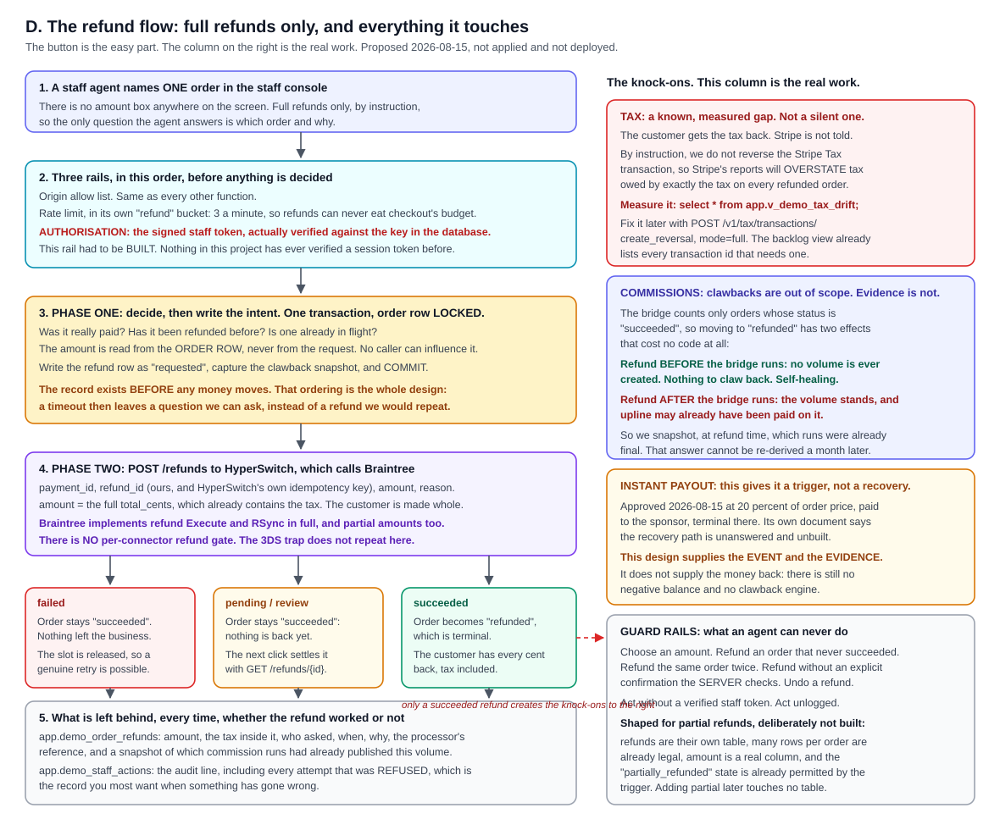

# 11. Refunds: staff only, full amount, and everything it touches

**Owner of this document:** the architect on the Orvanna build team.
**Written:** 2026-08-15.
**Status as of 2026-08-16: LIVE.**

| Artefact | State |
|---|---|
| Migration 022 (refunds schema) | **APPLIED** to project `oiyibdczkokegaxkwulv` and verified |
| Migration 023 (guard fix) | **APPLIED**, see the box below |
| `refund-payment` Edge Function | **LIVE**, version 2, `verify_jwt: true` |
| `list-demo-orders` (extended) | **LIVE**, version 6 |
| `www\staff.html` order history and refund button | **PUBLISHED** |
| The ten direct-call refusals | **ALL TEN REFUSED**, section 16.0 |
| The single test refund | **DONE, AND IT WORKED.** Order `ORV-2026-08-1JSPY4`, $109.75 returned in full. Section 16.0b |
| The staff order history and refund button | **PUBLISHED AND UNGRADED.** No quality assurance checklist row has been run against it |

Both functions were deployed by Howard from the command line tool, which reads straight from
disk, so there is no bundle drift to chase.

> **THE SUCCESS PATH IS PROVEN, 2026-08-16.** A real refund executed end to end:
> order `ORV-2026-08-1JSPY4`, member `GW-000001`, **$109.75 including $9.75 of tax**,
> refund reference `orvrf_1854dcb719b1bd9be0767b97`, acquirer reference
> `cmVmdW5kXzdlc2V5bmE1`, connector `braintree`, status `succeeded`, requested by
> `Orvanna_Staff` from the verified token. The order is now `refunded`.
>
> **The amount was recomputed independently and matches to the cent.** $100.00 taxable at the
> Los Angeles combined rate of 9.750 percent is $9.75; $100.00 plus $9.75 is $109.75;
> `total_cents` and `amount_cents` are both 10,975. This closes the amount-equality check that
> had been deferred since 2026-08-14 on every rail.
>
> **`app.v_demo_tax_drift` now reads 975 cents**, its first non-zero value, exactly the tax on
> the one refunded order that carried a Stripe tax transaction, and exactly what section 7 of
> migration 022 predicted. That is the measurement working, not a fault.
>
> **What this does NOT prove.** The audit row carries `reason_code: 'other'`, which both the
> staff screen and a direct call can produce, so the refund button's wiring is still unproven.
> `already_refunded` has never been returned by the live endpoint: step 7 below was not run.
> The database backstop against a double refund WAS proven independently (a second succeeded
> refund row is refused by the partial unique index). Full record:
> `C:\Users\howar\Desktop\Desktop\ORVANNA\MLM-PILOT\docs\verification\REFUNDS-VERDICT-2026-08-15.md`

> **MIGRATION 022 SHIPPED A DEFECT AND VERIFICATION CAUGHT IT.** The transition guard allowed
> `processing -> refunded` and `created -> refunded`. Migration 010's guard only ever tested
> where a row was coming FROM and leaned on the CHECK constraint to reject values it had never
> heard of; widening that constraint in 022 silently removed the thing doing the work, and
> those two cases fell through to `return new`. Found by the section 9 guard tests minutes
> after applying and before any refund existed, fixed by migration 023, and re-tested: 11 of
> 11 transitions now behave correctly with no regression on the normal
> `processing -> succeeded` path. No data was affected, because the Edge Function requires
> `succeeded` before it will write a refund at all, so this was a missing backstop rather than
> a live hole. **The general lesson: when you widen a CHECK constraint, re-read every trigger
> that was relying on it to be narrow.**

> **THE DEPLOY HAPPENED, AND THE DELIBERATE STOP WAS THE RIGHT CALL.** This block previously
> explained why the code was NOT deployed: the Supabase command line tool held no credential,
> and the only alternative route took file **contents inline**, meaning roughly 2,500 lines
> hand-copied for one bundle and 1,900 for the other. That is exactly the silent bundle drift
> the deploy instructions warn about, on the one path in this project that moves money out of
> the business, and shipping the schema without the code was judged the safer end to a long
> session.
>
> **Howard then ran `supabase login` and deployed both functions from the command line tool**,
> which reads straight from disk. `refund-payment` is version 2, `list-demo-orders` is version
> 6. The platform's own record confirms the route: both report an entrypoint path beginning
> `file:///Users/howar/...`, whereas every function deployed the older way reports a
> `file:///tmp/user_fn_...` path. All eight source files were then hashed on both sides of the
> symbolic link and are byte identical. **There is no transcription step anywhere in this
> deploy, which is the whole reason the stop was worth taking.**
>
> One correction to the old instruction above: it said to deploy with `--no-verify-jwt`. It was
> deployed with `verify_jwt: true` instead, and that is **fine and arguably better**: the staff
> token travels in `x-orvanna-session`, so the platform keeps `Authorization` for its own key
> and the two never collide. The header split was designed for exactly this. The one cost is
> the audit label described in section 16.0.

**Scope, set by Howard on 2026-08-15, in five steps.**

1. *"lets just do the full or partial refunds and then work our way to clawbacks, and lets
   not refund back the tax."*
2. *"if doing 100% refund is the easiest then lets do that."*
3. *"now this can only be available in the staff area."*
4. *"you are going to have to setup an order history for these refunds ... we should be able
   to go into the order and then have a refund button ... these can only be the orders that
   have been placed over the last day or two."*
5. On how much the screen should do about that last rule: *"i can do that as a rule that i
   need to know so you do not have to program so much around that."*

So: **full refunds only**, the whole amount the customer paid coming back in one action with
the tax included, **available to staff and nobody else**, reached from an **order history**
and an **order detail view**, and limited to orders placed in the last **24 hours**, a rule
**enforced on the server** rather than drawn on the screen. Clawbacks are out of scope and
section 10 states exactly what a refund leaves behind so they can be built later. The Stripe
Tax reversal is out of scope and section 11 measures the gap that creates rather than hiding
it. Partial refunds are out of scope and section 7 explains how the schema was shaped to
accept them without a rewrite.

**Acronym key, spelled out here and used short afterwards.** Application Programming
Interface (API). Hash-based Message Authentication Code (HMAC). Row Level Security (RLS).
JavaScript Object Notation (JSON). JavaScript Object Signing and Encryption, commonly called
JSON Web Token (JWT). Coordinated Universal Time (UTC). Sales Volume (SV). Personal Volume
(PV). Three-Domain Secure, the card authentication protocol (3DS). Internet Protocol (IP).
Structured Query Language (SQL). Cross-Site Scripting (XSS). Cross-Site Request Forgery
(CSRF).

---

## 1. Lead with the picture



Plain path to that image:
`C:\Users\howar\Desktop\Desktop\ORVANNA\DOCUMENTATION\diagrams\refund-flow.svg`

The same thing in one paragraph. A staff agent, holding a token whose signature the server
verifies and whose **role the server re-reads from the database**, names one order. The
function confirms the order was really paid, has never been refunded, and has no refund in
flight. It writes down what it is about to do **and commits that record before any money
moves**, then calls HyperSwitch, which calls Braintree. If the refund succeeds the order
moves to a new terminal state, `refunded`, and the customer has every cent back including
tax. Everything in the right hand column of the picture is a consequence somebody has to have
thought about, and that column is why this document is long and the button is short.

---

## 2. Staff only: how the gate actually works, and what it does not do

This section is first because it is the primary security requirement of the feature, not a
user interface detail. A refund moves money **out** of the business, to a party **outside**
it, and it cannot be undone from our side. A Conductor, a shopper, and an anonymous visitor
must never be able to cause one.

### 2.1 Three things that look like they satisfy that, and do not

**a. Rendering the button only on `staff.html` is not a gate.** The Edge Function is a public
HTTPS endpoint. Anyone who reads the shipped JavaScript learns its name and its request
shape. If which page draws a button were the only thing between a stranger and a refund, we
would have shipped a way to move money out of the business from a browser console.

**b. The origin allow list is not authorisation.** `isAllowedOrigin` in `_shared/edge.ts`
answers exactly one question: did this request come from our own site. **Every page on our
site passes it, the shop included.** It is a cross-site protection, and an identity check is
a different thing. It is not described as one anywhere in the code or in this document.

**c. The browser's session object is not evidence.** This is open finding **V-H3**.
`www\staff.html` and `site\index.html` read a session object out of session storage and trust
it; a hand-written one opens the page. The page's own comment says so. **So the browser
cannot be the source of truth about who is asking**, and the design must not reintroduce that
assumption anywhere.

### 2.2 What the gate actually is

Server side, against the database, on every single call, in one place:
`functions\_shared\staff-auth.ts`. This is the single place the decision is made, the way
`_shared\tax.ts` became the single place tax is decided. No second mechanism exists and none
should be written.

Five checks, cheapest first:

1. **Is there a token at all?** No token, no work.
2. **Does it verify?** HMAC using SHA-256 over the payload, keyed with the 32-byte value in
   `app.demo_auth_config` (migration 012). This reuses exactly the mechanism
   `functions\demo-login\index.ts` already uses to *mint* tokens, rather than inventing a
   second one. Nothing in the payload is believed before this passes.
3. **Has it expired?** A perfect signature on an expired token is still a refusal. Eight
   hours, as `demo-login` sets it.
4. **Does that user still exist** in `app.demo_users`? Case-insensitive, matching the
   `demo_users_username_lower_key` index and `demo-login`'s own lookup.
5. **Is their role, as read live from `app.demo_users` right now, `staff`?**

### 2.3 The role comes from the database, not from the token

This is the decision worth understanding. The token carries a `role` claim, and **it is
discarded**. The role is re-read from `app.demo_users` on every call.

That buys three things a signed claim cannot:

- **Revocation that actually works.** Change or delete the row and the next call fails. With
  a trusted claim, a token issued before the change keeps working for its full eight hours no
  matter what the database says.
- **One source of truth.** `app.demo_users.role` is the answer, everywhere, always. A token
  is a cached copy, and cached copies of authorisation decisions go stale.
- **A smaller blast radius if the signing key ever leaked.** A forged token still has to name
  a username that exists *and* carries the staff role in the database.

### 2.4 `admin` is refused, and that is not a typo

The natural assumption is that `admin` outranks `staff`. **In this project it does not**, and
building on the assumption would have created exactly the hole Howard's constraint excludes.

Migration 012 says it in as many words: *"Roles: admin opens the member portal, staff opens
the call console."* `Orvanna_Admin` is labelled *"Member portal demonstration account"*. It
is the **member-facing** login, that is, the Conductor.

`demo-login` already treats the two as **distinct rather than hierarchical**: it refuses a
sign-in whose role does not match the role the page asked for, and tells an admin outright
that *"the staff console needs the staff credentials"*. This work reuses that existing role
gate rather than inventing a second one.

So `requireStaff` defaults to `['staff']` and `refund-payment` passes `['staff']`. **An admin
token is refused.** If a genuine super-user role is ever wanted, add a new role; do not widen
this default.

*(An earlier draft of this design accepted both roles on the reasonable-sounding grounds that
admin is a superset. Reading migration 012 showed it is not. Recorded because the mistake is
an easy one to repeat.)*

### 2.5 What an attacker can and cannot do, plainly

**If we had shipped refunds with only origin plus rate limit**, which is how every other
function in this project is gated: **anyone at all could refund any order**, from a browser
console on `orvanna.io`, with a single `fetch`. That is the counterfactual this design
exists to prevent, and it is stated so the value of section 2.2 is concrete.

**With this design, calling the endpoint directly gets an attacker:**

| They have | Result |
|---|---|
| Nothing | `not_authorised`. Logged as `missing_token`. |
| A hand-written session object of the kind that opens `staff.html` | `not_authorised`. Logged as `bad_signature`. The page gate and this gate are unrelated. |
| A real but **expired** token | `not_authorised`. Logged as `expired`. |
| A real **admin** (member portal) token | `not_authorised`. Logged as `wrong_role`. |
| A real staff token for an account since deleted or downgraded | `not_authorised`. Logged as `unknown_user` or `wrong_role`. |
| A valid staff token | **A refund.** This is the intended path. |

**CSRF does not apply**, and it is worth saying why rather than leaving it implied: the token
travels in a request **header**, not a cookie. Browsers do not attach headers automatically
to cross-site requests, so a malicious page cannot ride a signed-in agent's session the way
it could with cookie authentication.

### 2.6 The residual hole, named rather than implied

**The session mechanism is weak, and this design improves it without closing it.** The
honest statement:

1. **Token theft is the real exposure.** The token sits in `sessionStorage` on a static site.
   Any XSS on `orvanna.io`, or console access to a signed-in staff browser, yields a token
   valid for up to eight hours. **There is no per-token revocation.** Revoking a *person*
   works; revoking one leaked *token* while keeping the account does not.
   - **Mitigation available today, and it is immediate:** change or delete that account's row
     in `app.demo_users`. Because the role is re-read live (section 2.3), the stolen token
     stops working on its very next call. That is a direct, practical benefit of not trusting
     the claim.
2. **One shared staff account.** There is a single `Orvanna_Staff` login, so "who refunded
   this" resolves to an account and not to a person. For a demonstration that is acceptable;
   for anything with more than one operator it is not.
3. **Password guessing is throttled but not locked out.** `demo-login` limits to 8 attempts a
   minute and 40 an hour **per salted IP hash**, so a distributed attempt is slowed rather
   than stopped. The password itself is bcrypt-checked in the database and never reaches the
   page.
4. **The static site stays public.** Page markup remains fetchable and the seven public
   demonstration views stay readable with the publishable key, by design. This work closes
   the gap on **actions**, not on markup. Migration 012's own honest-scope note makes the
   same point.
5. **The audit log defends against a compromised function, not a compromised database
   owner.** It is append-only by trigger (section 2.7), and the table owner can drop that
   trigger. That is the same boundary every other trigger in this project sits behind.

**None of these makes the feature unsafe to ship for a demonstration.** All of them would
need answering before real customer money moved at volume, and item 1 is the one to answer
first.

### 2.7 Audit: who refunded, established server side

Every attempt writes a row to `app.demo_staff_actions`, **including refusals**, which are the
attempts you most want a record of: the expired token, the wrong role, the order that was
already refunded. None of those produces a refund row, and all of them are the shape of
either a mistake worth noticing or somebody probing.

**The actor comes from `requireStaff`, never from the request body.** There is no code path
in `refund-payment` that puts a browser-supplied name in that field, and there must not be
one. An audit trail that records what the caller *claimed* about itself is not an audit
trail. The username stored is the **database's** spelling, so it is canonical rather than
however the caller happened to type it at sign-in.

The table is **append-only**, enforced by a trigger that refuses `update` and `delete`. An
audit log that can be edited is not an audit log, and this one is the record of an
irreversible outward money movement.

Recorded per attempt: when, actor, actor role, action, target order, outcome
(`allowed`/`refused`), a machine-readable outcome code, the salted IP hash, and a small named
detail object. Never a raw address, never card data, never a key.

### 2.8 Rate limiting, in its own scope and tighter than anything else

`checkRateLimit(ipHash, { perMinute: 3, perHour: 20 }, "refund", client)`.

**Its own bucket** so a staff agent working through a queue can never consume the budget a
shopper needs for checkout, and vice versa. That scoping mechanism already exists in
`_shared\edge.ts` and this reuses it.

**Tighter than every other function**, deliberately. `create-payment` allows 5 a minute,
`list-demo-orders` 20, `demo-login` 8. Refunds allow 3. A legitimate operator does not refund
three orders in a minute, and **a refund endpoint being hammered is an incident, not a busy
shopper.** Refused attempts are logged, so the audit table is where that incident would first
become visible.

---

## 3. The next question: can Braintree refund through HyperSwitch?

**Yes. And there is no per-connector refund gate of the kind that caught us on external
3DS.** This was the most likely hidden blocker, so it was checked before anything was
designed.

**Why this was the worry.** On the external three-domain secure authentication work we hit a
hard-coded capability list in HyperSwitch's own source: a function that simply returns `false`
for connectors the project has not enabled, regardless of what the connector can actually do.
That list lives in `crates/common_enums/src/connector_enums.rs`. If refunds had an equivalent
gate, every design decision below would have been wasted.

**Finding one: there is no refund gate in that file.** Reading
`crates/common_enums/src/connector_enums.rs` on the `main` branch, the hard-coded
per-connector capability functions present are `supports_access_token`,
`is_separate_authentication_supported`, `is_overcapture_supported_by_connector`, and
`supports_file_storage_module`. **No function or match block in that file mentions refunds at
all.** Braintree does appear in `is_separate_authentication_supported`, on the deny side,
which is the 3DS problem we already knew about and is unrelated to refunds.
Source: `https://raw.githubusercontent.com/juspay/hyperswitch/main/crates/common_enums/src/connector_enums.rs`

**Finding two: Braintree implements refunds properly, with real bodies.** Reading
`crates/hyperswitch_connectors/src/connectors/braintree.rs`, both refund integrations are
implemented:

- `impl ConnectorIntegration<Execute, RefundsData, RefundsResponseData> for Braintree`
- `impl ConnectorIntegration<RSync, RefundsData, RefundsResponseData> for Braintree`

Both carry complete method bodies (`get_headers`, `get_content_type`, `get_url`,
`get_request_body`, `build_request`, `handle_response`) rather than returning
`NotImplemented`. The refund amount is passed as `req.request.minor_refund_amount`, so
**partial amounts reach the connector** and the later partial refund work is not blocked
there either. `impl ConnectorIntegration<Void, PaymentsCancelData, PaymentsResponseData> for
Braintree` is likewise implemented.
Source: `https://raw.githubusercontent.com/juspay/hyperswitch/main/crates/hyperswitch_connectors/src/connectors/braintree.rs`

**What I could not confirm, stated rather than inferred.** The documentation page at
`https://docs.hyperswitch.io/integrations/connectors-integrations/payment-processor-capabilities`
did not contain a capability matrix when fetched, so there is **no vendor-published table row
for Braintree refunds** to cite. The source-level evidence above is stronger than a table
would be, but it is source rather than documentation, and `main` rather than the specific
version behind the sandbox. **The verification in section 15 is therefore not optional.**

---

## 4. What the refund API actually is

Every claim here is cited. Where the documentation does not say something, this section says
that instead of guessing.

### 4.1 Creating a refund

`POST /refunds`. Source: `https://api-reference.hyperswitch.io/v1/refunds/refunds--create`

| Field | Required | Type | What it is |
|---|---|---|---|
| `payment_id` | **Required** | string, exactly 30 characters | "The payment id against which refund is to be initiated" |
| `refund_id` | Optional | string, 30 characters | Our identifier. See idempotency below. |
| `merchant_id` | Optional | string, max 255 | The merchant account identifier |
| `amount` | Optional | integer, **minimum 100** | Minor units. "If not provided, this will default to the full payment amount" |
| `reason` | Optional | string, max 255 | See the reason note below |
| `refund_type` | Optional | enum `scheduled` or `instant` | Defaults to instant |
| `metadata` | Optional | object | Up to 50 keys, key names to 40 characters, values to 500 |
| `merchant_connector_details` | Optional | object | Not used by us |

**How a partial refund would be expressed**, for when it is built: by passing an `amount`
lower than the original payment. Omitting `amount` refunds in full. **Our function always
sends the amount explicitly** even though it is always the full amount, because an explicit
value can be checked against the response and an omitted one cannot.

**The minimum of 100 matters.** That is one dollar. Nothing in the Orvanna catalogue is
priced under a dollar, so it cannot bite today, but the function refuses below it with a
clear message rather than letting the processor produce a confusing error.

**The idempotency mechanism is `refund_id`, and it is client-supplied.** The documentation is
explicit: *"Unique Identifier for the Refund. This is to ensure idempotency for multiple
partial refunds initiated against the same payment. If this is not passed by the merchant,
this field shall be auto generated and provided in the API response."* This is the most
useful sentence in the reference for our purposes, and section 6 explains what the design
does with it.

**The reason field has a connector-specific rule.** For payments routed through Stripe,
`reason` must be one of `duplicate`, `fraudulent`, or `requested_by_customer`. We run
Braintree, so the rule does not apply today. Our schema constrains the column to that set
anyway, plus our own `other` which is mapped to `requested_by_customer` before the call. That
costs nothing now and makes a future move onto Stripe a configuration change rather than a
migration.

### 4.2 The status enum, and which values are terminal

`RefundStatus` has exactly four values: **`succeeded`, `failed`, `pending`, `review`**.
Source: the create reference above, confirmed again at
`https://api-reference.hyperswitch.io/v1/refunds/refunds--retrieve`

**The documentation does not label any of them "terminal".** That word is ours. Our
treatment, which the code implements:

| Status | Our treatment | Why |
|---|---|---|
| `succeeded` | Terminal. Order becomes `refunded`. | The money is back with the customer. |
| `failed` | Terminal. Order stays `succeeded`. | Nothing left the business. The slot is released so a genuine retry is possible. |
| `pending` | **Not** terminal. Order stays `succeeded`. | Nothing is back yet, so nothing about the order has changed. |
| `review` | **Not** terminal. Order stays `succeeded`. | Same reasoning. A human may need to look. |
| anything else | Treated as `pending`. | The safe direction: an unrecognised status can never be mistaken for a completed refund. |

Response fields we read: `refund_id`, `payment_id`, `amount`, `currency`, `status`,
`connector`, `connector_refund_id`, `error_code`, `error_message`, `unified_code`,
`unified_message`.

### 4.3 Reading refunds back

- **Retrieve one:** `GET /refunds/{refund_id}`, authenticated with the `api-key` header.
  Source: `https://api-reference.hyperswitch.io/v1/refunds/refunds--retrieve`
  **The documentation does not mention a `force_sync` query parameter** on this endpoint,
  unlike the payments retrieve. Stated rather than assumed: if a stale cached status shows up
  in testing, that is the first thing to check.
- **List many:** `POST /refunds/list` (a POST, not a GET). Filters include `payment_id`,
  `refund_id`, `profile_id`, `limit`, `offset`, `start_time` (**required**), `end_time`,
  `amount_filter`, `connector`, `merchant_connector_id`, `currency`, `refund_status`.
  Response is `{ count, total_count, data[] }`.
  Source: `https://api-reference.hyperswitch.io/v1/refunds/refunds--list`
  We do not use it. It is documented here because it is the right tool for a future
  reconciliation sweep, and finding it cost a search.

### 4.4 Refunding a captured payment versus voiding an uncaptured one

`POST /payments/{payment_id}/cancel` is the void. The documentation states which statuses
permit it, verbatim: *"A Payment could can be cancelled when it is in one of these statuses:
`requires_payment_method`, `requires_capture`, `requires_confirmation`,
`requires_customer_action`."*
Source: `https://api-reference.hyperswitch.io/v1/payments/payments--cancel`

**`succeeded` is not in that list.** The documentation does **not** go on to say in as many
words that a captured payment cannot be cancelled and must be refunded instead; it simply
lists the four statuses that permit cancellation. That distinction is recorded rather than
smoothed over.

**Which applies to us: refund, always.** We run `capture_method` automatic, so a payment that
authorises is captured in the same movement and lands on `succeeded`. It never rests in
`requires_capture`, the one cancellable state that would otherwise apply. Corroborating this
from our own code rather than the vendor's: `mapHyperswitchStatus` in `_shared/edge.ts`
groups `requires_capture` and every partial-capture status under the comment *"unreachable
with capture_method automatic"* and flags them loud if they ever appear.

**One consequence worth stating.** Because there is no void path, there is no cheap "cancel
before it settles" option for a mistake caught within seconds. Every reversal is a refund,
with the full set of knock-ons below. That is the right trade for a shop that captures
immediately, but it means the guard rails in section 8 are doing real work.

### 4.5 Which webhook events fire on a refund

HyperSwitch's `IncomingWebhookEvent` enum contains **`RefundSuccess`** and
**`RefundFailure`**. The enum carries `#[serde(rename_all = "snake_case")]`, so these
serialize as `refund_success` and `refund_failure`. Both map to the same flow:
`IncomingWebhookEvent::RefundSuccess | IncomingWebhookEvent::RefundFailure => { Self::Refund }`.
The outgoing payload for a refund event is `RefundDetails(Box<refunds::RefundResponse>)`, a
full `RefundResponse` object.
Source: `https://raw.githubusercontent.com/juspay/hyperswitch/main/crates/api_models/src/webhooks.rs`

**What I could not determine.** Whether the Braintree connector in the sandbox actually emits
these. `braintree.rs` lists refunds in `BRAINTREE_SUPPORTED_WEBHOOK_FLOWS` and derives the
event with `get_status(response.kind.as_str())`, but the source I read did not show explicit
refund event mappings in `get_webhook_event_type`. So: **the platform defines refund webhook
events; whether our connector sends them is unverified.** The design does not depend on the
webhook and treats it as a bonus.

**And this is not theoretical, because we already run a webhook that would swallow them.**
See section 13.

---

## 5. What has been written

Nothing below is applied and nothing is deployed.

| File | What it is | New or changed |
|---|---|---|
| `db\migrations\022_PROPOSED_refunds_NOT_APPLIED.sql` | Schema: new states, amended trigger, the refund table, the append-only audit table, the clawback snapshot, the tax drift views. | new |
| `functions\refund-payment\index.ts` | The Edge Function. Complete, not a skeleton. | new |
| `functions\_shared\staff-auth.ts` | The single place "is this a staff agent?" is decided. **This had to be built; see section 2.** | new |
| `functions\_shared\refund-rules.ts` | The single place "may this order be refunded?" is decided, including the 24 hour window. Pure: imports nothing, touches nothing. | new |
| `functions\_shared\refund-rules.test.ts` | Executes every refusal against the real rule module. **This is what made the refusals provable before deploy.** | new |
| `functions\list-demo-orders\index.ts` | **Extended, not replaced.** Gains paging, member code, refund state, and a staff-gated order detail mode. Old behaviour byte for byte unchanged when no new parameter is sent. | changed |
| `www\staff.html` | Order history panel, order detail view, refund button and confirmation. | changed |

Plain paths:

```
C:\Users\howar\Desktop\Desktop\ORVANNA\MLM-PILOT\db\migrations\022_PROPOSED_refunds_NOT_APPLIED.sql
C:\Users\howar\Desktop\Desktop\ORVANNA\MLM-PILOT\functions\refund-payment\index.ts
C:\Users\howar\Desktop\Desktop\ORVANNA\MLM-PILOT\functions\_shared\staff-auth.ts
C:\Users\howar\Desktop\Desktop\ORVANNA\MLM-PILOT\functions\_shared\refund-rules.ts
C:\Users\howar\Desktop\Desktop\ORVANNA\MLM-PILOT\functions\_shared\refund-rules.test.ts
C:\Users\howar\Desktop\Desktop\ORVANNA\MLM-PILOT\functions\list-demo-orders\index.ts
C:\Users\howar\Desktop\Desktop\ORVANNA\MLM-PILOT\www\staff.html
```

**Two shared modules, two different questions, and they are deliberately separate.**
`staff-auth.ts` answers "may this *caller* refund", `refund-rules.ts` answers "may this
*order* be refunded". Keeping them apart is what let the second one stay pure enough to
execute and prove without a server, which is section 16.

Migration 022 is the next free number: 021 is the highest on disk, and 018 and 019 are
themselves still proposed. **022 does not depend on 018 or 019.** It detects at run time
whether 019 has been applied and behaves correctly either way, because 019 may never be
applied and refunds should not wait on that decision.

---

## 6. Why the record is written before the money moves

There are two possible orderings, and they fail differently.

**Call the processor first, write the record after.** A timeout between the two leaves money
returned to the customer and no record of it anywhere in our system. The next staff click
finds no refund row, concludes the order was never refunded, and **returns the money a second
time**. Nothing would ever notice, because nothing knows the first one happened.

**Write the record first, call the processor after.** The same timeout leaves a row marked
`requested` for a refund that may or may not have happened. That is a *question*, and
questions are answerable: the next click asks `GET /refunds/{refund_id}` and settles it.
Meanwhile that row occupies the one-live-refund-per-order slot, so no second attempt can
start.

**An unanswered question is recoverable. A double refund is not.**

This works precisely because `refund_id` is client-supplied and documented as the idempotency
key (section 4.1). We mint the reference, store it, and send it. If the same reference is
ever sent twice, HyperSwitch's own idempotency stops a second refund at their end and our
unique index stops a second row at ours. **The same key guards both ends**, which is why this
is safe rather than merely careful.

Two further guards sit behind it:

- The order row is locked with `select ... for update` for the whole decision, so two agents
  clicking in the same instant serialise.
- A partial unique index on `demo_order_id` where status is in
  `('requested','pending','review','succeeded')` enforces at most one live refund per order
  **even if a future caller forgets the lock**. A `failed` refund does not occupy the slot, so
  a genuine retry after a decline still works.

---

## 7. The schema, and why it is shaped for partial refunds it does not perform

Full refunds are all this system does. Several things in the schema look like
over-engineering for an all-or-nothing operation. They are not, and the migration header says
so explicitly so the next reader understands the design rather than assuming an oversight.

These are the four places where getting it wrong today would force a data migration later,
against a table that by then holds live money records:

**a. Refunds are their own table, not columns on the order.** `app.demo_order_refunds`
permits **many rows per order**. Today every order has zero or one. A partial refund world
needs many, and a boolean or a pair of columns on `app.demo_orders` would have to be torn out
and back-filled to get there.

**b. `amount_cents` is a real column, never implied from the order total.** A full refund
stores the full amount explicitly. When partial arrives this column does not change meaning:
it already means "the amount of *this* refund". Code that reads it never learns the
difference.

**c. Both `refunded` and `partially_refunded` exist from day one**, and the amended trigger
already permits `succeeded -> partially_refunded`, `partially_refunded ->
partially_refunded`, and `partially_refunded -> refunded`. Only `refunded` is reachable by
today's code. Adding partial later is a change to a *function*, never to a constraint or a
trigger. That is the difference between a code deploy and a migration against live money
records.

**d. `refund_kind` records which kind each row was**, so a future reader can tell a full
refund from a partial one without comparing amounts against an order total that may itself
have been partially refunded already.

**And one rule is enforced now even though it cannot fire now.**
`demo_order_refunds_guard_total` refuses any refund that would bring total succeeded refunds
on an order above what was paid. With full refunds and the one-live-refund index in force
this is unreachable. It is written anyway, because it is the rule a partial implementation is
most likely to forget, and a constraint that already exists cannot be forgotten.

### 7.1 The state machine after migration 022

```
created            -> processing | succeeded | failed | abandoned
processing         -> succeeded | failed | abandoned
succeeded          -> refunded | partially_refunded          (NEW)
partially_refunded -> partially_refunded | refunded          (NEW)
refunded           -> (terminal, no exit)
failed             -> (terminal, no exit)
abandoned          -> succeeded | failed only
```

**What stays forbidden, deliberately, because each would be a bug wearing a plausible face:**

- `refunded -> succeeded`. Money that went out does not come back by changing a row. A
  re-purchase is a new order number, exactly as a retry after a failure already is.
- `processing -> refunded` and `abandoned -> refunded`. You cannot refund what was never
  captured. This forces a payment to have been observed `succeeded` first, **which matters
  more than it looks**: reaching `succeeded` means `retrieveAndApplyPaymentTruth` already
  compared the processor's amount to `total_cents` to the cent. The amount this function
  returns has therefore been verified against the processor, not merely against our own
  arithmetic.
- `failed -> refunded`. There is nothing to return.

Migration 010 made `succeeded` terminal with no exit at all, and that was right when nothing
could follow a successful payment. A refund is the one thing that can, so `succeeded` gains
exactly two exits and no others.

### 7.2 What the refund row records

Amount, and the tax inside it. Reason code and free-text note. Who asked, from the verified
server-side identity. When. A salted hash of the caller's address, never the address. Our
reference and the connector's. A sanitized processor summary with named fields only, never a
raw payload and never card data. And the clawback snapshot in section 9.

---

## 8. The staff experience: order history, order detail, and the refund button

Howard, 2026-08-15: *"you are going to have to setup an order history for these refunds ...
we should be able to go into the order and then have a refund button ..."*

### 8.1 The order history

Built into `www\staff.html` as a new panel, served by the **existing**
`functions\list-demo-orders\index.ts` rather than a second listing endpoint. That function
already is "read `app.demo_orders` with the server-side connection and hand back sanitized
fields", which is exactly what the history needs. A second endpoint would have duplicated
the rate limit, the origin check, the abandon sweep and the sanitization, and duplicated
code is how two screens start disagreeing about what an order is.

Each row shows **order number, when it was placed, the member code if any, the total, and
the payment status**, newest first. A refunded order is recognisable at a glance from its
status pill, and carries the refunded amount.

**The history is NOT filtered by time.** Staff need to look up any order whenever it was
placed. The refund window is a server rule, not a property of this list, and a list that
quietly implemented a money rule would be a second place that rule could drift.

**Paging, and the numbers chosen.** The old call returned a fixed 25 rows. It now accepts
`limit` and `offset` and **still returns 25 when neither is given**, so every existing caller
is unaffected. The staff history asks for **50 per page** with a "Show more" button, and the
response carries the true `total` so the screen can say "showing 50 of 214". The maximum
page is **100**: this is a demonstration rail with a small table, and an unbounded limit on a
public endpoint is a free way to make a database work hard. If the table ever passes a few
thousand rows, offset paging is the first thing to revisit, and keyset paging on
`(created_at, id)` is the replacement the existing index already supports.

### 8.2 The order detail view

Clicking a row opens the order. It shows enough that a staff member can be **sure they have
the right order before acting**:

- **The line items as the server priced them** at checkout: stock keeping unit, billing mode,
  quantity, unit price, unit volume. Client prices were never trusted and are not stored, so
  this is the only pricing that exists for the order.
- **The tax, with its jurisdiction and its provenance.** Not just the number: the source is
  shown too, because a zero from Stripe Tax and a zero from the flat fallback are different
  facts (migration 016), and a receipt that cannot tell you which is a receipt that quietly
  lies.
- **The activation fee**, when there is one, and **the total charged**.
- **The payment status** and when it last changed.
- **The processor reference**, which is the value a human quotes to the processor.
- **The refund history**, every attempt including failed ones, with who asked and why.

**The detail view is staff-gated and the list is not.** The list carries only sanitized
fields and stays on the anonymous path exactly as before. The detail adds the processor
reference and the line items, so it requires a verified staff session. Both live in one
function; the difference is whether a valid `x-orvanna-session` header is present.

### 8.3 The refund button, and what the screen deliberately does not do

The detail view carries a plain **Refund this order** button. Clicking it opens a
confirmation that **restates the order number and the exact amount**, because a refund is
irreversible and outward facing and the number on the screen is the last chance to notice it
is the wrong order. The confirmation shows:

- the order number in its heading,
- the exact amount in large type, with the tax inside it named,
- that it cannot be undone and that a re-purchase would be a new order,
- a reason selector and an optional note,
- and a field where **the agent must type the order number** to enable the confirm button.
  Typing beats clicking for an irreversible action, because it defeats muscle memory.

**The screen enforces none of the rules, and that is deliberate.** Howard: *"i can do that as
a rule that i need to know so you do not have to program so much around that."* So the
console does not compute eligibility, does not grey anything out, and does not explain the
window. It sends the request and **displays whatever the server answers, verbatim**. That is
why the refusal messages in `refund-rules.ts` are written for a person rather than for a log.

This is the safer half of the split. A screen that hides or greys a button is a courtesy to
the person reading it and stops nobody: anyone can call the endpoint directly. Keeping the
rules in exactly one place, on the server, is what makes them real.

### 8.4 What an agent must never be able to do

| Never | How it is prevented, server side |
|---|---|
| Refund at all without being staff | `requireStaff` with `['staff']`, role re-read from `app.demo_users`. Section 2. |
| Refund as the member portal (admin) account | Same check. `admin` is not accepted. Section 2.4. |
| **Refund an order older than 24 hours** | **`refundRefusal` in `_shared/refund-rules.ts`. Section 9.** |
| Choose an amount | There is no amount field on the endpoint. The amount is read from the order row. |
| Refund an order that was not paid | `refundRefusal`, inside the locked transaction, and the trigger refuses the transition anyway. |
| Refund the same order twice | `refundRefusal`, plus the row lock, plus the one-live-refund unique index, plus the processor's own idempotency on `refund_id`. |
| Refund without confirming | `confirm: true` is checked server side, independently of the browser control. |
| Undo a refund | `refunded` is terminal in the trigger. |
| Refund more than was paid | `demo_order_refunds_guard_total`. Unreachable today, correct tomorrow. |
| Act unlogged | Every attempt writes to the append-only `app.demo_staff_actions`, refusals included. |
| Hammer the endpoint | 3 a minute, 20 an hour, in the `refund` scope. Section 2.8. |

---

## 9. The 24 hour refund window

**Howard set this to 24 hours on 2026-08-15.** It is one named constant:

```
REFUND_WINDOW_HOURS = 24        functions\_shared\refund-rules.ts
```

**It is enforced on the server, in the refund function, alongside the staff role check.** It
is not a list filter, and the screen does not know about it. That distinction is the whole
point: a window that lived only in the query behind the screen would not be a rule at all,
because the endpoint would still accept any order number a caller typed. We would have built
a control that looks like a limit and is not one, which is the same mistake as hiding the
refund button and calling it authorisation.

**What it is:** a deliberate blast-radius limit for a demonstration rail. It is the answer to
"if something goes wrong with this control, how much money can it reach", and the answer is
"only what was taken in the last day".

**What it is not:** a business refund policy. A real business sets this from its terms of
sale, its card scheme obligations and its consumer-law position, and the number is usually
measured in weeks or months rather than hours. Real rules would also distinguish a
customer's *right* to a refund from a staff member's *authority* to issue one, which this
single number deliberately does not. **The pilot is tighter on purpose**, and a real
deployment would replace the constant with a policy input, very probably a per-market one.

**Measured from placement to request, not to settlement.** A refund requested at hour 23 that
the processor settles at hour 25 must be allowed to finish. Basing the rule on request time
is what makes that true.

**Three other rules sit in the same function**, so no future caller can pick up some of them
and miss the rest: an order must be `succeeded`, must not already be refunded, and must not
have a refund already in flight.

**Not enforced in the database, and here is why.** A trigger would have to evaluate the
window at write time, which would block the legitimate late case above: a refund requested at
hour 23 could not write its `refunded` status at hour 25. The window is a rule about *when a
refund may be requested*, so it belongs at the request. The database still enforces
everything that is timeless: `succeeded` is the only state that may become `refunded`,
`refunded` is terminal, and one live refund per order.

---

## 10. Commissions: what a refund leaves behind for a clawback

**Clawbacks are out of scope.** Not one cent of volume is reversed here. No compensation
table is touched: not `app.orders`, not `app.order_lines`, not `app.commission_runs`, not
`app.run_member_results`, not `app.commission_lines`. There is still no negative balance
concept.

What this section does is state precisely what a refund **leaves behind**, so whoever builds
clawbacks does not have to reconstruct history from timestamps and hope.

### 10.1 Two things happen for free, and they are worth knowing

Migration 019's bridge gates on `payment_status = 'succeeded'` (its policy P1). Migration
017's tax recorder gates on the same value. Moving a refunded order to `refunded` therefore
removes it from **both** queues automatically, and that gives a useful split at no cost:

| When the refund happens | What it means |
|---|---|
| **Before the bridge runs** | The order never becomes volume at all. Nothing to claw back, ever. **Self-healing.** |
| **After the bridge runs** | The volume already exists and stays. Upline may already have been paid on it. **This is the clawback case.** |
| **Before `record-tax` runs** | No Stripe tax transaction is created, so there is **no drift** for this order. |
| **After `record-tax` runs** | The transaction stands unreversed. **Drift.** See section 10. |

None of that required a line of code. It is a consequence of those gates having been written
against `succeeded` rather than against "not failed". It looks like luck and is worth
keeping, so the migration records it too.

### 10.2 The snapshot, and why it is taken at refund time

**The problem a later clawback will have.** By the time somebody builds it, the answer to
"which commission runs paid on this order" will have *changed*. Migration 019's policy P4
spreads a one-time purchase across **ten volume months**, so one refunded order can have
contributed volume to ten separate runs, some finalized and some not. The finalized set grows
every month. Asking that question in six months gives a different and less useful answer,
because by then everything is finalized and **nothing records what had already been published
at the moment the money went back**.

So the answer is captured at refund time and stored on the refund row, by
`app.fn_refund_comp_snapshot`. For each bridged order it records the order id, the volume
month, the Sales Volume it carried, the line count, and **the run id and run status of that
month's final run, as at that instant**.

It is **evidence, not a working table**. Nothing reads it today, and a clawback engine may
recompute whatever it likes. But it cannot be re-derived, so it is taken now. That is the
whole argument for it.

### 10.3 What a future clawback needs, and where each piece is

| What it needs | Where it is |
|---|---|
| The order | `demo_order_id`, and `order_number` for a human |
| The amount | `amount_cents`, with `tax_cents_returned` broken out |
| The date | `requested_at`, plus `volume_month_first` for the compensation calendar rather than the wall clock |
| The affected runs | `comp_impact -> bridged[] -> run_id` and `run_status` |
| Who did it | `requested_by`, verified server side |

### 10.4 What refunds require from clawbacks

Not a design, just the requirement this work hands over:

1. **A decision on volume already counted in a finalized month.** Migration 019 policy P3
   refuses to write into a period with a final run, and the member booklet already promises a
   published rule before refunds exist. **That promise is now due.**
2. **A decision on commission already paid.** There is no negative balance, so a clawback
   either reduces a future payout or is written off. Howard's call, not an engineering one.
3. **Nothing else.** The evidence above is sufficient to build either answer.

---

## 11. Tax: a known and measured gap, which is the point

**By instruction, this system does not reverse the Stripe Tax transaction when it refunds an
order.**

### 11.1 The customer is made whole. Read this before anything else in this section.

`amount_cents` is `demo_orders.total_cents`, and `total_cents` **already contains**
`tax_cents`. The customer receives everything they paid, tax included. What is skipped is the
**bookkeeping reversal in Stripe's records**, not the money.

This distinction is why it is safe to skip. Refunding only the pre-tax amount would mean
keeping money collected on a tax authority's behalf, which is not a thing to ship by accident.
That is not what happens here, and `tax_cents_returned` on every refund row is the standing
proof of what went back.

### 11.2 The consequence, stated prominently rather than in a footnote

**Stripe's tax records will overstate what is owed by exactly the tax on every refunded order
that had already been recorded as a tax transaction.**

It is an **overstatement**, never an understatement, which is the safer direction to be wrong
in: the reports claim more is owed than actually is. It is still wrong, and it grows with
every refund.

Orders refunded *before* `record-tax` ran have no transaction to reverse and contribute no
drift at all, which is why the measurement counts only orders with a `tax_transaction_id`.

### 11.3 How to measure it

Migration 022 ships two views so this is never a guess.

**The running total, one row:**

```sql
select * from app.v_demo_tax_drift;
```

Columns: `refunded_orders_with_tax_transaction`, `tax_overstated_cents`, `tax_overstated`,
`first_refund_at`, `latest_refund_at`.

**The itemised backlog**, which is what you hand to whoever eventually files the reversals,
because it names every transaction that needs one and precomputes the reference:

```sql
select * from app.v_demo_tax_reversal_backlog;
```

**Or as a plain query, for anyone who does not want to look up a view name:**

```sql
select count(*)                 as refunded_orders,
       sum(o.tax_cents) / 100.0 as stripe_overstates_tax_by
  from app.demo_orders o
  join app.demo_order_refunds r
    on r.demo_order_id = o.id and r.status = 'succeeded'
 where o.payment_status in ('refunded', 'partially_refunded')
   and o.tax_transaction_id is not null;
```

**Expected value today: zero.** Nothing has been refunded. It should be checked whenever the
tax position is reviewed, and **before anyone quotes a Stripe tax report as fact**.

---

## 12. Instant Payout: what this gives it, and what is still missing

Howard approved Instant Payout on 2026-08-15 at **20 percent of order price, paid to the
sponsor, terminal at the sponsor and not rolling up**. `10-INSTANT-PAYOUT-TERMS.md` states
plainly, in its own approval note, that *"The chargeback recovery path remains unanswered and
unbuilt"*, and that term 12 is the gate on the whole mechanism.

**What this design gives it:**

1. **The event.** There is now a defined, recorded, timestamped moment at which an order
   stops being revenue. Before this, "the order was refunded" was not a fact the system could
   represent at all.
2. **The evidence.** Amount, date, actor, and the snapshot of which runs had already paid.
3. **The trigger point.** A recovery process has something concrete to fire on: a row
   appearing in `app.demo_order_refunds` with status `succeeded`.
4. **A partial-refund-ready shape**, which matters here more than elsewhere: a 20 percent
   payout against a partially refunded order is exactly the case that needs `amount_cents` to
   be a real number rather than a flag.

**What is still missing, and this is the honest half:**

1. **There is no negative balance.** If the sponsor has already been paid the 20 percent and
   has no future earnings, there is no mechanism to recover it. None.
2. **There is no clawback engine.** Out of scope by instruction.
3. **There is no rule about whether an Instant Payout is recoverable at all.** That is a terms
   decision and belongs in the member-facing document before the brochure promises anything.
4. **Refunds are not chargebacks.** This work covers the case where *we* return the money on
   request. A chargeback is the bank taking it back without asking, arrives through a
   different event, and is not addressed here.

**So: this unblocks the recovery path's prerequisites. It does not build it.** Term 12 remains
the gate.

---

## 13. The tax reversal that is not being built, named so nobody researches it twice

**Endpoint:** `POST https://api.stripe.com/v1/tax/transactions/create_reversal`
Source: `https://docs.stripe.com/api/tax/transactions/create_reversal`

| Parameter | Requirement | Notes |
|---|---|---|
| `mode` | **Required**, enum `full` or `partial` | `full` fully reverses the original transaction. `partial` reverses only the provided amounts. |
| `original_transaction` | **Required** | The transaction to reverse. Ours is `app.demo_orders.tax_transaction_id`. |
| `reference` | **Required**, max 500 characters | "must be unique across all transactions". |
| `flat_amount` | Required if `mode=partial` and neither `line_items` nor `shipping_cost` given | Negative, minor units, including taxes. |
| `line_items` | Required if `mode=partial` and neither `shipping_cost` nor `flat_amount` given | Amounts are **negative**. Sub-fields include `amount`, `amount_tax`, `original_line_item`, `reference`. |
| `shipping_cost` | Required if `mode=partial` and neither of the other two given | |
| `metadata` | Optional | |

**For a full refund, which is all this system performs, the call is three parameters:**

```
mode=full
original_transaction=<app.demo_orders.tax_transaction_id>
reference=<order_number>-refund-1
```

**The reference question is already solved.** Stripe requires it unique across all
transactions *and reversals*. Migration 017 already uses our order number as the transaction
reference precisely because it is unique by construction, so suffixing it is sufficient and no
new identifier need be invented. `app.v_demo_tax_reversal_backlog` precomputes exactly this
string in its `proposed_reversal_reference` column.

**Where it would go.** Not in the refund path. It belongs in a separate idempotent job
alongside `record-tax`, for the same reason `record-tax` is separate from the payment path: a
bookkeeping call must never be able to fail a money movement. `record-tax`'s own header makes
this argument and it applies unchanged.

---

## 14. The live webhook currently swallows refund events, silently

This is the one place this work touches something already deployed, so it is called out
separately rather than folded into the migration.

**What happens today if a refund webhook arrives.** `functions/payment-webhook/index.ts`
verifies the signature, then pulls a `payment_id` out of the body. A `RefundResponse` contains
`payment_id` (section 4.1), so the lookup **succeeds** and finds the order. Then:

```
if (row.payment_status === "succeeded" || row.payment_status === "failed") {
  return reply(200, { ok: true, action: "already_terminal" });
}
```

The order is `succeeded`, so the function answers `200 already_terminal` and does nothing.
**The refund event is silently discarded.** Worse in a subtle way: once migration 022 is
applied and the order is `refunded`, that condition no longer matches, so the function falls
through and spends a `GET /payments` call on every refund webhook before its guarded update
matches nothing. Harmless, but wasteful and misleading in the logs.

**What it should do:** recognise the refund event and route it to the refund reconciler.
Proposed shape, **not applied**:

1. Read the event type from the body alongside the identifiers (`refund_success` /
   `refund_failure`, per section 4.5), and read `refund_id` as well as `payment_id`.
2. If the event is a refund event **and** we hold a refund row with that `refund_reference`,
   re-ask `GET /refunds/{refund_id}` ourselves and apply the answer, exactly as
   `refund-payment` does on its sync path. **The body's status is still never believed**,
   which keeps the existing trust model byte for byte: the body is a wake-up call and nothing
   more.
3. Add `'refunded'` to the terminal short-circuit so a refunded order stops the retries
   cleanly.
4. If we hold no matching refund row, answer 200 and ignore it, as today.

**Why this is worth doing even though the design does not depend on it.** It is the only
mechanism that would settle a `pending` refund without a human clicking again. Without it, a
refund that HyperSwitch settles asynchronously sits at `pending` until somebody revisits the
order. Acceptable for a demonstration; not for a real shop.

**This patch is deliberately not written into the live file**, because `payment-webhook` is
deployed and changing it is a live behaviour change that belongs to whoever deploys. It is
specified here so that work is a small, well-defined task rather than a research exercise.

---

## 15. Small follow-ups this creates elsewhere

Recorded rather than fixed, and none blocks the refund path.

1. ~~`list-demo-orders` returns `payment_status` raw.~~ **Done as part of this work.** The
   function now returns `member_code`, `refunded`, `refunded_amount` and `refunded_at`, and
   the console renders the status as a labelled pill. Any *other* reader of that endpoint
   still receives the raw string, which is unchanged and harmless.
2. **`db\comp\003_reset_app_data.sql`.** Migration 019's header already documents that this
   script needs updating for `app.shop_sku_map`. `app.demo_order_refunds` references
   `app.demo_orders`, so the same class of problem applies to any future truncate of the demo
   order tables. Same fix, same place.
3. **No reconciliation sweep for stuck refunds.** A refund left at `pending` or `requested` is
   only settled when somebody revisits that order, or by the webhook patch in section 13. The
   index `demo_order_refunds_unsettled_idx` exists so such a sweep is a one-query job, and
   `POST /refunds/list` (section 4.3) is the right tool for it.
4. **The refunded state is not on any public view.** The anon surface is unchanged by
   migration 022, deliberately. If the shop should ever tell a shopper their order was
   refunded, that is a new decision and a new view.
5. **`staff.html` and `site\index.html` still trust their session objects** (finding V-H3).
   This work makes the *action* safe. It does not fix the *page* gate, and the page comments
   should not be read as claiming otherwise.
6. **`_shared\edge.ts` needed one line, and it is a deploy-order trap.**
   `Access-Control-Allow-Headers` now includes `x-orvanna-session`. Without it the browser
   never sends the header at all: a custom request header makes the request non-simple, the
   browser preflights, and a header missing from that list fails the preflight before the
   function is reached. **The symptom is a network-level failure, not a 401**, so it reads as
   "the service is down" rather than "you are not signed in". This was found by rendering the
   console against the live endpoint, and it means `_shared/edge.ts` must be deployed
   together with, or before, the functions that read the new header.

---

## 16. Verification

### 16.0 THE TEN REFUSALS, RUN AGAINST THE LIVE ENDPOINT, 2026-08-16

Both functions were deployed by Howard from the command line tool, which reads from disk, so
there is no bundle drift to chase. `refund-payment` is live at version 2 with
`verify_jwt: true`, **matching every other function except the webhook, and that is fine**:
the staff token travels in `x-orvanna-session`, so the platform keeps `Authorization` for the
anonymous key and the two never collide. That header split was designed for exactly this and
needed no workaround.

Ten refusals were sent **directly to the endpoint**, not through the screen, paced to respect
the three-per-minute limit. Every one refused. HTTP status is what the caller saw;
`outcome_code` is from `app.demo_staff_actions`.

| # | Sent | HTTP | outcome_code |
|---|---|---|---|
| 1 | no session header | 401 `not_authorised` | `bad_signature` (see the note below) |
| 2 | hand-written session token | 401 `not_authorised` | `bad_signature` |
| 3 | expired staff token | 401 `not_authorised` | `expired` |
| 4 | **`Orvanna_Admin` token** | 401 `not_authorised` | `wrong_role` |
| 5 | **`GW-000001` member token** | 401 `not_authorised` | `wrong_role` |
| 6 | valid signature, account absent | 401 `not_authorised` | `unknown_user` |
| 7 | **order 26.6 hours old** | 409 `outside_refund_window` | `outside_refund_window` |
| 8 | order still `processing` | 409 `not_refundable` | `not_refundable` |
| 9 | order that does not exist | 404 `order_not_found` | `order_not_found` |
| 10 | `confirm` omitted | 400 `not_confirmed` | `not_confirmed` |

Rows 4 and 5 are the ones that could never be tested before, because they need the database:
**1,002 accounts can sign in and exactly one may refund.** Both the member portal login and a
Conductor login were refused by name. Row 7 is the 24 hour window firing on live data:
*"Refunds are limited to orders placed in the last 24 hours. This one is 26.7 hours old, so it
has to be handled another way."*

**Two things this run incidentally proved.** The six 401s tell the caller the same thing and
record six *different* reasons, which is the design working. And every call returned a real
HTTP status rather than a network failure, which is the only proof available that the current
`_shared/edge.ts` shipped: without its `x-orvanna-session` entry in
`Access-Control-Allow-Headers`, the browser would have failed at preflight and never reached
the function at all.

> **ONE DISCREPANCY, AND IT IS AN AUDIT LABEL RATHER THAN A HOLE.** Row 1 sends no session
> header and is logged as `bad_signature`, not `missing_token`. The cause: `bearerFrom` falls
> back to `Authorization` when `x-orvanna-session` is absent, and on this deployment
> `Authorization` always carries the anonymous key, which is a well-formed token that simply
> is not ours. So it is read, fails the signature check, and is refused.
>
> **The refusal is correct and the request never reaches an order.** What is lost is
> precision: "nobody was signed in" and "somebody presented a forged token" now look
> identical in the audit log, and the second is the one worth alerting on. `missing_token` is
> effectively unreachable from a browser.
>
> The fix is one line, dropping the `Authorization` fallback, which is right for this function
> precisely because it is deployed with `verify_jwt: true` and that header is therefore always
> the platform's. **It is not being made tonight**, because deploying it needs the command
> line tool and this session has no credential for it, and because changing a money path to
> improve a log label at the end of a long night is the wrong trade. Recorded as open.

### 16.0b THE SINGLE TEST REFUND: STOPPED FIRST, THEN DONE, AND IT WORKED

**Resolved 2026-08-16.** This section is kept in two parts because the stop is worth
reading. Part one is why the refund was NOT performed on the night of deploy, written at
the time. Part two is what happened when it was.

#### Part two, the outcome. Read this first.

**The refund was performed and it succeeded.**

| | |
|---|---|
| Order | `ORV-2026-08-1JSPY4` |
| Member | `GW-000001`, entered as the referral code and resolved server side |
| Charged | $100.00 subscription plus $9.75 tax (`stripe_tax`, `CA, US`) = **$109.75** |
| Refunded | **$109.75**, `tax_cents_returned` 975 |
| Refund reference | `orvrf_1854dcb719b1bd9be0767b97` (ours, and the processor's idempotency key) |
| Acquirer reference | `cmVmdW5kXzdlc2V5bmE1` |
| Connector | `braintree`, refund `status` `succeeded` |
| Requested by | `Orvanna_Staff`, from the verified token, never a browser-asserted name |
| Order state | `succeeded` to `refunded` |
| `app.v_demo_tax_drift` | **975 cents**, first non-zero reading, exactly as section 7 predicted |

**Independently recomputed.** $100.00 at the Los Angeles combined rate of 9.750 percent is
$9.75. $100.00 plus $9.75 is $109.75. `total_cents` is 10,975 and `amount_cents` is 10,975.
**The money returned equals the money charged, to the cent.** That closes the amount-equality
check that had been deferred since 2026-08-14.

**The clawback snapshot was captured and reads `bridge: not_applied`**, which is correct:
migration 019 is not applied, so this order never produced volume and there is nothing to
claw back. The mechanism ran; the case that matters has still never been exercised.

**Four things this still does not prove**, stated because the table above reads like a clean
sweep:

1. **The refund button's wiring.** The audit row carries `reason_code: 'other'`, which both
   the staff screen and a direct call produce. Nothing in the record says which was used.
2. **`already_refunded` from the live endpoint.** Step 7 of section 16.2 was not run; there
   is no audit row after the success. The **database backstop was proven separately**: a
   second succeeded refund row on the same order is refused by
   `demo_order_refunds_one_live_per_order_idx`. That is the stronger of the two controls, and
   the weaker one is untested.
3. **That the processor is not called twice** on a second click.
4. **Anything about the staff screens themselves**, which have had no quality assurance pass
   of any kind.

#### Part one, the stop, written on the night of deploy and kept for the record

**At the time this was written, no refund had been issued on any order.**
`app.demo_order_refunds` was empty and `app.v_demo_tax_drift` read zero, which was the honest
figure and not a placeholder.

**Why.** Refunding requires a paid order of my own, and I could not get one to `succeeded`:

1. **The 3DS challenge path is unreachable from here.** A fresh order
   (`ORV-2026-08-05RFVR`, $55.13) was created and confirmed with the Braintree test card
   `4111 1111 1111 1111`. HyperSwitch answered `requires_customer_action` with a
   `redirect_inside_popup`, and the bank approval screen is a cross-origin iframe inside
   another cross-origin page. The browser pane in this session cannot composite frames, so
   screenshots and clicks are unavailable, and there is no way to press the approval button.
   That is an environment limit, not a fault in the rail: it is the same challenge a real
   shopper completes on their own device.
2. **The frictionless card authenticates but does not settle.** A second order
   (`ORV-2026-08-05V99X`, $55.13) used `4000 1005 1111 2003`, which section B4 of
   `docs/3DS-RESEARCH.md` documents as frictionless success for our exact external-3DS
   configuration. It cleared authentication with no challenge and then sat at `processing` at
   Braintree for over three minutes. The plausible reading is that a 3DSecure.io
   authentication PAN is not a card Braintree's sandbox will authorise, so the two legs do
   not line up. **Unconfirmed**, and worth one deliberate test.

**I did not refund somebody else's order.** There is a succeeded order from earlier testing
inside the 24 hour window that would have refunded cleanly. Refunding it would have produced
a green tick and a real refund of an order that was not mine, which is not what was asked.

**Both of my orders are `created` and will age to `abandoned`** by the existing sweep, which
is the designed behaviour. Nothing was hand-edited to tidy them.

**What was still unproven at that point**, stated plainly at the time: the success path. The
write path (processor call, refund row, order moving to `refunded`, drift becoming non-zero)
had been proven only in the rule layer and the database guard tests, never end to end.

**The plan written then was**: place an order through the shop in a browser where the approval
screen can actually be clicked, let `record-tax` run so the order carries a
`tax_transaction_id`, then refund and read `app.v_demo_tax_drift`. Recording tax first is what
makes the drift non-zero; refund before it runs and the order leaves the recorder queue with
no transaction to reverse, which is the self-healing case in section 10.1.

**That plan was followed and it worked exactly as written**, including the drift prediction.
Part two above is the result. The refusal to refund somebody else's order, taken at the time
as a matter of principle rather than convenience, cost one extra session and produced a better
piece of evidence: an order created for the purpose, refunded in full, with a tax transaction
behind it so the drift measurement had something to measure.

### 16.1 What was executed before deploy, and what it proved

**The order rules were run and every refusal fired.** Because `_shared/refund-rules.ts`
imports nothing and touches nothing, the decision itself can be executed without a server or
a database. That is the reason the rules were put in a pure module rather than written as a
block of `if` statements inside the endpoint.

```
node --experimental-strip-types functions/_shared/refund-rules.test.ts
```

Result: **19 of 19 cases matched expectation.** The messages below are the real output, not
a transcription of intent:

| Case | Verdict |
|---|---|
| paid, 2 hours old | **ALLOWED** |
| placed 30 hours ago | `409 outside_refund_window` — "Refunds are limited to orders placed in the last 24 hours. This one is 30 hours old, so it has to be handled another way." |
| placed 8 days ago | `409 outside_refund_window` — "... This one is 8 days old ..." |
| exactly 24 hours old | **ALLOWED** (boundary is inclusive) |
| 24 hours and 6 minutes old | `409 outside_refund_window` — "... This one is 24.1 hours old ..." |
| `created_at` in the future | `409 outside_refund_window` — "This order's placement time is in the future, so it cannot be refunded here." |
| payment still `processing` | `409 not_refundable` — "Only a paid order can be refunded. This one is processing." |
| payment `failed` | `409 not_refundable` — "... This one is failed." |
| order `abandoned` | `409 not_refundable` — "... This one is abandoned." |
| order already `refunded` | `409 not_refundable` — "... This one is refunded." |
| refund row already `succeeded` | `409 already_refunded` — "This order has already been refunded in full." |
| refund `pending` / `requested` / `review` | `409 refund_in_flight` — "A refund on this order is already under way. Check again shortly." |
| already refunded **and** stale | `409 already_refunded` (the useful reason wins over the window) |
| earlier refund `failed` | **ALLOWED** (a decline must not block a genuine retry) |
| no such order | `404 order_not_found` |
| no processor reference | `409 no_payment_reference` |
| total below one dollar | `422 amount_too_small` |

**What that proves, and what it does not.** It proves the **rules** refuse, including the
three the coordinator asked for specifically: outside the window, not succeeded, and already
refunded. It does **not** prove the **deployed endpoint** refuses, because nothing is
deployed. Those are different claims and only the first one has been demonstrated. The
authorisation refusals in `staff-auth.ts` are likewise not covered here: they need a database
to read `app.demo_users`, so they belong to step 4 below.

**The order history was also rendered**, against the live *undeployed* `list-demo-orders`, at
`http://localhost:9120/www/staff.html`: 25 rows, order number, timestamp, member column,
formatted total and status pill. The member column reads "—" and paging says "25 of 25"
because the deployed function does not yet return `member_code` or `total`, which is the
graceful-degradation path working as intended. No console errors came from this code; the
403 and 404 entries in the console are the Botpress chat embed and Google Fonts, and predate
this work.

### 16.2 The run order, with what has actually been run marked

**Updated 2026-08-16 by the verification gate.** This was written as a to-do list. It is kept
in its original wording, with each step marked, because the wording is the specification for
anyone re-running it.

| Step | State |
|---|---|
| 1. Apply migration 022 and run its section 9 checks | **DONE**, and it found the defect that became migration 023 |
| 2. Deploy `refund-payment` and `_shared/staff-auth.ts` | **DONE** from the command line tool, from disk. Deployed with `verify_jwt: true` rather than `--no-verify-jwt`; see the deploy box at the top of this document for why that is fine |
| 3. Re-run the rule tests against the deployed code | **DONE. 19 of 19**, re-run by the gate against the file that is deployed |
| 4. Test the refusals by calling the endpoint directly | **DONE. Ten sent, ten refused**, section 16.0. One substitution: a `GW-000001` Conductor token was tested in place of "an order already refunded" |
| 5. Confirm the audit log cannot be edited | **DONE.** An update against a live audit row was driven and refused |
| 6. Create a fresh test order and refund it | **DONE.** `ORV-2026-08-1JSPY4`, section 16.0b. Amount matched to the cent, `connector_refund_id` present, drift now 975 cents |
| 7. Click refund a second time; expect `already_refunded` | **NOT DONE.** The database backstop was proven instead. The caller-facing response and the no-second-processor-call promise are unproven |
| 8. Check the history and detail screens against the deployed function | **NOT DONE. No quality assurance pass of any kind has been run on the staff refund screens.** This is the largest open item in the refunds work |

**Steps 1 to 4 were Howard's to run.** Step 5 was the first thing that spends real sandbox
money and was done on an order created for the purpose.

1. **Apply migration 022** and run the ten verification queries in its section 9. They check
   the new states, the amended trigger in both directions, the one-live-refund index, the
   over-refund guard, the drift views, the clawback snapshot with and without migration 019,
   the append-only audit log, the two account roles, and, importantly, **that the anon surface
   is unchanged**.
2. **Deploy `refund-payment` with platform JWT verification disabled**, exactly as
   `payment-webhook` is deployed, because the Authorization header carries our staff token
   rather than the platform key. Deploy `_shared/staff-auth.ts` alongside it.
3. **Re-run the rule tests against the deployed code**, so the module that shipped is the
   module that was proven: `node --experimental-strip-types functions/_shared/refund-rules.test.ts`.
   Expect 19 of 19.
4. **Test the refusals BY CALLING THE ENDPOINT DIRECTLY, not through the screen.** This is
   the whole point: the console does not enforce anything, so a refusal that only happens on
   the screen is not a refusal. Use `curl` or the browser console against
   `POST /functions/v1/refund-payment`, and work through, in this order:

   | Sent | Must be refused with |
   |---|---|
   | no token | `401 not_authorised` (`missing_token`) |
   | a hand-written session object of the kind that opens `staff.html` | `401 not_authorised` (`bad_signature`) |
   | an expired token | `401 not_authorised` (`expired`) |
   | **an `Orvanna_Admin` token** | `401 not_authorised` (`wrong_role`) |
   | a staff token for an account temporarily renamed in `app.demo_users` | `401 not_authorised` (`unknown_user`) |
   | **an order placed more than 24 hours ago** | `409 outside_refund_window` |
   | **an order that is `processing`** | `409 not_refundable` |
   | **an order already refunded** | `409 already_refunded` |
   | an order that does not exist | `404 order_not_found` |
   | `confirm` omitted | `400 not_confirmed` |

   **All ten must be refused, and all ten must appear in `app.demo_staff_actions` with
   distinct `outcome_code` values.** If any one succeeds, stop.
5. **Confirm the audit log cannot be edited.** Try to update and delete one of those rows.
   Both must raise.
6. **Then, and only then, create a fresh test order in the sandbox and refund that one.** Not
   an existing order, and it will be minutes old so it is inside the window. Confirm: the
   customer-side amount matches `total_cents` exactly; `payment_status` is `refunded`; the
   refund row holds a `connector_refund_id`; and `select * from app.v_demo_tax_drift` now
   shows the tax on that order, which is the drift working as designed rather than a fault.
7. **Click refund a second time on the same order.** It must return `already_refunded` and
   must not call the processor.
8. **Check the history and detail screens against the deployed function**: paging says
   "showing N of M", the member code appears, and the refunded order shows its refunded
   amount.

---

## 17. Decisions awaiting Howard

Each with options and a recommendation. None is mine to make alone.

**D1. Should `admin` ever be able to refund?**
Currently **no**, and that is a change from my first draft. In this project `admin` is the
member portal demonstration account, not a super-user (section 2.4).
*Options:* (a) staff only, as built; (b) add a genuine third role that outranks both; (c)
allow admin as well.
**Recommendation: (a).** (c) would hand the refund endpoint to the Conductor-facing login,
which is exactly what Howard's constraint excludes. (b) is real work for a need that does not
exist yet.

**D2. Does a refund ever reverse volume, and from when?**
The clawback question: out of scope to build, not out of scope to decide.
*Options:* (a) refunds never reverse volume, and the plan says so; (b) reverse only in periods
not yet finalized, which the bridge already effectively does by refusing to write into a final
period; (c) full clawback including against published statements.
**Recommendation: (b), and publish it before the first refund.** It is what the system already
does by accident, it never re-opens a published statement, and the member booklet already
promises a rule will exist before refunds do. That promise is now due.

**D3. Fix the Stripe tax drift later, or accept it permanently?**
*Options:* (a) accept permanently and keep measuring; (b) build the reversal job later; (c)
reverse manually in the Stripe dashboard using the backlog view.
**Recommendation: (c) until refunds are more than occasional, then (b).** The backlog view
already names every transaction and precomputes every reference, so the manual route is
minutes of work at low volume and needs no code. Revisit the moment the drift view shows more
than a handful of orders.

**D4. Is an Instant Payout recoverable when the order behind it is refunded?**
Unanswered today, and it gates the brochure.
*Options:* (a) not recoverable, treated as a cost of acquisition; (b) recoverable from future
earnings only; (c) recoverable as a debt.
**Recommendation: (a) for the pilot, stated openly in the terms.** It is the only option that
needs no negative balance concept, and (c) is a promise the system cannot currently keep.

**D5. Patch `payment-webhook` to handle refund events, or leave it?**
*Options:* (a) patch it as specified in section 13; (b) leave it and rely on a staff member
revisiting the order.
**Recommendation: (a), as a small separate task after the refund path is verified.**

**D6. Should partial refunds follow, and when?**
The schema is ready; the work is the function and the console.
*Options:* (a) not planned; (b) after clawbacks; (c) next.
**Recommendation: (b).** A partial refund makes the volume question harder, not easier, and
answering D2 first means partial arrives into a system that already knows what a reversal
means.

**D7. Should the one shared staff account become per-person accounts?**
Today "who refunded this" resolves to an account, not a person (section 2.6, item 2).
*Options:* (a) leave it, it is a demonstration; (b) add one account per operator.
**Recommendation: (a) for now,** but revisit the moment more than one person can refund.
`app.demo_users` already supports it; it is a data change, not a code change.

**D8. Is 24 hours the right window, and should it stay a constant?**
Howard set 24 hours on 2026-08-15. `REFUND_WINDOW_HOURS` in `_shared/refund-rules.ts`.
*Options:* (a) leave it at 24 hours; (b) change the number; (c) make it a policy input, for
example per market or per product, rather than one constant.
**Recommendation: (a) for the pilot, and (c) before anything real.** The constant is right
while this is a demonstration, because its job is to bound blast radius rather than to
express a policy. The moment a real customer can ask for a refund, the number stops being an
engineering choice: it comes from terms of sale and card scheme rules, and it will very
probably differ by market. Note also what the single number cannot express today: a
customer's *right* to a refund and a staff member's *authority* to issue one are different
questions, and both currently share this one value.

---

## 18. What I could not determine

Stated plainly, because an unknown that is written down is manageable and one that is not is
a trap.

1. **Whether Braintree in our sandbox actually emits refund webhooks.** The platform defines
   `RefundSuccess` and `RefundFailure`, and `braintree.rs` lists refunds in
   `BRAINTREE_SUPPORTED_WEBHOOK_FLOWS`, but the source I read did not show explicit refund
   mappings in `get_webhook_event_type`. **The design does not depend on it.**
2. **Whether there is a vendor-published capability matrix confirming Braintree refunds.** The
   documentation page that should carry it did not contain a matrix when fetched. The
   source-level evidence in section 3 is stronger, but it is `main` branch source rather than
   documentation for the version behind our sandbox.
3. **Whether `GET /refunds/{refund_id}` supports `force_sync`.** The documentation does not
   mention it. If a stale status shows up in testing, that is the first thing to check.
4. **Whether HyperSwitch permits a refund on a payment older than some window.** The
   documentation states no age limit. Braintree itself has settlement-window behaviour that
   the HyperSwitch reference does not describe, and I found no documented statement either
   way. **Untested, and worth one deliberate test on an old order.**
5. **The exact HyperSwitch version behind `sandbox.hyperswitch.io`.** All source citations are
   the `main` branch. Behaviour could differ.
6. **Whether a sandbox refund reaches a customer statement at all.** Sandbox refunds
   frequently do not move real money, so "succeeded" at the processor is the strongest signal
   available on this rail. A property of testing, not of this design.
7. **What the compensation plan brochure currently promises about refunds.** I did not read
   the member-facing booklet, only migration 019's reference to it. **Decision D2 should be
   checked against what has actually been published before it is answered.**
8. **Whether any other page or agent flow expects to trigger a refund.** I designed for the
   staff console only, per Howard's constraint. If a Conductor-facing "request a refund" flow
   is ever wanted, it must be a *request* that a staff agent approves, never a direct call to
   this endpoint.

---

## 19. Sources

Every HyperSwitch and Stripe claim traces to one of these.

- `https://api-reference.hyperswitch.io/v1/refunds/refunds--create`
- `https://api-reference.hyperswitch.io/v1/refunds/refunds--retrieve`
- `https://api-reference.hyperswitch.io/v1/refunds/refunds--list`
- `https://api-reference.hyperswitch.io/v1/payments/payments--cancel`
- `https://raw.githubusercontent.com/juspay/hyperswitch/main/crates/common_enums/src/connector_enums.rs`
- `https://raw.githubusercontent.com/juspay/hyperswitch/main/crates/hyperswitch_connectors/src/connectors/braintree.rs`
- `https://raw.githubusercontent.com/juspay/hyperswitch/main/crates/api_models/src/webhooks.rs`
- `https://docs.stripe.com/api/tax/transactions/create_reversal`

Internal sources read for this work: `functions/create-payment/index.ts`,
`functions/payment-webhook/index.ts`, `functions/record-tax/index.ts`,
`functions/list-demo-orders/index.ts`, `functions/demo-login/index.ts`,
`functions/_shared/edge.ts`, `www/staff.html`, `db/migrations/010_demo_orders.sql`,
`012_demo_auth.sql`, `016_order_tax_provenance.sql`, `017_tax_transaction_record.sql`,
`019_shop_to_comp_bridge.sql`, `DOCUMENTATION/02-DATA-MODEL.md`,
`09-LINKING-SHOP-TO-COMP.md`, `10-INSTANT-PAYOUT-TERMS.md`.
