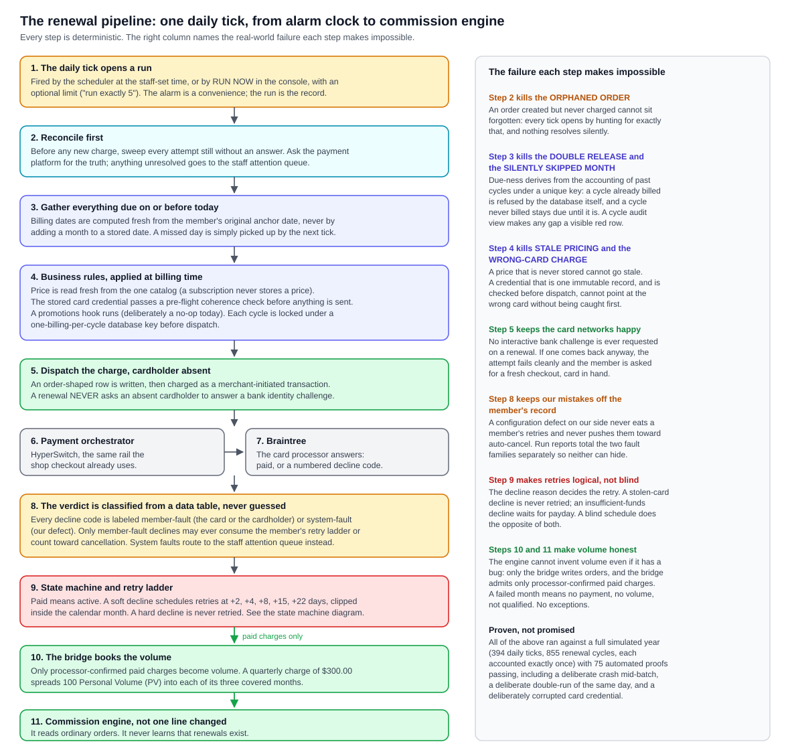
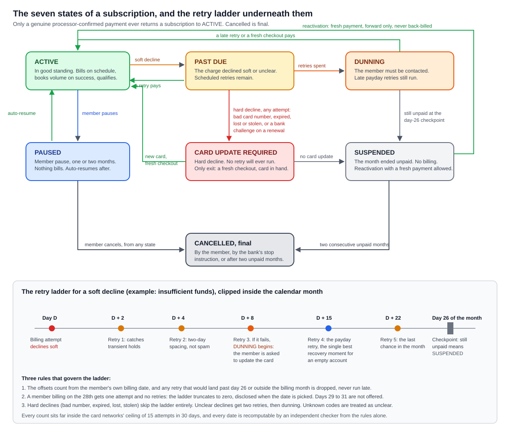

# 12. The Subscription Engine: renewals, logical retries, and the console that drives them

**Owner of this document:** the writer on the Orvanna build team, working from the
architect's specification, the builder's proof run, and the console source files.
**Written:** 2026-08-16.
**Status as of 2026-08-16, stated plainly up front:**

| Artefact | State |
|---|---|
| The engine schema and pipeline (migrations 024 to 027) | **APPLIED to the cloud project**, gated, and deliberately **INERT** there: the engine's clock is empty and nothing bills until it is initialized on purpose |
| The full simulated year | **PROVEN LOCALLY: 75 automated proofs of 75 pass**, one command, on the real migration files |
| The staff billing console (page plus its server function) | **BUILT**, implementing the full option list; not yet deployed by its builder (gates first, then the deploy engineer ships it) |
| The staff commission dashboard (five panels plus projection) | **BUILT** to its own specification; same deploy discipline |
| The run limit and the live Braintree dispatch (migrations 028 and 029) | **AUTHORED AND PROVEN LOCALLY**; they ride the console deploy round, closed by a seven-row live acceptance |
| Real stored cards, the daily alarm, member-facing dunning notices | **NOT BUILT YET.** Named honestly in section 8 |

This document exists because Howard asked for exactly it: what the subscription
program does, how it retries, and the console, written so it can be sold. Everything
below comes from the specification, the proof-run record, and the source files listed
under Sources. Nothing is invented, and anything not yet real says so.

**Acronym key, spelled out here and used short afterwards.** Personal Volume (PV).
Sales Volume (SV). Commissionable Volume (CV). Customer Initiated Transaction (CIT),
a payment where the cardholder is present and acting. Merchant Initiated Transaction
(MIT), a payment where the merchant charges a stored card with no cardholder present.
Three-Domain Secure (3DS), the card network step that asks the shopper's own bank to
confirm their identity. Non-Sufficient Funds (NSF). Quality Assurance (QA).
Graphical User Interface (GUI).

**Sources this document was built from, and nothing else.**

- `C:\Users\howar\Desktop\Desktop\ORVANNA\MLM-PILOT\docs\SUBSCRIPTION-ENGINE-SPEC.md` (version 1.2, the law)
- `C:\Users\howar\Desktop\Desktop\ORVANNA\MLM-PILOT\docs\SUBSCRIPTION-ENGINE-BRIEF-2026-08-16.md` (the research behind it)
- `C:\Users\howar\Desktop\Desktop\ORVANNA\MLM-PILOT\docs\verification\S1-PROOF-RUN-2026-08-16.md` (the evidence)
- `C:\Users\howar\Desktop\Desktop\ORVANNA\MLM-PILOT\db\migrations\` files 024 through 029 (headers and status blocks)
- `C:\Users\howar\Desktop\Desktop\ORVANNA\MLM-PILOT\functions\billing-console\index.ts` (what the console really does)
- `C:\Users\howar\Desktop\Desktop\ORVANNA\MLM-PILOT\functions\commission-report\index.ts` and `MLM-PILOT\docs\STAFF-COMMISSION-DASHBOARD-SPEC.md`

---

## 1. Lead with the picture

Plain path to that image:
`C:\Users\howar\Desktop\Desktop\ORVANNA\DOCUMENTATION\diagrams\renewal-pipeline.svg`

Read it top to bottom. One daily tick reconciles anything left hanging, gathers
everything due, prices it fresh, checks the stored card is coherent, charges it
through the payment orchestrator, classifies the answer from a data table, moves the
subscription through its state machine, and hands only the genuinely paid charges to
the bridge, which books the volume the commission engine reads. The right-hand column
is the selling story: each step exists to make a specific, named production failure
impossible.

## 2. What it is, in one page

Orvanna's subscription engine bills recurring memberships for a direct-selling
company. A member subscribes to a product, and from then on the engine charges their
stored card on their own schedule and turns each successful charge into the volume
that drives their qualification and their upline's commissions. The whole design can
be stated in seven sentences:

1. **Four frequencies:** monthly, bi-monthly (every two months), quarterly, and
   semi-annual, stored as plain data on the subscription.
2. **The member picks their billing day** (the 1st through the 28th; anchors that
   would land on the 29th through the 31st normalize to the 28th, disclosed at
   signup). If they do not pick, the first renewal lands 30 days after the initial
   purchase and that anniversary recurs.
3. **Every charge goes through the payment orchestrator** (HyperSwitch, in front of
   Braintree), the same rail the shop checkout already uses, as a Merchant Initiated
   Transaction against a stored credential.
4. **Every cycle is accounted.** Each expected billing has exactly one accounting
   row: paid, unpaid with its attempts on record, skipped because paused, or void
   because cancelled. A cycle can never silently vanish, and never bill twice.
5. **A multi-month charge spreads its volume.** A quarterly charge of $300.00 books
   100 PV into each of its three covered months, so a quarterly member is identical,
   month by month, to a monthly member. This was Howard's ruling, made because the
   alternative would let identical money qualify differently by billing frequency.
6. **Volume flows to the commission engine automatically** through the existing
   bridge, which admits only processor-confirmed paid charges. A failed month means
   no payment, no volume, not qualified. The engine physically cannot invent volume,
   because only the bridge writes orders.
7. **Everything is recomputable.** Given the same subscriptions, rules, and outcomes,
   the engine produces identical rows to the cent, every run, and an independent
   checker did exactly that recomputation across a simulated year.

## 3. The five failures it makes impossible

This section is the reason a buyer who has operated subscription billing will read
this document twice. Howard named five failure modes he deals with today, in real
production systems moving real money, and required each to be defended **by name,
with a mechanism and a proof**, in a living register that grows whenever he names
another. None of these are hypothetical. Every one has happened somewhere money was
real. Each defense below was then exercised by the proof run: the proof labels (A1,
B4, and so on) are rows in the automated battery anyone can re-run with one command.

### 3.1 The double release

*The failure:* a subscription ships and charges twice in a month because the program
did not check the last release correctly.

*The defense:* billing is idempotent per cycle, enforced by the database itself, not
by discipline. Each subscription cycle has a unique key; a second attempt to bill the
same cycle is refused structurally. And the engine never decides what is due from a
stored "next date": it derives due-ness from the accounting of past cycles, so a
re-run, a crash and restart, or an overlapping tick finds the cycle already accounted
and bills nothing.

*The proof (rows A1 to A3):* the same day was deliberately run twice against eight
due subscriptions: zero new charges the second time. Across the whole simulated year,
855 renewal cycles were accounted exactly once each.

### 3.2 The orphaned order

*The failure:* the subscription program creates the order but never reaches the
payment platform, and the order sits there, unpaid and invisible.

*The defense:* every tick opens with a reconciler that hunts for exactly this: any
attempt still without a terminal answer. It asks the payment platform for the truth,
re-dispatches idempotently, or fails the attempt explicitly into a staff attention
queue a human sees. Nothing resolves silently.

*The proof (rows B1 to B4):* the engine was deliberately killed mid-batch, with
payment 47 of 60 dispatched. The rerun reconciled attempt 47 from the recorded
answer, billed cycles 48 through 60 exactly once each, and touched cycles 1 through
46 not at all. Sixty members, sixty periods, sixty paid, zero orphans.

### 3.3 Stale pricing

*The failure:* the catalog price changes, but subscriptions keep billing an old
price that was copied onto them at signup and never updated.

*The defense:* the subscription row **never stores a price**. Every billing reprices
at billing time from the one catalog source, and any change from the prior period is
printed on the run report rather than hidden. A price that cannot be stored cannot go
stale.

*The proof (rows C1 to C2):* December billed $100.00; the catalog price changed on
December 14; January billed $110.00 with the matching volume, automatically. A schema
sweep confirms no price column exists anywhere on the subscription table.

### 3.4 The silently skipped month

*The failure:* a subscription skips a month for no reason anyone can find, usually
because date arithmetic drifted (add a month to January 31, land on February 28, add
a month to that, and March bills on the 28th forever) or a stored date was missed.

*The defense, four layers:* every cycle's date is computed from the member's original
anchor date plus cycle-number arithmetic, never by incrementing a stored date, so
drift is arithmetically impossible; a short month clamps to its last day and the
schedule returns to the true day in months long enough; the gather step picks up
anything due on or before today, so a missed day self-heals on the next tick; and a
cycle-audit view demands an accounting row for every expected cycle, so any gap
becomes a visible red row in the staff attention queue instead of a silence.

*The proof (rows D1 to D3):* a subscription anchored on the 31st was driven through
a full year: twelve cycles, printed date by date in the transcript, billing February
28, back on the 31st in March, zero gaps in the audit. Separately, one daily tick was
deliberately skipped with ten cycles due; the next day's tick gathered all ten, zero
lost, zero doubled.

### 3.5 The wrong-card stored credential

*The failure:* recurring rebills bounce off the merchant's own gateway ("Payment Type
Does Not Match") because the stored-credential anchor points at the wrong card brand,
usually after a card change that updated one record but not the other. The member did
nothing wrong, and no retry can ever succeed.

*The defense, three layers:* the card identity and its network anchor live together
in **one immutable credential record**; a card change never edits it but mints a new
credential through a fresh cardholder-present checkout and retires the old one, so
the pieces cannot drift apart. A pre-flight check at dispatch refuses to send any
rebill whose credential is retired, expired, or internally incoherent. And such
refusals are classified **system fault, our defect**: they never consume the member's
retries, never push the member toward cancellation, and are totalled separately in
run history so they cannot hide inside decline statistics.

*The proof (rows E1 to E5):* one member's credential was deliberately corrupted
(brand mismatched to its anchor). Every one of her thirteen billing attempts across
the year was stopped at pre-flight, none ever reached the processor, all thirteen
surfaced in the attention queue, and her account ended the year with zero marks
against it.

The register is open-ended by design: when Howard names failure mode six, it enters
the specification with a mechanism and a proof row the same day.

## 4. The retry engine

Plain path to that image:
`C:\Users\howar\Desktop\Desktop\ORVANNA\DOCUMENTATION\diagrams\subscription-state-machine.svg`

The governing rule, in one sentence: **the decline reason decides the retry, never a
blind schedule.** A blind schedule retries stolen cards, which card networks fine you
for, and gives up on empty accounts two days before payday. This engine reads the
processor's decline code, looks it up in a data table (changing a rule is a data
change with an effective date, never a code deploy), and acts on the class.

### 4.1 The classification principle: member fault versus system fault

Every decline class carries one label. Member-fault classes are facts about the card
or the cardholder: hard declines, soft declines, unclear declines, and the bank's
stop instructions. System-fault classes are our own defects or infrastructure
trouble: configuration errors, duplicate-transaction warnings, an unreachable
processor. **Only member-fault declines may ever consume the member's retry ladder,
dunning clock, or auto-cancel counter.** System faults route to the staff attention
queue as our problem to fix, and every run report totals the two families separately.

### 4.2 What each class does

- **Hard declines are never retried.** Invalid card number, expired card, no such
  account, lost card, stolen card, suspected fraud: time will not fix any of these,
  and networks sanction merchants who retry them. The subscription moves to CARD
  UPDATE REQUIRED, whose only exit is the member completing a fresh checkout with a
  new card, where bank authentication runs properly, cardholder present.
- **The bank's stop instruction is treated as a cancellation, not a decline.** Two
  specific codes mean the cardholder told their bank to stop the billing. The engine
  cancels immediately, one code for this subscription, the other for every
  subscription the member holds, and never retries. Retrying a stop instruction is
  how merchants earn chargebacks.
- **Soft declines get the ladder:** retries at 2, 4, 8, 15, and 22 days after the
  billing attempt, every one clipped inside the billing calendar month. Insufficient
  funds is the classic: the day-15 retry is aimed at paydays, which industry dunning
  data consistently shows as the best single recovery moment.
- **Unclear declines get two cautious retries, then dunning.** The issuer said no
  without saying why; guessing harder is not a strategy. Two codes that explicitly
  ask for a human conversation with the bank get one retry, then dunning.
- **Unknown codes are treated as unclear and printed loudly on the run report.** An
  unrecognized decline can never earn itself an aggressive schedule.
- **The merchant-initiated invariant, absolute:** a renewal never asks an absent
  cardholder to answer a bank identity challenge. If a challenge comes back anyway,
  the attempt fails cleanly with the reason recorded, and the subscription moves to
  CARD UPDATE REQUIRED. This invariant is asserted on every attempt of every proof
  run, so the discipline was tested before real charging existed.

### 4.3 Dunning, pause, auto-cancel, reactivation

When the ladder's day-8 retry fails, DUNNING begins: the member must be contacted
(the notices themselves are a later phase; the engine records every event they will
read). The late payday retries still run during dunning, because recovering the
member is the point. At day 26 of the billing month, a period still unpaid suspends.

A member may pause for one or two months. Nothing bills, no volume books, the months
are marked "skipped, paused" and never count as unpaid. One deliberate asymmetry,
ruled precisely: pausing **before** dunning resets the unpaid-months clock, because a
member who engages early is the opposite of silent churn; pausing **from within
dunning** freezes the clock and resumes it where it stood, so a pause cannot be used
as an indefinite auto-cancel evasion device. Both lanes were driven through the proof
year on real dates.

Two consecutive unpaid months auto-cancel the subscription. Suspension sits in
between: no billing attempts, but the member can reactivate any time with a fresh
cardholder-present payment, which covers the month of the payment and re-anchors
their schedule forward. Nothing is ever back-billed into closed history, and the
unpaid months stay on the record forever. Cancelled is final: a returning member is
a new subscription row.

### 4.4 One member's story, worked in dollars

Ann holds a monthly subscription: $100.00, 100 PV, billing on the 1st. Beth, her
sponsor, earns 10 percent of Ann's CV (CV is 80 percent of SV), so a normal month
pays Beth $8.00 on Ann's renewal.

**September, the recovered month.** Ann's September 1 charge declines with
insufficient funds. Retries run September 3 and 5 and decline again. The September 9
retry **succeeds**. Ann's September volume books in full: SV $100.00, qualified, and
Beth's statement shows exactly $8.00, indistinguishable from an on-time renewal. A
recovered retry is invisible in the statement, which is exactly right. The proof run
reproduces this to the cent.

**The bad month, for contrast.** If every attempt through September 23 had failed,
the subscription suspends at day 26, no order exists, Ann's September SV is $0.00,
she is not qualified, and Beth's $8.00 line does not exist. Nothing in the
commission engine was touched to make that happen: the retry engine decides which
orders exist, and the plan's own arithmetic does the rest. October unpaid too, and
November 1 auto-cancels, unless Ann reactivates first.

**The edge case, disclosed rather than hidden.** A member who picks the 28th as
their billing day gets one attempt and zero retries, because every ladder step would
fall past the day-26 line. The engine does not pretend otherwise: the truncation is
disclosed when the date is picked, the single attempt runs, and a soft decline goes
straight to dunning. The proof year drives this exact case, suspension at month-end
and reactivation included.

## 5. The console: the staff surface

The billing console is a staff-only screen behind the same server-verified sign-in
the refund screen uses, with the same two hard rules: **every write is audited to
the staff-action ledger with the staff username**, and **every rule is enforced by
the server, never by the page**, because hiding a button is not a gate. A crafted
request without a staff session gets the same refusal the screen would show.

What staff can do, option by option, as implemented in the console's server function:

- **Schedule control.** Enable or disable the automatic daily run and set its time
  and timezone. The schedule is honored server-side; when disabled, the engine runs
  only by hand.
- **Run now, preview first, with the run limit.** Execution is two steps by design.
  The preview is a mandatory dry run that shows what would bill today, counts,
  dollars, breakdown by frequency and new-versus-retry, creating nothing. It uses
  the engine's own arithmetic, so preview and execution can never disagree. Beside
  RUN NOW sits the limit field, built to Howard's words ("if i want to run 5 run
  only 5"): blank runs everything due; an integer N runs exactly N, selected
  deterministically, oldest due first. **When N is set, the preview lists which N**,
  member by member, product and amount and due date, before the confirm step. The
  unprocessed remainder needs no bookkeeping: it is simply still due, and the next
  tick picks it up, oldest first. Retries already promised are never held back by a
  limit, because deferring a promised retry could silently push it out of its
  calendar-month window.
- **Run history, with ran-N-of-M honesty.** Every run is a row: date, gathered,
  succeeded, declined by class, with member-fault and system-fault totals separate.
  A limited run renders as "ran 5 of 23 due, 18 remaining", so a partial run can
  never be mistaken for a complete one. Any run drills down to its individual
  attempts and their plain-words reasons.
- **Retry queue.** Everything scheduled to retry, when, and under which decline
  class.
- **Attention queue: the reconciler's inbox.** The rows a human must see: orphaned
  attempts, cycle-audit gaps, system-fault failures, and the codes flagged
  needs-human. This queue is the structural promise that nothing silently vanishes.
- **Member management.** On one member's subscription: pause, resume, cancel, change
  the billing day or frequency (with the transition rule's disclosure shown to
  staff), flag for card update, reactivate. Every action goes through the engine's
  sanctioned functions; raw edits are refused by the database.
- **Seven-day forecast.** The next week of scheduled billing, computed from the same
  date arithmetic the engine itself uses, so the forecast shows what the engine will
  actually do.

One honesty detail worth selling on its own: while the production engine is inert
(section 8), the console does not fake a preview. It says plainly that the engine's
clock is unset, reports the raw backlog headcount, and refuses to claim a dollar
figure it cannot honestly compute. A console that would rather refuse than guess is
the same philosophy as the rest of the system.

### 5.1 The commission dashboard beside it

A second staff page, read-only by construction, gives the money side: five panels
over the real compensation tables. The runs board (every finalized month with its
totals and top movers), the current month accumulating live, a per-member drill
(rank, volumes against the qualification gate, full commission history), the house
ledger (unattributed volume, bookkeeping only, never a disbursement), and the
superseded-run trail (every rerun visible in its version chain, nothing overwritten).

Its one clever piece is the **if-run-today projection**: the dashboard calls the
real commission engine inside a database transaction and then rolls the whole thing
back, so the numbers are the engine's own with zero drift and zero rows surviving.
And the projection **can never impersonate a finalized statement**: it carries no
run identifier (every finalized figure carries one, and the presence or absence of
the identifier is the machine-checkable tell), it always renders under a literal
banner saying it is a what-if computed at a timestamp and not payable, and nothing
from it is ever stored, exported, or reachable from any member-facing surface.

## 6. Determinism and audit

- **Billing is a versioned run**, the same discipline the commission engine already
  lives by: one final run per day, reruns supersede rather than overwrite, finalized
  rows are frozen by database trigger, and totals are written at close.
- **The engine's entire behavior is a function of its inputs:** the subscription
  rows, the append-only event stream, the classification and retry-policy tables as
  of the run date, the recorded outcomes, and the clock. No hidden state, no
  wall-clock reads in business logic, no randomness. Same inputs, same rows out, to
  the cent.
- **The proof harness is one command** (`py MLM-PILOT\db\subscriptions\run_proofs.py`).
  It builds a disposable database, applies the real migration files verbatim, replays
  a scripted year of 394 daily ticks, and grades 75 proof rows, in well under a
  minute of wall time. The battery includes the deliberate crash, the deliberate
  double-run, the corrupted credential, the day-28 case, both pause lanes, the
  limit-of-5 run, and the three worked dollar examples recomputed to the cent.
- **Every staff action is audited with the username**, to the same ledger the refund
  system writes, and everything member-visible is reconstructible from the event
  stream. An independent verifier recomputed the year's every date, transition, and
  statement line from the rules alone and matched the engine row for row.

## 7. Why this is sellable

The short version for a buyer: subscription billing systems fail in well-known ways,
and the people who run them spend their careers cleaning up after the same five
accidents. This engine was designed by naming those accidents first and making each
one structurally impossible, then proving it by deliberately trying to cause every
one of them against a simulated year and publishing the transcript. The retry engine
follows card-network rules an auditor would recognize, the console shows its staff
exactly what will happen before it happens, partial runs say so out loud, our own
mistakes are never charged to the member's record, and every number on every screen
can be recomputed independently from first principles. That combination, honesty
made structural, is the product.

## 8. Where it stands today, honestly

What is real right now:

- Migrations 024 through 027 (schema, policy data, pipeline, bridge amendment) are
  **applied to the cloud project**, after both gates passed. The engine there is
  **deliberately inert**: its clock has no row, simulations never run in production
  by ruling, and nothing bills until an operator initializes the clock on purpose.
- The complete simulated year is **proven locally, 75 proofs of 75**, on the exact
  files the cloud runs.
- The console and the commission dashboard are **written in full** and implement
  everything section 5 describes, but the builder does not deploy; the deploy
  engineer ships them after gating, with a byte-compare against the repository.
- Migrations 028 (the run limit) and 029 (the live dispatch seam) are **authored and
  proven locally against the simulated processor**. The live half is deliberately
  reserved for a deploy-round acceptance written into migration 029 itself, seven
  rows: a limit-2 run producing exactly two payments visible in the HyperSwitch
  dashboard, channel renewal_engine, succeeded through Braintree, no 3DS challenge
  requested and zero challenges seen, plus a strand drill proving an unanswered live
  attempt surfaces in the attention queue instead of vanishing.

What "sellable" still awaits, named so no reader assumes it exists:

- **The vault.** Today no real card is stored anywhere, on our side or the
  orchestrator's. The first task of the live-charging phase is the stored-credential
  spike: one cardholder-present payment with the setup flag, then one merchant-
  initiated charge against the returned credential, on our actual sandbox rail. The
  test plan is written, including the deliberate saboteur card that must fail
  correctly to prove the no-challenge invariant live.
- **The real alarm clock.** The scheduler (a five-minute database cron job that does
  nothing but open a run when the staff-set time passes) is specified and decided,
  but not installed on the cloud instance. The console shows an honest banner saying
  exactly that.
- **Member-facing dunning surfaces.** The notices, the member's own card-update
  page, and the member subscription-management page are the next phase. The engine
  already records every event those surfaces will read.

## 9. What this document does not cover

The compensation plan's own arithmetic (document 03), the bridge's nine policies
(document 09), refunds (document 11), and the checkout that creates a subscription
in the first place (document 04). The exact decline-code tables, the transition
rules for changing a billing date mid-cycle, and the ten-table schema live in the
specification, which remains the law where this document summarizes. And nothing
here has been graded by QA as a user-facing surface yet: the console's screens,
like the refund button before them, will get their own checklist rows before
anyone calls them done.
