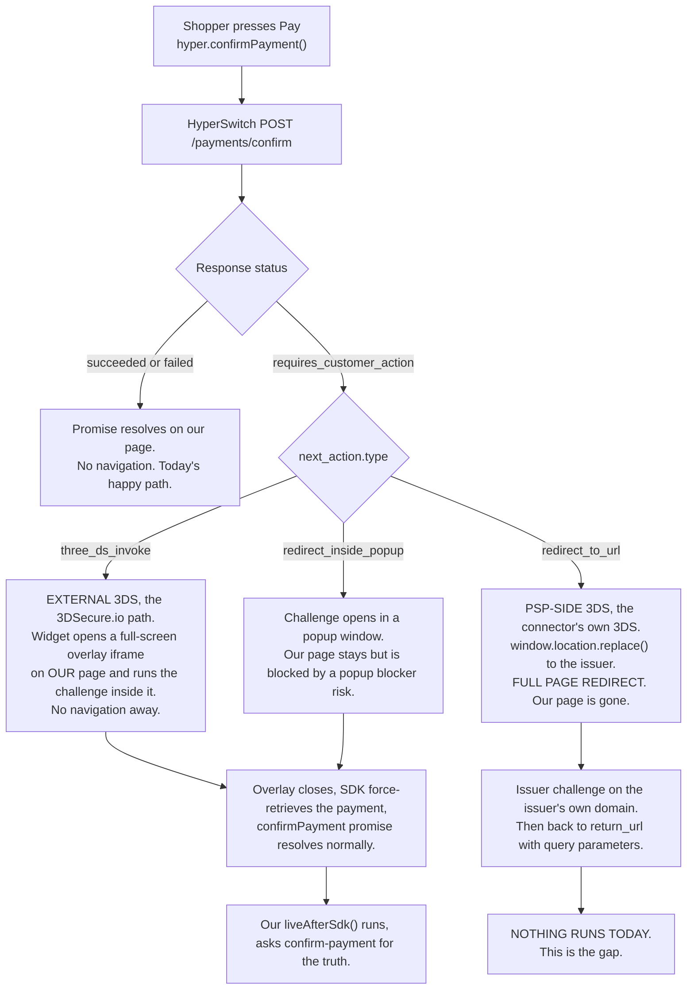
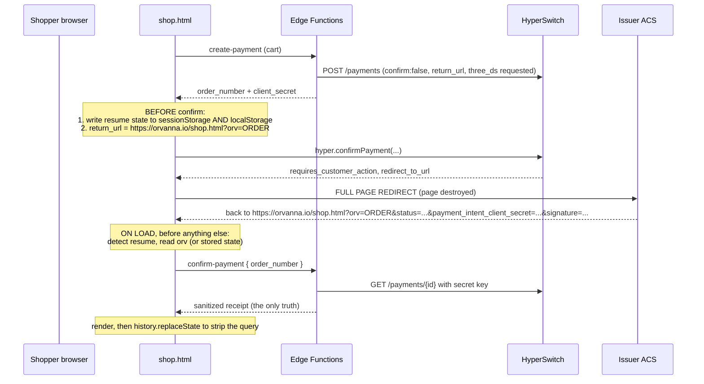

# 3-D Secure (3DS) Research: Orvanna Pilot on HyperSwitch

Research only. No site code was written or changed while producing this document.
A builder should be able to work from this file without re-reading the sources.

Date of research: 2026-08-14
Scope: HyperSwitch hosted sandbox, HyperLoader.js web widget, 3DSecure.io as the
external authentication provider, dummy connectors `pretendpay_default` and
`stripe_test_default`.

---

## Acronym key

Every acronym used in this document, expanded once here so the body reads cleanly.

| Short form | Full form | What it means in one line |
|---|---|---|
| 3DS | 3-D Secure | The card-network protocol that asks the card issuer to confirm the shopper is really the cardholder. |
| EMV 3DS | EMV 3-D Secure (protocol versions 2.1, 2.2, 2.3.1) | The modern version of 3DS, the one in use here. |
| ACS | Access Control Server | The card issuer's server that runs the challenge screen. |
| DS | Directory Server | The card network's router (Visa, Mastercard) that sits between us and the issuer. |
| AReq / ARes | Authentication Request / Authentication Response | The first message pair. The ARes says whether a challenge is needed. |
| CReq / CRes | Challenge Request / Challenge Response | The message pair that carries the challenge screen. |
| RReq | Results Request | The final message that carries the challenge outcome. |
| transStatus | Transaction Status | A single letter in the ARes or RReq saying how authentication went. See the table in Part B. |
| ECI | Electronic Commerce Indicator | A short code recording the authentication outcome, used to decide who eats a fraud chargeback. |
| BIN | Bank Identification Number | The first six to eight digits of a card number, identifying the issuing or acquiring bank. |
| PSP | Payment Service Provider | The processor that actually authorizes the money. Here, `stripe_test` or `pretendpay`. |
| SDK | Software Development Kit | Here, HyperLoader.js and the widget it mounts. |
| PSD2 | Revised Payment Services Directive (European Union) | The regulation that made 3DS mandatory for most European online card payments. |
| SCA | Strong Customer Authentication | The PSD2 requirement that 3DS satisfies. |
| MOTO | Mail Order / Telephone Order | A card payment taken by a human over the phone or by mail. |
| OTP | One-Time Passcode | The six-digit code an issuer texts to the cardholder during a challenge. |
| DTMF | Dual-Tone Multi-Frequency | Touch-tone keypad signaling. Used to let a caller key a card number without an agent hearing it. |
| IVR | Interactive Voice Response | The automated phone menu that can capture a card without a human agent. |
| HMAC | Hash-based Message Authentication Code | A signature that proves a message came from someone holding a shared secret. |
| URL | Uniform Resource Locator | A web address. |
| API | Application Programming Interface | The HyperSwitch server endpoints our Edge Functions call. |

---

## The one-paragraph summary

The parameter `redirect: 'if_required'` does **not** protect us from a full page
redirect. It only controls the courtesy redirect that happens *after* a
successful confirmation. When HyperSwitch answers a confirm with
`next_action.type = "redirect_to_url"`, the widget navigates the whole page away
with `window.location.replace(...)`, unconditionally. Our checkout has no handler
for coming back, so that path currently ends on a page that has forgotten which
order it was. Separately, because `create-payment` sends neither
`authentication_type` nor `request_external_three_ds_authentication`, the
3DSecure.io connector Howard just wired up is **not being asked to do anything
yet**, which is why nothing has ever challenged.

---

## Part A: the technical flow

### A0. The three shapes a challenge can take

HyperSwitch does not have one 3DS flow. It has three, and which one fires
decides whether the shopper stays on our page or leaves it. This is the single
most important fact in this document.

**Where this comes from.** The HyperSwitch web SDK is open source. In
`src/Utilities/PaymentHelpers.res`, when `intent.status == "requires_customer_action"`:

- `next_action.type == "redirect_to_url"` calls `handleOpenUrl(intent.nextAction.redirectToUrl)`.
  That posts an `openurl` message to the parent frame, and
  `src/hyper-loader/LoaderPaymentElement.res` answers it with
  `Utils.replaceRootHref(url, redirectionFlags)`, which is
  `Window.Location.replace(href)` (or `Window.Top.Location.replace(href)` when
  the merchant has set `shouldUseTopRedirection`). That is a full page
  navigation, and it is a `replace`, so it destroys the history entry too.
  **It is not gated on the `redirect` option at all.**
- `next_action.type == "three_ds_invoke"` posts `fullscreen: true` with
  `param: "3ds"` or `param: "3dsAuth"` to the parent. The loader then injects a
  `#orca-fullscreen` iframe pointed at
  `<sdk domain>/fullscreenIndex.html?fullscreenType=3dsAuth`, and inside it
  `src/ThreeDSAuth.res` reads `trans_status`. If `trans_status === "C"` it builds
  a form targeted at an iframe named `3dsChallenge`, posts the CReq to the
  `acs_url`, and the issuer's challenge renders **inside our page**. When it
  finishes, the frame sends `openurl_if_required` to the parent, which
  force-retrieves the payment intent and resolves the `confirmPayment` promise.
- `next_action.type == "redirect_inside_popup"` renders `ThreeDSRedirectionModal`
  and uses a popup plus a `poll_status` loop.

Source files, for the builder who wants to read them:
[Hyper.res](https://github.com/juspay/hyperswitch-web/blob/main/src/hyper-loader/Hyper.res),
[PaymentHelpers.res](https://github.com/juspay/hyperswitch-web/blob/main/src/Utilities/PaymentHelpers.res),
[LoaderPaymentElement.res](https://github.com/juspay/hyperswitch-web/blob/main/src/hyper-loader/LoaderPaymentElement.res),
[ThreeDSAuth.res](https://github.com/juspay/hyperswitch-web/blob/main/src/ThreeDSAuth.res).

### A1. What `redirect: 'if_required'` actually does

HyperSwitch's own SDK reference says: with `'always'` (the default),
`hyper.confirmPayment` "will always redirect to your `return_url` after a
successful confirmation"; with `'if_required'` it "will only redirect if your
user chooses a redirect-based payment method"
([JS SDK reference](https://docs.hyperswitch.io/integration-guide/payment-experience/readme-1/js-1.md)).

Read against the source, that sentence means something narrower than it sounds:

1. `'if_required'` suppresses the **post-success courtesy redirect**. With
   `'always'`, even a plain frictionless card success navigates you to
   `return_url`. With `'if_required'`, a plain success resolves the promise on
   your page. This is the behavior we rely on today and it works.
2. `'if_required'` does **not** suppress a `redirect_to_url` next action. That
   redirect is issued from inside the widget iframe before the promise ever
   resolves, and the code path does not consult the `redirect` option.

So the honest rule is:

| Outcome | Stays on our page? | Our current code handles it? |
|---|---|---|
| Frictionless success (no 3DS, or 3DS with no challenge) | Yes | Yes |
| Plain decline before any 3DS | Yes | Yes |
| External 3DS challenge (`three_ds_invoke`, the 3DSecure.io path) | Yes, overlay iframe | Yes, by accident. The promise resolves normally afterward. |
| PSP-side 3DS challenge (`redirect_to_url`) | **No, full page redirect** | **No. This is the gap.** |
| Popup challenge (`redirect_inside_popup`) | Yes, but popup blockers apply | Partly. If the popup is blocked the shopper is stuck with no message. |

Two further cautions:

- Even on the external 3DS path, the **authorization leg after authentication**
  can still return `redirect_to_url` if the connector wants its own step. So the
  return path must be built regardless of which 3DS mode we choose.
- `window.location.replace` replaces the history entry. After a redirect out and
  back, pressing Back will **not** return the shopper to the pre-payment
  checkout. Any user experience plan that assumes "they can just go back" is
  wrong.

### A2. The return path (the biggest gap)

**What HyperSwitch appends to `return_url`.** Per the HyperSwitch API reference
([introduction](https://api-reference.hyperswitch.io/introduction)), the redirect
back carries these query parameters:

| Parameter | Meaning | Trust it? |
|---|---|---|
| `status` | One of `succeeded`, `processing`, `failed` | **No.** It is in a user-editable query string. Use it only to pick a loading message. |
| `payment_intent_client_secret` | The client secret for the payment, usable to retrieve status | No, but useful as a signal that we are resuming. |
| `amount` | The payment amount | No. |
| `manual_retry_allowed` | Whether this payment can be retried | No, but worth logging. |
| `signature` | HMAC signature of the payload, verifiable with `payment_response_hash_key` | Only if verified server-side. |
| `signature_algorithm` | Which HMAC algorithm produced `signature` | Only as an input to verification. |

Note what is **not** there: there is no `payment_id`, and obviously no Orvanna
order number. HyperSwitch cannot tell our page which order it was. We have to
carry that ourselves.

**Why `return_url: window.location.href` is wrong.** Three reasons:

1. It carries no correlation key, so the resumed page cannot name the order.
2. It snapshots whatever query string and hash fragment happened to be on the
   page at the moment of confirm, including any leftovers from a previous
   resume. On a second attempt you can get `?orv=A&orv=B` style pollution or a
   stale `payment_intent_client_secret` that makes the page think it is resuming
   the wrong payment.
3. It is not guaranteed to be a canonical, publicly reachable address. Anything
   the browser has done to the address bar rides along.

**What a correct implementation does.**

Concretely:

1. **Build a canonical return URL.** Not `window.location.href`. Build
   `new URL(window.location.pathname, window.location.origin)`, set exactly one
   search parameter of ours, and use `.toString()`:
   `https://orvanna.io/shop.html?orv=ORV-2026-08-XXXXXX`.
   HyperSwitch appends its own parameters to whatever we give it, so ours
   survives alongside `status`, `payment_intent_client_secret` and the rest.
   (Confirm this empirically on the first test. See "What I could not verify".)
2. **Persist resume state before calling `confirmPayment`, not after.** The
   redirect can happen before any `.then()` of ours runs. Write, under a
   versioned key such as `orv.resume.v1`:
   `{ order_number, payment_id_known: false, total_cents, created_at_ms, channel }`.
   Write it to **both** `sessionStorage` and `localStorage`:
   - `sessionStorage` survives a same-tab redirect and is automatically scoped
     to the tab, which is the correct default.
   - `localStorage` is the fallback for the mobile case where an issuer app
     bounces the shopper back into a **new** tab or a fresh in-app browser
     session, which drops `sessionStorage`. Give the localStorage copy a hard
     expiry (say 30 minutes) and clear it on any terminal state.
   Do **not** store the client secret in `localStorage`. It is a bearer token
   for that payment. `sessionStorage` only, and delete it once the order reaches
   a terminal state.
3. **Detect resume on load, before rendering the normal checkout.** A single
   function that runs on `DOMContentLoaded`:
   - Resume if the URL has our `orv` parameter, **or** has
     `payment_intent_client_secret`, **or** stored resume state exists and is
     under 30 minutes old.
   - Order number resolution order: the `orv` query parameter first (survives
     new-tab returns), then `sessionStorage`, then `localStorage`.
   - If none of those yields an order number, show an honest recovery panel:
     "We could not tell which order this was. Your cart is untouched and nothing
     was charged twice. If you have your Orvanna order number, enter it here."
     with a lookup box that calls `confirm-payment`. Do not silently drop back
     to the empty cart, which is what produces the "am I charged?" support call.
4. **Do not read `status` and act on it.** Call `confirm-payment` with the order
   number and render the server receipt, exactly as `liveAfterSdk` does today.
   Our whole trust model is that the browser is never the source of truth, and
   the return path must not create an exception to that rule.
5. **Clean the address bar after resolving.** `history.replaceState({}, '',
   window.location.pathname)` so a refresh does not re-enter resume mode with a
   stale client secret.
6. **Show the right thing while the resume call runs.** Not the empty catalog.
   A dedicated "Finishing your order ORV-..." panel, visible within the first
   paint, so the shopper never sees a state that looks like their order vanished.

### A3. Payment statuses during a challenge, and what `confirm-payment` should do

HyperSwitch's full `IntentStatus` enum, from the retrieve endpoint reference
([payments--retrieve](https://api-reference.hyperswitch.io/v1/payments/payments--retrieve)):
`succeeded`, `failed`, `cancelled`, `cancelled_post_capture`, `processing`,
`requires_customer_action`, `requires_merchant_action`, `requires_payment_method`,
`requires_confirmation`, `requires_capture`, `partially_captured`,
`partially_captured_and_capturable`, `partially_authorized_and_requires_capture`,
`partially_captured_and_processing`, `conflicted`, `expired`, `review`.

Today `mapStatus()` in `confirm-payment/index.ts` handles three of those by name
and lumps the other fourteen into `processing`. That is safe (it never wrongly
declares success) but it is not truthful, and truthfulness is what the user
interface needs.

Recommended mapping. The database column keeps three values plus `abandoned`, so
the change is mostly about carrying a **reason** through to the receipt, not
about adding database states.

| HyperSwitch status | Our `payment_status` | Reason code to add to the receipt | What the shopper should be told |
|---|---|---|---|
| `succeeded` | `succeeded` (after the cent-for-cent amount check) | none | Confirmed. |
| `failed` | `failed` | pass through `error_code` / `error_message` | Declined, with the bank's own words. |
| `cancelled` | `failed` | `cancelled` | Not completed. Nothing was charged. |
| `cancelled_post_capture` | `failed` | `cancelled_post_capture` | Reversed. Escalate: this should not happen in this demo. |
| `expired` | `failed` | `expired` | The payment window closed. Nothing was charged. Start again. |
| `requires_customer_action` | `processing` | **`awaiting_authentication`** | "Your bank is asking you to approve this. Finish in the window from your bank." Long, patient wait. |
| `requires_payment_method` | `processing` | **`attempt_reset`** | The attempt did not complete and HyperSwitch reset the intent for another try. In a 3DS flow this is the usual landing spot for a failed or abandoned challenge. Tell the shopper to try again; do not say "still processing". |
| `requires_confirmation` | `processing` | `not_submitted` | We never confirmed. Almost always means the shopper closed the form. |
| `processing` | `processing` | `in_flight` | Genuine "one moment". |
| `requires_capture`, `partially_*` | `processing` | `unexpected_capture_state` | Unreachable with `capture_method: "automatic"`. Log loudly if seen. |
| `requires_merchant_action`, `review`, `conflicted` | `processing` | `needs_human` | Log loudly, tell the shopper we are checking and will not charge twice. |

Three additional changes to `confirm-payment`:

- **Read `external_authentication_details`.** The retrieve response carries an
  object with the electronic commerce indicator, an authentication status, the
  Directory Server transaction identifier, the message version, error codes,
  challenge cancellation codes, and a `trans_status` reason. Copy a small set of
  named fields into the sanitized `processor_summary` (never the whole object)
  so the confirmation view can distinguish "you did not finish authenticating"
  from "your bank said no to the money". Keep the existing discipline: named
  fields only, no raw payloads.
- **Distinguish two waiting clocks.** Waiting for a processor takes seconds.
  Waiting for a human to read a text message takes one to three minutes. The
  current three polls at 2.5 seconds cover about 7.5 seconds, which will time out
  in the middle of every real challenge. See Part C item 5 for the recommended
  schedule.
- **Do not let a challenge in flight look like an error.** The current terminal
  message ("Still processing. Your order number is ...") is fine as a last
  resort but must not be reached at 7.5 seconds.

### A4. What must change in `create-payment` for 3DS to happen at all

Right now `create-payment` sends `amount`, `currency`, `capture_method`,
`confirm: false`, `description` and `metadata`. It sends nothing about
authentication. That is why every test so far has sailed through `stripe_test`
without a challenge.

| Field | Values | What it means | Recommendation |
|---|---|---|---|
| `authentication_type` | `three_ds` or `no_three_ds` | "Specifies the type of cardholder authentication to be applied for a payment." `three_ds` asks for 3DS; `no_three_ds` says do not. | Send `three_ds` for the pilot so the flow is exercised deterministically. Omitting it hands the decision to HyperSwitch's 3DS Decision Manager and to the connector's own defaults, which is why behavior has looked random. |
| `request_external_three_ds_authentication` | boolean | "Whether to perform external authentication (if applicable)." This is the switch that routes authentication to the external provider rather than to the connector. | Send `true` to actually use `threedsecureio_default`. Without it, the 3DSecure.io connector Howard configured stays idle no matter how healthy it looks in the dashboard. |
| `return_url` | absolute URL | "The URL to redirect the customer to after they complete the payment process or authentication. Crucial for flows involving off-site redirection." | Send it at **create** time as well as in `confirmParams`, so a server-driven redirect has a destination even if the browser value is lost. |
| `billing` | address object | Not required by the API, but issuers use address data in their risk decision. | Our demo deliberately collects nothing personal. That is the right call for a public demo, and the honest consequence is a **higher challenge rate**, because a risk engine with no data defaults to challenging. State this in the demo copy rather than fighting it. |
| `email`, `customer_id` | strings | Same story: more signal, more frictionless approvals. | Skip for the demo. Note the tradeoff in the spec. |
| `browser_info` | object (accept header, language, color depth, screen height and width, time zone, user agent, Java enabled) | EMV 3DS requires it. | The web SDK collects and sends this itself at confirm time. Nothing for us to do while we use the widget. Would become our job on a headless integration. |

Source: [payments--create API reference](https://api-reference.hyperswitch.io/v1/payments/payments--create) and
[External authentication for 3DS](https://docs.hyperswitch.io/integration-guide/workflows/3ds-decision-manager/external-authentication-for-3ds.md).
The external authentication document also confirms the shape of the flow: the
payment create response comes back with status `requires_customer_action` and a
`next_action` object carrying a client secret, and after authentication "the
status should go to `succeeded` status."

There is also a dashboard-side prerequisite, per the same page: the
authentication connector has to be named under Developers, Payment Settings, not
only created under Connectors. Worth verifying in the dashboard before blaming
the code.

### A5. 3DS versus our amount check and our idempotency

**Does the payment identifier change across a challenge?** No. The `payment_id`
is minted by `POST /payments` at create time and is stable for the life of the
intent. Retries create new **attempts** underneath the same intent (the retrieve
response exposes an `attempts` array described as "List of attempts that happened
on this intent"). Our `payment_reference` column therefore stays correct across
any number of challenges and retries. Nothing to change.

**Does the amount change?** No. 3DS authenticates; it does not reprice. The
authenticated amount is the amount that was in the AReq, and a mismatch would be
a protocol violation, not a normal outcome. Our cent-for-cent equality check
stays exactly as strong as it is today and should not be loosened. (The one
scenario that could ever change an amount is dynamic currency conversion or
surcharging at the connector, neither of which is in play here.)

**Can a challenged payment reach `succeeded` without `confirm-payment` ever being
called?** **Yes, easily, and this is the second real risk after the return path.**
The concrete case: the shopper is redirected to the issuer, completes the
challenge on their phone, and then closes the tab, loses signal, or the return
redirect fails. HyperSwitch and the connector complete the authorization and mark
the payment `succeeded`. Our row is still `created` or `processing`, and per spec
section 5.5 it eventually ages into `abandoned`. On a test rail that is cosmetic.
On a live rail that is the classic "my card was charged and I have no order"
support call.

Two fixes, in priority order:

1. **A webhook receiver.** HyperSwitch delivers outgoing webhooks for
   `payment_succeeded`, `payment_failed`, `payment_processing`,
   `payment_cancelled`, `payment_authorized`, `payment_captured`,
   `action_required`, and eleven refund, dispute and mandate events
   ([Webhooks](https://docs.hyperswitch.io/integration-guide/webhooks.md)). It
   signs the body with HMAC-SHA512 using the merchant's
   `payment_response_hash_key` and sends the digest in the
   `x-webhook-signature-512` header. Build a fourth Edge Function,
   `payment-webhook`, that:
   - verifies the signature before doing anything else, and returns 401 on
     failure without touching the database;
   - treats the body only as a **wake-up call**, never as truth. It reads the
     payment identifier from the body, then does the same server-side
     `GET /payments/{id}` retrieve, the same amount check, and the same guarded
     update that `confirm-payment` already does. The trust model is unchanged;
     the webhook just triggers the existing verification instead of the browser
     doing it;
   - is idempotent by construction because the update is guarded on
     `payment_status in ('created','processing')`;
   - returns 2xx quickly so HyperSwitch stops retrying.
   The right way to build this is to factor the retrieve-check-update block out
   of `confirm-payment/index.ts` into `_shared/` and have both callers use it.
2. **A sweeper before abandonment.** Whatever process ages rows into
   `abandoned` must first do one last server-side retrieve of any row with a
   `payment_reference`. Cheap, and it closes the gap even if webhooks are never
   built. This is a strict improvement even with webhooks in place, because
   webhook delivery can fail.

---

## Part B: the test matrix

### B1. Which world are we testing in?

There are three different sets of test cards in play, and they are not
interchangeable. Getting this wrong is the most likely way to waste an afternoon.

| World | Fires when | Card set that matters |
|---|---|---|
| Dummy connector (`pretendpay_default`) | Routing sends the payment to the dummy connector | HyperSwitch's own dummy connector card list |
| Connector 3DS on `stripe_test_default` | `authentication_type: "three_ds"` and external authentication **not** requested | Stripe's regulatory test cards |
| External 3DS via `threedsecureio_default` | `request_external_three_ds_authentication: true` | 3DSecure.io's sandbox PANs for the authentication leg, and then the connector's rules for the authorization leg |

### B2. Dummy connector cards (HyperSwitch)

From [Test Credentials](https://docs.hyperswitch.io/other-features/payment-orchestration/quickstart/payment-methods-setup/test-credentials.md).

| Card number | Flow | Outcome |
|---|---|---|
| 4000 0038 0000 0446 | 3DS | Documented as the 3DS success card. This is the one already in our docs. |
| 4111 1111 1111 1111 | Non-3DS | Success |
| 4242 4242 4242 4242 | Non-3DS | Success |
| 5555 5555 5555 4444 | Non-3DS | Success |
| 3800 0000 0000 06 | Non-3DS | Success |
| 3782 8224 6310 005 | Non-3DS | Success |
| 6011 1111 1111 1117 | Non-3DS | Success |
| 5105 1051 0510 5100 | Non-3DS | Declined |
| 4000 0000 0000 0002 | Non-3DS | Declined |
| 4000 0000 0000 9995 | Non-3DS | Insufficient funds |
| 4000 0000 0000 9987 | Non-3DS | Lost card |
| 4000 0000 0000 9979 | Non-3DS | Stolen card |

The documented dummy connector list contains **only one** 3DS card and no 3DS
failure card. If we need a challenge-then-failure case on the dummy connector,
it is not published.

### B3. Stripe test cards (relevant when `stripe_test_default` does the 3DS)

From [Stripe testing documentation](https://docs.stripe.com/testing?testing-method=card-numbers#regulatory-cards).
All take any future expiry date and any three-digit security code.

| Card number | What it does | End state to expect | Why we want it in the matrix |
|---|---|---|---|
| 4000 0000 0000 3220 | 3DS authentication must be completed. Issued in Ireland. | Challenge, then success | The main challenge-then-success case. |
| 4000 0084 0000 0027 | Same, issued in the United States | Challenge, then success | Same case with a United States issuer, closer to our shoppers. |
| 4000 0000 3220 0000 | 3DS required on every transaction, but resolves **frictionless** | No challenge screen, success | Proves the frictionless path. The shopper sees nothing at all. |
| 4000 0027 6000 3184 | Always authenticate on every transaction | Challenge, then success | Deterministic. Good for repeated user-interface work. |
| 4000 0038 0000 0446 | Already set up for off-session use; still challenges one-time and on-session payments | Challenge, then success | The card already in our documentation. |
| 4000 0084 0000 1629 | Authentication required, then the charge is **declined** with `card_declined` | Challenge passes, payment fails | **The most important row for user experience.** This is where a shopper does everything right and still gets a no. |
| 4000 0082 6000 3178 | Authentication required, then declined `insufficient_funds` even after successful authentication | Challenge passes, payment fails | The second flavor of "authenticated but declined". |
| 4000 0084 0000 1280 | Authentication required, but the 3DS lookup itself fails with a processing error; payment declined | 3DS error, payment fails | The "3DS is broken right now" case. |
| 4000 0000 0000 3097 | 3DS may be attempted but is not required; any attempt produces a processing error | 3DS error, behavior depends on rules | Second 3DS error case. |
| 4000 0000 0000 3055 | 3DS supported but not required | Usually no challenge, success | Frictionless-by-default control. |
| 4242 4242 4242 4242 | 3DS supported but the card is **not enrolled**. Even if 3DS is requested, no prompt appears. | No challenge, success | Our current happy path card. Confirms that forcing `three_ds` alone will not produce a challenge with this card. |
| 3782 8224 6310 005 (American Express) | 3DS **not supported** on this card and cannot be invoked | No challenge, payment proceeds | Proves the flow degrades gracefully when 3DS is impossible. |
| 4000 0025 0000 3155 | Requires authentication for off-session payments unless set up for future payments | Challenge on first use | Relevant only if we ever add saved cards or subscriptions billing. |

Note the trap in row eleven: **4242 4242 4242 4242 will never challenge**, no
matter what `authentication_type` we send. If Howard tests "did 3DS turn on?"
with the card that is currently in the on-page hint text, the answer will always
look like no.

### B4. 3DSecure.io sandbox PANs (the authentication leg only)

From [3DSecure.io sandbox test cases](https://docs.3dsecure.io/3dsv2/sandbox.html).
3DSecure.io does not publish a flat card list. It publishes an **encoding
scheme**: the outcome is chosen by the last four digits of the card number, and
the leading digits are free. Any last four that does not match a defined case
returns an error.

Generic case:

| PAN | Outcome |
|---|---|
| 9000 1001 1111 1111 | Card not enrolled |

Browser flow (device channel 02). Read the last four digits as `WXYZ`:

| Position | Digit | Meaning |
|---|---|---|
| W (first of the last four) | 0 | Range across message versions 2.1, 2.2, 2.3.1 |
| W | 1 | Message version 2.1 |
| W | 2 | Message version 2.2 |
| W | 3 | Message version 2.3.1 |
| X (second) | 0 | With the 3DS method (the invisible device-fingerprint step) |
| X | 1 | Without the 3DS method |
| X | 2 | With a 3DS method timeout |
| Y (third) | 0 | Frictionless, `transStatus: Y` (authenticated) |
| Y | 1 | Frictionless, `transStatus: N` (not authenticated) |
| Y | 2 | Frictionless, `transStatus: A` (attempted, not verified) |
| Y | 3 | Frictionless, `transStatus: R` (rejected by the issuer) |
| Y | 4 | Frictionless, `transStatus: I` (informational only, version 2.2 and above) |
| Y | 5 | Frictionless, `transStatus: U` (unavailable) |
| Y | 6 | Directory Server timeout |
| Y | 7 | `transStatus: C`, a challenge is required. The Z digit then decides the outcome. |
| Z (fourth, only meaningful when Y is 7) | 0 | Challenge automatically **passes**, final `transStatus: Y` |
| Z | 1 | Challenge automatically **fails**, final `transStatus: N` |
| Z | 2 | **Manual** challenge; the tester chooses Y or N |

Worked examples published by 3DSecure.io:

| PAN | Last four | What happens |
|---|---|---|
| 5000 1004 1111 0203 | 0203 | 3DS method times out, then frictionless `transStatus: Y` |
| 4000 1005 1111 2003 | 2003 | Version 2.2, with 3DS method, frictionless `transStatus: Y` |
| 6000 1006 1111 1103 | 1103 | Version 2.1, no 3DS method, frictionless `transStatus: Y` |
| 3000 1008 1111 1072 | 1072 | Version 2.1, **manual challenge**, result `Y` or `N` chosen by the tester |
| 7000 1009 1111 2070 | 2070 | Version 2.2, **automatic challenge that passes**, `transStatus: Y` |
| 3000 1010 1111 1071 | 1071 | Version 2.1, **automatic challenge that fails**, `transStatus: N` |

So the mapping onto the four cases Howard asked for is:

| Case wanted | 3DSecure.io PAN pattern |
|---|---|
| Challenge then success | last four `xx70` (for example 7000 1009 1111 2070) |
| Challenge then failure | last four `xx71` (for example 3000 1010 1111 1071) |
| Frictionless success | last four `xx03` (for example 4000 1005 1111 2003) |
| 3DS unavailable | last four `xx53` |
| 3DS rejected by issuer | last four `xx33` |
| 3DS error / timeout | last four `xx63` (Directory Server timeout), or any unmatched last four, which "an error will be given" |
| Card not enrolled | 9000 1001 1111 1111 |

**The trap to plan for.** These are 3DSecure.io sandbox card numbers. They are
not Stripe test-mode card numbers. If external authentication is enabled and the
authorization leg still goes to `stripe_test_default`, the authentication may
succeed against 3DSecure.io and then the **authorization** may fail because
Stripe's test mode does not recognize the card. Expect to have to either route
these to `pretendpay_default`, or accept that the end-to-end test proves
authentication only. Plan the test session around that; it is easy to
misdiagnose as "our code is broken".

### B5. Acquirer BIN, in plain language

Howard was given "acquirer BIN 424242" when registering with 3DSecure.io. Two
sentences of what it is:

- The **acquirer BIN** and the **acquirer merchant identifier** are fields inside
  the 3DS authentication request. They say *who is asking*: which acquiring bank,
  and which merchant account under that bank. The Directory Server uses them to
  route the request and to bill for it, and issuers use them as part of the risk
  history they hold on a merchant.
- The **card number** says *who is paying*. It is what determines whether the
  issuer decides to challenge.

Why they are not the same thing: the acquirer BIN is configured once and is the
same on every single transaction you ever run. The card number changes with every
shopper. Nothing you type into the acquirer BIN field can make a card challenge,
and changing it will not turn challenges on or off. The `424242` value is a
placeholder for the sandbox; it happens to look like the start of the famous
test card `4242 4242 4242 4242`, which is precisely the coincidence that makes
this confusing. They are unrelated. If a challenge is not appearing, the acquirer
BIN is the wrong knob; look at `authentication_type`,
`request_external_three_ds_authentication`, and the card number.

Source for the field definitions: EMV 3-D Secure protocol specification, as
summarized by [EMVCo](https://www.emvco.com/emv-technologies/3-d-secure/) and
implementers such as [Acquired.com's 3DS documentation](https://docs.acquired.com/docs/3d-secure).

### B6. What the sandbox challenge itself looks like

Partly answerable, partly not, and I would rather say so than invent it.

What the 3DSecure.io documentation does state:

- For the **automatic** cases (last four `xx70` and `xx71`), "the challenge will
  auto-submit using JavaScript". The tester types nothing. The challenge frame
  appears and resolves itself in under a second, so on screen it looks like a
  brief flash.
- For the **manual** case (last four `xx72`), the challenge flow "must be
  invoked" and the result is `Y` or `N` depending on what the tester does. The
  documentation does not describe the screen.

What I could not find published: a screenshot, the exact wording, or the specific
control the tester uses on the manual screen. There is **no real one-time
passcode** in a sandbox: nothing is sent to any phone. Sandbox challenge screens
in this industry conventionally present either a fixed passcode printed on the
page itself, or a pair of buttons labeled to the effect of "authenticate" and
"fail", but I am describing the convention, not a documented fact about
3DSecure.io. Treat the manual case as "run it once and screenshot what you see,
then write it down in TEST-CARDS.html".

The Stripe test-mode challenge, by contrast, is well known and does have a
documented shape: a Stripe-hosted page with explicit "Complete authentication"
and "Fail authentication" buttons. If we test the connector 3DS path first, we
get a predictable challenge screen to build the user interface against, which is
a good argument for doing that path first.

---

## Part C: the user experience requirements

Numbered so a builder can tick them off, and so a quality gate can check them one
by one.

### C1. Before the challenge

1. **Say it is coming, before the shopper presses Pay.** One short line under the
   pay button, present from the moment the card form mounts: "Your bank may ask
   you to approve this payment. If it does, a window from your bank will open."
   The single largest cause of 3DS abandonment is surprise. A shopper who was
   told to expect a bank window does not think they have been phished.
2. **Give the order number before the challenge, not after.** The order number
   already exists at `create-payment` time. Display it on the pay step ("Order
   ORV-2026-08-XXXXXX, not yet charged") so that if everything after this goes
   wrong, the shopper has the one string that lets us find their order. This
   single change removes most of the "am I charged?" support burden on its own.
3. **Never mount the challenge cold.** Between pressing Pay and the challenge
   appearing there can be several seconds of 3DS method and authentication
   request traffic. Fill it with a specific message ("Checking with your bank"),
   not a bare spinner, and never with a message that implies the payment is
   already going through.

### C2. While the challenge is up

4. **The page behind the challenge must be inert.** Disable the pay button, the
   cart quantity controls, the delivery choice, and the member code field. Not
   merely visually dimmed: actually disabled, so a keyboard user cannot tab into
   them. Nothing the shopper touches behind the overlay may change the amount
   that is currently being authenticated.
5. **Two waiting clocks, not one.** The current three polls at 2.5 seconds
   (roughly 7.5 seconds total) is right for "waiting for the processor" and
   badly wrong for "waiting for a human to read a text message". Recommended:
   - Processor wait (`processing`, `in_flight`): poll at 2 seconds, up to about
     20 seconds, then offer a manual "Check again" button.
   - Authentication wait (`requires_customer_action` / `awaiting_authentication`):
     poll at 5 seconds for the first minute, then 10 seconds, up to about 10
     minutes. Never present this as an error. The copy stays "Waiting for you to
     approve this with your bank" for the whole window, with the order number
     visible throughout.
6. **A visible escape hatch, always.** Inside or beside the overlay, a plain
   "Cancel and go back" control that abandons the attempt cleanly, tells the
   shopper nothing was charged, and leaves the cart intact. If the shopper has
   no visible way out, they will close the tab, which is the worst outcome for
   both of us.

### C3. After the challenge

7. **Two different declines need two different sentences.** These are not the
   same event and must never share a message:
   - *Authentication did not complete* (`transStatus: N`, `R`, or an abandoned
     challenge): "Your bank did not confirm it was you. Nothing was charged. You
     can try again, or use a different card." The shopper's action is to retry
     the approval step.
   - *Authenticated, then declined* (card 4000 0084 0000 1629 in the matrix):
     "Your bank confirmed it was you, then declined the payment itself. Nothing
     was charged. This is usually a limit or a hold on the card, so a different
     card will often work." The shopper's action is to change cards or call
     their bank. Telling this shopper to "check their card details" is actively
     wrong and produces a support call.
8. **A 3DS system error is a third message.** For the processing-error cards
   (4000 0084 0000 1280, 4000 0000 0000 3097): "The security check could not run
   just now. Nothing was charged. Please try again in a minute." Do not imply
   the shopper or their card did anything wrong.
9. **Success copy must acknowledge the extra step.** "Approved by your bank and
   confirmed" reads better after a challenge than the same confirmation the
   frictionless shopper sees, and it closes the loop on the anxiety the challenge
   created.

### C4. The specific hazards Howard named

10. **The shopper closes the challenge window.** Detect it, do not wait for a
    timeout. On the overlay path, the widget's promise resolves or rejects. On
    the popup path, poll `window.closed`. On the redirect path there is nothing
    to detect, which is why item 12 exists. In every case, land on: "You closed
    the approval window before finishing. Nothing was charged. Your cart is
    unchanged." with the pay button re-enabled and the order number still shown.
    Under the covers, ask `confirm-payment` anyway, because the shopper may have
    approved and then closed.
11. **Mobile losing page state on redirect.** Three defenses, all needed:
    - The cart is already persisted to `localStorage` by `persist()`, so it
      survives. Keep it that way and do not clear it until a receipt says
      `succeeded`.
    - The order number rides in the `return_url` query string, so it survives
      even a fresh tab.
    - The `localStorage` resume copy covers the case where an issuer application
      bounces the shopper back into a new browsing context that has no
      `sessionStorage`. Give it a 30-minute expiry.
    Test specifically on an in-application browser (a link opened from a
    messaging application), which is where `sessionStorage` most often
    disappears.
12. **The Back button after a redirect.** `window.location.replace` destroys the
    history entry, so Back will not return to the checkout. Do not build any
    instruction that says "press back". Instead, make the resumed page a
    complete destination in its own right: it shows the order, the outcome, and
    the next action, without needing history.
13. **Double submission while a challenge is pending.** Three layers:
    - Client: a `liveState.busy` flag that is set before `confirmPayment` and,
      critically, is **re-established on resume** so the resumed page does not
      start in a clickable state.
    - Client: never call `create-payment` again while a resume is unresolved.
      The existing structure already reuses `liveState.clientSecret`; extend
      that so a resumed page rehydrates `clientSecret` and `orderNumber` before
      the pay button can be pressed.
    - Server: this is the layer that actually matters. The guarded update in
      `confirm-payment` (`where payment_status in ('created','processing')`)
      already makes terminal rows immutable, so a duplicate confirm is harmless.
      A duplicate **create** would produce a second order, which is why the
      client-side guard must survive the redirect.
14. **The "am I charged or not" ambiguity.** The rule: at every single moment of
    the flow, the page states either "nothing has been charged" or "this is
    confirmed, here is your order number". There is no third state that is
    allowed to be silent. Specifically:
    - Every failure message in the flow already ends with "Nothing was charged".
      Keep that discipline through every new 3DS message.
    - The waiting state says "we have not charged you yet; we are waiting for
      your bank".
    - The unresolvable state (resume with no order number) says "if your bank
      shows a pending hold, it will drop off; here is how to look up your order"
      and offers the lookup box from item A2.3.
15. **Test-mode honesty inside the overlay.** The challenge frame is the
    issuer's or the sandbox's content and we cannot brand it. Put the test-mode
    reminder on our page immediately above and below the overlay area so it is
    visible in the same screenshot: "Test mode. This is a simulated bank
    approval. No money moves."
16. **Accessibility.** The overlay must trap focus, be reachable by keyboard,
    carry `role="dialog"` and `aria-modal="true"` and an accessible name, and
    announce status changes through a polite live region. A shopper using a
    screen reader currently gets no indication that a challenge has appeared.

### C5. Phone orders taken by staff (the staff console)

This one deserves candor rather than a feature.

**What is actually true.** A payment keyed by an agent while the cardholder is on
the phone is a MOTO transaction. Two facts follow:

- MOTO is **out of scope for Strong Customer Authentication** under PSD2,
  because it is not an electronic payment channel. So the regulation does not
  require 3DS on a phone order in the first place.
- 3DS is largely **not usable** on a phone order anyway, because the protocol
  needs the cardholder's own browser or device to render the challenge and
  return the result. There is no such browser: the agent's browser belongs to
  the agent.

The catch: skipping authentication also skips the **liability shift**. On an
authenticated payment a fraud chargeback lands on the issuer; on a MOTO payment
it lands on the merchant. Phone orders are a deliberate trade of fraud risk for
the ability to take the order at all. That is a business decision, not a bug.

**How real operations handle it**, in rough order of how common they are:

1. **Flag the transaction as MOTO and accept the liability**, with fraud
   screening compensating. This is the mainstream answer.
2. **Send a pay-by-link and stay on the line.** The agent generates a secure
   payment link, texts or emails it to the caller, and the caller pays on their
   own device, where 3DS works normally. This keeps the liability shift and keeps
   card data out of the agent's hands entirely. HyperSwitch supports this
   natively through its [Payment Links](https://docs.hyperswitch.io/explore-hyperswitch/payment-orchestration/quickstart/payment-links)
   feature, so it is available on the rail we already use.
3. **Transfer the card capture to an IVR or to DTMF masking**, so the caller keys
   the card on their own keypad and the agent never hears or sees the digits.
4. **Invoice and let the caller pay online later.** Lowest risk, worst
   conversion.

**What our staff console should do**, given that its rail is shared with the shop:

17. **Do not pretend the agent can complete a challenge.** If a challenge fires
    on the staff rail, the console must say so plainly: "This card's bank wants
    the cardholder to approve on their own device. You cannot do this step for
    them."
18. **Never ask the agent to read a passcode from the caller.** An agent asking a
    caller to read out the code their bank just texted is the exact script of a
    real-world fraud technique, issuers warn cardholders against it, and it does
    not satisfy authentication anyway. This should be an explicit written rule in
    the console copy, not just an omission.
19. **Make pay-by-link the primary path on the staff console**, presented as the
    normal way to take a card, not as a fallback. The console shows the order
    number, a copyable payment link, and a live status that updates from
    `confirm-payment` so the agent can watch the caller pay while still on the
    call. This is honest, it is what good operations actually do, and for a
    pilot it is far more impressive to demonstrate than a keyed card.
20. **If a card is keyed directly, label the state truthfully.** A distinct
    "Waiting for the caller to authenticate" state, with the order number, the
    time elapsed, and an explicit note that this can take several minutes. Never
    the shopper-facing copy, which assumes the person reading the screen is the
    person holding the phone.
21. **Give the agent an abandon control** that closes the attempt cleanly and
    says "nothing was charged", so a caller who cannot complete authentication
    does not leave a row stuck in `processing` while the agent moves on.

---

## Required code changes, by file

Nothing below was implemented. This is the build list.

### `MLM-PILOT/functions/create-payment/index.ts`

| # | Change | Notes |
|---|---|---|
| 1 | Add `authentication_type: "three_ds"` to the `POST /payments` body | Makes 3DS deterministic instead of connector-default. Consider making it configurable by an environment variable so the demo can be flipped back to `no_three_ds`. |
| 2 | Add `request_external_three_ds_authentication: true` | Required for `threedsecureio_default` to be used at all. Without it the connector stays idle. |
| 3 | Add `return_url` to the create body | Canonical absolute URL including our `?orv=<order_number>` parameter. Build it server-side from an allowed-origin constant plus the channel (`shop.html` or `staff.html`), never from a browser-supplied value. |
| 4 | Accept a `channel` value that selects which return page to use | Already present as `channel`; reuse it. |
| 5 | Keep `confirm: false` and the amount in cents unchanged | No 3DS-driven change needed. |

### `MLM-PILOT/functions/confirm-payment/index.ts`

| # | Change | Notes |
|---|---|---|
| 6 | Expand `mapStatus()` to name every status in the A3 table | Add `cancelled_post_capture` and `expired` as terminal failures; keep the rest non-terminal but stop treating them as anonymous. |
| 7 | Add a `reason` field to the sanitized summary and to `receiptOf()` | Values like `awaiting_authentication`, `attempt_reset`, `not_submitted`, `needs_human`. This is what lets the page tell the four different stories in C7 and C8. |
| 8 | Copy a small named subset of `external_authentication_details` into `processor_summary` | Electronic Commerce Indicator, authentication status, `trans_status`, message version, error code. Named fields only, never the raw object, consistent with spec section 2.2. |
| 9 | Factor the retrieve, amount check, and guarded update into `_shared/` | So the new webhook function can reuse it verbatim and the trust model cannot drift between the two callers. |
| 10 | Leave the amount check exactly as it is | 3DS does not change the amount. Do not loosen it. |

### `MLM-PILOT/functions/payment-webhook/index.ts` (new)

| # | Change | Notes |
|---|---|---|
| 11 | New Edge Function receiving HyperSwitch outgoing webhooks | Subscribe at minimum to `payment_succeeded`, `payment_failed`, `action_required`. |
| 12 | Verify `x-webhook-signature-512` (HMAC-SHA512 with `payment_response_hash_key`) before any other work | Reject with 401 and touch nothing on failure. Add `HYPERSWITCH_WEBHOOK_HASH_KEY` to the secrets list in the spec's section 3. |
| 13 | Treat the payload as a wake-up call only | Read the payment identifier, then run the shared retrieve-check-update from change 9. Never write a status taken from the body. |
| 14 | Return 2xx promptly | So HyperSwitch stops retrying. Idempotency comes free from the guarded update. |

### `MLM-PILOT/www/shop.html`

| # | Change | Notes |
|---|---|---|
| 15 | Replace `return_url: window.location.href` with a canonical URL carrying `?orv=<order_number>` | See A2.1. Build from `origin` plus `pathname`, never from the live address bar. |
| 16 | Write resume state to `sessionStorage` and `localStorage` **before** calling `confirmPayment` | Client secret to `sessionStorage` only. 30-minute expiry on the `localStorage` copy. |
| 17 | Add a resume handler that runs on load, before the normal checkout renders | Detects `orv` or `payment_intent_client_secret` or fresh stored state; resolves the order number; calls `confirm-payment`; renders from the server receipt; then `history.replaceState` to strip the query. |
| 18 | Add the "we could not tell which order this was" recovery panel with an order-number lookup box | The last line of defense against the "am I charged?" call. |
| 19 | Split polling into two schedules | Processor wait versus authentication wait, per C5. Replace the single three-poll loop. |
| 20 | Add the four distinct outcome messages | Authentication not completed, authenticated then declined, 3DS system error, success after challenge. Driven by the new `reason` field from change 7. |
| 21 | Add the pre-challenge notice and show the order number on the pay step | C1 items 1 and 2. |
| 22 | Disable the cart, delivery, and member-code controls for the whole time a payment is in flight, and re-establish that state on resume | C4 item 4 and C13. |
| 23 | Update the test-card hint text | It currently names only 4242 4242 4242 4242, which can never challenge. Name a challenge card alongside it. |
| 24 | Add focus trapping and live-region announcements around the overlay area | C16. |

### `MLM-PILOT/www/staff.html`

| # | Change | Notes |
|---|---|---|
| 25 | All of changes 15 through 22, adapted | The rail is shared, so the return path gap is identical. Return page is `staff.html`. |
| 26 | Add the "cardholder must authenticate on their own device" state | Distinct copy from the shopper flow, per C17 and C20. |
| 27 | Add an explicit written rule against asking the caller to read out a passcode | C18. This belongs in the visible console copy, not only in documentation. |
| 28 | Add a pay-by-link path as the primary way to take a card | HyperSwitch Payment Links. Requires a new Edge Function or an extension of `create-payment`. Scope this as its own work package; it is the largest single item on this list. |
| 29 | Add an agent abandon control | C21. |

### `MLM-PILOT/docs/TEST-CARDS.html`

| # | Change | Notes |
|---|---|---|
| 30 | Replace the single 3DS card entry with the Part B matrix | Split by world (dummy connector, Stripe, 3DSecure.io) so a tester does not mix card sets. |
| 31 | Record what the sandbox challenge screen actually looks like, once observed | Fills the gap this research could not close. |

### `MLM-PILOT/docs/PHASE-6-SPEC.md`

| # | Change | Notes |
|---|---|---|
| 32 | Amend section 5.4 (status mapping) with the A3 table | The current three-way mapping is now under-specified. |
| 33 | Amend section 5.5 (idempotency) to require a final retrieve before any row ages into `abandoned` | A5, fix 2. |
| 34 | Amend section 3 (secrets) with `HYPERSWITCH_WEBHOOK_HASH_KEY` | Needed by change 12. |
| 35 | Add a section describing the return path as a first-class flow step | It is currently absent, which is how the gap survived review. |

---

## What I could not verify

Stated plainly rather than guessed.

1. **Whether HyperSwitch preserves our own query parameters on `return_url`.**
   The documentation says HyperSwitch appends `status`,
   `payment_intent_client_secret`, `amount`, `manual_retry_allowed`, `signature`
   and `signature_algorithm`. It does not explicitly promise that an existing
   query string on the supplied `return_url` survives. The SDK source calls
   `makeUrl(confirmParam.return_url)` and appends, which strongly suggests
   preservation, but I did not find a documented guarantee and did not run a
   live test. **This must be verified on the first test run**, because change 15
   depends on it. The `sessionStorage` plus `localStorage` fallback in change 16
   is exactly the insurance for this, so the design does not fail if the answer
   is no.
2. **Which next action `threedsecureio_default` actually produces on our
   merchant account.** The source shows `three_ds_invoke` for the external
   authentication path and `redirect_to_url` for the connector path, but which
   one HyperSwitch selects depends on merchant configuration and on the
   connector's capabilities. I did not have dashboard access. Verify by logging
   `next_action.type` on the first challenged payment.
3. **Whether the 3DSecure.io connector in HyperSwitch points at 3DSecure.io's
   sandbox** (and therefore accepts the `9000...` / `xx70` style test PANs).
   I could not confirm this from published documentation. If those PANs produce
   errors, the answer is no and the test matrix collapses back to the Stripe
   cards.
4. **Whether a 3DSecure.io sandbox authentication can be followed by a
   successful `stripe_test` authorization** using a 3DSecure.io PAN. I strongly
   suspect not, for the reason given in B4, but I did not test it.
5. **What the 3DSecure.io manual challenge screen looks like** and what the
   tester types or clicks. Not published. The automatic cases auto-submit by
   JavaScript, which is documented. There is no real one-time passcode in any
   sandbox.
6. **A 3DS failure card for the HyperSwitch dummy connector.** The published
   dummy connector list has exactly one 3DS card (a success card) and no 3DS
   failure card. If one exists it is not in the documentation I found.
7. **The exact payload shape of HyperSwitch outgoing webhooks.** The webhooks
   page points at a schema in the API reference rather than inlining it. The
   signature mechanism (HMAC-SHA512, `payment_response_hash_key`,
   `x-webhook-signature-512`) is documented; the body fields are not, on that
   page. Since the recommended design uses the body only as a wake-up call, this
   does not block the build.
8. **Whether `shouldUseTopRedirection` is set on our merchant configuration.**
   It changes whether the redirect replaces the iframe's location or the top
   window's. It defaults to `false` in the SDK. Not material to the design, but
   worth knowing if the redirect behaves oddly inside any embedded context.
9. **Whether HyperSwitch Payment Links are enabled on our sandbox account.** The
   feature is documented and part of the product; availability on this specific
   account was not checked. Change 28 depends on it.

---

## Sources

HyperSwitch, official:

- [JavaScript SDK reference (confirmPayment, redirect option)](https://docs.hyperswitch.io/integration-guide/payment-experience/readme-1/js-1.md)
- [Payments Create API reference (authentication_type, request_external_three_ds_authentication, return_url, capture_method)](https://api-reference.hyperswitch.io/v1/payments/payments--create)
- [Payments Retrieve API reference (full IntentStatus enum, next_action, attempts, external_authentication_details)](https://api-reference.hyperswitch.io/v1/payments/payments--retrieve)
- [API reference introduction (return_url query parameters and signature verification)](https://api-reference.hyperswitch.io/introduction)
- [External authentication for 3DS (3dsecure.io, Netcetera, Cardinal, Juspay 3DS server)](https://docs.hyperswitch.io/integration-guide/workflows/3ds-decision-manager/external-authentication-for-3ds.md)
- [Test credentials (dummy connector cards, including the 3DS card)](https://docs.hyperswitch.io/other-features/payment-orchestration/quickstart/payment-methods-setup/test-credentials.md)
- [Outgoing webhooks (event list, HMAC-SHA512, x-webhook-signature-512)](https://docs.hyperswitch.io/integration-guide/webhooks.md)
- [SDK payment flows](https://docs.hyperswitch.io/about-hyperswitch/sdk-payment-flows.md)
- [Payment Links](https://docs.hyperswitch.io/explore-hyperswitch/payment-orchestration/quickstart/payment-links)

HyperSwitch web SDK source (open source, read directly to settle the redirect question):

- [Hyper.res](https://github.com/juspay/hyperswitch-web/blob/main/src/hyper-loader/Hyper.res)
- [PaymentHelpers.res](https://github.com/juspay/hyperswitch-web/blob/main/src/Utilities/PaymentHelpers.res)
- [LoaderPaymentElement.res](https://github.com/juspay/hyperswitch-web/blob/main/src/hyper-loader/LoaderPaymentElement.res)
- [Elements.res](https://github.com/juspay/hyperswitch-web/blob/main/src/hyper-loader/Elements.res)
- [ThreeDSAuth.res](https://github.com/juspay/hyperswitch-web/blob/main/src/ThreeDSAuth.res)
- [ThreeDSMethod.res](https://github.com/juspay/hyperswitch-web/blob/main/src/ThreeDSMethod.res)
- [Utils.res](https://github.com/juspay/hyperswitch-web/blob/main/src/Utilities/Utils.res)
- [App.res](https://github.com/juspay/hyperswitch-web/blob/main/src/App.res)

3DSecure.io and card networks:

- [3DSecure.io sandbox test cases](https://docs.3dsecure.io/3dsv2/sandbox.html)
- [EMVCo, EMV 3-D Secure](https://www.emvco.com/emv-technologies/3-d-secure/)
- [Acquired.com, EMV 3-D Secure implementation notes (acquirerBIN, acquirerMerchantID)](https://docs.acquired.com/docs/3d-secure)

Stripe (relevant because `stripe_test_default` is the connector our payments have been routing to):

- [Stripe testing, regulatory and 3DS test cards](https://docs.stripe.com/testing?testing-method=card-numbers#regulatory-cards)

Mail order and telephone order practice:

- [Adyen, understanding Strong Customer Authentication](https://www.adyen.com/knowledge-hub/psd2-understanding-strong-customer-authentication)
- [Checkout.com, SCA exemptions explained](https://www.checkout.com/blog/exemptions-to-sca)
- [Paytia, MOTO payments guide](https://www.paytia.com/resources/blog/what-you-need-to-know-about-moto-payments)
