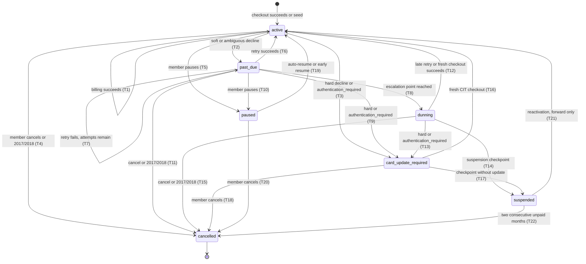

# Subscription Engine Specification, version 1.0

As of 2026-08-16. Author: mlm-architect. Status: SPECIFICATION for Phase S1
(schema plus state machine plus simulated clock). Live charging is Phase S2;
dunning surfaces are Phase S3. This spec refines the research brief
(`SUBSCRIPTION-ENGINE-BRIEF-2026-08-16.md`); where it deviates, section 3 says why.

Plain path:
`C:\Users\howar\Desktop\Desktop\ORVANNA\MLM-PILOT\docs\SUBSCRIPTION-ENGINE-SPEC.md`

> **FLAG FOR HOWARD, DO NOT SKIP: one recommended default in this spec needs your
> explicit confirmation before Phase S1 closes. Multi-month frequencies SPREAD
> their volume: a quarterly billing of a 100 Personal Volume monthly product
> charges 300.00 and spreads 100 Personal Volume into each of the three covered
> calendar months, exactly the bridge's one-time spread pattern. The alternative,
> all volume in the billing month, breaks the per-month thresholds the plan is
> calibrated against. Full argument in section 5.4; the question is restated as
> open question OQ1 in section 15.**

## 1. Acronym key

| Short form | Spelled out |
|---|---|
| CIT | Customer Initiated Transaction, the cardholder is present and acting |
| MIT | Merchant Initiated Transaction, the merchant charges a stored credential with no cardholder present |
| MLM | Multi-Level Marketing |
| PV | Personal Volume |
| SV | Sales Volume |
| CV | Commissionable Volume |
| QA | Quality Assurance |
| UTC | Coordinated Universal Time |
| 3DS | 3-D Secure, the card network step that asks the shopper's bank to confirm identity |
| NSF | Non-Sufficient Funds |
| FK | Foreign Key |
| PK | Primary Key |

## 2. Howard's rulings of 2026-08-16, which are law for this spec

| # | Ruling | Where delivered |
|---|---|---|
| R1 | Frequencies: monthly, bi-monthly (every 2 months), quarterly, semi-annual. The member picks their billing date; if they do not pick, the default is 30 days after the initial purchase, then that anniversary recurs per the frequency. Date changes need a double-billing rule for the transition. | Sections 4, 12.1 |
| R2 | Failed month: no payment, no volume, not qualified. Consistent with bridge ruling 4.4, volume only on processor-confirmed succeeded. | Sections 9, 13 |
| R3 | Pause: up to 2 months; while paused nothing bills, no volume, not qualified; auto-resume after 2 months unless cancelled. | Sections 6, 12.2 |
| R4 | Auto-cancel after two consecutive unpaid months; suspended state in between, no billing attempts, reactivation with fresh payment allowed. | Sections 6, 12.4 |
| R5 | Retries are logical, keyed to decline classification, never blind. Hard declines: no retry, card_update_required. Soft: ladder at days 2, 4, 8, 15, 22 relative to the billing attempt, clipped inside the calendar month. Ambiguous: two backoff retries then dunning. A renewal is an MIT and never runs 3DS interactively; requires_customer_action on a renewal is failed with reason authentication_required, recoverable only through a fresh cardholder-present checkout. | Sections 8, 11 |
| R6 | Recommended default requiring confirmation: multi-month frequencies spread their volume, calendar-contained. | Section 5.4, OQ1 |
| R7 | (arrived while this spec was being written, folded in the same day) The engine runs automatically each day at a staff-configured time, if one is set; a staff Graphical User Interface (GUI) console controls the schedule, previews and executes runs, and manages subscriptions. | Section 9A |
| R8 | (same-day, three follow-up messages) Five production failure modes Howard deals with today must each be defended against by name, with a mechanism and a verification row, in a living register. | Section 13A |

Sections 9A and 13A carry letters rather than renumbering the document,
so the same-day amendment stays visible, per this role's charter rule that
a spec is amended the day reality moves, never silently rewritten.

## 3. Deviations from the brief, each argued

The brief was written before rulings R1 through R4 landed, so several of its
defaults are now overruled or refined. Recorded here so nobody reconciles the
two documents by guesswork.

1. **Anniversary billing replaces first-of-month.** The brief's open question Q1
   recommended first-of-month billing for everyone. Howard ruled R1: the member
   picks the date, default anchor is purchase plus 30 days. Consequence: the
   billing run is a DAILY tick, not one monthly batch, and the retry ladder is
   clipped per subscription rather than sharing one month-wide calendar. The
   brief's day-26 suspension checkpoint survives, generalized in section 8.3.
2. **Frequencies are un-discarded.** The brief's harvest verdict E6 discarded
   frequency as speculative generality. R1 adds four frequencies, so the
   subscription row gains a frequency column after all. E6's caution survives as
   the derive-never-store rule for the next billing date (the E16 footgun).
3. **Retry offsets are relative to the billing attempt.** The brief's cadence
   table used absolute days of month (2, 4, 8, 15, 22) because everyone billed
   on day 1. Howard's R5 wording, "relative to the billing attempt", governs:
   the offsets are plus 2, plus 4, plus 8, plus 15, plus 22 days from the
   billing date. For a day-1 billing they land on days 3, 5, 9, 16, 23, which
   still resolve before the day-26 checkpoint.
4. **State set: seven states, not eight.** The brief proposed both past_due and
   in_retry. This spec merges them into past_due. The distinction they drew,
   waiting between attempts versus an attempt in flight, is unobservable on the
   simulated clock, where every attempt resolves inside its tick, and nearly
   unobservable on the real rail, where an attempt resolves in seconds. Two
   states the verifier can never tell apart is one state too many.
5. **Pause is up to two months, not one.** The brief's Q4 default was one month
   at a time. R3 says up to 2 months. R3 wins.
6. **Auto-cancel confirmed.** The brief's Q3 default (suspend at the checkpoint,
   auto-cancel after two consecutive unpaid months) is now ruling R4, no longer
   an open question.

## 4. Frequencies, billing dates, and coverage

### 4.1 Frequencies

Stored as data on the subscription row, months per period:

| frequency code | Months per period | Example: 100 PV monthly product |
|---|---|---|
| monthly | 1 | charges 100.00, covers 1 month |
| bi_monthly | 2 | charges 200.00, covers 2 months |
| quarterly | 3 | charges 300.00, covers 3 months |
| semi_annual | 6 | charges 600.00, covers 6 months |

The charge is months times the current catalog monthly price, priced through
the existing pricing mirror at billing time (brief E15: renewals bill at the
current catalog price, and the run report shows any change from the prior
period rather than hiding it).

### 4.2 The billing date

- **Member-picked:** a day of month, 1 through 31, stored as
  `billing_day`. Days 29 through 31 clamp at derivation time (section 12.5).
  Days 27 through 31 truncate the retry ladder partly or entirely
  (section 8.3); the shop discloses this at pick time (S3 surface; S1 records
  the fact).
- **Default when not picked:** `billing_anchor_date` = the initial purchase
  date plus 30 days. The first renewal bills on that date; the billing day of
  month is the anchor's day; later renewals recur on that anniversary per the
  frequency. Example: purchase 2026-01-05, anchor 2026-02-04, monthly renewals
  on the 4th thereafter.
- **Derived, never stored:** the next billing date is always computed from the
  stored facts (anchor or picked day, frequency, pause history, date-change
  history), never written into a column an operator could forget to update.
  This is the brief's E16 footgun rule, kept verbatim.

Derivation, stated so builder and verifier reach the same dates independently:

```
scheduled_date(n) = clamp_day( add_months(anchor_date, n * frequency_months + shift_months(n)) )
```

where `n` is the renewal index (1 = first renewal), `add_months` is calendar
month arithmetic on the anchor's day of month, `clamp_day` reduces the day to
the last day of a shorter month without ever rewriting the stored day, and
`shift_months(n)` is the whole-month deferral accumulated from pause events
effective before renewal n (section 12.2). A billing-day change replaces the
day component from its effective renewal onward (section 12.1). All dates UTC.

**Anchor-derived, never incremental (failure mode FM4 defense, section 13A).**
Every cycle's date is computed from the ORIGINAL anchor plus cycle-number
arithmetic, never by adding a month to a previously stored next date.
Incremental date math is how drift and skipped months are born: add one month
to Jan 31 and land on Feb 28, add one month to THAT and March bills on the
28th forever, or a stored date gets missed and a cycle silently vanishes.
Anchor math cannot drift: a January 31 anchor bills February 28 (29 in a leap
year), March 31, April 30, back on the 31st in every month long enough, and a
cycle is NEVER skipped because its date does not exist. The clamp rule here
and the leap-month edge case in section 12.5 are ONE rule, stated once each
place it bites.

### 4.3 Coverage

- A billing on date D covers the calendar month containing D, plus the next
  `frequency_months - 1` calendar months.
- The initial checkout covers the calendar month of purchase as period zero
  (the bridge already books it; no proration, per the brief's Q2 logic: a
  part-month price would break the PV equals dollars invariant).
- Coverage is continuous: covered months never skip and never double, except
  the single disclosed transition case in the date-change rule (section 12.1).

### 4.4 Spread for multi-month frequencies (the flagged default, R6)

A multi-month billing spreads its PV: one product-month of PV into each covered
calendar month, each slice stamped to the first of its own month, calendar
contained. This is exactly the bridge's one-time spread pattern (bridge ruling
4.1 logic: a month of volume corresponds to a month of product; migration 021's
materialised slices). A quarterly Domain Agent billing charges 300.00 and books
100 PV into each of three months, making the quarterly member identical, month
by month, to a monthly member, which is the property the plan's per-month
thresholds require. The alternative, 300 PV in the billing month then two empty
months, would make a quarterly member qualified one month in three, and a
semi-annual member one in six, on identical money. **Recommended default,
awaiting Howard's confirmation, OQ1.**

## 5. The state machine

### 5.1 The seven states

| State | Meaning | Bills? | Books volume? | Qualifies via this subscription? |
|---|---|---|---|---|
| active | In good standing; next billing derives normally | yes, on schedule | yes, on success | yes, when volume books |
| past_due | The period's billing attempt declined soft or ambiguous; scheduled retries remain | retries only | on retry success | only if a retry succeeds |
| dunning | Retries for the escalation point are spent or truncated; member contact required; late-ladder retries (soft class) still run | remaining soft retries only | on late success | only if a late retry succeeds |
| card_update_required | Hard decline, cancellation-lane exclusion aside, or authentication_required; no retry will ever run | no | no | no |
| paused | Member pause, 1 or 2 months; nothing bills | no | no | no (R3) |
| suspended | Period ended unpaid; no billing attempts; reactivation with fresh payment allowed | no | no | no |
| cancelled | Terminal. A returning member is a new subscription row | no | no | no |

### 5.2 Every allowed transition, the diagram as a table

Transitions not listed are forbidden and the state-log trigger refuses them.

| # | From | To | Trigger |
|---|---|---|---|
| T1 | active | active | Billing attempt succeeds; volume books through the bridge. Self-transition is the recorded no-op. |
| T2 | active | past_due | Billing attempt declines soft or ambiguous. |
| T3 | active | card_update_required | Billing attempt declines hard, or comes back requires_customer_action (classified failed, reason authentication_required, R5). |
| T4 | active | cancelled | Member cancels, or decline code 2017 or 2018 (the cardholder-spoke lane; 2018 cancels every subscription the member holds). |
| T5 | active | paused | Member pauses (1 or 2 months). |
| T6 | past_due | active | A scheduled retry succeeds; volume books to the covered period. |
| T7 | past_due | past_due | A retry declines soft or ambiguous and scheduled attempts remain before the escalation point. |
| T8 | past_due | dunning | Escalation: soft class after the plus-8 retry fails; ambiguous class after both backoff retries fail; any class immediately when the surviving ladder is empty (truncation, section 8.3). |
| T9 | past_due | card_update_required | A retry declines hard, or authentication_required. |
| T10 | past_due | paused | Member pauses while past_due; remaining retries for the period are cancelled; the period stays unpaid (section 12.3). |
| T11 | past_due | cancelled | Member cancels, or code 2017 or 2018 on a retry. |
| T12 | dunning | active | A remaining soft-ladder retry succeeds, or the member completes a fresh checkout for the period. |
| T13 | dunning | card_update_required | A remaining retry declines hard, or authentication_required. |
| T14 | dunning | suspended | The suspension checkpoint passes with the period still unpaid (section 8.3). |
| T15 | dunning | cancelled | Member cancels during dunning (section 12.4), or code 2017 or 2018. |
| T16 | card_update_required | active | Member completes a new cardholder-present checkout (fresh CIT, 3DS runs properly); the payment re-establishes the credential and covers the open period if inside the same calendar month, else the next period forward. |
| T17 | card_update_required | suspended | The suspension checkpoint passes without a card update. |
| T18 | card_update_required | cancelled | Member cancels. |
| T19 | paused | active | Auto-resume when the pause window ends (R3), or member resumes early. |
| T20 | paused | cancelled | Member cancels during pause. |
| T21 | suspended | active | Reactivation: a fresh cardholder-present payment succeeds; next period forward, no back-billing (section 12.6). |
| T22 | suspended | cancelled | Auto-cancel: two consecutive unpaid calendar months (R4, counting rule in section 12.7), or member cancels. |

Nothing returns to active except a genuine processor-confirmed succeeded
payment (fresh retrieve, exact integer amount match, the same evidentiary bar
the checkout already holds). cancelled is terminal.

### 5.3 The same machine as a picture



## 6. Schema

### 6.1 The call on `app.subscriptions`: evolve, do not replace

The existing table (member_id, product_id, quantity, start_month inclusive,
cancel_month exclusive) is EVOLVED, not replaced. Three reasons: 1,820 seeded
rows and six finalized months already interpret it, and replacement would force
a data migration through frozen history for zero semantic gain; the comp engine
never reads subscriptions at all (it reads orders), so the evolution is
invisible to everything finalized; and the month model (exclusive cancel month)
is exactly the coverage arithmetic section 4.3 needs. New columns, with
backfill for the 1,820 seeded rows that reproduces their current behavior
exactly (monthly, billing day 1, active):

| New column | Type | Meaning |
|---|---|---|
| `frequency_months` | `int` not null default 1, check in (1, 2, 3, 6) | R1 frequencies as data |
| `billing_day` | `int` nullable, check 1 to 31 | Member-picked day; null means anchor rule |
| `billing_anchor_date` | `date` not null | Purchase date plus 30 days for checkout-born rows; backfilled to start_month for seeded rows (day 1) |
| `state` | `text` not null default 'active', check in the seven states | Section 5 |
| `state_changed_at` | `timestamptz` not null | Stamped by trigger on state change |
| `credential_id` | `bigint` nullable FK to `app.payment_credentials` | The stored credential renewals charge (section 6.2 table 10); null for seeded and Path B simulated rows until a credential exists |

**Deliberately absent: any next_billing_date column.** Derived per section 4.2.
A view `app.v_subscription_next_billing` computes it for every non-terminal
row, as a lens, never a store (the same lens-versus-store split migration 021
drew with `v_volume_schedule`).

### 6.2 New tables, ten of them

SQL below is a SKETCH for shape only, not production code; mlm-db-engineer
writes the real migration.

**1. `app.subscription_events`, the append-only fact stream.** Every member and
engine action lands here; the verifier replays this stream plus the outcome
record to reproduce everything.

```sql
-- SKETCH
create table app.subscription_events (
  id bigint generated always as identity primary key,
  subscription_id bigint not null references app.subscriptions(id),
  event_type text not null check (event_type in
    ('created','state_change','billing_day_change','pause','resume',
     'cancel_request','reactivation')),
  occurred_on date not null,              -- simulated or real clock date, UTC
  from_state text, to_state text,         -- for state_change
  cause text,                              -- transition id T1..T22 plus detail
  old_billing_day int, new_billing_day int,
  pause_months int check (pause_months in (1,2)),
  billing_attempt_id bigint               -- FK added after billing_attempts
);
```

Append-only: a trigger refuses update and delete, the same discipline as
finalized commission rows.

**2. `app.billing_runs`, the versioned batch.** One row per tick, the
commission-run discipline exactly: statuses running, final, superseded; a rerun
is a new row; a partial unique index allows one final run per tick date.

```sql
-- SKETCH
create table app.billing_runs (
  id bigint generated always as identity primary key,
  tick_date date not null,                -- the simulated or real day processed
  engine_version text not null,
  clock_source text not null check (clock_source in ('simulated','real')),
  status text not null check (status in ('running','final','superseded')),
  started_at timestamptz, finished_at timestamptz,
  subscriptions_due int, attempts_made int, succeeded int, declined int,
  notes text
);
create unique index billing_runs_one_final_per_tick
  on app.billing_runs(tick_date) where status = 'final';
```

**3. `app.renewal_periods`, the obligation ledger.** Materialised at first
attempt (rule resolved into data at billing time, the migration 021 principle),
one row per subscription per renewal index.

```sql
-- SKETCH
create table app.renewal_periods (
  id bigint generated always as identity primary key,
  subscription_id bigint not null references app.subscriptions(id),
  renewal_index int not null,             -- n in scheduled_date(n)
  scheduled_date date not null,           -- as derived at billing time, frozen
  covered_month_first date not null,      -- first of first covered month
  covered_months int not null,            -- = frequency_months at billing time
  amount_cents int not null,              -- priced at billing time, frozen
  pv_total numeric(10,2) not null,
  outcome text not null default 'open' check (outcome in
    ('open','paid','unpaid','skipped_paused','void_cancelled')),
  unique (subscription_id, renewal_index)
);
```

**4. `app.billing_attempts`, the attempt and retry ledger.**

```sql
-- SKETCH
create table app.billing_attempts (
  id bigint generated always as identity primary key,
  run_id bigint not null references app.billing_runs(id),
  renewal_period_id bigint not null references app.renewal_periods(id),
  attempt_no int not null,                -- 1 = billing attempt, 2.. = retries
  attempt_kind text not null check (attempt_kind in
    ('initial','retry_soft','retry_ambiguous','retry_infra_immediate')),
  scheduled_for date not null,
  demo_order_id bigint references app.demo_orders(id),  -- the payment artifact
  outcome text not null default 'dispatched' check (outcome in
    ('dispatched',                            -- non-terminal: sent, no answer yet
     'succeeded','declined','processor_unreachable',
     'preflight_failed','skipped_clipped')),
  decline_code text, decline_class text,
  next_action text,                        -- 'retry:<date>','dunning','card_update','suspend','none'
  unique (renewal_period_id, attempt_no)
);
```

**5. `app.decline_classifications`, the classification table as DATA, not
code.** Rows carry an as-of date; changing a classification is an insert of a
new effective row, never an edit, so a past run's classification is always
reconstructible. Seeded from the brief's section 3.2 verbatim:

| code | source | class | max scheduled retries | notes |
|---|---|---|---|---|
| 2005, 2006, 2007, 2009, 2012, 2013, 2014, 2047, 2004 | braintree | hard | 0 | card_update_required; 2004 expired card is the card-update front door |
| 2017 | braintree | cancellation | 0 | cancel THIS subscription immediately, T4/T11/T15 |
| 2018 | braintree | cancellation_all | 0 | cancel EVERY subscription the member holds |
| 2001, 2002, 2003 | braintree | soft | 5 | full ladder |
| 3000 | braintree | infra | 5 | one immediate retry first, not counted against the ladder |
| processor_unreachable | internal | infra | 5 | same as 3000 |
| 2000, 2038 | braintree | ambiguous | 2 | two backoff retries then dunning |
| 2044, 2046 | braintree | ambiguous_contact | 1 | one retry then straight to dunning |
| 2015, 2019, 2024 | braintree | config | 0 | flag needs_human on the run report; not a card fact |
| 2016 | braintree | duplicate | 0 | never retry; investigate; needs_human |
| authentication_required | internal | auth | 0 | card_update_required, R5 invariant |
| gateway type mismatch ("Payment Type Does Not Match" and kin), failed pre-flight | internal | internal_config | 0 | SYSTEM FAULT, section 13A FM5: our defect, never the member's. Never laddered (no retry fixes our own bad pointer), never counted against the member's dunning or auto-cancel clocks, routed to card_update_required or the staff attention queue, reported separately in run history |
| any unrecognized code | internal | ambiguous | 2 | printed loudly on the run report; unknown never earns aggressive retries |

**A principle of the whole table: every class is labeled member-fault or
system-fault.** hard, soft, ambiguous, ambiguous_contact, cancellation and
auth are member-side facts about a card or a cardholder; infra, config,
duplicate and internal_config are system-side faults. Only member-fault
classes may ever consume the member's retry ladder, dunning clock, or
auto-cancel counter. System-fault failures are OUR defects: they route to the
staff attention queue, are fixed by us, and can never hide inside decline
statistics because run history reports the two families separately.

**6. `app.retry_policies`, the ladder as data.** One row per class per step:
soft steps 1 through 5 at offsets 2, 4, 8, 15, 22 days from the billing
attempt; ambiguous steps 1 and 2 at offsets 2 and 4; ambiguous_contact step 1
at offset 2; infra inherits soft after its immediate retry. Changing a cadence
is a data change with an as-of date, not a code deploy.

**7. `app.sim_clock`, the simulated clock.** Section 10.

**8. `app.sim_outcome_scripts`, the Path B simulated processor.** Section 10.

**9. `app.billing_schedule`, the staff-set daily schedule (R7).** A single
row: `enabled boolean`, `run_at_time time`, `timezone text`, `updated_by text`
(staff username), `updated_at timestamptz`. Edited only through the staff
console's Edge Function; honored server-side per section 9A. When `enabled`
is false or no time is set, the engine runs manually only.

**10. `app.payment_credentials`, payment identity as one immutable record
(FM5 defense).** Card identity and its network anchor live TOGETHER, versioned,
never as loose copies that can drift apart:

```sql
-- SKETCH
create table app.payment_credentials (
  id bigint generated always as identity primary key,
  member_id bigint not null references app.members(id),
  brand text not null, last4 text not null,
  expiry_month int not null, expiry_year int not null,
  token_reference text not null,          -- mandate / payment method identifier
  network_anchor text,                    -- network transaction anchor from the minting CIT
  minted_by_demo_order_id bigint references app.demo_orders(id),
  created_on date not null,
  retired_on date                          -- null = live; a card change retires, never edits
);
```

A credential row is immutable after insert (trigger refuses update except
setting `retired_on` once). A card update NEVER edits a credential: it mints a
NEW one through a fresh cardholder-present transaction (which is what creates
a valid new network anchor), repoints `subscriptions.credential_id`, and
retires the old row with a date. This is the derive-not-store principle
applied to payment identity, and it maps one to one onto the HyperSwitch
mandate model of the brief's Path A: one mandate, one card, forever; card
change means new mandate. In S1's Path B simulation, synthetic credential rows
exercise the same shape, including the deliberately corrupted one the verifier
must catch (section 14).

### 6.3 Widened, not new

- `app.demo_orders.created_by_channel` check widens to include
  `'renewal_engine'`. Engine-created rows set `created_at` from the run's tick
  date, never from `now()`, so month attribution (bridge policy P3) reads the
  clock the engine ran on.
- Items written by the engine carry `mode: 'sub'` plus a new per-line field
  `covered_months` (1, 2, 3 or 6). The bridge amendment in section 7 reads it.

Schema count for the record: **ten new tables, one evolved table
(`app.subscriptions`), one widened table (`app.demo_orders`), one amended
function (the bridge, section 7).** The staff attention queue and the cycle
audit (section 13A) are VIEWS over these tables, lenses not stores, so they
add no table to the count.

## 7. The order-shape decision: the engine writes demo-order-shaped rows

**Decision: the renewal engine writes `app.demo_orders`-shaped rows and lets
the existing bridge translate them, exactly as the shop does. It never writes
`app.orders` directly.** Argued:

1. **The seven rulings come free instead of being duplicated.** P1 (succeeded
   only, fresh retrieve, exact amount) is the enforcement of Howard's R2; P3
   month attribution, P5 packs stay whole, P7 idempotent re-runs, P9 activation
   fee handling, and the migration 021 finalized-month trigger all apply to a
   demo-order row automatically. Writing `app.orders` directly would mean
   re-implementing every one of those policies inside the engine, and the two
   implementations would drift, which is precisely the two-input-shapes failure
   the bridge design rejected.
2. **The audit trail stays one trail.** commission line to order to demo order
   to processor payment reference already exists; renewal attempts join it at
   `billing_attempts.demo_order_id` instead of inventing a parallel spine.
3. **Retries fit the house rule.** failed is terminal on demo_orders; a retry
   is a NEW demo-order row with a new order number, so every attempt survives
   as its own receipt, and only the succeeded row bridges.

**One amendment to the bridge, and only one.** Today the bridge spreads
`mode: 'one'` lines over ten months and books `mode: 'sub'` lines to the
creation month. It gains a single datum: a `sub` line carrying
`covered_months > 1` spreads over exactly that many months, first slice in the
creation month, later slices stamped to the first of each following calendar
month, the identical materialised-slice mechanism migration 021 already built
and proved (ten slices, summing exactly, calendar contained). This is an
extension of the bridge's existing spread pattern with a parameterised count,
not a duplicate and not a bypass; the seven rulings are untouched. It is a
small migration owned by mlm-db-engineer, gated on OQ1.

Because ruling R5 clips every retry inside the billing calendar month, a
success always lands in the month it renews, so P3's creation-month attribution
gives the correct volume month with no exception path. The brief's section 4.1
worry (run-assigned month versus creation month) dissolves: under anniversary
billing plus the clip, they are the same month by construction. A webhook
straggler after suspension still hits the migration 021 trigger if its month
finalized, and the brief's section 4.2 rule stands: late money buys the next
month, forward only.

## 8. The retry ladder, exactly

### 8.1 Offsets (R5)

Relative to the billing attempt date D, all within D's calendar month:

| Class | Attempts after the billing attempt | Offset days from D |
|---|---|---|
| soft | up to 5 | +2, +4, +8, +15, +22 |
| ambiguous | up to 2, then dunning | +2, +4 |
| ambiguous_contact (2044, 2046) | 1, then dunning | +2 |
| infra (3000, processor_unreachable) | 1 immediate (same tick, minutes on the real rail), then the soft ladder; the immediate retry consumes no ladder step | +0, then soft offsets |
| hard, cancellation, config, duplicate, auth | 0 | none |

### 8.2 Escalation and dunning entry

- soft: dunning state entered when the +8 retry fails (the brief's day-8 notice
  point); the +15 and +22 retries still run while in dunning (the payday retry
  is the single best recovery moment for NSF).
- ambiguous: dunning entered when the +4 retry fails.
- ambiguous_contact: dunning entered when the +2 retry fails.
- Any class whose surviving ladder is EMPTY after clipping (section 8.3):
  dunning entered immediately when the billing attempt fails.

### 8.3 The clip, generalized from the brief's day 26

Rule C1: **a scheduled retry survives only if its date falls in the same
calendar month as the billing attempt AND its day of month is at most 26.**
Rule C2: **the suspension checkpoint is the day-26 tick of the billing month;
for billing dates on days 27 through 31 (reachable only by member pick or
short-month clamping), the checkpoint is the month-end tick instead.** At the
checkpoint, a period still unpaid moves dunning or card_update_required to
suspended (T14, T17), and the renewal_period outcome freezes as unpaid.

Worked truncation table, monthly subscription, 31-day month:

| Billing day | Surviving retries (soft) | Surviving (ambiguous) | Checkpoint |
|---|---|---|---|
| 1 | +2, +4, +8, +15, +22 on days 3, 5, 9, 16, 23: all five | both, days 3 and 5 | day 26 |
| 4 (the default-anchor example) | days 6, 8, 12, 19, 26: all five | both, days 6 and 8 | day 26 |
| 15 | days 17, 19, 23; +15 lands day 30 and +22 day 37, both clipped: three survive | both, days 17 and 19 | day 26 |
| 20 | days 22, 24; +8 lands day 28, clipped: two survive | both, days 22 and 24 | day 26 |
| 24 | day 26 only (+2); +4 lands day 28, clipped: one survives | one, day 26 | day 26 |
| **28 (the mission's named case)** | **none. +2 lands day 30, above the day-26 line; every later offset likewise. The ladder truncates to zero: the billing attempt on day 28 is the only attempt.** | **none** | **month end** |

So for the member-picked date of the 28th: the answer is that NO retries
survive. One attempt runs on the 28th; a soft or ambiguous decline goes
straight to dunning (empty-ladder rule, 8.2); the period suspends at the
month-end tick if the member does not recover it with a fresh checkout. The S3
pick surface must say this out loud when a member chooses day 27 or later
(OQ3).

### 8.4 The MIT and 3DS invariant (R5, restated as testable)

No payment created by the billing or retry run ever carries an interactive
authentication request. Any renewal payment that returns
requires_customer_action is immediately classified failed, reason
authentication_required, class auth, zero retries, subscription to
card_update_required, whose only exit is a fresh cardholder-present checkout
where 3DS runs properly (T16). Under Path B simulation the invariant is
asserted on every simulated attempt in the run report, so the discipline is
already tested before real charging exists.

## 9. The renewal pipeline, step by step

One tick processes one date. Every step is deterministic given the inputs.

1. **Open the run.** Insert `billing_runs` row for the tick date, status
   running, clock source recorded.
2. **Reconcile first (FM2 defense).** Before gathering new work, sweep every
   renewal attempt still non-terminal (`dispatched`, or a demo order sitting
   in `created` or `processing`) beyond the threshold: retrieve the truth from
   the processor exactly as the existing abandoned-order sweep does, write the
   terminal outcome, or re-dispatch idempotently under the per-cycle key, or
   fail it explicitly and surface it in the staff attention queue. Nothing
   silently vanishes between the order table and the processor.
3. **Gather due work, ON OR BEFORE the tick date (the catch-up rule, R7, and
   the FM4 skip defense).** Derivation queries, no stored schedule: (a) active
   subscriptions with any cycle index n whose `scheduled_date(n)` is on or
   before the tick date AND has no `renewal_periods` accounting row yet;
   due-ness derives from the accounting of prior cycles, never from a stored
   next date, so a missed day, a crashed run, or a paused scheduler self-heals
   on the next tick and a cycle can never be lost or billed twice (FM1); (b)
   `billing_attempts.next_action` retry dates on or before the tick date, C1
   still enforced (a retry whose window passed is `skipped_clipped`, never run
   late into a new month); plus checkpoint evaluations (C2), pause
   auto-resumes (T19), and auto-cancel evaluations (T22) due by today.
4. **Promo hook, named `app.fn_apply_promotions`.** Interface, fixed now so S2
   and later promotions slot in without touching the pipeline: input is the
   run id plus the set of candidate charges (subscription_id, renewal_index,
   priced lines with unit_price_cents and unit_pv); output is the same set,
   possibly with adjusted prices and a promo annotation per adjusted line. In
   S1 it is a NO-OP: output equals input, asserted in the run report. Contract
   constraint: the hook returns price AND PV explicitly per line; any future
   promotion that moves price without PV breaks the PV equals dollars
   invariant and requires Howard's ruling before it may ship.
5. **Price, at billing time, from the single pricing source (FM3 defense).**
   Through the existing pricing mirror at current catalog prices, with the
   existing drift check between `pricing.ts` and `catalog.js` as the guard;
   the subscription row stores NO price, ever, so a catalog change can never
   leave a stale copy behind. Charge = frequency_months times monthly price
   per line; renewals carry no activation fee. Any difference from the prior
   period's price for the same subscription is printed on the run report
   (E15). If Howard ever wants price-locked (grandfathered) subscriptions,
   that becomes an explicit dated attribute with an effective-dating rule,
   never an implicit stale copy (OQ9).
6. **Batch.** Materialise `renewal_periods` rows for new attempts (frozen
   scheduled_date, coverage, amount, PV) and `billing_attempts` rows for
   everything dispatched this tick. The unique key
   `(subscription_id, renewal_index)` is the per-cycle idempotency lock (FM1),
   the same pattern as the bridge's `(demo_order_id, volume_month)` index.
7. **Pre-flight credential check (FM5 defense).** Before any rebill is sent,
   verify the credential the subscription points at is coherent: not retired,
   not expired at the billing date, brand consistent with its own anchor
   record. A failed pre-flight NEVER reaches the processor: the attempt is
   written `preflight_failed`, classified `internal_config`, and routed per
   the system-fault rules of section 6.2. Skipped for credential-less Path B
   rows except the scripted corruption scenarios.
8. **Dispatch to payment.** Write the demo-order-shaped row
   (created_by_channel renewal_engine, created_at = tick date, items with
   covered_months) and submit it: in S1, to the simulated processor
   (section 10), which writes payment_status exactly as the real confirmation
   path would; in S2, to the real rail as an off-session MIT. The state
   machine, classification, and bridge never know which processor answered.
9. **Classify.** Look up the connector code (first), orchestrator status
   (second), refined reason (third) in `decline_classifications`, effective as
   of the tick date. Unrecognized is ambiguous, loudly.
10. **Transition and schedule.** Apply the state transition (T1 through T22),
    append `subscription_events`, compute surviving retries under C1, write
    `next_action`.
11. **Bridge.** Call the existing `app.fn_bridge_demo_orders` (with the
    section 7 amendment): succeeded rows become ordinary orders, spread slices
    included, idempotently.
12. **Close the run.** Totals, assertions (no interactive authentication
    requested on any attempt; promo hook identity in S1; member-fault and
    system-fault failures totalled separately), status final. A rerun of the
    same tick is a new run row superseding the old, and re-running is harmless
    because every write is idempotent on its natural key.

## 9A. The daily scheduler and the staff billing console (R7, ruled 2026-08-16)

### 9A.1 The scheduler is decided, no longer an open question

The brief's open question Q8 is closed by Howard's ruling: the renewal engine
runs AUTOMATICALLY EACH DAY at a staff-configured time, if one is set. The
schedule (enabled flag, time of day, timezone) lives in `app.billing_schedule`
(section 6.2 table 9), is edited only from the staff console, and is honored
SERVER-SIDE, because a static page cannot wake itself.

**Mechanism, argued: `pg_cron` inside the Supabase Postgres project.** The two
candidates were pg_cron and an external scheduled trigger calling an Edge
Function with a shared secret. pg_cron wins on every axis that matters here:
it lives inside the one platform this project already trusts, next to the data
and inside the same transaction boundary; it is one migration to enable; and
it adds no second platform, no shared secret, and no outbound dependency. The
external trigger is the fallback if the platform ever withdraws pg_cron, and
nothing below would change but the alarm clock.

How it fires: a pg_cron job runs every five minutes and does almost nothing.
It reads `app.billing_schedule`; if `enabled` is true, the configured
`run_at_time` in the configured timezone has passed for the schedule-local
date, and no final `billing_runs` row exists for that date, it OPENS a run,
which is the same first-class, hand-runnable, replayable object as always. The
cron tick is a convenience alarm, never the owner of the work. When no time is
set or `enabled` is false, the engine runs manually only.

**The catch-up rule makes a missed day self-heal.** Pipeline step 3 gathers
everything due ON OR BEFORE the tick date that has no accounting row yet, per
the member-picked billing dates and frequencies. A day the scheduler missed
(outage, disabled window, paused project) is simply gathered by the next tick
that runs. Nothing is lost, and nothing double-bills, because due-ness derives
from cycle accounting under the per-cycle unique key, not from a stored date.

### 9A.2 The staff billing console

A Graphical User Interface (GUI) behind the EXISTING staff sign-in (the
demo-login staff session, the same gate the refund screen uses). Named
options, minimum set:

| Option | What it does |
|---|---|
| Schedule control | Enable or disable the daily run; set the time and timezone. Writes `app.billing_schedule` through an Edge Function. |
| Run now, preview first | A mandatory DRY-RUN PREVIEW before any execution: what would bill today (count of subscriptions due, total dollars, breakdown by frequency and by new-versus-retry), creating nothing, exactly the quote-then-record pattern the tax engine already established. Then a separate confirm step executes the real run. The preview is the SAME gather-and-price read the real run performs, so preview and execution can never disagree. |
| Run history | Every billing run as a row: run id, tick date, when, gathered, succeeded, declined by classification (member-fault and system-fault reported separately), retries scheduled. Drill into one run down to its attempts and their reasons, the brief's E13 made real. |
| Retry queue | Everything scheduled to retry, when, and under which decline class. |
| Attention queue | The rows a human must see: orphaned attempts the reconciler flagged (FM2), cycle-audit gaps (FM4), internal_config failures (FM5), needs_human classifications (config and duplicate codes). |
| Subscription management | On one member's subscription: pause, resume, cancel, change billing date or frequency (invoking the section 12.1 double-billing transition rule, with its disclosure shown to staff), flag card_update_required, reactivate a suspended subscription with a fresh payment. |
| Upcoming forecast | The next seven days of scheduled billing, by day, derived from the same `scheduled_date(n)` arithmetic, so what the forecast shows is what the engine will do. |

Two hard rules, both precedents from the refund screen: every write is
audited to the SAME `app.demo_staff_actions` ledger the refund system uses,
with the staff username; and every rule is enforced by the Edge Functions,
never by the page, because hiding a button is not a gate. A crafted request
without a staff session gets the same refusal the console would show.

### 9A.3 The phasing call, argued

**The console core lands in Phase S1, driving the simulated clock.** Argument:
S1's simulated year needs a driver anyway, and a driver with no eyes is a
script, not a demonstration. With the console in S1, the schedule control,
dry-run preview, run history, retry queue, attention queue, forecast, and
subscription management all operate against simulated ticks, which makes the
console itself the best demonstration surface the engine has: staff can play
a year of billing in minutes and watch declines classify, retries recover, and
suspensions land. In S2 the same console drives the real rail, with the
pg_cron alarm firing real daily ticks, and not one console screen changes.
Member-facing surfaces (dunning notices, the member's own card update page)
remain Phase S3 as before. Cost of the call: S1 grows by one page and its Edge
Functions; the schema was already carrying everything the console reads.

## 10. The simulated clock, and how S1 proves a year in minutes

- **`app.sim_clock`** holds a single row: `current_date date`, plus an
  append-only advance log (from, to, advanced_by_run). The engine NEVER calls
  `now()` or `Date.now` for business dates; every date in sections 4 through 9
  reads the clock the run was opened with. Real wall-clock timestamps
  (started_at, finished_at) remain honest wall time, labelled as bookkeeping,
  never as business dates.
- **Advancing:** `fn_billing_tick(p_date)` requires p_date = clock date + 1
  day, runs the section 9 pipeline for that date, then advances the clock. A
  year is 365 sequential calls; on the live database's scale (about 1,800
  subscriptions) each tick touches a few dozen rows, so a full simulated year
  completes in minutes. Determinism: same subscriptions, same events, same
  scripts, same data tables in, identical rows out, to the cent, every run.
- **`app.sim_outcome_scripts`**, the Path B processor: one row per
  (subscription_id, renewal_index, attempt_no) with the scripted outcome
  (succeeded, or a decline code, or processor_unreachable). Any attempt
  without a script row succeeds; that default keeps scripts small and the
  happy path implicit. The simulated processor writes payment_status through
  the same guarded transition path as the real confirmation code, so the
  demo-order state machine is exercised, not bypassed.
- **Environment rule:** the simulated year runs in a reset environment (the
  `db\comp\003_reset_app_data.sql` path or a Supabase branch), never against
  the production data carrying six finalized months; the migration 021 trigger
  would rightly refuse simulated writes into finalized periods, and production
  history must stay untouched (OQ8).

## 11. Qualification interplay, hand-computed worked examples

Shared setup: Ann is sponsored by Beth. Ann holds one monthly Domain Agent
subscription, 100.00 dollars, 100 PV, billing day 1, tax destination answering
zero (the Illinois case from the brief). Beth is qualified with paid depth 1.
Rates: CV = 0.80 times SV; level 1 pays 10 percent of CV.

**Example A: soft decline recovered by the plus-8 retry. Qualified.**

| Date (Sep 2026) | Event | Outcome |
|---|---|---|
| Sep 1 | Billing attempt 1, 100.00 (10000 cents) | declined 2001, class soft; state active to past_due (T2) |
| Sep 3 | Retry (+2), attempt 2 | declined 2001; past_due (T7) |
| Sep 5 | Retry (+4), attempt 3 | declined 2001; past_due (T7) |
| Sep 9 | Retry (+8), attempt 4 | SUCCEEDED; past_due to active (T6) |

The Sep 9 demo order (created_at Sep 9, inside the billing month) bridges:
order row, volume month 2026-09, 100 PV. Ann's September SV = 100.00, at the
gate, QUALIFIED. CV = 0.80 x 100.00 = 80.00. Beth earns level 1: 10 percent of
80.00 = 8.00. Identical to an on-time renewal: a recovered retry is invisible
in the statement, which is exactly right (R2 satisfied by success).

**Example B: retries exhaust. Not qualified.**

Same member, attempts on Sep 1, 3, 5, 9, 16, 23 all decline 2001 (attempt 1
plus the full five-step ladder at +2, +4, +8, +15, +22; dunning entered when
the Sep 9 attempt fails). Day-26 checkpoint: dunning to suspended (T14), period
outcome unpaid. No succeeded row exists, so the bridge writes nothing (P1, R2).
Ann's September SV = 0.00, NOT qualified. Beth's 8.00 line does not exist.
October: suspended, no billing attempt, October also unpaid. At the Nov 1 tick
the counter reads two consecutive unpaid months: auto-cancel (T22, R4), unless
Ann reactivated during October with a fresh payment (T21).

**Example C: quarterly member under the spread default. Qualified all three
covered months.**

Carl holds the same Domain Agent at quarterly frequency, billing day 1. Oct 1
billing: charge = 3 x 100.00 = 300.00 (30000 cents), succeeds first attempt.
The bridge books three slices of 100 PV: volume months 2026-10, 2026-11,
2026-12, first slice in the creation month, later slices stamped Nov 1 and
Dec 1, summing exactly 300. Carl's SV is 100.00 in October, 100.00 in
November, 100.00 in December: QUALIFIED in all three covered months, and his
upline earns 8.00 in each month, exactly as if he were a monthly subscriber.
Under the rejected alternative he would post SV 300.00 in October and 0.00 in
November and December: qualified one month in three on identical money, which
is the arithmetic case for OQ1's default.

## 12. Edge cases, each with its rule

### 12.1 Date change mid-cycle: the double-billing rule (R1 consequence)

Rule: coverage is continuous; a date change never creates a coverage gap and
never doubles a covered month. The transition charge runs on the FIRST
occurrence of the new billing day strictly after the change request, and it
covers the next uncovered month(s). Consequence, stated plainly: the change
month may contain TWO billings of the same subscription (the old-schedule
charge and the transition charge), exactly once per date change, disclosed to
the member at change time. After the transition charge, the schedule is the
new day, recurring per the frequency. Example: monthly, day 5, August billed
and covered; member changes to day 25 on Aug 10; transition charge Aug 25
covers September; two charges land in August, September is covered once, no
month is ever double-covered. Retries on a transition charge follow the normal
ladder, clipped in the transition charge's own calendar month.

### 12.2 Pause mechanics (R3)

A pause defers whole billing periods, never fractions: pausing for k months
(k = 1 or 2) adds k to `shift_months` for every future renewal index, so every
later scheduled date moves k months later and coverage stays continuous. While
paused: no billing, no volume, not qualified through this subscription. The
paused months are `skipped_paused` renewal-period outcomes, distinct from
unpaid; they do NOT count toward the R4 auto-cancel counter. Auto-resume fires
at the tick after the pause window ends (T19); an early resume re-derives the
schedule with the actual months skipped.

### 12.3 Pause during past_due or dunning

Accepted (T10). Remaining retries for the open period are cancelled
(`skipped_clipped` attempts), the period freezes as unpaid, its volume is gone
forever (R2), and the pause covers the following periods. Recommended default,
OQ2: the pause RESETS the consecutive-unpaid counter, because a member who
pauses has engaged, which is the opposite of the silent churn R4 exists to
sweep out; the unpaid period itself still stands.

### 12.4 Cancellation during dunning

Effective immediately (T15). Remaining retries are cancelled; the open period
stays unpaid; no refund concept exists in this engine (refunds remain the
bridge's separate, unbuilt machinery per bridge decision 4.3). Codes 2017 and
2018 take the same path without waiting for the member to click anything,
because the cardholder already spoke through their bank.

### 12.5 Leap months and short months: the clamp rule

The stored `billing_day` is never rewritten. At derivation, a day greater than
the month's length clamps to the month's last day: day 31 bills Apr 30, day 29
bills Feb 28 (or Feb 29 in a leap year, since 29 then exists). The next month
the stored day applies again, so a day-31 member bills Jan 31, Feb 28, Mar 31.
Clamped dates on days 27 through 31 fall under checkpoint rule C2 (month-end
suspension, truncated ladder per C1). This is the E16 footgun avoided a second
way: the fact stored is the member's choice; every consequence is derived.

### 12.6 Reactivation from suspended: what resets

Reactivation is a fresh cardholder-present checkout (CIT, 3DS runs). On
success (T21): state active; the payment covers the calendar month of the
reactivation payment as its first covered month, forward only, no back-billing
into unpaid or finalized history (bridge trigger enforces the finalized half);
the consecutive-unpaid counter resets to zero; retry ladders reset (a new
period starts clean); `billing_anchor_date` re-anchors to the reactivation
date, so the default schedule recurs from it, unless the member picks a day at
reactivation (OQ6 records the re-anchor default for confirmation). The unpaid
periods stay unpaid forever; nothing is rewritten.

### 12.7 The auto-cancel counter, defined countably (R4)

An UNPAID MONTH is a calendar month in which this subscription was due to be
covered but booked no volume because of payment failure or suspension. Paused
months are excluded (12.2, 12.3). The counter is derived, never stored: at
each month-start tick, count backward over consecutive calendar months; if the
two most recent are both unpaid and the state is suspended, auto-cancel fires
(T22). For multi-month frequencies the same rule applies to covered months: a
quarterly member whose billing failed has its first uncovered month begin the
count, and cancellation lands at the start of the third uncovered month unless
reactivation intervenes.

## 13. Determinism and audit

- Billing is a versioned run (section 6.2, table 2) with the commission-run
  discipline: one final run per tick, reruns supersede, finalized rows frozen
  by trigger, totals written at close.
- The engine's entire behavior is a function of: the subscription rows, the
  event stream, the classification and retry-policy data tables (as of the
  tick date), the outcome record (scripts in S1, processor summaries in S2),
  and the clock. No hidden state, no wall-clock reads in business logic, no
  randomness.
- R2 is enforced structurally, not procedurally: the engine cannot book volume
  at all, because only the bridge writes orders and the bridge admits only
  processor-confirmed succeeded rows (P1). A bug in the engine can fail to
  charge; it cannot invent volume.

## 13A. Known industry failure modes and their defenses (R8, ruled 2026-08-16)

Howard named five failure modes he deals with TODAY in production subscription
and payment systems. Each is defended by name, with a mechanism in this spec
and a verification row in section 14. **This register is a living section: it
grows as Howard names more.** Nothing in it is hypothetical; every entry is a
thing that has actually happened somewhere money was real.

### FM1. Double release

*"Subscription released twice because the program is not checking last ship
date."* Defense, two locks that hold independently: (a) billing is idempotent
per cycle, enforced structurally by the unique key
`(subscription_id, renewal_index)` on `app.renewal_periods` (pipeline step 6),
the same pattern as the bridge's `(demo_order_id, volume_month)` index; a
second insert for the same cycle is refused by the database, not by
discipline. (b) The gather step derives due-ness from the ACCOUNTING of prior
cycles (which cycles have rows and outcomes), never from a stored next date
(pipeline step 3), so a re-run, a crash-and-restart, or an overlapping tick
finds the cycle already accounted and bills nothing. Verified by a deliberate
double-tick in the simulated year: zero duplicate charges (section 14).

### FM2. Orphaned order

*"Subscription created the order but never got to the payment platform."*
Defense: every renewal attempt must reach a terminal state, and the RECONCILER
(pipeline step 2, the existing abandoned-order sweep pattern) opens every
tick by finding anything stuck non-terminal beyond the threshold, retrieving
the processor's truth, then re-dispatching idempotently under FM1's cycle key
or failing it explicitly into the attention queue. The crash-mid-batch case is
the acceptance scenario: payment 47 of 60 dispatched, engine dies; the rerun's
reconciler resolves attempt 47 from the processor's answer, the gather step
finds cycles 48 through 60 unaccounted and bills them once each, and cycles 1
through 46 are already accounted and untouched. Nothing silently vanishes
between the order table and the processor.

### FM3. Stale pricing

*"Pricing sometimes does not get updated when pricing changes."* Defense: the
subscription row NEVER stores a price; every billing reprices at billing time
from the single pricing source, the existing `_shared` pricing mirror, guarded
by the existing drift check between `pricing.ts` and `catalog.js` (pipeline
step 5). A price that cannot be stored cannot go stale. Price-locked
(grandfathered) subscriptions, if ever wanted, become an explicit dated
attribute with an effective-dating rule, never an implicit stale copy. The
open half, whether a price change requires member notification before the next
renewal bills it, is OQ9 with a recommended default.

### FM4. The skipped month

*"When the subscription is created, for some reason it skips a month for no
reason."* Defense, four parts: (a) ANCHOR-DERIVED SCHEDULE, section 4.2:
every cycle's date computes from the original anchor plus cycle-number
arithmetic, never by incrementing the previously stored date; incremental math
is how drift and skips are born, anchor math cannot drift. (b) THE
MONTH-LENGTH RULE, one rule with section 12.5: an anchor on the 29th, 30th or
31st bills on the LAST day of any month too short for it and returns to the
anchor day in months long enough (January 31 anchor: February 28 or 29,
March 31, April 30); a cycle is NEVER skipped because its date does not exist.
(c) GATHER IS DUE-ON-OR-BEFORE, pipeline step 3: a cycle the engine missed
yesterday is gathered today, never lost. (d) THE CYCLE AUDIT, the invariant
that makes a silent skip DETECTABLE: a view over the accounting requires that
for every active subscription, every expected cycle index from the anchor to
the clock date has an accounting row in `renewal_periods` (outcome paid,
unpaid with its attempts on record, skipped_paused, or void_cancelled). A gap with no
row is an integrity violation the verifier queries for and the attention
queue surfaces as a red row a human sees. An unexplained skip stops being
silent.

### FM5. The wrong-card anchor (gateway type mismatch)

*"Recurring rebills declined by our own gateway (Payment Type Does Not Match);
the stored-credential anchor points to the wrong card brand."* Anatomy: a
recurring charge rides on a stored-credential anchor minted by the original
cardholder-present transaction (in mandate terms, the mandate or
payment-method identifier plus the network transaction anchor). When the
anchor's card and the credential the rebill names disagree, because the member
changed cards and the anchor was never rebuilt, or the pointer was crossed
between cards, the gateway itself refuses before any bank is asked. The
member did nothing wrong and no retry can ever succeed. Defense, three parts:
(a) THE CREDENTIAL IS ONE IMMUTABLE RECORD, `app.payment_credentials`
(section 6.2 table 10): identity and anchor live together, a card change
mints a new credential through a fresh CIT and retires the old one, so the
pieces cannot drift apart. (b) PRE-FLIGHT CHECK at dispatch (pipeline
step 7): a rebill whose credential is retired, expired, or internally
incoherent never reaches the processor. (c) THE `internal_config` CLASS
(section 6.2 table 5): type-mismatch refusals and failed pre-flights are
SYSTEM FAULT, never laddered, never counted against the member's dunning or
auto-cancel clocks, routed to card_update_required or the attention queue as
our defect, and reported separately in run history so system faults cannot
hide inside decline statistics.

### FM6 and onward

Reserved. Howard's list is open-ended; when he names the next one, it enters
here with a mechanism and a verification row, the same day.

## 14. Verification, per Phase S1

**mlm-verifier recomputes independently (correctness gate):**

1. Given the subscription rows and event stream, recompute every
   `scheduled_date(n)` for the simulated year and match the engine's
   materialised `renewal_periods` exactly, including clamps, date changes, and
   pause shifts.
2. Given the outcome scripts plus the classification and retry-policy tables,
   recompute every attempt date, every surviving-versus-clipped retry (rules
   C1 and C2, including the day-28 zero-survivor case), every state
   transition with its T-number, and match `billing_attempts` and
   `subscription_events` row for row.
3. Recompute the bridged volume: every succeeded attempt's order rows, spread
   slices for multi-month frequencies (count, stamps, sums to the cent), and
   the resulting per-member monthly SV; reproduce section 11's three worked
   examples exactly, including Beth's 8.00 appearing in A and C and absent
   in B.
4. Assert the invariants over the whole simulated year: no volume without a
   succeeded demo order; no retry after a hard, cancellation, config,
   duplicate, auth, or internal_config classification; no attempt dated
   outside its billing month or above day 26 (C1); no interactive
   authentication on any engine attempt; no write into a finalized period;
   rerun of any tick produces zero new rows (idempotency); event stream,
   attempt ledger, and credential rows are append-only.
5. FM1 row: a deliberate double-tick of the same date, and a deliberate rerun
   after a simulated crash, both produce ZERO duplicate charges; the cycle
   accounting shows one accounted row per cycle, provably.
6. FM2 row: the crash-mid-batch scenario (payment 47 of 60 dispatched, engine
   killed) resolves completely on the rerun: attempt 47 reconciled from the
   outcome record, 48 through 60 billed exactly once, 1 through 46 untouched.
7. FM4 row: a subscription anchored on the 31st crossing February shows twelve
   accounted cycles with zero gaps in the cycle audit, billing February 28
   (29 in a leap year) and returning to the 31st in months long enough.
8. FM5 row: the deliberately corrupted credential (brand mismatched to its
   anchor) is stopped at pre-flight, classified internal_config, surfaced in
   the attention queue, retried zero times, and the member's dunning and
   auto-cancel clocks are provably untouched by it.
9. R7 row: with the schedule enabled, the tick opens at the configured time
   and date (simulated), and after a deliberately skipped day the next tick
   gathers the missed work under the catch-up rule with zero losses and zero
   duplicates.

**mlm-qa accept-tests (completeness gate):**

1. A full simulated year runs end to end in minutes and the run reports exist
   for every tick with totals and assertions.
2. Each frequency bills, covers, and (pending OQ1) spreads correctly on at
   least one scripted subscription.
3. Pause (1 and 2 months), early resume, auto-resume, pause-during-past_due,
   cancel-during-dunning, 2017 and 2018 lanes, date change with the
   double-billing disclosure event, day-31 clamp, day-28 truncation,
   suspension, reactivation, and auto-cancel each demonstrated by a scripted
   scenario and traceable in the event stream.
4. The promo hook is present, invoked every run, and provably a no-op in S1.
5. The seeded 1,820 subscriptions, backfilled per section 6.1, produce
   unchanged behavior for a simulated month (monthly, day 1), proving the
   evolution broke nothing.
6. QA drives the staff billing console end to end: schedule set, disabled,
   re-enabled; RUN NOW blocked until the dry-run preview is shown, and the
   preview's counts, dollars, and frequency breakdown match the subsequent
   real run exactly; run history drills to attempt level with member-fault
   and system-fault totals separate; retry queue and seven-day forecast match
   the verifier's recomputation; the attention queue shows the orphan, the
   cycle gap, and the internal_config rows from the scripted scenarios.
7. Every console write lands in `app.demo_staff_actions` with the staff
   username; a crafted request without a staff session is refused server-side
   (the hiding-a-button-is-not-a-gate test).

## 15. Open questions for Howard, each with a recommended default

Closed since the brief and no longer listed: the scheduler (the brief's Q8) is
DECIDED by ruling R7, daily automatic run at a staff-set time, pg_cron
mechanism, section 9A.

| # | Question | Recommended default, so nothing blocks |
|---|---|---|
| OQ1 | **THE FLAGGED ONE (R6): confirm that multi-month frequencies spread their volume**, one product-month of PV per covered calendar month, calendar contained, per section 4.4 and worked example C. | **Spread.** The alternative breaks every per-month threshold the plan calibrates against and makes identical money qualify differently by billing frequency. |
| OQ2 | Does pausing while past_due reset the consecutive-unpaid counter (12.3)? | **Yes.** A pausing member has engaged; R4 targets silent churn. The unpaid period itself still stands. |
| OQ3 | Billing-day picks of 27 through 31: allow with a disclosed truncated-or-empty retry ladder, or restrict picks to days 1 through 26 so the full ladder always survives? | **Allow 1 through 28 with disclosure; reserve 29 through 31 to the clamp rule only.** Freedom with a plain warning beats a rule members will read as arbitrary; day 28 is the worst allowed case and is fully specified (8.3). |
| OQ4 | Confirm the double-billing transition rule (12.1): transition charge on the first new-day occurrence after the change, at most one double-billed calendar month per change, no proration, disclosed at change time. | **Yes.** It is the only rule of the candidates that keeps coverage continuous and PV equals dollars intact. |
| OQ5 | Confirm the single bridge amendment (section 7): `sub` lines carrying covered_months spread by the existing materialised-slice mechanism. | **Yes.** Parameterises a proven mechanism; touches no ruling. Gated with OQ1. |
| OQ6 | Reactivation re-anchors the billing schedule to the reactivation date by default (12.6)? | **Yes**, with an optional member pick at reactivation. The old anniversary belongs to a lapsed promise. |
| OQ7 | Suspension checkpoint for billing days 27 through 31 at month end rather than day 26 (rule C2)? | **Yes.** A day-28 billing cannot be judged unpaid on day 26, two days before it runs. |
| OQ8 | S1's simulated year runs in a reset environment or Supabase branch, never production (section 10)? | **Reset environment.** Production carries six finalized months whose protection triggers would, correctly, fight the simulation. |
| OQ9 | (FM3) When a catalog price changes, does the next renewal simply bill the new price, or is member notification required before it may bill? | **Bill the new price at the next renewal, printed on the run report and on the member's billing history.** It is the honest reading of a subscription at catalog price, and the notification half is a member-surface (Phase S3) question that must not gate the engine. If Howard wants notice-before-increase, it becomes an S3 rule: a price rise takes effect on the first renewal at least N days after the notice event, N his call. |

## 16. What this specification deliberately did not do

No production code: every SQL block above is marked a sketch, and
mlm-db-engineer owns the real migrations. No dunning copy, notice rendering,
or MEMBER-facing surfaces: those are Phase S3, and the S1 engine only records
the events those surfaces will read (the STAFF console, by contrast, is an S1
deliverable per section 9A.3). No real charging: Path A (HyperSwitch
mandates) remains Phase S2's spike, and nothing in this spec depends on its
outcome, because the simulated processor and the real rail feed the same
pipeline at the same step. And nothing touches the six finalized months: the
engine creates future demo-order rows only, and every guard that already
protects history keeps protecting it.

---

## Addendum: Howard's rulings on the open questions, 2026-08-16 evening

All nine open questions were put to Howard the same evening the specification was
written. Rulings, recorded verbatim by the coordinator:

- OQ1 (multi-month volume spread): CONFIRMED, spread across covered months. A quarterly
  billing of a 100 Personal Volume product places 100 in each covered month.
- OQ3 (billing days 29 to 31): RULED, allow through the 28th only; anchors that would
  land on the 29th to 31st normalize to the 28th, disclosed at signup.
- OQ2, OQ4, OQ5, OQ6, OQ7, OQ8, OQ9: recommended defaults ACCEPTED as written (pause
  resets the unpaid counter; the double-billing transition rule stands; the bridge
  spread amendment proceeds with OQ1; reactivation re-anchors; the month-end checkpoint
  stands; simulations run in a reset environment and never production; a price change
  bills at the next renewal, notification is a Phase S3 rule if wanted).

Phase S1 is cleared to build. Per the standing rule, nothing applies to the cloud
project until both gates pass on the exact artifacts.
